# Setting up secure authentication to AWS API

## Project Review

In this project, we will be jsetting up a secure authentication to AWS API. An Application Programming Interface (API) is a set of protocols and tools that allows different software applications to communicate with each other. In the context of AWS, the AWS API enables the scripts or the AWS CLI to interact with AWS services programmatically. This means you can create, modify. and delete AWS resources by making API calls, which are just structured  requests that the AWS platform can understand and act upon.

### What is AWS CLI? 

AWS CLI (Command Line Interface) is a command-line tool that lets you interact with AWS services by typing commands instead of using the AWS Management Console.

### What is AWS API?

AWS API (Application Programming Interface) is the backend interface that allows software applications to communicate directly with AWS services.

### Task

1. Setup IAM (role, user, policy etc)

- Create an IAM role. Go to the aws management console and search for IAm on the search bar.

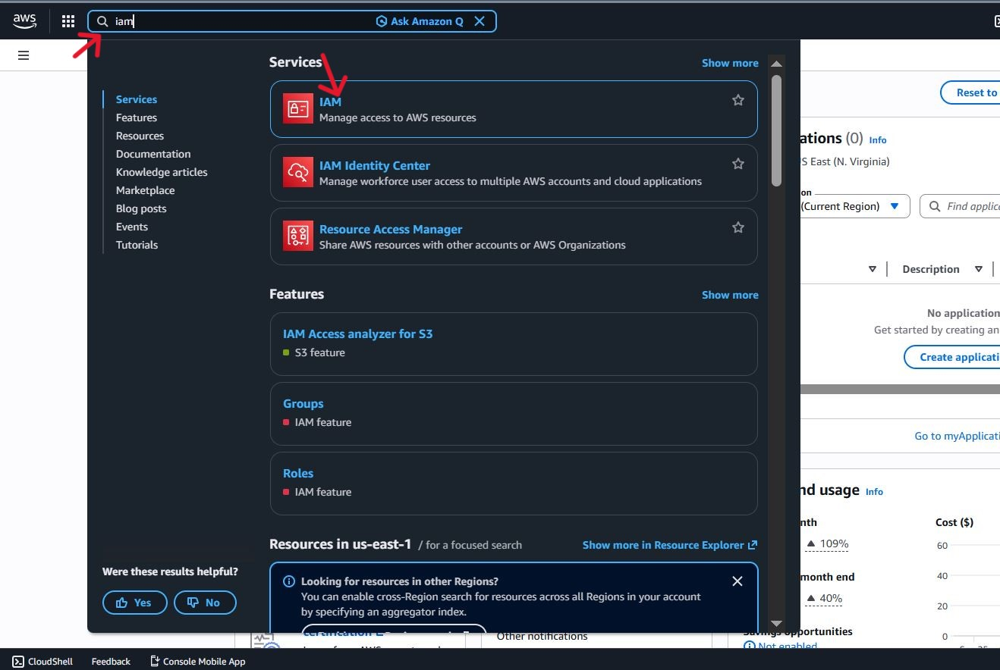

- On the leftside bar of the IAM dashboard click on roles. Then click on "Create role"

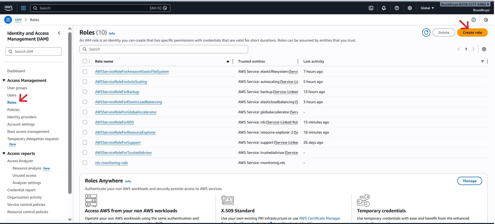

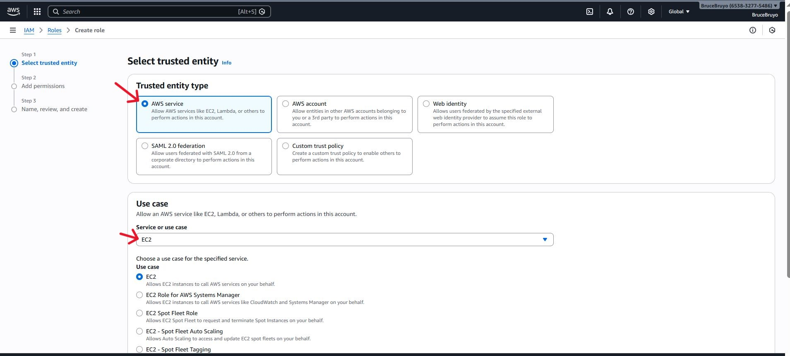

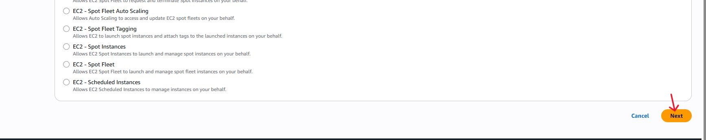

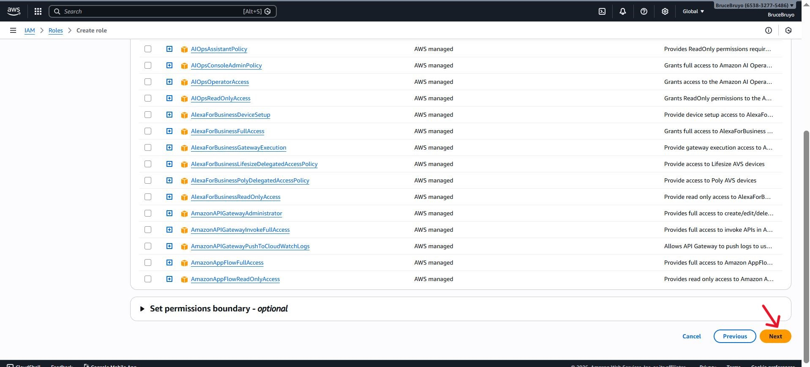

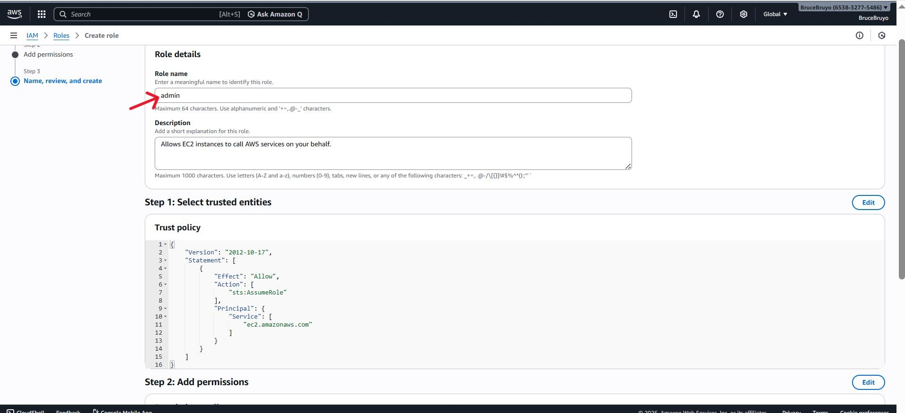

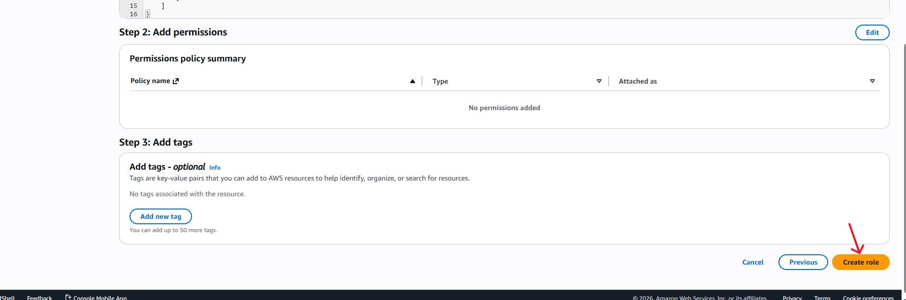

- On the leftside bar of the IAM dashboard click on policies. Then click on "Create policy"

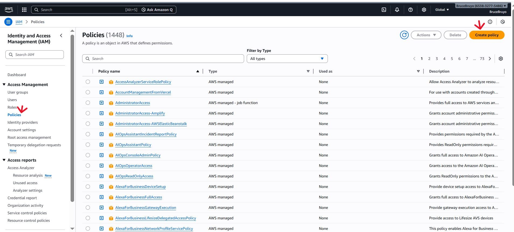

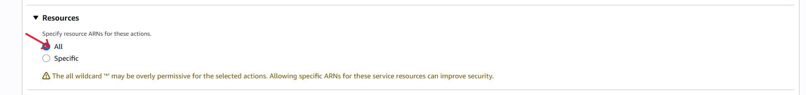

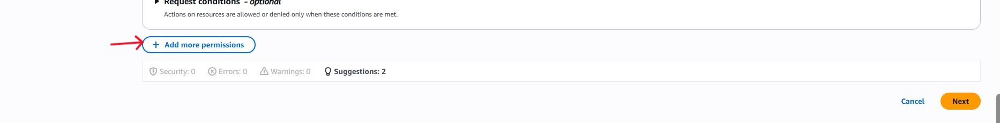

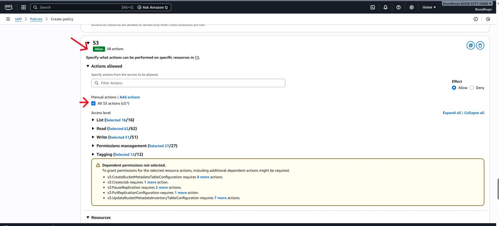

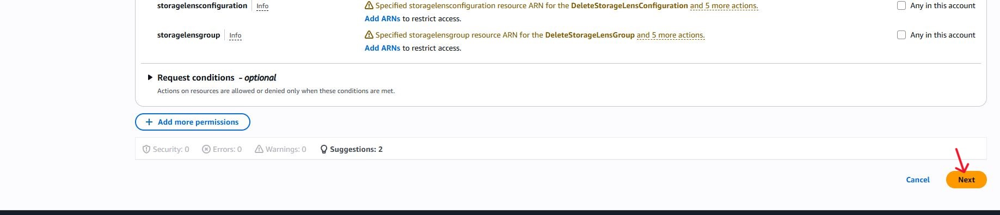

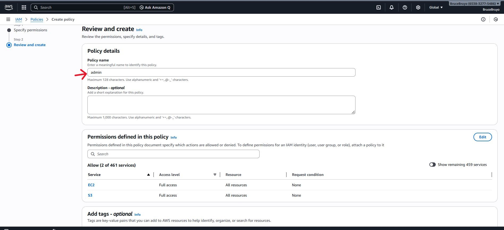

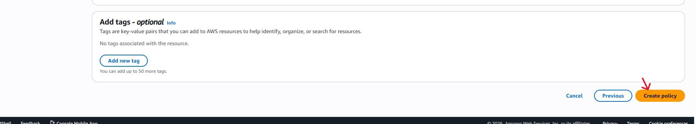

-  On the leftside bar of the IAM dashboard click on user. Then click on "Create user"

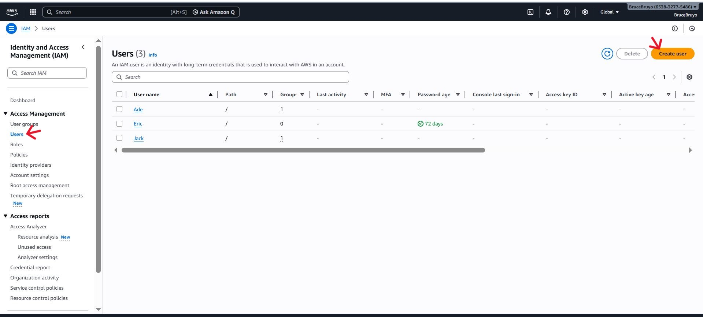

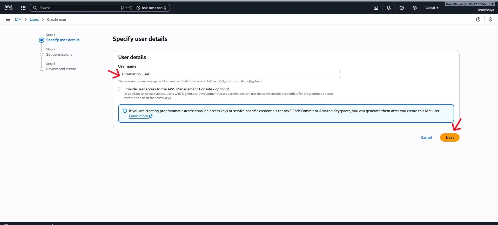

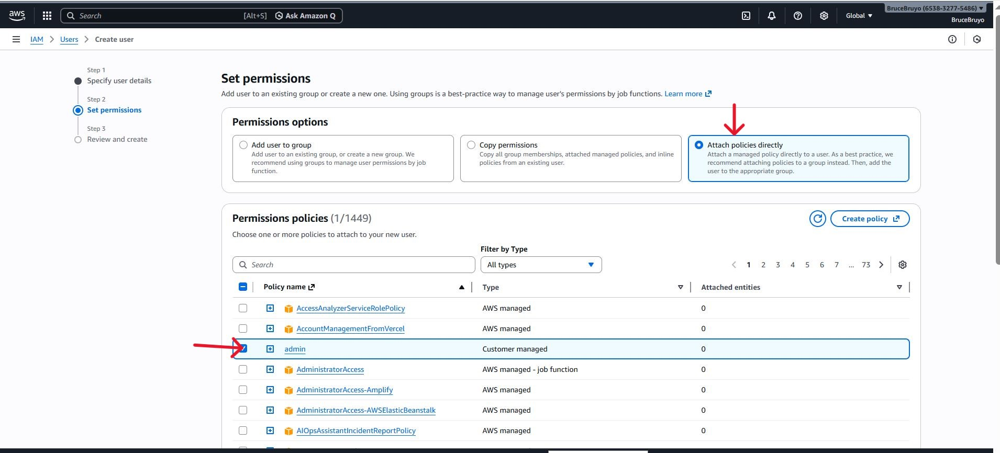

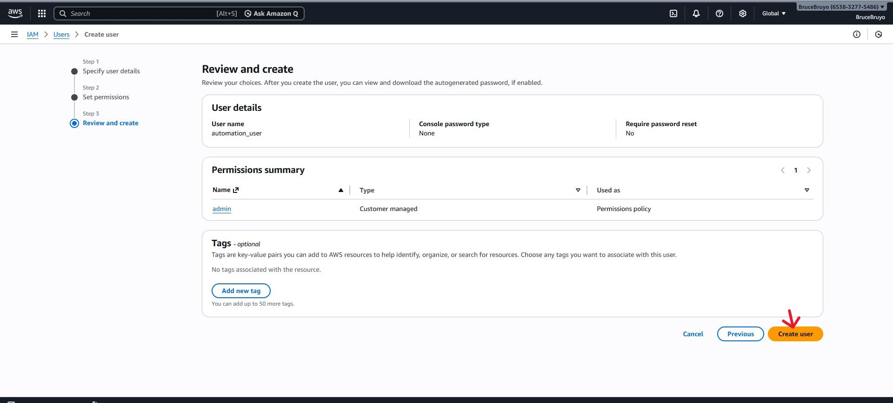

- Create programmatic access credentials.

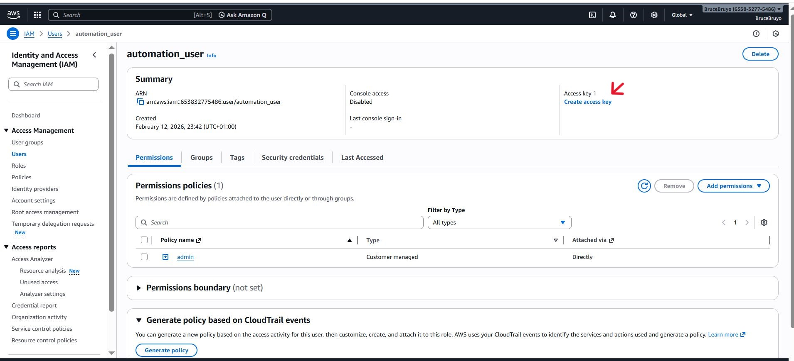

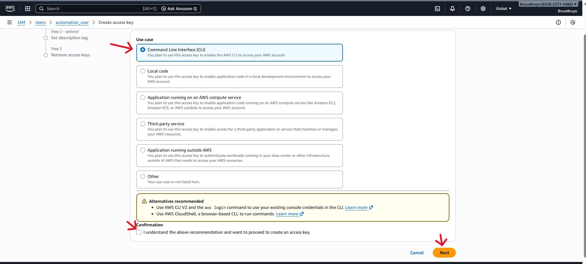

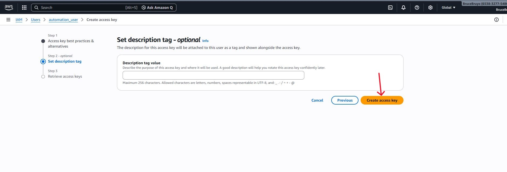

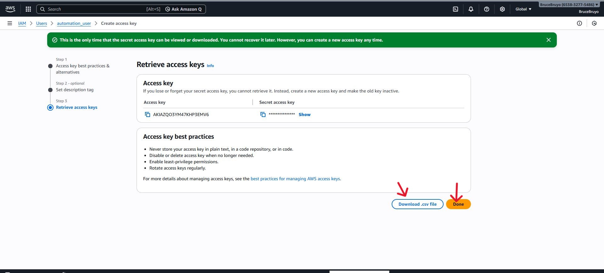

2. Installing and configuring the AWS CLI.

- Download the AWS CLI version 2 installation file for Linux.

'curl "https://awscli.amazonaws.com/awscli-exe-linux-x86_64.zip" -o "awscliv2.zip"'

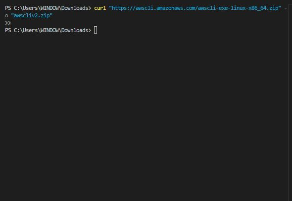

- Unzip the installer.

'unzip awscliv2.zip'

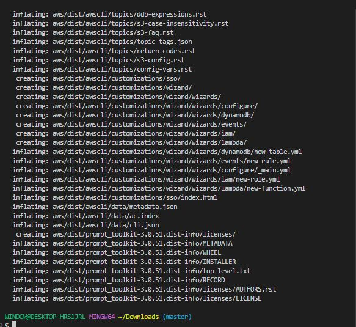

- Run the installer.

'sudo ./aws/install'

- To ensure that aws cli is installed type the code below.

'aws --version'

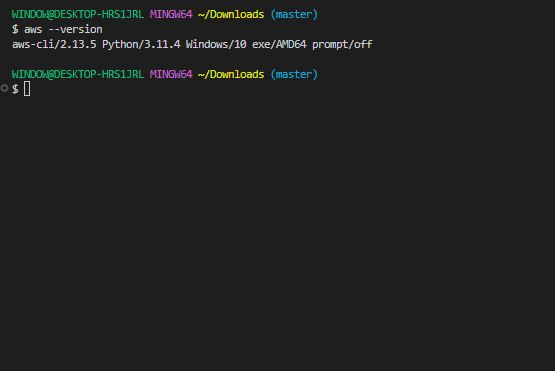

- Configuring AWS CLI for access to AWS. On the linux terminal enter;

'aws configure'

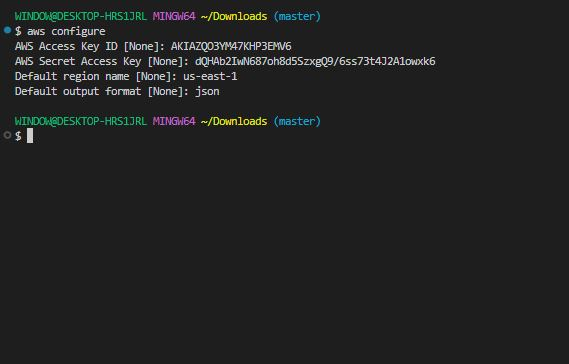

3. Testing the configuration.

- To verify communication between the AWS CLI and AWS services. 

'aws ec2 describe-regions --output table'

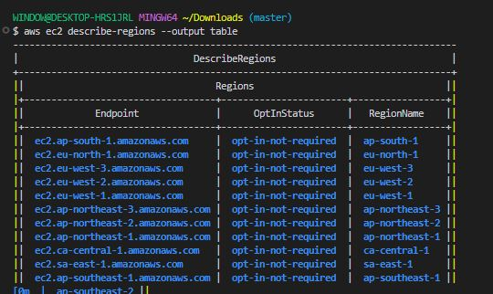

Now you are ready to develop scripts.

