# AWS Account Creation Project

## What is Cloud?

You can imagine your computer or phone. It stores all your pictures, files, and apps, right? But what if you run out of space or lose your device? That where cloud comes in. The cloud is like a giant digital storage space, but it's not just one big hard drive sitting somewhere. It's actually made up of lots of powerful computers connected over the internet. 

## What is AWS Cloud?

There are many cloud providers like Azure, Google Cloud Platform, IBM cloud etc, each offering range of services for businesses and individuals.

Amazon Web Services (AWS) is one of the leading cloud providers in the market, providing comprehensive suite of cloud computing services. It offers a vast array of computing resources, including servers, storage,databases, networking, and more, all delivered over the internet. It's like a huge digital world where companies and people can use really strong computers without having to invest in physical hardware.

## Importance of AWS Cloud?

The AWS Cloud is important because it lets businesses and individuals do things that were once only possible for big companies with lots of funds. Now, AWS provide access for small businesses or startups to resources to build, grow, and scale their ideas. You only use resources based on demands and not buy a whole infrastructure to build projects.

## Setting up an AWS Account
 
1. Open an AWS management console via https://aws.amazon.com/console/

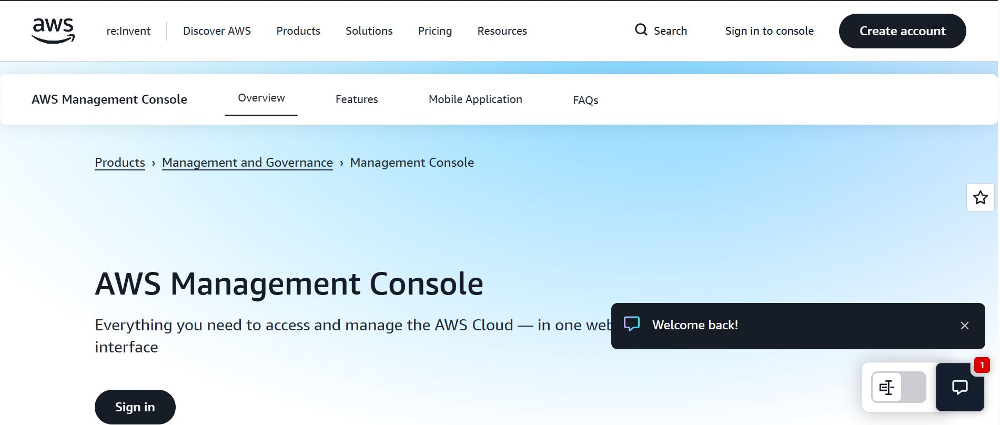

2. Click on **Create account**

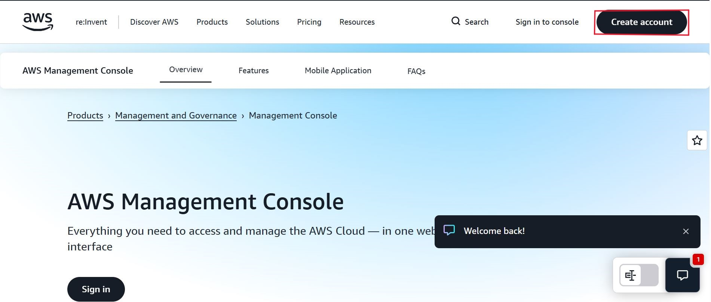

3. Enter a valid required details like email address, password and aws account name;

- The click verify email address.

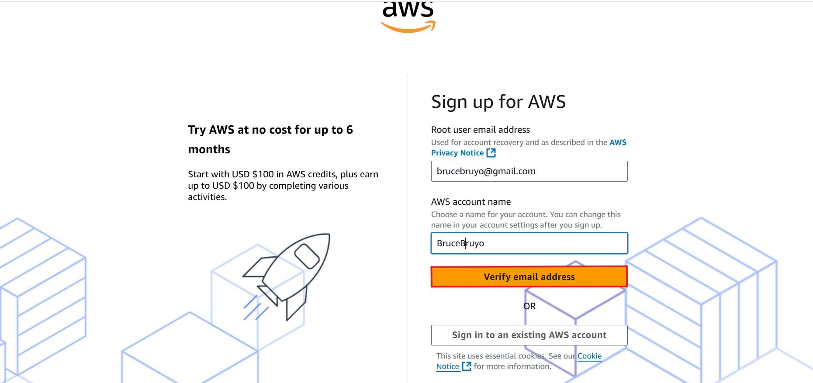

4. Check respective email.

- You'll receive a verification code there, copy that verification code. Paste it on the AWS page and click verify.

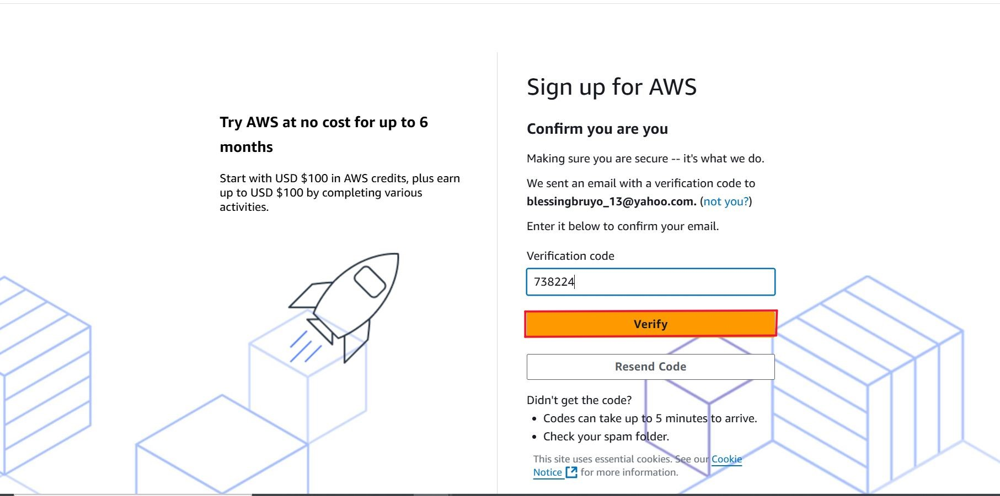

5. Now set your root user password and click on "Continue".

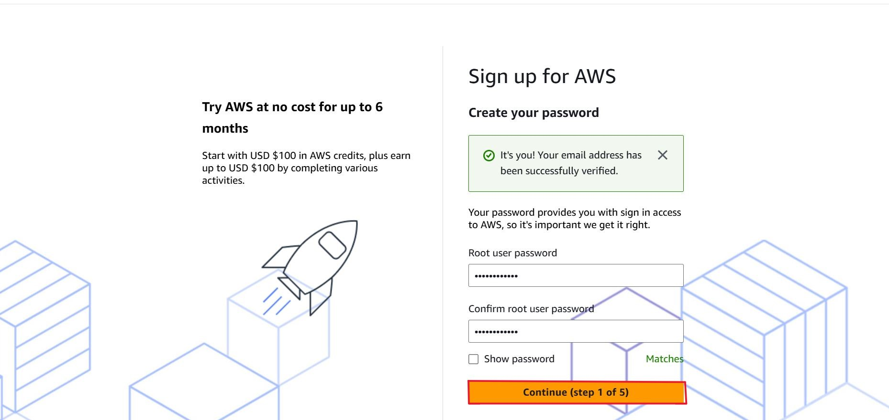

6. Enter all required information and click on "Continue"

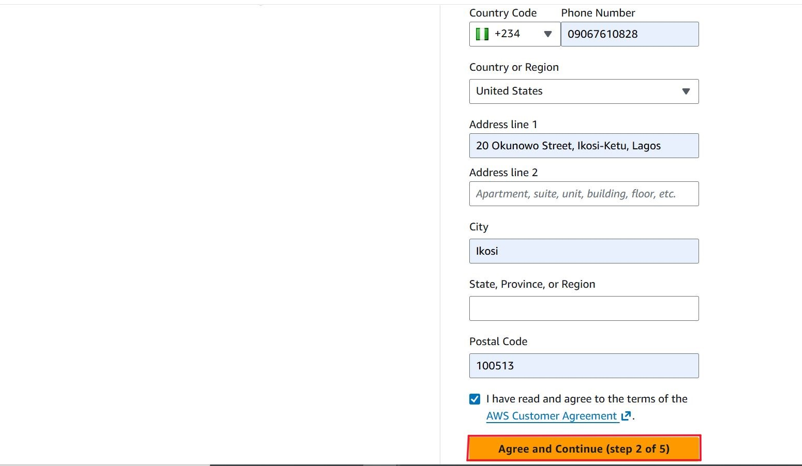

- Choose a plan; Either the free 6months or paid plan.

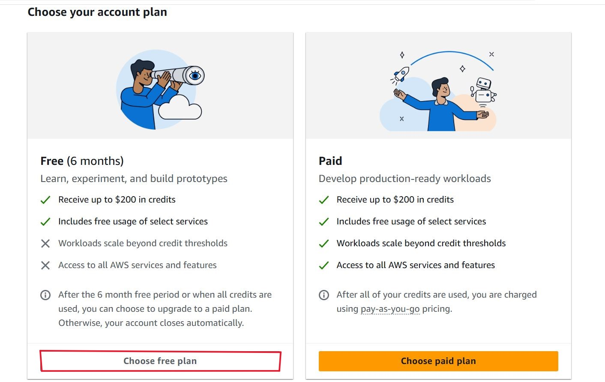

7. As per your request, please provide your payment information for verification purposes.

- Rest assured, they will not charge you unless your usage surpasses the **AWS Free Tier Limits**.

Kindly note that some credit card or debit card companies may authorize a nominal charge of approximately USD $1.00 to validate the card's authenticity, with the charge typically being reversed shortly thereafter. 

- click on "Verify and continue".

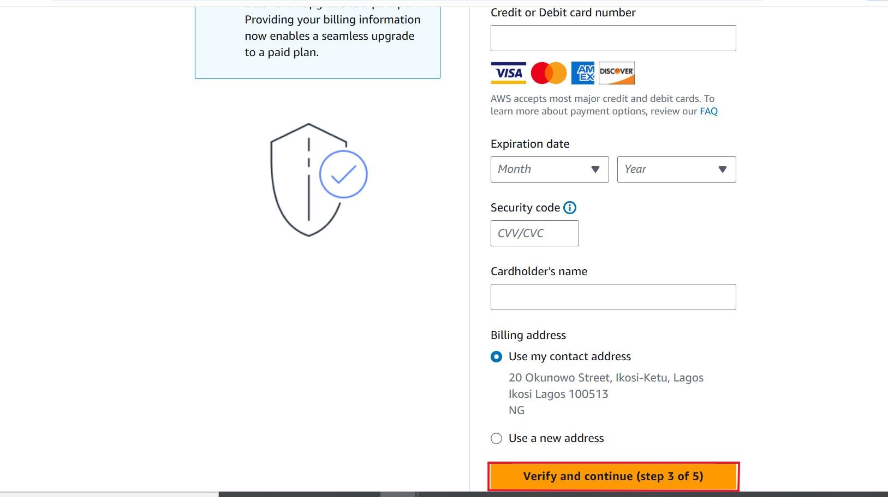

Your payment process will be initiated. Please be rest assured that your payment information will be securely processed.

8. A one-time password (OTP) will be sent to the respective phone number for verification purposes.

- Please ensure that you have access to the provided phone number to receive the OTP and complete the phone verification process.

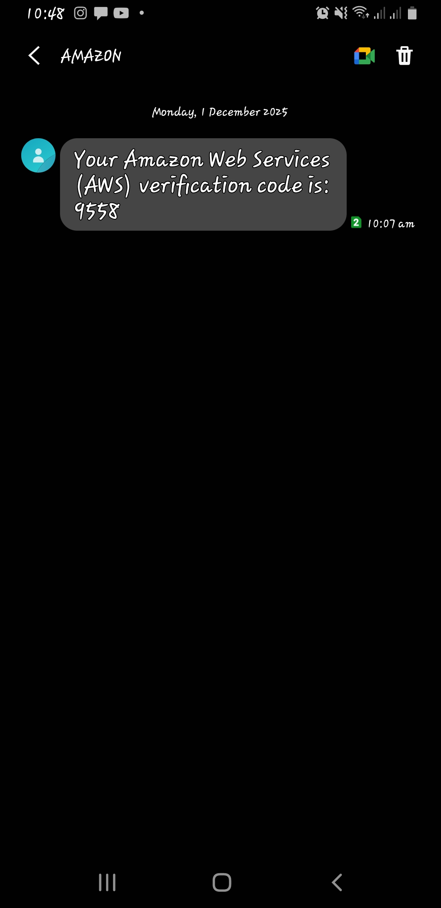

- Then write the OTP here:

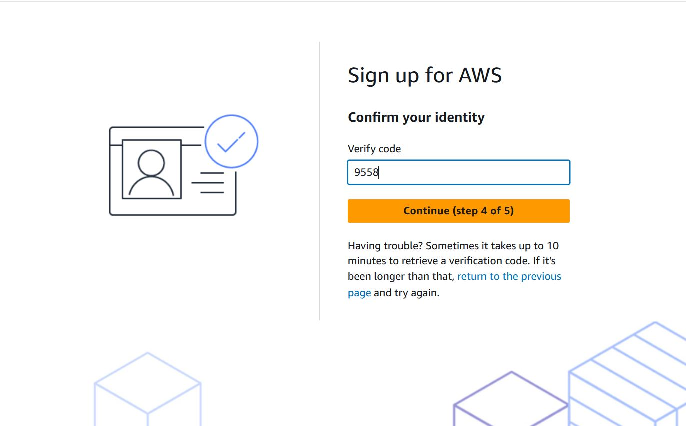

9. To activate your account and confirm your identity.

- You have the option to choose either a Text message (SMS) or a Voice call to receive the verification code.

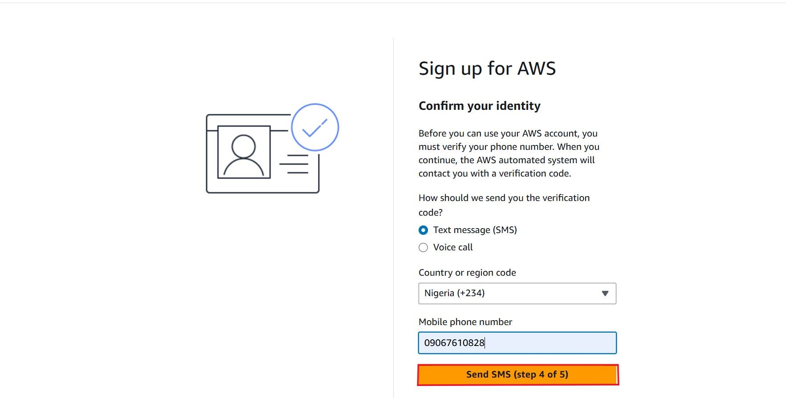

- Additionally, you will be presented with a CAPTCHA. Please enter the displayed code and proceed to the send for verification.

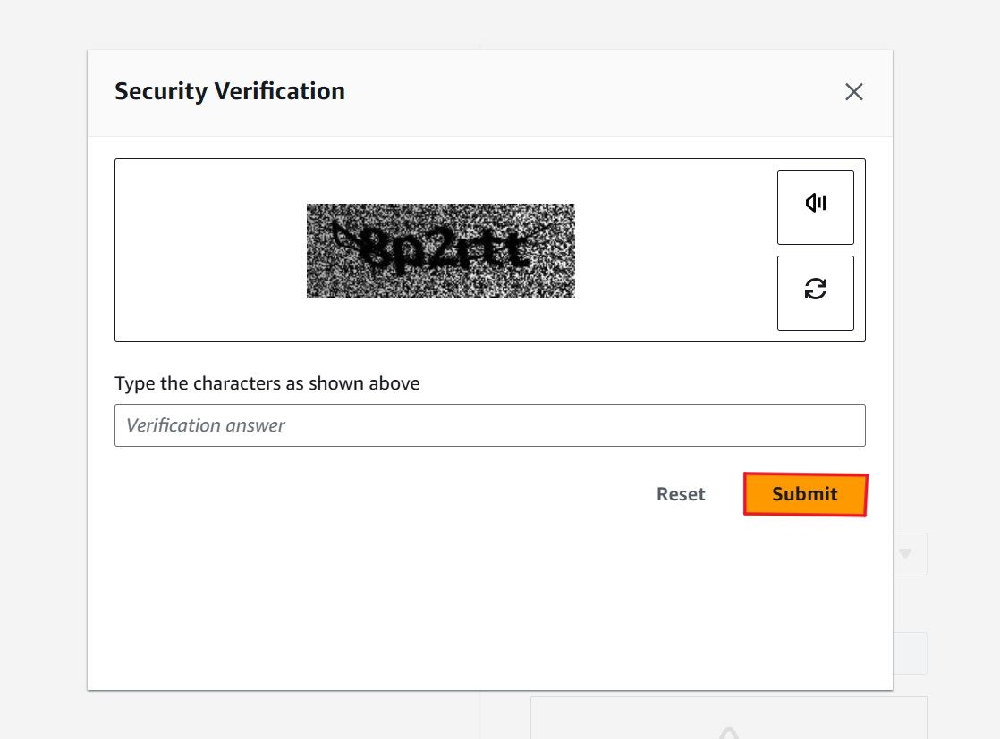

10. Please click the "Submit button" to proceed.

- Once initiated, your account is set up and ready for use.

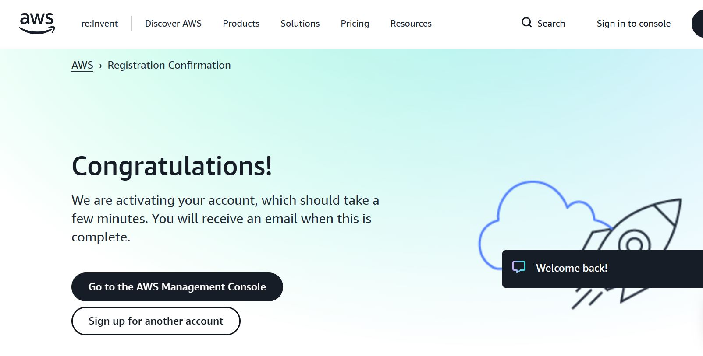

11. Sign into console by clicking "Sign in to console"

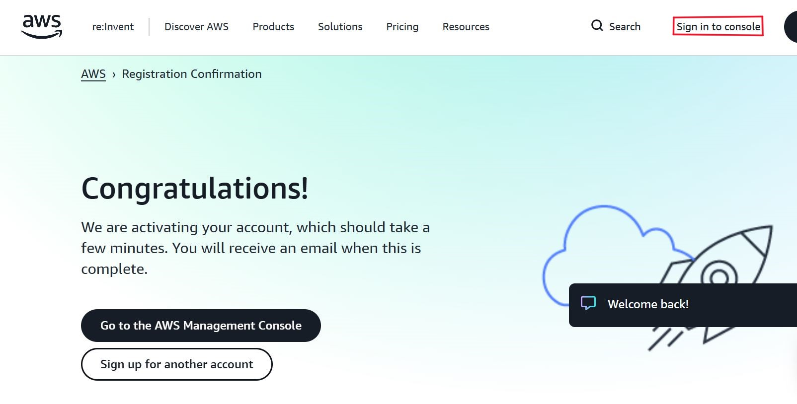

- Input your login details to access console.

### Conclusion

In conclusion, for those having challenges with their debit, you might have to clear your cache, try another browser or debit/credit card.

