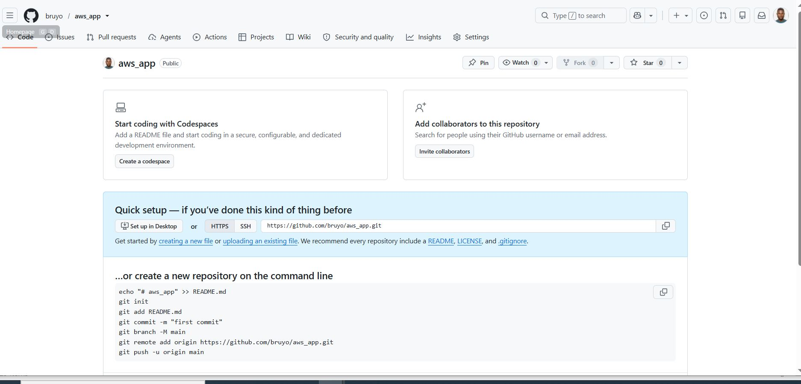
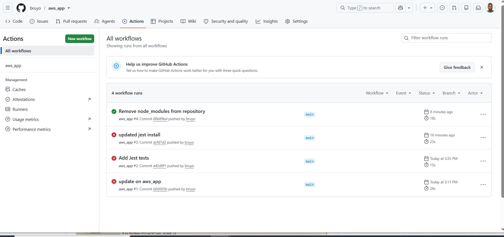

# GitHub Actions and CI/CD: Advanced Concepts and Best Practices

## Project Review: Introduction to Advanced GitHub Actions and CI/CD.

This project will address the sophisticated aspects of GitHubs Actions, learning how to craft maintainable workflows, optimize performance, and prioritize security in your automation process. 

### The Importance of Advanced Concepts in CI/CD

Imagine you're an architect and builder rolled into one, constructing a skyscrapper. In the early stages, the focus is on laying the foundation and building - analogous to setting up basic CI/CD pipelines. As your the skyscrapper (software project) grows taller and more complex, the demands change. Now, you need to ensure that the building is not just strong but also efficient in resource use (optimization), safe for its occupants (security), and able to adapt to changing needs over time (maintainability).

Just like in constructing a skyscrapper, in software development, you need to evolve the tools and strategies to manage more complex, larger scale, and more critical projects. Advanced GitHub Actions skills ensure that the CI/CD processes are like a well-designed skyscrapper: robust, efficient, adaptable, and secure.

### Best Practices for GitHub Actions

**Writing Maintainable Workflows:**

1. Use Clear and Descriptive Names:

- Name your workflows, jobs, and steps descriptively for easy understanding.

- Example: **'name: Build and Test Node.js Application'**.

2. Document your workflows:

- Use comments within the YAML file to explain the purpose and functionality of complex steps.

**Code Organization and Modular Workflows:**

1. Modular Common Tasks:

- Create reusable workflows or actions for common tasks.

- Use **'uses'** to reference other actions or workflows.

```bash
jobs:
  build:
    runs-on: ubuntu-latest
    steps:
    - uses: actions/checkout@v2
    - name: Install Dependencies
      run: npm install
    # Modularize tasks like linting, testing etc.
```

2. Organize Workflow Files:

- Store workflows in the **'.github/workflows'** directory.

- Use separate files for different workflows (**'build.yml', 'deploy.yml'**).


### Performance Optimization

**Optimizing Workflow Execution Time:**

1. Parallelize Jobs:

- Break your workflow into multiple jobs that can run in parallel.

- use **'strategy.matrix'** for testing across multiple environments.

2. Implement Caching:

- use the **'actions/cache'** action to cache dependencies and build outputs.

```bash
- uses: actions/cache@v2
  with:
    path: ~/.npm
    key: ${{" runner.os "}}-node-${{" hashFiles('**/package-lock.json') "}}
    restore-keys: ${{" runner.os "}}-node-
# This caches the npm modules based on the hash of 'package-lock.json'.
```

### Security Considerations

**Implementing Security Best Practices:**

1. Least Privilege Principle:

- Grant minimum permissions necessary for the workflows.

- Regularly review and update permissions.

2. Audit and Monitor Workflow Runs:

- Regularly check workflow run logs for unexpected behaviour.


**Securing Secrets and Sensitive Information:**

1. Use Encrypted Secrets:

- Store sensitive information like tokens and keys in GitHub Encrypted Secrets.

```bash
env:
  ACCESS_TOKEN: ${{" secrets.ACCESS_TOKEN "}}
# Use secrets as environment variables in your workflow.
```

2. Avoid Hardcoding Sensitive Information:

- Never hardcode sensitive details like passwords directly in your workflow files.

### Let's test what we have learnt

- Create a github repository and named **'aws_app'**. Clone the repository to your local machine.



- Clone your repository.

```bash
git clone https://github.com/bruyo/aws_app.git
```

- Set up the Node.js machine (runtime).

```bash
npm init
```

- Create a simple server using Express.js to serve a static web page.

```bash
nano index.js
```

```bash
const express = require('express');

const app = express();
const port = process.env.PORT || 3000;

app.get('/', (req, res) => {
  res.send('Hello World!');
});

app.listen(port, () => {
  console.log(`App listening at http://localhost:${port}`);
});

module.exports = app;
```

- Create a .github/workflow file named **'main.yml'**.

```bash
mkdir .github
```

```bash
mkdir workflows
```

```bash
nano main.yml
```
- Copy and paste the code below into the .github/workflow file named **'main.yml'**.

```bash
name: aws_app

on:
  push:
    branches:
      - main
      - develop
      - staging

jobs:
  build:
    runs-on: ubuntu-latest

    env:
      ACCESS_TOKEN: ${{ secrets.ACCESS_TOKEN }}

    steps:
      - name: Checkout Repository
        uses: actions/checkout@v4

      - name: Set up Node.js
        uses: actions/setup-node@v4
        with:
          node-version: 20
          cache: npm

      - name: Cache npm modules
        uses: actions/cache@v4
        with:
          path: ~/.npm
          key: ${{ runner.os }}-node-${{ hashFiles('**/package-lock.json') }}
          restore-keys: |
            ${{ runner.os }}-node-

      - name: Install Dependencies
        run: npm install

      - name: Run Linter
        run: npm run lint
        continue-on-error: true

      - name: Run Unit Tests
        run: npm test
```

- Add a lock file named "package-lock.json".

```bash
npm install
```

- Add a jest.config.js to the .github/workflow.

```bash
nano jest.config.js
```

```bash
// jest.config.js
module.exports = {
  testMatch: ["**/tests/**/*.test.js"],
  testPathIgnorePatterns: ["/node_modules/", "/.github/"]
};
```

- Create a test file named "test.js". Copy and paste the script.

```bash
nano test.js
```

```bash
describe('Sample Test', () => {
  test('adds two numbers', () => {
    expect(2 + 2).toBe(4);
  });
});
```

- Install Jest.

```bash
npm install --save-dev jest
```

Note: Update package.json

```bash
{
  "scripts": {
    "test": "jest"
  }
}
```

