# Database Management with Amazon RDS

## Project Review

In this project, we will learn about Amazon RDS (Relational Database Service), a key part of Amazon Web Services (AWS) designed for managing relational databases in the cloud. It will focus on essential tasks such as creating an AWS RDA database, connecting it to an EC2 instance, and accessing the database and its tables. 

### What is a database?

You can think of a database as a big digital filing cabinet where you can store all kinds of information. So, if you have a list of your favourite songs, or a record of all the books in a library, you can keep them organized in a database. It's having a super organized digital notebook where you can easily find and manage your information.

### What is database management?

Database management is like being the boss of that digital filing cabinet. It's all about making sure the information in the database is well-organized, secure, and easy to access. So, just like a manager at a company, you're responsible for things like creating and updating records, setting up rules for who can access what, and making sure everything runs smoothly.

### What is a database management system?

Database management can be describe as a friend that tidy up your digital space, making sure everything is easy to find and use. They organize your stuff neatly, help you add new things, and make sure nothing gets lost or messed up.

Now, think of Database Management System (DBMS) as the toolbox your friend uses to do all this. It's like a set of special tools and tricks that make organizing and managing your digital stuff super easy.

### What is Relational Database Management Systems (RDBMS)?

Picture RDBMS as your trusty treasure map maker. It takes all the clues (data) you have and puts them into neat categories, like different types of treasure. Then, it connects these categories together, just like drawing lines on your treasure map to show where each clue leads. Now, when you need to find a specific clue, RDBMS swoops in like a superhero, quickly locating it for you.

### Difference betweeen a Database management system (DBMS) and Relational database management system (RDBMS)?

Imagine you're planning a treasure hunt with lots of clues hidden around your backyard. Now, if you're just using your regular old memory to remember where each clue is, that's like using a Database Management System (DBMS). You're doing all the work yourself, trying to keep track of everything without much help. But if you upgrade to a Relational Database Management System (RDBMS), it's like having a super-powered assistant to help out. 

In simple terms, DBMS is like doing the treasure hunt all by yourself, while RDBMS is like having helpful assistant to make everything easier and more organized.

### Task

GatoGrowFast is a fast-growing IT services company that provides software development, cloud solutions, and cybersecurity services to businesses. With an increasing number of clients and projects, the company needs a strong and reliable database to handle all its data. This includes keeping track of client details, managing projects information, and processing service orders. As the business keeps expanding, the amount of data is getting bigger and more complex, so they need a database system that can keep up.

1. Navigate to the search bar on the AWS console.

- Input "RDS" to locate the RDS service. Once found, click on the RDS option to proceed.

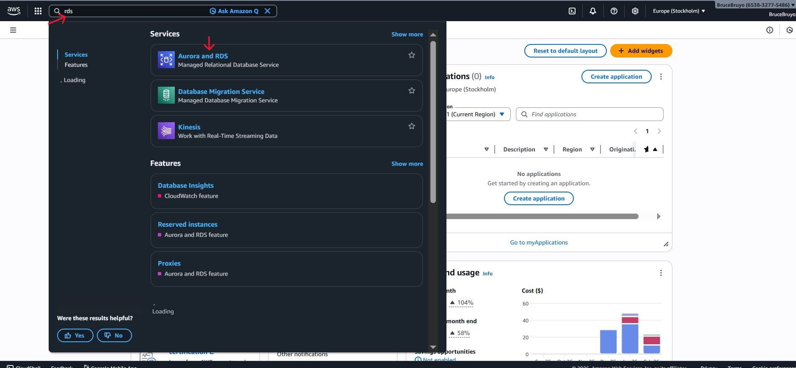

2. Navigate to the left sidebar and select the "Databases" section.

- Click on "Create Database" to proceed.

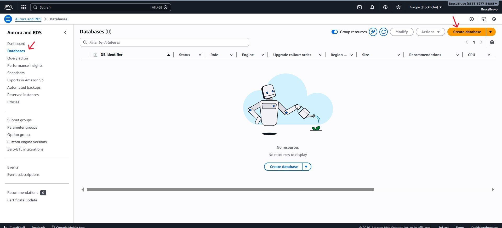

3. Select "Full configuration" as the database creation method.

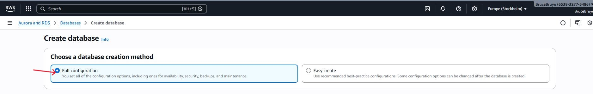

- Choose the MYSQL Engine.

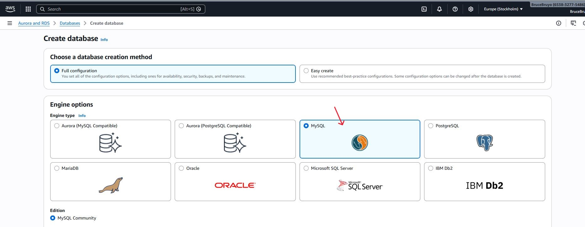

**Note:** MYSQL, PostgreSQL, Amazon Aurora etc. are like digital assistants for organizing your data. They help you store and manage information in an organized way, kind of keeping your files neat and tidy in a virtual filing cabinet. You can create different categories for your data, like lists of names or numbers, and easily find what you need when you need it.

These are called relational database management systems (RDBMS). They're like special software that makes it easy to work with structured data, meaning data that are organized into tables with rows and columns. With RDBMS, you can create databases, define how your data should look, search for specific information, and make sure everything stays organized and secure. It's like having a super-powered organizer for your digital information.

- Select the latest engine version or preferred version.

- Choose a free tier template.

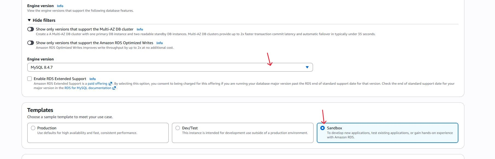

- Specify the database instance name.

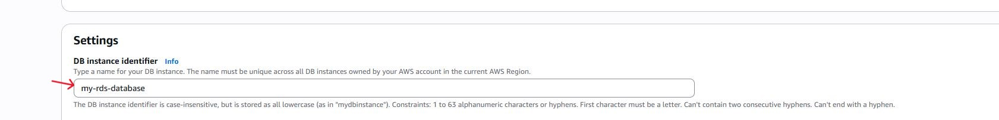

- Select a master username for the database.

- Choose "Credentials management" as "Self-managed".

- Enter the master password for the database and confirm it by re-entering it in the "Confirm master password" field.

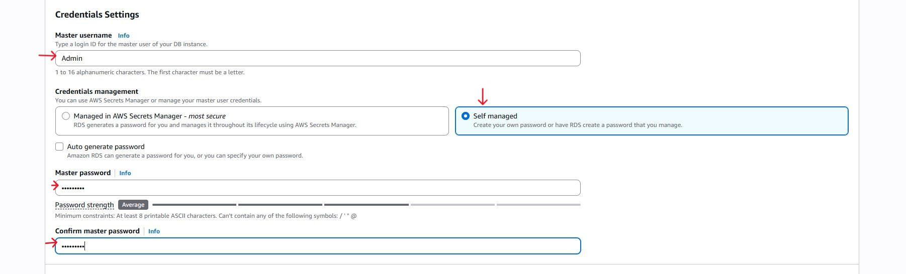

**Note:** Ensure you keep you password safe for future access.

- Choose DB instance class as "db.t3.micro".

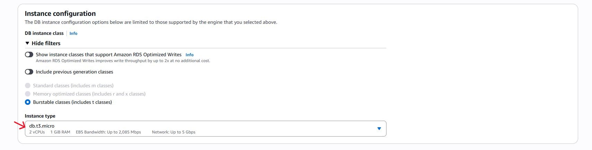

- Please maintain the default setting for the other configurations.

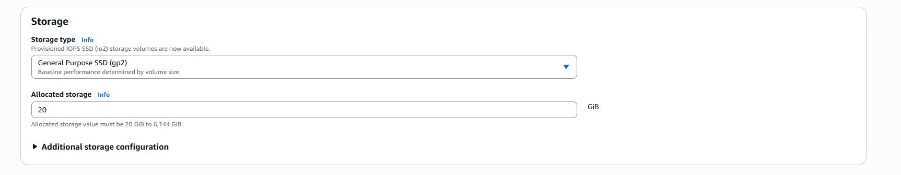

- Choose the VPC created previously.

- Select "Public access" as "Yes".

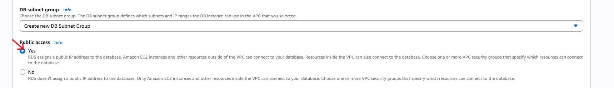

**Note:** While it's generally not recommended to keep your database public, for the prupose of this task, we'll be configuring it as public.

- Select the option "VPC security group (firewall)" as "Choose existing".

- Then, choose your pre-created security group in the "Existing VPC security groups" section.

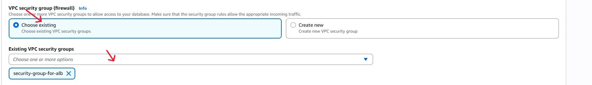

**Note:** Ensure that your security group attached to database permits inbound traffic on port 3306.

If the security group is not configured, set it up by selecting the attached security group and add an inbound rule for MySQL/Aurora on port 3306, allowing traffic from the 0.0.0.0/0 CIDR range.

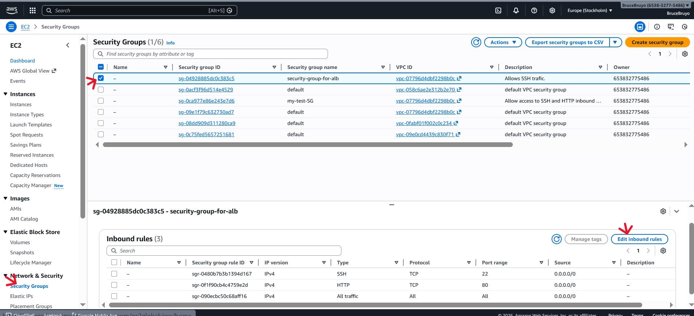

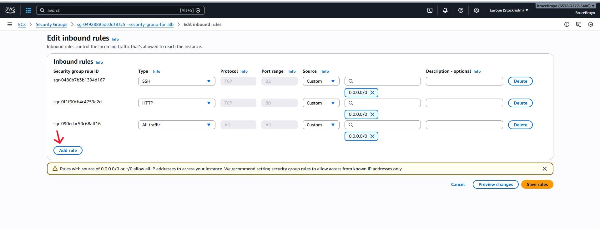

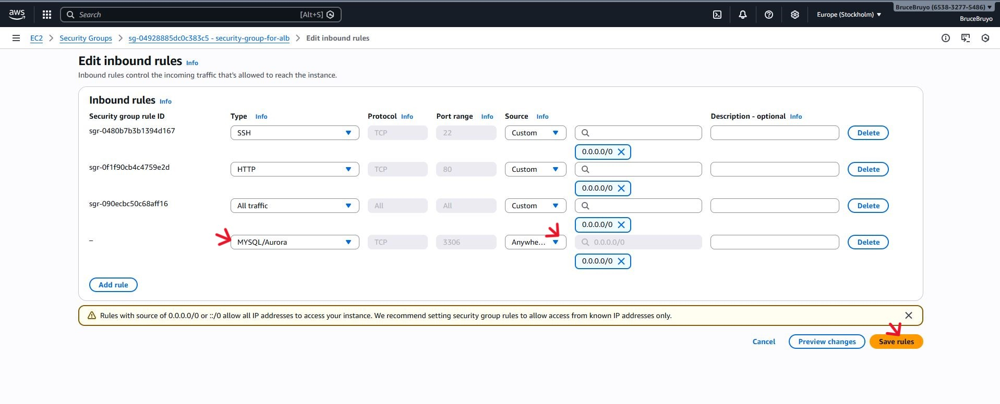

- You can choose any availability zones. Here, we are selecting "eu-north-1a".

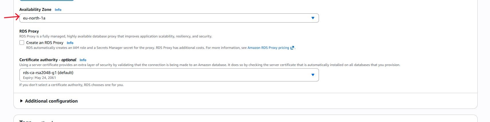

You can leave the other settings as default.

- Proceed by selecting the option labelled "Create database" to initiate the creation process.

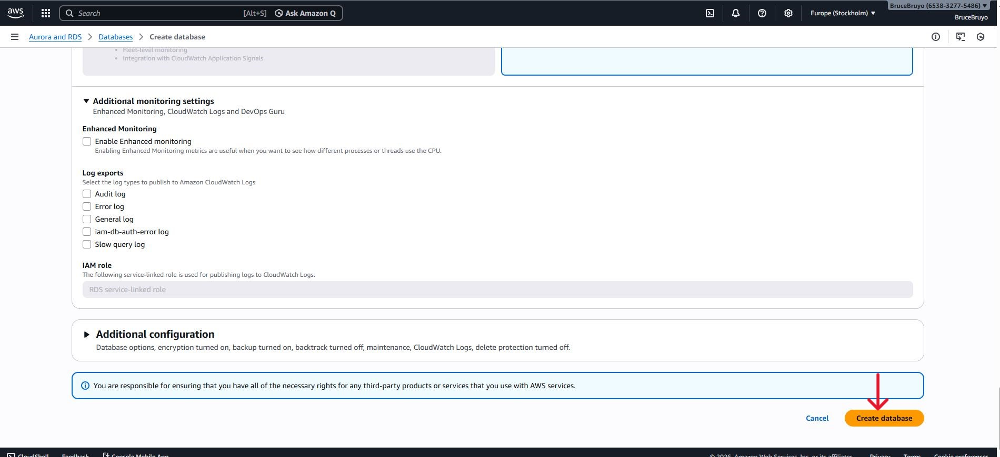

Typically, creating a database takes some time. To monitor the progress, you can refresh the page periodically by clicking on the refresh button in the designated section as indicated in the image below.

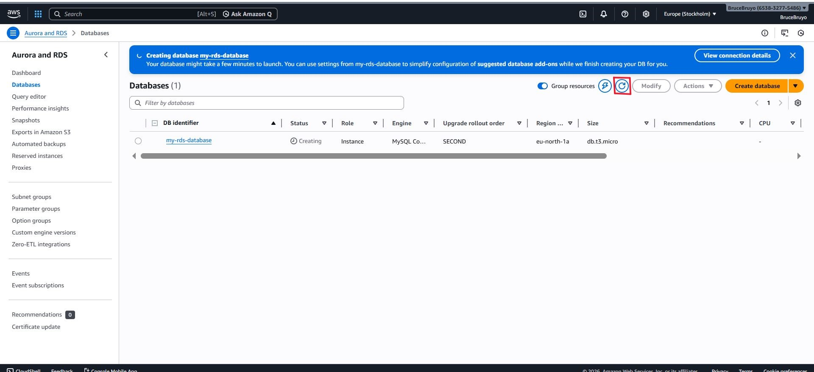

Now, you can observe that the database is available for use. 

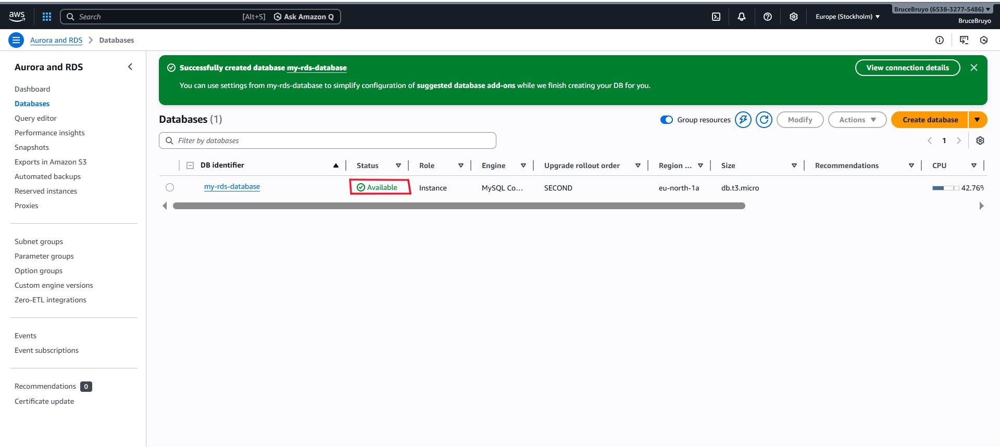

4. Proceed by clicking on your database, labeled "my-rds-database".

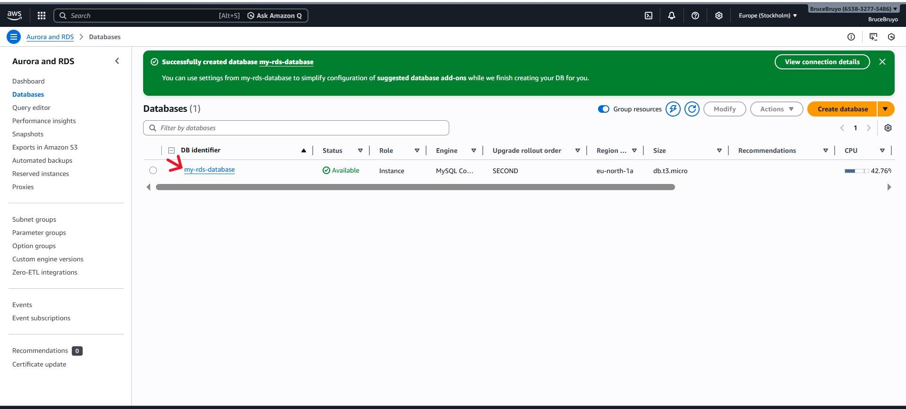

5. Now, scroll down and on the right side, you will find an endpoint. Copy this endpoint.

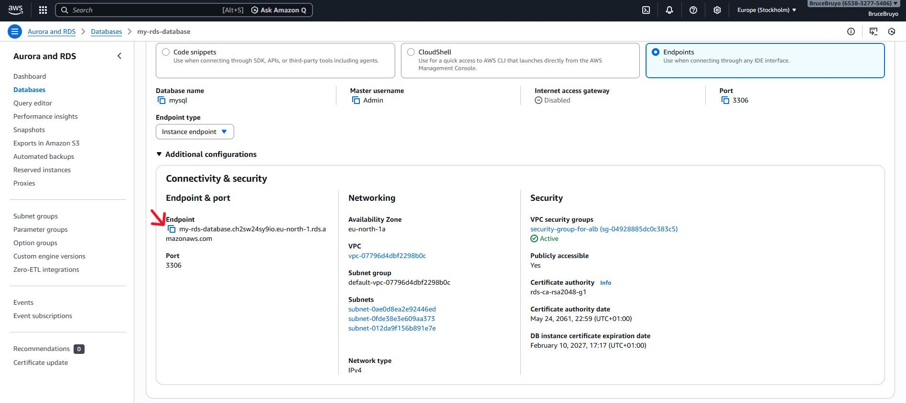

Keep this endpoint along with your username and password in a safe place for future reference.

We've created EC2 instance previously.

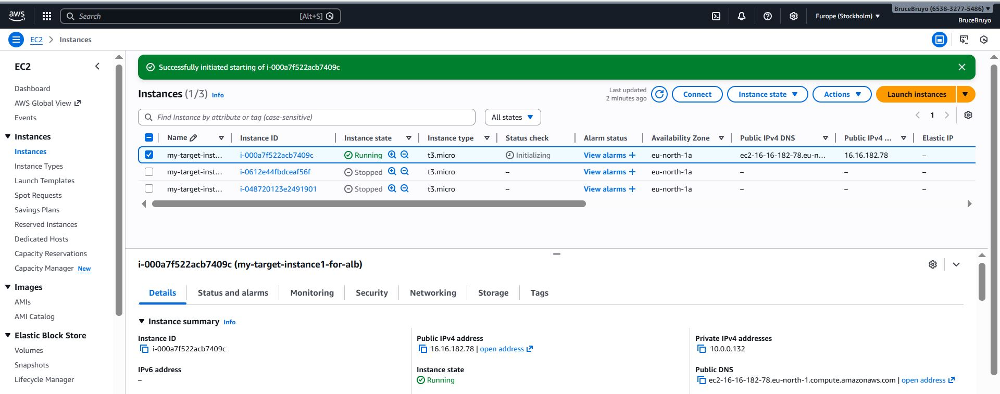

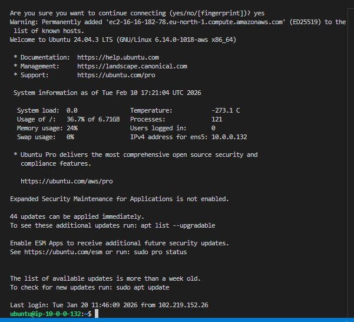

After connecting to the instance, execute the following commands:

'sudo wget https://dev.mysql.com/get/mysql57-community-release-el7-11.noarch.rpm'

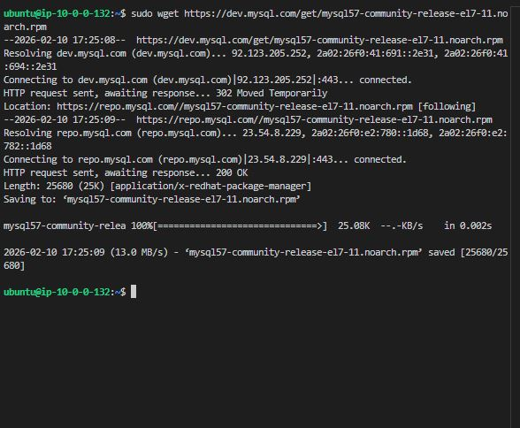

'sudo yum localinstall mysql57-community-release-el7-11.noarch.rpm'

Since we are using an ubuntu VM;

**To install MySQL with Ubuntu**

'sudo apt update'

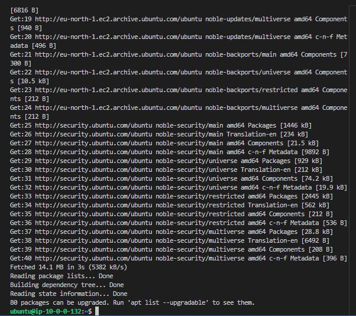

sudo apt install mysql-server -y'

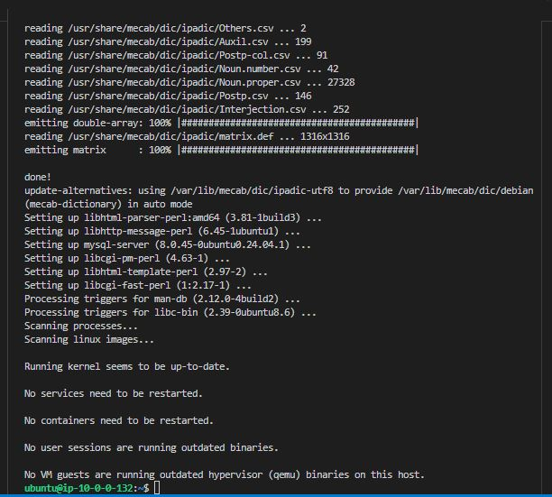

**To start  and enable it**

'sudo systemctl start mysql'

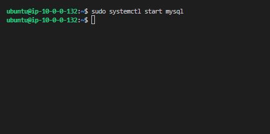

'sudo systemctl enable mysql'

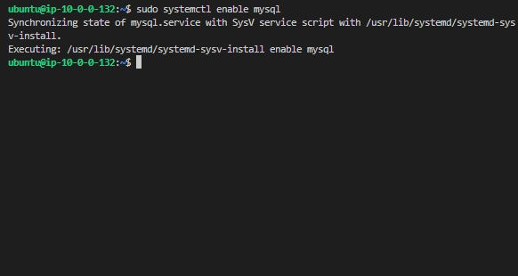

### Connecting your RDS to EC2 instance

**mysql -h [Endpoint] -P [Port] -u [Username] -p [Password]**

In this process, we are executing commands tailored to our specific database configuration. Please ensure you adjust the values to align with the database setup.

'mysql -h my-rds-database.ch2sw24sy9io.eu-north-1.rds.amazonaws.com -P 3306 -u Admin -ptest_2026'

**Note:** Ensure that there are no spaces between "-p" and your password.

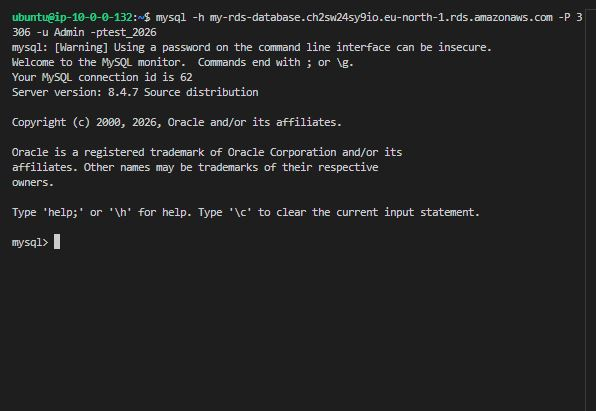

If you want to show all databases, run;

'SHOW DATABASES;'

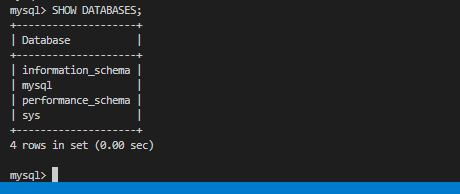

To use the database you have created, execute;

'USE mysql'

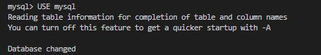

If you want to show tables inside the database,

'SHOW TABLES;'

1[Show-tables](./img/show-tables.JPG)

You've successfully created a database and connected it to EC2 instance. Plus, you've effortlessly accessed and explored the database tables. Great job on reaching this important milestone.

**Summary:** By using Amazon RDS with MySQL, GatoGrowFast can handle its growing data needs effeciently. This solution provides the scalability, security, and reliability required to support the company's expansion, allowing GatoGrowFast to focus on delivering excellent IT services to its clients.