# Automated WordPress Deployment on AWS

## Project Scenario

DigitalBoost, a digital marketing agency, aims to elevate its online presence by launching a high-performance WordPress website for their clients. As an AWS Solutions Architect, your task is to design and implement a scalable, secure, and cost-effective WordPress solution using various AWS services. Automation through Terraform will be key to achieving a streamlined and reproducible deployment procress.

### Project structure

```bash
terraform-wordpress/
├── main.tf
├── variables.tf
├── outputs.tf
└── modules/
    ├── vpc/
    │   ├── main.tf
    │   ├── variables.tf
    │   └── outputs.tf
    ├── rds/
    │   ├── main.tf
    │   ├── variables.tf
    │   └── outputs.tf
    ├── efs/
    │   ├── main.tf
    │   ├── variables.tf
    │   └── outputs.tf
    ├── alb/
    │   ├── main.tf
    │   ├── variables.tf
    │   └── outputs.tf
    └── asg/
        ├── main.tf
        ├── variables.tf
        └── outputs.tf
```

### Project Tasks

- Create a project directory named **'terraform-wordpress'**.

```bash
mkdir terraform-wordpress
```

**VPC Setup:**

- In the project directory, creat a new directory for vpc module named **'modules/vpc'**.

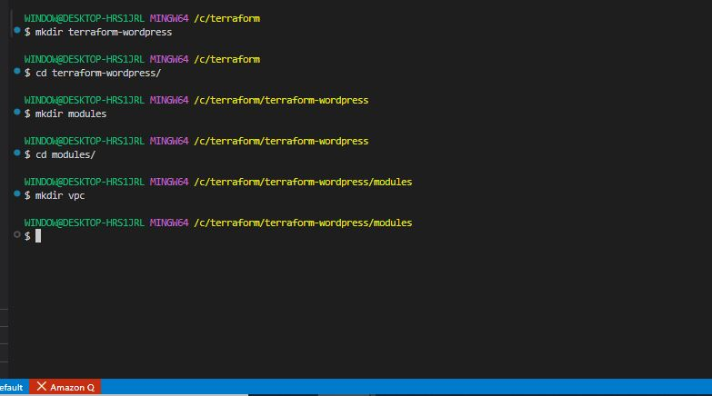

- Write a Terraform module named **'modules/vpc/main.tf'** to create VPC.

```bash
nano main.tf 
```

```bash
# -----------------------------------------------
# VPC
# -----------------------------------------------
resource "aws_vpc" "main" {
  cidr_block           = var.vpc_cidr
  enable_dns_support   = true
  enable_dns_hostnames = true

  tags = merge({ Name = "${var.project_name}-vpc", Environment = var.environment }, var.tags)
}

# -----------------------------------------------
# Internet Gateway
# -----------------------------------------------
resource "aws_internet_gateway" "main" {
  vpc_id = aws_vpc.main.id
  tags   = merge({ Name = "${var.project_name}-igw" }, var.tags)
}

# -----------------------------------------------
# Public Subnets
# -----------------------------------------------
resource "aws_subnet" "public" {
  count                   = length(var.public_subnet_cidrs)
  vpc_id                  = aws_vpc.main.id
  cidr_block              = var.public_subnet_cidrs[count.index]
  availability_zone       = var.availability_zones[count.index]
  map_public_ip_on_launch = true

  tags = merge(
    { Name = "${var.project_name}-public-subnet-${count.index + 1}", Type = "public" },
    var.tags
  )
}

# -----------------------------------------------
# Private Subnets
# -----------------------------------------------
resource "aws_subnet" "private" {
  count             = length(var.private_subnet_cidrs)
  vpc_id            = aws_vpc.main.id
  cidr_block        = var.private_subnet_cidrs[count.index]
  availability_zone = var.availability_zones[count.index]

  tags = merge(
    { Name = "${var.project_name}-private-subnet-${count.index + 1}", Type = "private" },
    var.tags
  )
}

# -----------------------------------------------
# Elastic IPs for NAT Gateways
# -----------------------------------------------
resource "aws_eip" "nat" {
  count      = var.enable_nat_gateway ? length(var.public_subnet_cidrs) : 0
  domain     = "vpc"
  depends_on = [aws_internet_gateway.main]
  tags       = merge({ Name = "${var.project_name}-nat-eip-${count.index + 1}" }, var.tags)
}

# -----------------------------------------------
# NAT Gateways
# -----------------------------------------------
resource "aws_nat_gateway" "main" {
  count         = var.enable_nat_gateway ? length(var.public_subnet_cidrs) : 0
  allocation_id = aws_eip.nat[count.index].id
  subnet_id     = aws_subnet.public[count.index].id
  depends_on    = [aws_internet_gateway.main]
  tags          = merge({ Name = "${var.project_name}-nat-gw-${count.index + 1}" }, var.tags)
}

# -----------------------------------------------
# Public Route Table
# -----------------------------------------------
resource "aws_route_table" "public" {
  vpc_id = aws_vpc.main.id

  route {
    cidr_block = "0.0.0.0/0"
    gateway_id = aws_internet_gateway.main.id
  }

  tags = merge({ Name = "${var.project_name}-public-rt" }, var.tags)
}

resource "aws_route_table_association" "public" {
  count          = length(var.public_subnet_cidrs)
  subnet_id      = aws_subnet.public[count.index].id
  route_table_id = aws_route_table.public.id
}

# -----------------------------------------------
# Private Route Tables
# -----------------------------------------------
resource "aws_route_table" "private" {
  count  = var.enable_nat_gateway ? length(var.private_subnet_cidrs) : 1
  vpc_id = aws_vpc.main.id

  dynamic "route" {
    for_each = var.enable_nat_gateway ? [1] : []
    content {
      cidr_block     = "0.0.0.0/0"
      nat_gateway_id = aws_nat_gateway.main[count.index].id
    }
  }

  tags = merge({ Name = "${var.project_name}-private-rt-${count.index + 1}" }, var.tags)
}

resource "aws_route_table_association" "private" {
  count          = length(var.private_subnet_cidrs)
  subnet_id      = aws_subnet.private[count.index].id
  route_table_id = aws_route_table.private[count.index].id
}
```

```bash
nano variables.tf 
```

```bash
variable "project_name" {
  type = string
}

variable "environment" {
  type    = string
  default = "dev"
}

variable "vpc_cidr" {
  type    = string
  default = "10.0.0.0/16"
}

variable "public_subnet_cidrs" {
  type    = list(string)
  default = ["10.0.1.0/24", "10.0.2.0/24"]
}

variable "private_subnet_cidrs" {
  type    = list(string)
  default = ["10.0.3.0/24", "10.0.4.0/24"]
}

variable "availability_zones" {
  type    = list(string)
  default = ["us-east-1a", "us-east-1b"]
}

variable "enable_nat_gateway" {
  type    = bool
  default = true
}

variable "tags" {
  type    = map(string)
  default = {}
}
```

```bash
nano outputs.tf 
```

```bash
output "vpc_id" {
  value = aws_vpc.main.id
}

output "public_subnet_ids" {
  value = aws_subnet.public[*].id
}

output "private_subnet_ids" {
  value = aws_subnet.private[*].id
}

output "nat_gateway_ids" {
  value = aws_nat_gateway.main[*].id
}

output "vpc_cidr" {
  value = aws_vpc.main.cidr_block
}
```


**AWS MySQL RDS Setup:**

- In the project directory, creat a new directory RDS module named **'modules/rds'**.

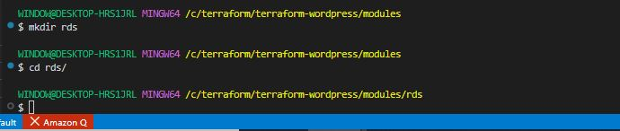

- Write a Terraform module named **'modules/rds/main.tf'** to create RDS.

```bash
nano main.tf 
```

```bash
# -----------------------------------------------
# RDS Security Group
# -----------------------------------------------
resource "aws_security_group" "rds" {
  name        = "${var.project_name}-rds-sg"
  description = "Security group for RDS MySQL"
  vpc_id      = var.vpc_id

  ingress {
    description = "MySQL from WordPress"
    from_port   = 3306
    to_port     = 3306
    protocol    = "tcp"
    cidr_blocks = var.allowed_cidr_blocks
  }

  egress {
    from_port   = 0
    to_port     = 0
    protocol    = "-1"
    cidr_blocks = ["0.0.0.0/0"]
  }

  tags = merge({ Name = "${var.project_name}-rds-sg" }, var.tags)
}

# -----------------------------------------------
# RDS Subnet Group
# -----------------------------------------------
resource "aws_db_subnet_group" "main" {
  name       = "${var.project_name}-rds-subnet-group"
  subnet_ids = var.subnet_ids
  tags       = merge({ Name = "${var.project_name}-rds-subnet-group" }, var.tags)
}

# -----------------------------------------------
# RDS MySQL Instance
# -----------------------------------------------
resource "aws_db_instance" "main" {
  identifier              = "${var.project_name}-${var.environment}-mysql"
  engine                  = "mysql"
  engine_version          = "8.0"
  instance_class          = var.db_instance_class
  allocated_storage       = var.allocated_storage
  storage_type            = "gp3"
  storage_encrypted       = true
  db_name                 = var.db_name
  username                = var.db_username
  password                = var.db_password
  db_subnet_group_name    = aws_db_subnet_group.main.name
  vpc_security_group_ids  = [aws_security_group.rds.id]
  multi_az                = false
  publicly_accessible     = false
  skip_final_snapshot     = true
  deletion_protection     = false
  backup_retention_period = 7

  tags = merge({ Name = "${var.project_name}-mysql" }, var.tags)
} 
```

```bash
nano variables.tf 
```

```bash
variable "project_name" {
  type = string
}

variable "environment" {
  type    = string
  default = "dev"
}

variable "vpc_id" {
  type = string
}

variable "subnet_ids" {
  type = list(string)
}

variable "db_name" {
  type    = string
  default = "wordpress"
}

variable "db_username" {
  type    = string
  default = "admin"
}

variable "db_password" {
  type      = string
  sensitive = true
}

variable "db_instance_class" {
  type    = string
  default = "db.t3.micro"
}

variable "allocated_storage" {
  type    = number
  default = 20
}

variable "allowed_cidr_blocks" {
  type = list(string)
}

variable "tags" {
  type    = map(string)
  default = {}
}
```

```bash
nano outputs.tf 
```

```bash
output "db_endpoint" {
  value = aws_db_instance.main.endpoint
}

output "db_name" {
  value = aws_db_instance.main.db_name
}

output "db_port" {
  value = aws_db_instance.main.port
}

output "security_group_id" {
  value = aws_security_group.rds.id
}
```

**EFS Setup for WordPress Files:**

- In the project directory, creat a new directory EFS module named **'modules/efs'**.

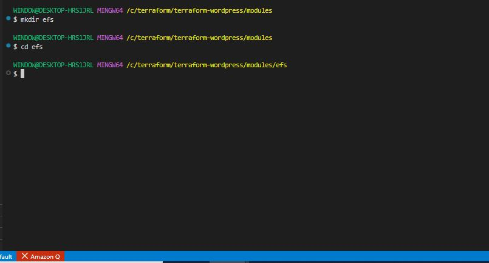

- Write a Terraform module named **'modules/efs/main.tf'** to create EFS file system.

```bash
nano main.tf 
```

```bash
# -----------------------------------------------
# EFS Security Group
# -----------------------------------------------
resource "aws_security_group" "efs" {
  name        = "${var.project_name}-efs-sg"
  description = "Security group for EFS"
  vpc_id      = var.vpc_id

  ingress {
    description = "NFS from WordPress"
    from_port   = 2049
    to_port     = 2049
    protocol    = "tcp"
    cidr_blocks = var.allowed_cidrs
  }

  egress {
    from_port   = 0
    to_port     = 0
    protocol    = "-1"
    cidr_blocks = ["0.0.0.0/0"]
  }

  tags = merge({ Name = "${var.project_name}-efs-sg" }, var.tags)
}

# -----------------------------------------------
# EFS File System
# -----------------------------------------------
resource "aws_efs_file_system" "main" {
  creation_token   = "${var.project_name}-efs"
  performance_mode = "generalPurpose"
  throughput_mode  = "bursting"
  encrypted        = true

  tags = merge({ Name = "${var.project_name}-efs" }, var.tags)
}

# -----------------------------------------------
# EFS Mount Targets — one per subnet
# -----------------------------------------------
resource "aws_efs_mount_target" "main" {
  count           = length(var.subnet_ids)
  file_system_id  = aws_efs_file_system.main.id
  subnet_id       = var.subnet_ids[count.index]
  security_groups = [aws_security_group.efs.id]
} 
```

```bash
nano variables.tf 
```

```bash
variable "project_name" {
  type = string
}

variable "environment" {
  type    = string
  default = "dev"
}

variable "vpc_id" {
  type = string
}

variable "subnet_ids" {
  type = list(string)
}

variable "allowed_cidrs" {
  type = list(string)
}

variable "tags" {
  type    = map(string)
  default = {}
}
```

```bash
nano outputs.tf 
```

```bash
output "efs_id" {
  value = aws_efs_file_system.main.id
}

output "efs_dns_name" {
  value = aws_efs_file_system.main.dns_name
}

output "security_group_id" {
  value = aws_security_group.efs.id
} 
```

**Application Load Balancer:**

- In the project directory, creat a new directory ALB module named **'modules/alb'**.

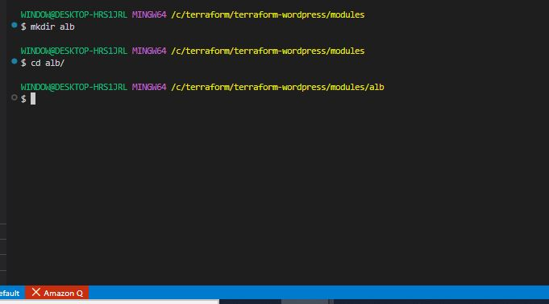

- Write a Terraform module named **'modules/alb/main.tf'** to create Application Load Balancer.

```bash
nano main.tf 
```

```bash
# -----------------------------------------------
# ALB Security Group
# -----------------------------------------------
resource "aws_security_group" "alb" {
  name        = "${var.project_name}-alb-sg"
  description = "Security group for ALB"
  vpc_id      = var.vpc_id

  ingress {
    description = "HTTP"
    from_port   = 80
    to_port     = 80
    protocol    = "tcp"
    cidr_blocks = ["0.0.0.0/0"]
  }

  ingress {
    description = "HTTPS"
    from_port   = 443
    to_port     = 443
    protocol    = "tcp"
    cidr_blocks = ["0.0.0.0/0"]
  }

  egress {
    from_port   = 0
    to_port     = 0
    protocol    = "-1"
    cidr_blocks = ["0.0.0.0/0"]
  }

  tags = merge({ Name = "${var.project_name}-alb-sg" }, var.tags)
}

# -----------------------------------------------
# Application Load Balancer
# -----------------------------------------------
resource "aws_lb" "main" {
  name               = "${var.project_name}-alb"
  internal           = false
  load_balancer_type = "application"
  security_groups    = [aws_security_group.alb.id]
  subnets            = var.subnet_ids

  enable_deletion_protection = false

  tags = merge({ Name = "${var.project_name}-alb" }, var.tags)
}

# -----------------------------------------------
# Target Group
# -----------------------------------------------
resource "aws_lb_target_group" "wordpress" {
  name     = "${var.project_name}-tg"
  port     = 80
  protocol = "HTTP"
  vpc_id   = var.vpc_id

  health_check {
    enabled             = true
    path                = "/wp-login.php"
    port                = "traffic-port"
    protocol            = "HTTP"
    healthy_threshold   = 3
    unhealthy_threshold = 3
    timeout             = 5
    interval            = 30
    matcher             = "200,302"
  }

  tags = merge({ Name = "${var.project_name}-tg" }, var.tags)
}

# -----------------------------------------------
# ALB Listener
# -----------------------------------------------
resource "aws_lb_listener" "http" {
  load_balancer_arn = aws_lb.main.arn
  port              = 80
  protocol          = "HTTP"

  default_action {
    type             = "forward"
    target_group_arn = aws_lb_target_group.wordpress.arn
  }
} 
```

```bash
nano variables.tf 
```

```bash
variable "project_name" {
  type = string
}

variable "environment" {
  type    = string
  default = "dev"
}

variable "vpc_id" {
  type = string
}

variable "subnet_ids" {
  type = list(string)
}

variable "tags" {
  type    = map(string)
  default = {}
}
```

```bash
nano outputs.tf 
```

```bash
output "alb_dns_name" {
  value = aws_lb.main.dns_name
}

output "alb_arn" {
  value = aws_lb.main.arn
}

output "target_group_arn" {
  value = aws_lb_target_group.wordpress.arn
}

output "security_group_id" {
  value = aws_security_group.alb.id
}
```

**Auto Scaling Group:**

- In the project directory, creat a new directory ASG module named **'modules/asg'**.

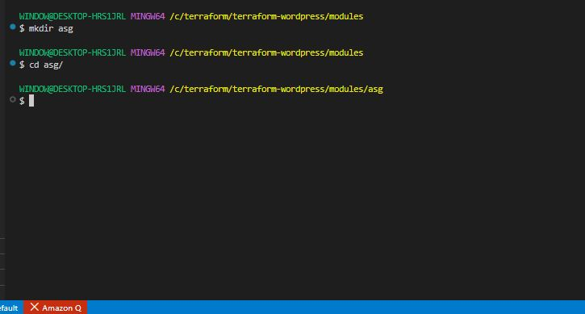

- Write a Terraform module named **'modules/asg/main.tf'** to create Auto Scaling Group.

```bash
nano main.tf 
```

```bash
# -----------------------------------------------
# Latest Amazon Linux 2023 AMI
# -----------------------------------------------
data "aws_ami" "amazon_linux" {
  most_recent = true
  owners      = ["amazon"]

  filter {
    name   = "name"
    values = ["al2023-ami-*-x86_64"]
  }

  filter {
    name   = "virtualization-type"
    values = ["hvm"]
  }
}

# -----------------------------------------------
# WordPress Security Group
# -----------------------------------------------
resource "aws_security_group" "wordpress" {
  name        = "${var.project_name}-wordpress-sg"
  description = "Security group for WordPress instances"
  vpc_id      = var.vpc_id

  ingress {
    description     = "HTTP from ALB"
    from_port       = 80
    to_port         = 80
    protocol        = "tcp"
    security_groups = [var.alb_sg_id]
  }

  ingress {
    description = "SSH"
    from_port   = 22
    to_port     = 22
    protocol    = "tcp"
    cidr_blocks = ["0.0.0.0/0"]
  }

  egress {
    from_port   = 0
    to_port     = 0
    protocol    = "-1"
    cidr_blocks = ["0.0.0.0/0"]
  }

  tags = merge({ Name = "${var.project_name}-wordpress-sg" }, var.tags)
}

# -----------------------------------------------
# WordPress User Data
# -----------------------------------------------
locals {
  wordpress_userdata = <<-EOF
    #!/bin/bash
    yum update -y
    yum install -y httpd php php-mysqlnd php-fpm amazon-efs-utils

    # Mount EFS
    mkdir -p /var/www/html
    mount -t efs ${var.efs_dns_name}:/ /var/www/html
    echo "${var.efs_dns_name}:/ /var/www/html efs defaults,_netdev 0 0" >> /etc/fstab

    # Install WordPress
    cd /var/www/html
    if [ ! -f wp-config.php ]; then
      wget https://wordpress.org/latest.tar.gz
      tar -xzf latest.tar.gz
      mv wordpress/* .
      rm -rf wordpress latest.tar.gz

      cp wp-config-sample.php wp-config.php
      sed -i "s/database_name_here/${var.db_name}/" wp-config.php
      sed -i "s/username_here/${var.db_username}/" wp-config.php
      sed -i "s/password_here/${var.db_password}/" wp-config.php
      sed -i "s/localhost/${var.db_endpoint}/" wp-config.php
    fi

    chown -R apache:apache /var/www/html
    chmod -R 755 /var/www/html

    systemctl enable httpd
    systemctl start httpd
  EOF
}

# -----------------------------------------------
# Launch Template
# -----------------------------------------------
resource "aws_launch_template" "wordpress" {
  name_prefix   = "${var.project_name}-lt-"
  image_id      = data.aws_ami.amazon_linux.id
  instance_type = var.instance_type

  network_interfaces {
    associate_public_ip_address = false
    security_groups             = [aws_security_group.wordpress.id]
  }

  user_data = base64encode(local.wordpress_userdata)

  block_device_mappings {
    device_name = "/dev/xvda"
    ebs {
      volume_size           = 30
      volume_type           = "gp3"
      encrypted             = true
      delete_on_termination = true
    }
  }

  tag_specifications {
    resource_type = "instance"
    tags = merge(
      { Name = "${var.project_name}-wordpress" },
      var.tags
    )
  }
}

# -----------------------------------------------
# Auto Scaling Group
# -----------------------------------------------
resource "aws_autoscaling_group" "wordpress" {
  name                = "${var.project_name}-asg"
  vpc_zone_identifier = var.subnet_ids
  target_group_arns   = [var.target_group_arn]
  min_size            = var.min_size
  max_size            = var.max_size
  desired_capacity    = var.desired_capacity
  health_check_type   = "ELB"
  health_check_grace_period = 300

  launch_template {
    id      = aws_launch_template.wordpress.id
    version = "$Latest"
  }

  tag {
    key                 = "Name"
    value               = "${var.project_name}-wordpress-asg"
    propagate_at_launch = true
  }
}

# -----------------------------------------------
# Scale Up Policy
# -----------------------------------------------
resource "aws_autoscaling_policy" "scale_up" {
  name                   = "${var.project_name}-scale-up"
  autoscaling_group_name = aws_autoscaling_group.wordpress.name
  adjustment_type        = "ChangeInCapacity"
  scaling_adjustment     = 1
  cooldown               = 300
}

resource "aws_cloudwatch_metric_alarm" "high_cpu" {
  alarm_name          = "${var.project_name}-high-cpu"
  comparison_operator = "GreaterThanOrEqualToThreshold"
  evaluation_periods  = 2
  metric_name         = "CPUUtilization"
  namespace           = "AWS/EC2"
  period              = 120
  statistic           = "Average"
  threshold           = 75
  alarm_description   = "Scale up when CPU >= 75%"
  alarm_actions       = [aws_autoscaling_policy.scale_up.arn]

  dimensions = {
    AutoScalingGroupName = aws_autoscaling_group.wordpress.name
  }
}

# -----------------------------------------------
# Scale Down Policy
# -----------------------------------------------
resource "aws_autoscaling_policy" "scale_down" {
  name                   = "${var.project_name}-scale-down"
  autoscaling_group_name = aws_autoscaling_group.wordpress.name
  adjustment_type        = "ChangeInCapacity"
  scaling_adjustment     = -1
  cooldown               = 300
}

resource "aws_cloudwatch_metric_alarm" "low_cpu" {
  alarm_name          = "${var.project_name}-low-cpu"
  comparison_operator = "LessThanOrEqualToThreshold"
  evaluation_periods  = 2
  metric_name         = "CPUUtilization"
  namespace           = "AWS/EC2"
  period              = 120
  statistic           = "Average"
  threshold           = 25
  alarm_description   = "Scale down when CPU <= 25%"
  alarm_actions       = [aws_autoscaling_policy.scale_down.arn]

  dimensions = {
    AutoScalingGroupName = aws_autoscaling_group.wordpress.name
  }
} 
```

```bash
nano variables.tf 
```

```bash
variable "project_name" {
  type = string
}

variable "environment" {
  type    = string
  default = "dev"
}

variable "vpc_id" {
  type = string
}

variable "subnet_ids" {
  type = list(string)
}

variable "target_group_arn" {
  type = string
}

variable "alb_sg_id" {
  type = string
}

variable "db_endpoint" {
  type = string
}

variable "db_name" {
  type = string
}

variable "db_username" {
  type = string
}

variable "db_password" {
  type      = string
  sensitive = true
}

variable "efs_dns_name" {
  type = string
}

variable "instance_type" {
  type    = string
  default = "t3.micro"
}

variable "min_size" {
  type    = number
  default = 1
}

variable "max_size" {
  type    = number
  default = 3
}

variable "desired_capacity" {
  type    = number
  default = 2
}

variable "tags" {
  type    = map(string)
  default = {}
}
```

```bash
nano outputs.tf 
```

```bash
output "asg_name" {
  value = aws_autoscaling_group.wordpress.name
}

output "launch_template_id" {
  value = aws_launch_template.wordpress.id
}

output "security_group_id" {
  value = aws_security_group.wordpress.id
}
```

**Main Terraform Configuration:**

- Create the main Terraform configuration file named **'main.tf'** in the project directory.

```bash
nano main.tf
```

```bash
provider "aws" {
  region = var.aws_region
  default_tags {
    tags = {
      Project     = var.project_name
      Environment = var.environment
      ManagedBy   = "terraform"
    }
  }
}

module "vpc" {
  source               = "./modules/vpc"
  project_name         = var.project_name
  environment          = var.environment
  vpc_cidr             = "10.0.0.0/16"
  public_subnet_cidrs  = ["10.0.1.0/24", "10.0.2.0/24"]
  private_subnet_cidrs = ["10.0.3.0/24", "10.0.4.0/24"]
  availability_zones   = ["us-east-1a", "us-east-1b"]
  enable_nat_gateway   = true
}

module "rds" {
  source               = "./modules/rds"
  project_name         = var.project_name
  environment          = var.environment
  vpc_id               = module.vpc.vpc_id
  subnet_ids           = module.vpc.private_subnet_ids
  db_name              = "wordpress"
  db_username          = "admin"
  db_password          = var.db_password
  db_instance_class    = "db.t3.micro"
  allocated_storage    = 20
  allowed_cidr_blocks  = ["10.0.0.0/16"]
}

module "efs" {
  source         = "./modules/efs"
  project_name   = var.project_name
  environment    = var.environment
  vpc_id         = module.vpc.vpc_id
  subnet_ids     = module.vpc.private_subnet_ids
  allowed_cidrs  = ["10.0.0.0/16"]
}

module "alb" {
  source       = "./modules/alb"
  project_name = var.project_name
  environment  = var.environment
  vpc_id       = module.vpc.vpc_id
  subnet_ids   = module.vpc.public_subnet_ids
}

module "asg" {
  source           = "./modules/asg"
  project_name     = var.project_name
  environment      = var.environment
  vpc_id           = module.vpc.vpc_id
  subnet_ids       = module.vpc.private_subnet_ids
  target_group_arn = module.alb.target_group_arn
  alb_sg_id        = module.alb.security_group_id
  db_endpoint      = module.rds.db_endpoint
  db_name          = "wordpress"
  db_username      = "admin"
  db_password      = var.db_password
  efs_dns_name     = module.efs.efs_dns_name
  instance_type    = "t2.micro"
  min_size         = 1
  max_size         = 3
  desired_capacity = 2
}
```

```bash
nano variables.tf
```

```bash
variable "aws_region" {
  type    = string
  default = "us-east-1"
}

variable "project_name" {
  type    = string
  default = "wordpress"
}

variable "environment" {
  type    = string
  default = "dev"
}

variable "db_password" {
  type      = string
  sensitive = true
}
```

```bash
nano outputs.tf
```

```bash
output "wordpress_url" {
  value = "http://${module.alb.alb_dns_name}"
}

output "alb_dns_name" {
  value = module.alb.alb_dns_name
}

output "rds_endpoint" {
  value = module.rds.db_endpoint
}

output "efs_dns_name" {
  value = module.efs.efs_dns_name
}

output "asg_name" {
  value = module.asg.asg_name
}

output "vpc_id" {
  value = module.vpc.vpc_id
}
```

**Deployment:**

- Run 'terraform init' and 'terraform apply' to deploy the EC2 instance with Apache2.

```bash
terraform init
```

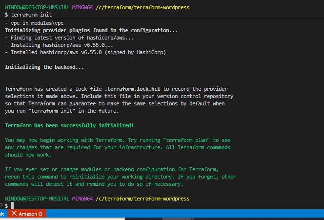


```bash
terraform apply
```

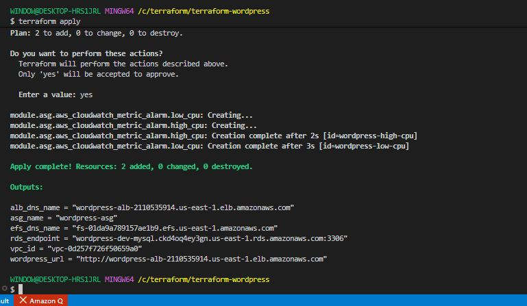

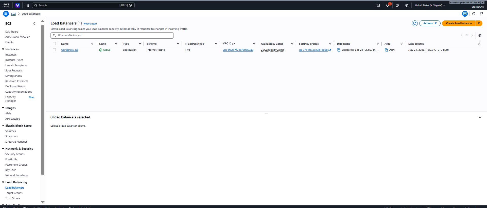

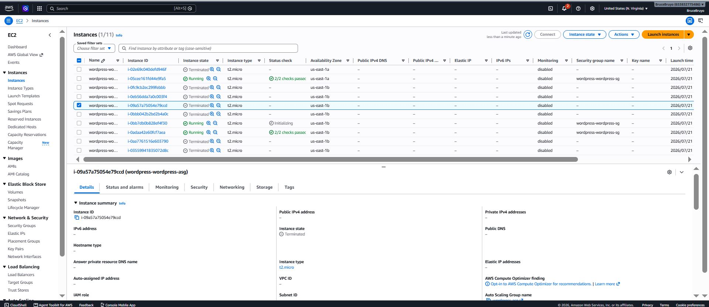

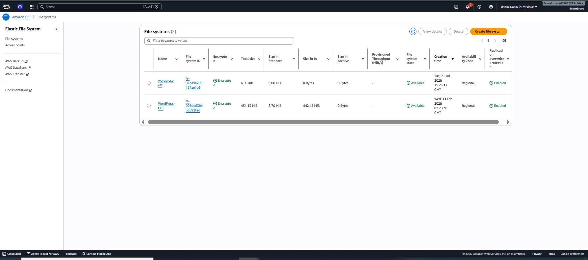

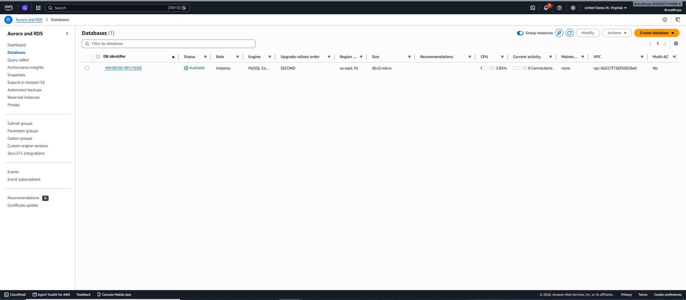


```bash
http://wordpress-alb-2110535914.us-east-1.elb.amazonaws.com/
```

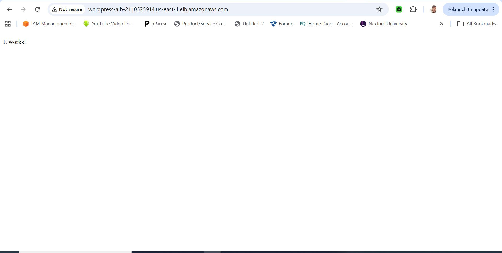


- Clean up

```bash
terraform destroy
```

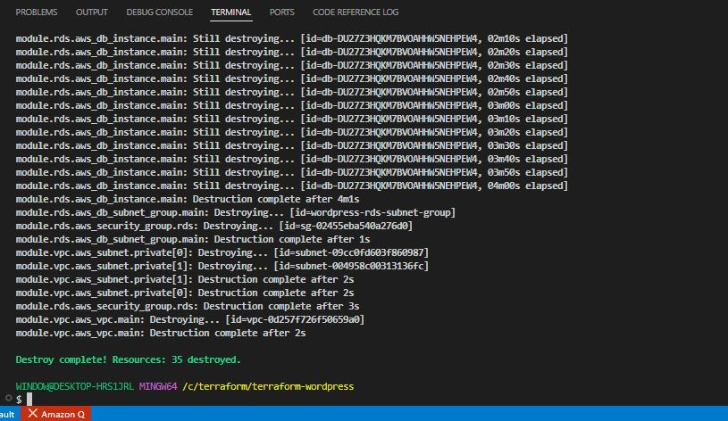

**Note:**

On you IAM section on AWS, you need to add the following permissions to the IAM user.

```bash
| AWS Service            | Missing Permission                                  |
| ---------------------- | --------------------------------------------------- |
| Elastic Load Balancing | `elasticloadbalancing:ModifyLoadBalancerAttributes` |
| EFS                    | `elasticfilesystem:TagResource`                     |
| RDS                    | `rds:CreateDBSubnetGroup`                           |
| Auto Scaling           | `autoscaling:PutScalingPolicy`                      |
| CloudWatch             | `cloudwatch:ListTagsForResource`                    |
```