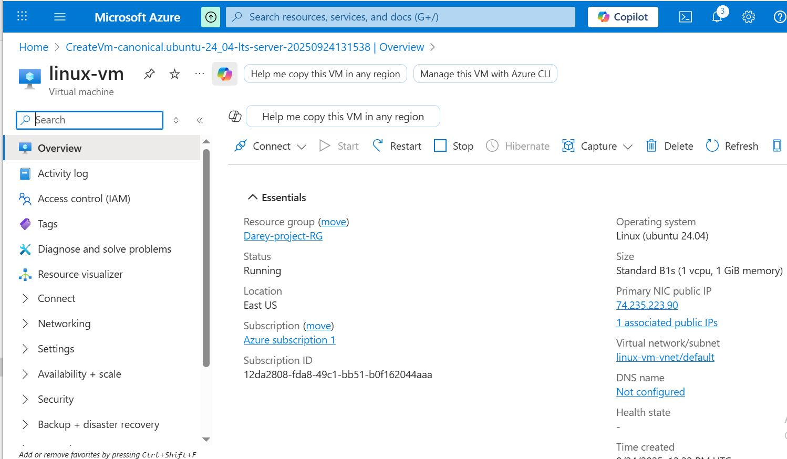

# Getting Started with Azure: Deploy and Manage a Linux VM

## Introduction

Cloud computing allows users to access powerful compute resources on demand. Microsoft Azure is one of the leading cloud platforms, and this projects will introduce you to its capabilities through *hands-on experience with deploying and managing a Linux Virtual Machine (VM)*.

This project will guide you through the process of creating a *Linux VM management operations* like starting, stopping, and resizing the VM using the Azure Portal.

## Objectives

1. Understand the Azure Portal and resource organization.

2. Create and manage a *Linux Virtual Machine* in Azure.

3. Securely connect to the VM using *SSH*.

4. Perform basic *VM lifecycle management* tasks.

5. Explore configuration options for compute resources.

## Prerequistes

1. A valid *Azure subscription* (Free Tier is acceptable).

2. A local *SSH client* (Linux/macOS terminal od PUTTY for Windows).

3. Basic understanding of *Linux commands* and *SSH access*.

## Project Task

### Create an Azure Account and Access the Portal.

- Visit the Azure signup page to create an account.

https://azure.microsoft.com/en-us/get-started/azure-portal

1. Click on "Sign in" for existing users and click on "New to Azure? Get Started".

2. Select your subscription. For this project, select "Try Azure for free".

3. Create account by filling in your data.

### Create a Resource Group

- In the portal, search for *resource Groups* and click *Create*.

- Choose a name and select a region.

- Click *Review + Create* to create.

### Create a Linux Virtual Machine

- Search for Virtual Machines in the Azure Portal and click *Create*.

- Fill out the *Basics* tab:

1. *VM name: 'linux-vm'*

2. *Region:* Same as resource group

3. *Image:* Ubuntu LTS 

4. *Authenication:* SSH public key. If needed, generate a key with: *'ssh-keygen -t rsa*

5. *Username:* Choose a non-root name like *azureuser*

- Click on 'Review + create'.

### Connect to the Linux VM via SSH

- Once the deployment is complete, go to the VM's Overview page.

- Copy the *public IP address* and in your terminal, connect via SSH.

- Set up the Native SSH to connect to the local by adding the downloaded key pair.

- Connect to your VM via SSH by copying the SSH command and pasting in your local machine. Ensure you are on the 'Downloads' environment where you have the downloaded key pair.

'ssh -i linux-vm_key.pem azureuser@74.235.223.90'

- Accept the host key fingerprint on first login.

### Explore VM Configuration

- In the Azure Portal, view the *VM details*.

1. OS type, VM Size, attached disk, and IP info.

- On the Linux VM, explore using commands like;

'uname -a
df -h
ip a'

### Manage VM Lifecycle 

- From the Azure Portal:

1. Use  the *Stop,Start, and Restart* buttons.

For Stop VM:

For Start VM:

For Restarted VM:

2. Click *Size* to *resize* the VM to a smaller/lager SKU.

