# Introduction to Continnuous Integration and Continuous Deployment

## Project Review

The project will involve setting up a simple web application (e.g a Node.js application) and applying CI/CD practices using GitHub Actions. This application will have basic functionality such as serving a static web page.

### Introduction to GitHub Actions and CI/CD Course Project

This project is designed to provide a hands-on learning experience through the essentials of automating software development processes using GitHub Actions. 

### Why is this relevant?

### Understanding Continuous Integration and Continuous Deployment

- Continuous Integration (CI) is the practice of merging all developers' working copies to a shared mainline several times a day.

- Continuous Deployment (CD) is the process of releasing software changes to production automatically and reliably.

**Benefits:**

- Faster release rate.

- Improved developer productivity.

- Better code quality.

- Enhanced customer satisfaction.

### Overview of the CI/CD Pipeline:

- **CI Pipeline:** This typically includes steps like version control, code integration, automated testing, and building the application.

- **CD Pipeline:** This involes steps like deploying the application to a staging or production environment, and post-deployment monitoring.

- **Tools:** Version control systems (e.g Git), CI/CD platforms (e.g GitHub Actions), testing frameworks, and deployment tools.

### Introduction to GitHub Actions

- **GitHub Actions:** This is a CI/CD platform integrated into GitHub, automating the build, test, and deployment pipelines of your software directly within your GitHub repository.

### Key Concepts and Terminology:

1. **Workflow:**

- **Definition:** A configurable automated process made up of one or more jobs. Workflows are defined by a YAML file in your repository.

- **Example:** A workflow to test and deploy a Node.js application upon Git push.

2. **Event:**

- **Definition:** A specific activity that triggers a workflow. Events include activities like push, pull request, issue creation, or even a scheduled time.

- **Example:** A push event triggers a workflow that runs tests every time a code is pushed to any branch in a repository.

3. **Job:**

- **Definition:** A set of steps in a workflow that are executed on the same runner. Jobs can run sequentially or in parallel.

- **Example:** A job that runs tests on your application.

4. **Step:**

- **Definition:** An individual task that can run commands within a job. Steps can run scripts or actions.

- **Example:** A step in a job to install dependencies ('npm install').

5. **Action:**

- **Definition:** A standalone commands combined into steps to create a job. Actions can be written by you or provided by the GitHub community.

- **Example:** Using actions/checkout to check out your repository code.

6. **Runner:**

- **Definition:** A server that runs your workflows when they're trigered. Runners are hosted by GitHub or self-hosted.

- **Example:** A GitHub-hosted runner that uses Ubuntu.

### Task

**Initialize a GitHub Repository:**

- Create a new repository on GitHub.

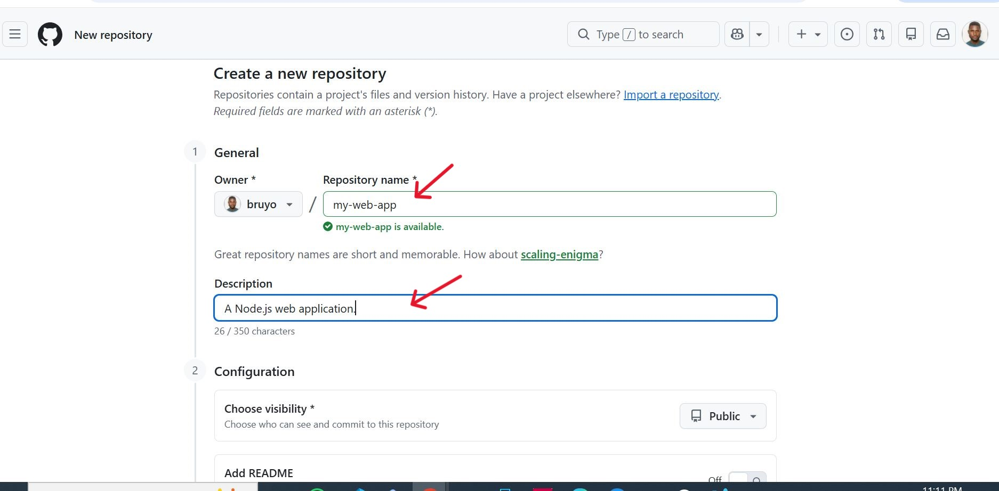

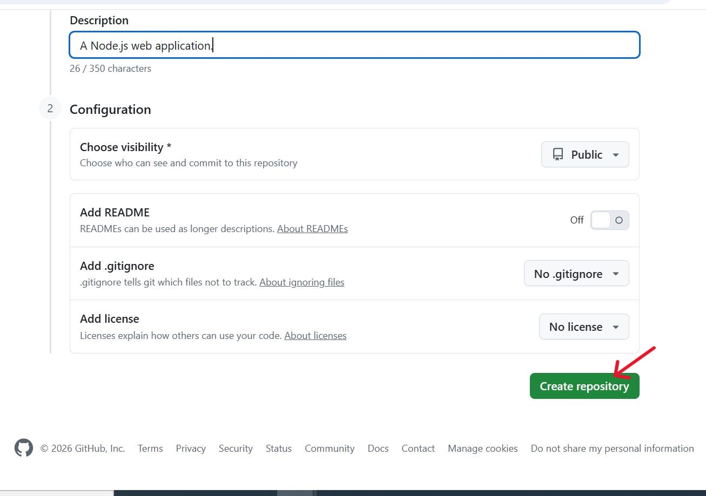

- Clone it to the local machine. Go to your terminal and paste the command.

```bash
git clone https://github.com/bruyo/my-web-app.git'
```

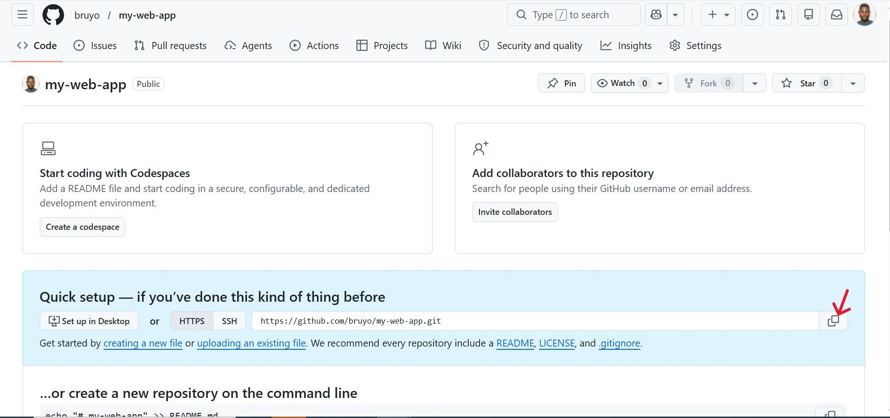

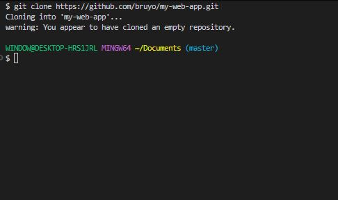

**Create a Simple Node.js Application:**

- Initialize a Node.js project ('npm init').

```bash
npm init
```

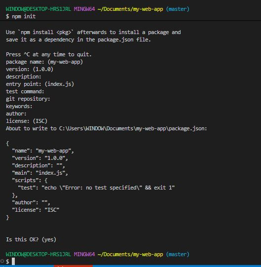

- Create a simple server using Express.js to serve a static web page.

- Add your code to the repository and push to GitHub.

```bash
nano index.js
```

```bash
// Example: index.js
const express = require('express');
const app = express();
const port = process.env.PORT || 3000;

app.get('/', (req, res) => {"\n     res.send('Hello World!');\n   "});

app.listen(port, () => {
  console.log(`App listening at http://localhost:${port}`);
});
```


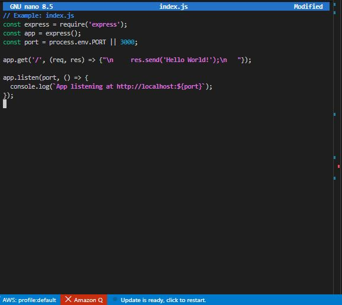


**Writing your first GitHub Action Workflow:**

-  Create a '.github/workflows' directory in your repositroy.

```bash
mkdir .github
```

```bash
cd .github
```

```bash
mkdir workflows
```

```bash
cd workflows
```

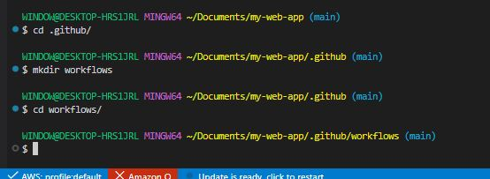

- Add a workflow file.

```bash
nano node.js.yml
```

```bash
# Example: .github/workflows/node.js.yml

# Name of the workflow
name: Node.js CI

# Specifies when the workflow should be triggered
on:
# Triggers the workflow on 'push' events to the 'main' branch
push:
    branches: [ main ]
# Also triggers the workflow on 'pull_request' events targeting the 'main' branch
pull_request:
    branches: [ main ]

# Defines the jobs that the workflow will execute
jobs:
# Job identifier, can be any name (here it's 'build')
build:
    # Specifies the type of virtual host environment (runner) to use
    runs-on: ubuntu-latest

    # Strategy for running the jobs - this section is useful for testing across multiple environments
    strategy:
    # A matrix build strategy to test against multiple versions of Node.js
    matrix:
        node-version: [14.x, 16.x]

    # Steps represent a sequence of tasks that will be executed as part of the job
    steps:
    - # Checks-out your repository under $GITHUB_WORKSPACE, so the job can access it
    uses: actions/checkout@v2

    - # Sets up the specified version of Node.js
    name: Use Node.js ${{" matrix.node-version "}}
    uses: actions/setup-node@v1
    with:
        node-version: ${{" matrix.node-version "}}

    - # Installs node modules as specified in the project's package-lock.json
    run: npm ci

    - # This command will only run if a build script is defined in the package.json
    run: npm run build --if-present

    - # Runs tests as defined in the project's package.json
    run: npm test
```

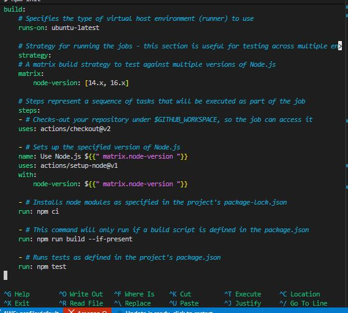

**Explanation:**

- **name:** This simply means the workflow. It's appears on GitHub when the workflow is running.

- **on:** This section defines when the workflow is triggered. Here, it's set to activate on push and pull request events to the main branch.

- **jobs:** Jobs are a set of steps that execute on the same runner. In this example, there's one job named "build".

- **runs-on:** Defines the type of machine to run the job on. Here, it's using the latest Ubuntu virtual machine.

- **strategy.matrix:** This allows you to run the job on multiple versions of Node.js, ensuring compatiblity.

- **steps:** A sequence of tasks executed as part of the job.

1. **actions/checkout@v2:** Checks out your repository under **'GITHUB_WORKSPACE'**.

2. **actions/setup-node@v1:** Sets up the Node.js environment.

3. **npm ci:** Installs dependencies defined in **package-lock.json**.

4. **npm run build --if-present:** Runs the build script from **package.json** if it's present.

5. **npm test:** Runs tests specified in **package.json**.

This workflow is a basic example for a Node.js project, demonstrating how to automate testing across different Node.js versions and ensuring that your code integrates and works as expected in a clean environment.

[Push-to-repository](./img/git-push.JPG)

**Testing and Deployment:**

- Add automated tests for your application by adding the following workflow script to automate testing across different Node.js versions.

Replace the script on the 'node.js.yml' file with the script below.

```bash
name: Node.js CI/CD
on:
  push:
    branches: [ main ]
  pull_request:
    branches: [ main ]

jobs:
  build:
    runs-on: ubuntu-latest
    strategy:
      matrix:
        node-version: [18.x, 20.x]
    steps:
      - name: Checkout repository
        uses: actions/checkout@v4

      - name: Use Node.js ${{ matrix.node-version }}
        uses: actions/setup-node@v4
        with:
          node-version: ${{ matrix.node-version }}
          cache: 'npm'

      - name: Install dependencies
        run: npm ci

      - name: Build app
        run: npm run build --if-present

      - name: Run tests
        run: npm test
```

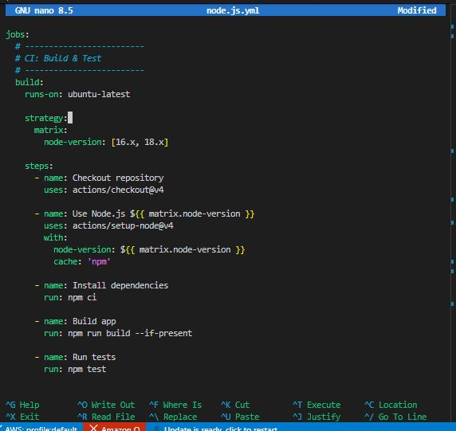


- Create a workflow for deployment by creating a file named deploy.js and paste the script below.

```bash
nano deploy.js
```

```bash
  # -------------------------
  # CD: Deployment
  # -------------------------
  deploy:
    runs-on: ubuntu-latest
    needs: build   # ensures build + tests pass first

    # Only deploy on push to main (not PRs)
    if: github.ref == 'refs/heads/main' && github.event_name == 'push'

    steps:
      - name: Checkout repository
        uses: actions/checkout@v4

      - name: Use Node.js
        uses: actions/setup-node@v4
        with:
          node-version: 18.x
          cache: 'npm'

      - name: Install dependencies
        run: npm ci

      - name: Build app
        run: npm run build --if-present

      # -------------------------
      # Example Deployment Step
      # -------------------------
      - name: Deploy to server
        run: |
          echo "Deploying application..."
          # Replace this with your real deployment command
          # Examples:
          # scp -r ./build user@server:/var/www/app
          # ssh user@server "pm2 restart app"
          # or deploy to cloud (AWS, Azure, Vercel, etc.)
```

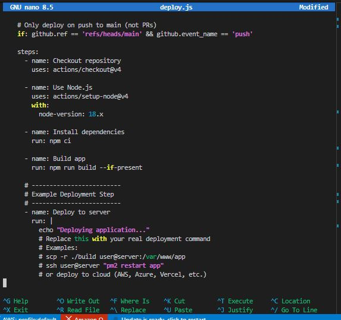

- Add a lock file with code below.

```bash
npm install
```

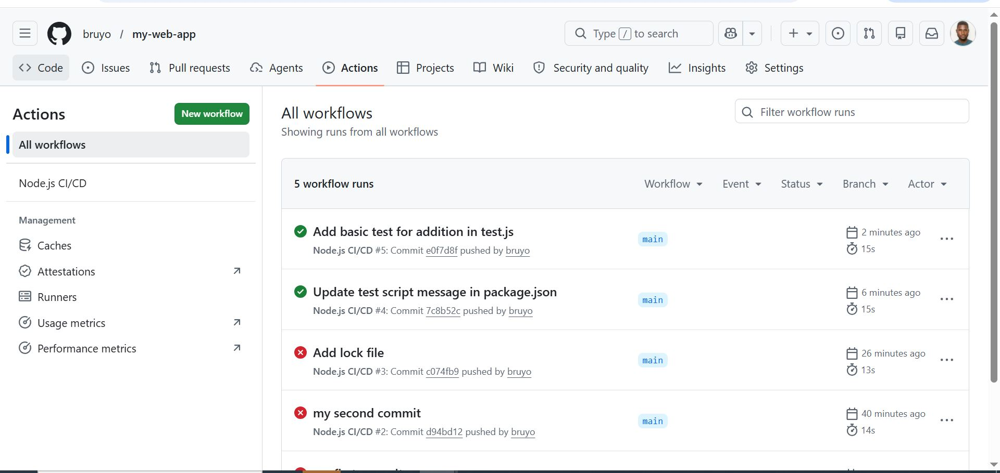

**Experiment and Learn:**

- Modify workflows to see how changes affect the CI/CD process.

- Try adding different types of tests (unit tests, integration tests).

1. Create a test file named "test.js". Copy and paste the code snippet below and save it on the file.

```bash
nano test.js
```

```bash
// __tests__/sample.test.js
test('basic test', () => {
  expect(1 + 1).toBe(2);
});
```

2. Install jest.

```bash
npm install --save-dev jest
```

3. Downgrade the jest version.

```bash
npm install --save-dev jest@28
```

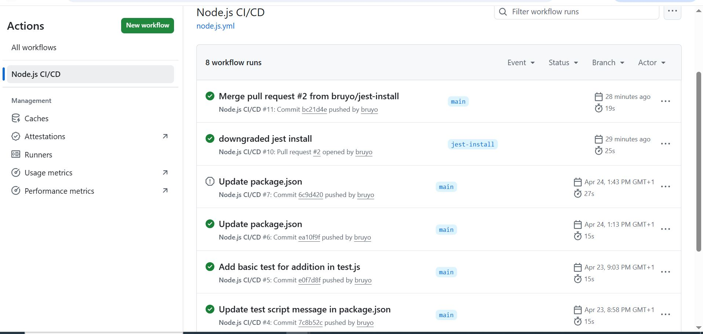