# Capstone Project - Git

## Enhancing a Community Library Website

### Background Scenario

You're a part of a development team tasked with enhancing the website for the "*Greenwood Community Library*". The website aims to be more engaging and informative for its visitors.

It currently includes basic sections: *Home*, *About Us*, *Event*, and *Contact Us*. Your team decides to add a *Book Review* section and update the *Events* page to 

feature upcoming community events.

### Setup

- Create a Repository on GitHub.

1. Name it greenwood-library-website

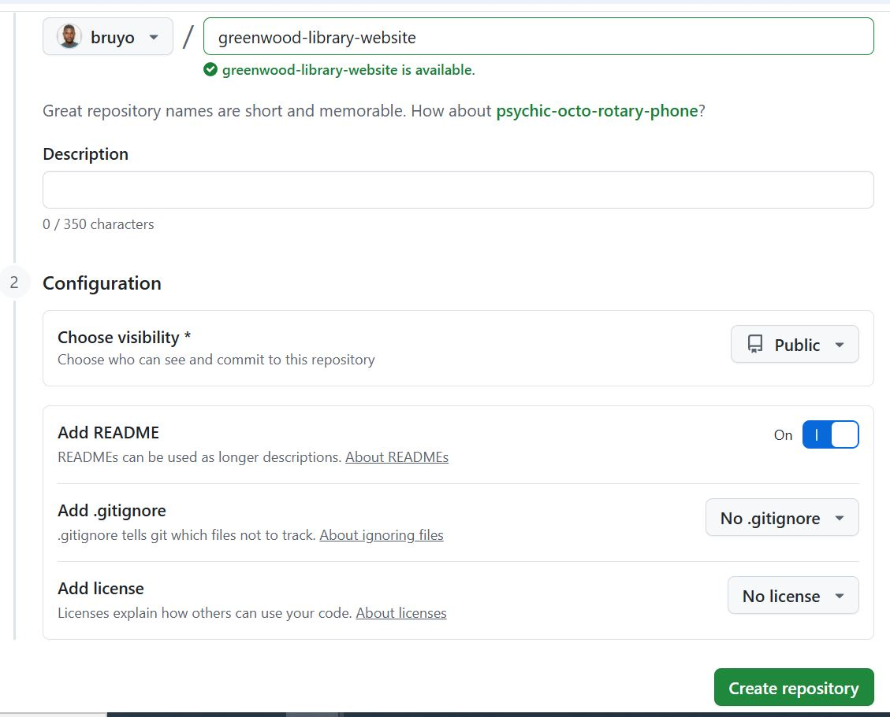

### Task 

- Create in the main branch using a *visual studio code editor*, the files for the each web pages.

1. home.html

'touch home.html'

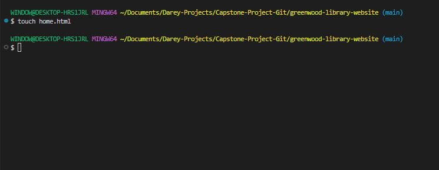

2. about_us.html

'touch about_us.html

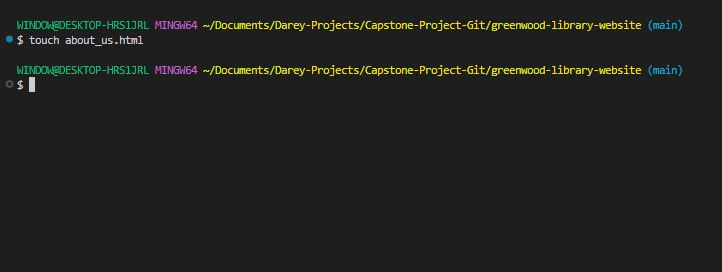

3. events.html

'touch events.html'

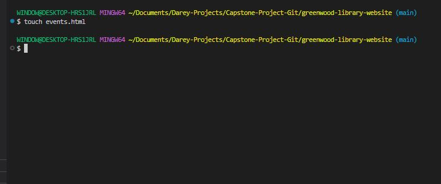

4. contact_us.html

'touch contact_us.html'

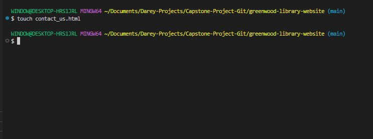

- Add content into each of the files.

1. Homepage

'vim home.html'

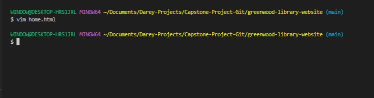

2. About-Us

'vim about_us.html'

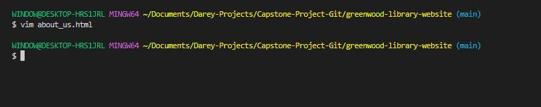

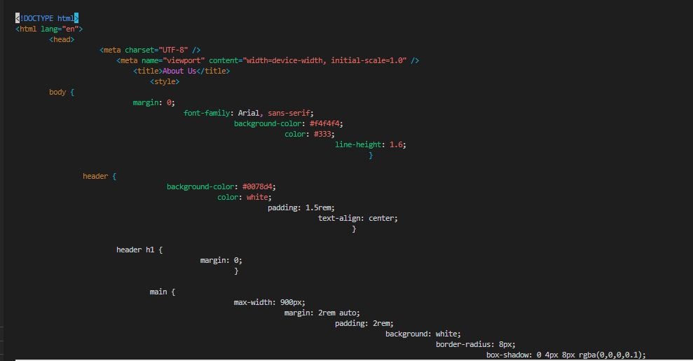

3. Events

'vim events.html'

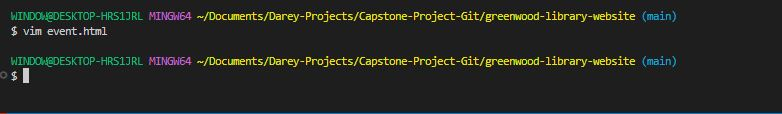

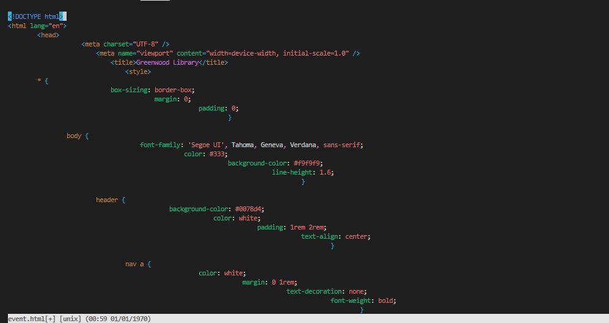

3. Contact_Us

'vim contact_us.html'

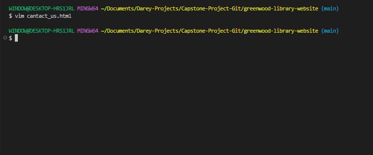

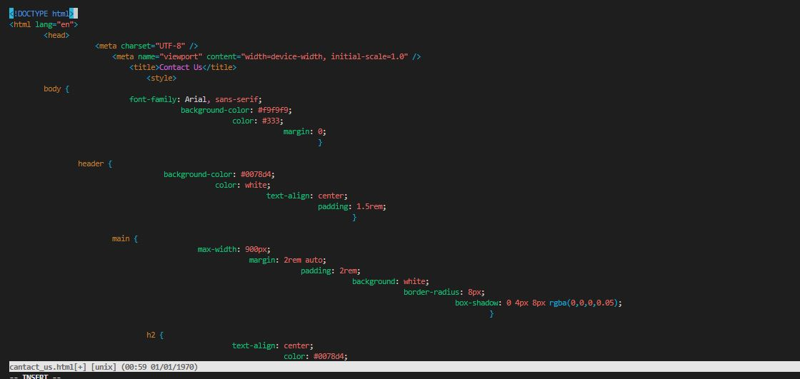

- Stage, commit and push the changes directly to *main branch*.

'git add .'

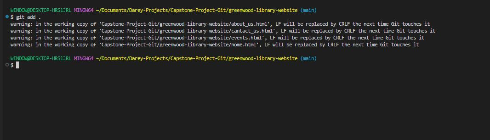

