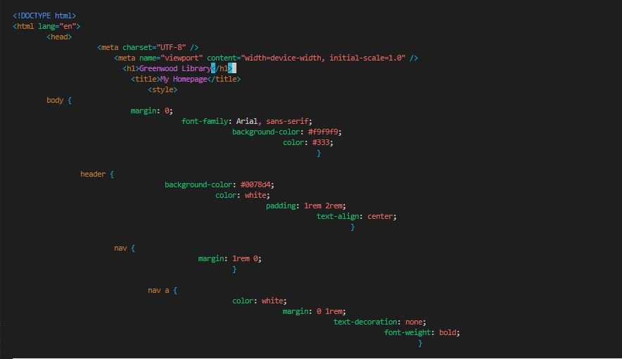
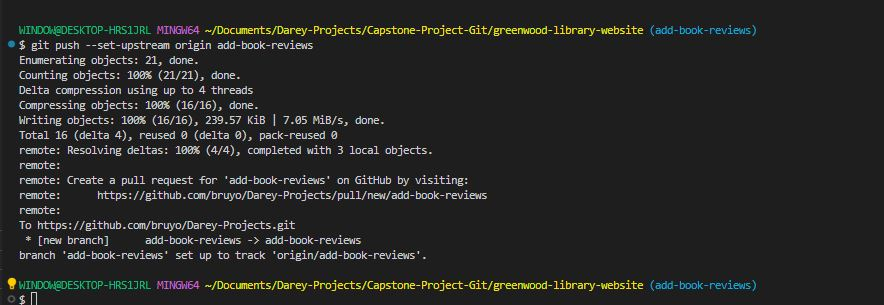
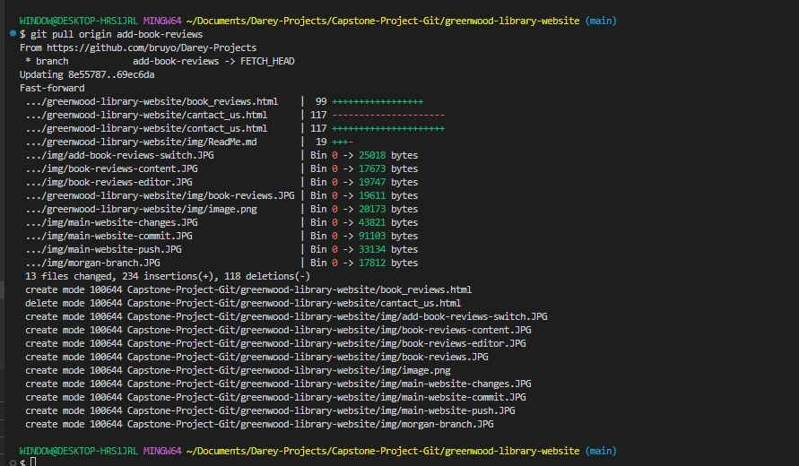

# Capstone Project - Git

## Enhancing a Community Library Website

### Background Scenario

You're a part of a development team tasked with enhancing the website for the "*Greenwood Community Library*". The website aims to be more engaging and informative for its visitors.

It currently includes basic sections: *Home*, *About Us*, *Event*, and *Contact Us*. Your team decides to add a *Book Review* section and update the *Events* page to 

feature upcoming community events.

### Setup

- Create a Repository on GitHub.

1. Name it greenwood-library-website

### Task 

- Create in the main branch using a *visual studio code editor*, the files for the each web pages.

1. home.html

'touch home.html'

2. about_us.html

'touch about_us.html

3. events.html

'touch events.html'

4. contact_us.html

'touch contact_us.html'

- Add content into each of the files.

1. Homepage

'vim home.html'

2. About-Us

'vim about_us.html'

3. Events

'vim events.html'

3. Contact_Us

'vim contact_us.html'

- Stage, commit and push the changes directly to *main branch*.

'git add .'

'git commit -m "main-website-changes"'

'git push'

### Morgan's Work:Adding Book Reviews

1. Create a Branch for Morgan:

'git branch *add-book-reviews*.

2. Switch to a new branch named *add-book-reviews*.

'git switch add-book-reviews'

3. Add a new file *book_reviews.html* to represent the Book Reviews Section:

'touch book_reviews.html'

4. Add a random text content into the file. 

'vim book_reviews.html'

5. Stage, commit and push the changes with a message like "*Add book reviews section*".

'git add .'

'git commit -m "Add book reviews section"'

6. Push the add-book-reviews branch to GitHub.

'git push --set-upstream origin add-book-reviews'

7. Raise a Pull Request (PR) for Morgan's work:

- Create a new "Pull request" by clicking on "Pull request".

- Click on "New pull request".

- Compare changes between the main branch and add-book-reviews branch and click on "Create pull request".

- Add a title and description of the changes and click on "Create pull request".

8. Merge Morgan's work to the main branch.

- Click on "Merge pull request".

- Click on "Confirm merge".

### Jamie's Work: Updating Events Page

We are going to repeat same flow for Jamie's work on the Events Page. Jamie's work is in *update-events* branch.

1. Pull the latest changes from the main branch into *update-events* before raising the Pull Request (PR)

- Switch to the main branch.

'git switch main'

- Pull the latest changes.

'git pull origin add-book-reviews"

- Create Jamie's branch

'git branch 
