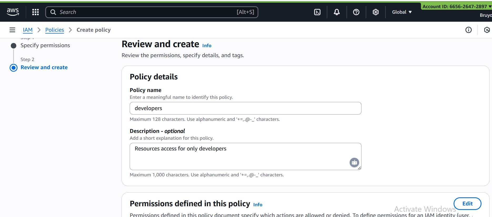
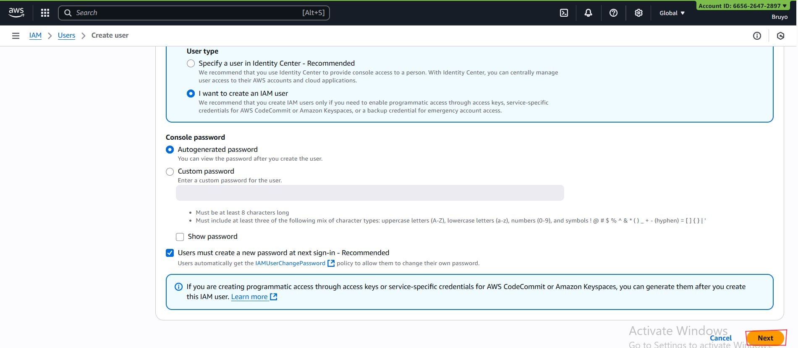

# Introduction to Cloud Computing - Security & Identity Management (IAM)

## Introduction to Cloud Computing

Cloud computing is the delivery of computing services—such as storage, databases, networking, servers, software, and analytics—over the internet (“the cloud”). Instead of owning and managing physical hardware and software, organizations and individuals can access these resources on demand from cloud providers like Amazon Web Services (AWS), Microsoft Azure, and Google Cloud Platform (GCP).

### Key Characteristics of Cloud Computing

- On-Demand Self-Service – Users can provision resources like servers and storage without human intervention.

- Broad Network Access – Services are available anytime, anywhere via the internet.

- Scalability & Elasticity – Resources can scale up or down automatically based on demand.

- Pay-As-You-Go Pricing – You only pay for what you use, reducing upfront costs.

- Managed Infrastructure – The cloud provider handles maintenance, updates, and security at the infrastructure level.

### Cloud Service Models (What You Get)

- IaaS (Infrastructure as a Service): Provides virtual servers, networking, and storage. Example: AWS EC2.

- PaaS (Platform as a Service): Provides development tools and platforms to build apps without managing servers. Example: Google App Engine.

- SaaS (Software as a Service): Provides ready-to-use applications delivered over the internet. Example: Gmail, Microsoft 365.

### Cloud Deployment Models (Where It Runs)
- Public Cloud: Shared resources hosted by providers (e.g., AWS, Azure).

- Private Cloud: Dedicated infrastructure for one organization, often on-premises.

- Hybrid Cloud: Mix of public and private for flexibility and control.

- Multi-Cloud: Using multiple providers for redundancy and optimization.

### Benefits of Cloud Computing

1. Cost-effective (no heavy upfront hardware investment)

2. Flexibility and mobility

3. Faster time to market

4. Business continuity with backup & disaster recovery

5. Security and compliance (when configured properly)

## Project Overview 

This mini-project is designed to guide throught the intricacies of Amazon Web Services (AWS), specifically focusing on indentity and access management. It invovles delivering computing services over the internet, including servers, storage, databases, networking, software, analystics and intelligence, to offer faster innovation, flexible resources, and economies of scale.

In this project, we will be working with a hypothetical fintech startup named *Zappy e-Bank*. This fictitious company represnts a typical startup venturing into financial technology sector, aiming to leverage the cloud power to innovate, scale, and deliver financial services. The scenario is set up to provide realistic backdrop that will help unserstand the application of *AWS IAM* in managing cloud resources securely and efficiently.

### The importance of IAM Zappy e-Bnak

For Zappy e-Bank, like any company dealing with financial services, security and compliances are paramount. The company must ensure that its data, including sensitive customer's information, is securely managed and that access to resources is tightly controlled. AWS IAM plays a critical role in achieving these security objectives by allowing the company to define who is authenticated *(Signed in)* and authorized *(has permission)* to use the resources.

### IAM will enable Zappy e-Bank to:

- Create and manage AWS users and groups, to control access to AWS services and resources securely.

- Use IAM roles and policies to set more granular permissions for AWS services and external users or services that need to access Zappy e-Bank AWS resources.

- Implement strong access controls, including multi-factor authentication (MFA), to enhance security.

## Project Setup

### Login to the AWS Mannagement Console: Use your administrator account log in.

- click on this link 'https://aws.amazon.com/console/' and click on "sigin in to console" for existing users.

### Navigate to the IAM dashboard: Here, you'll manage users, groups, roles, and policies. 

Let setup IAM users for a backend developer, *John*, and a data analyst, *Mary*, by first determining their specific access needs. 

1. As a backend developer, John requires access to servers *(EC2)* to run his code, necessitating an IAM user with policies granting EC2 access.

2. As a data analyst, Mary needs access to data storage *(AWS S3 Service)*, so her IAM user should have policies enabling S3 access.

### Create policy for Development team

- In the IAM Console, click policies.

- Click on 'create policy'

- In the select a service section, search for ec2.

- For simplicity sake, select the *"All EC2 actions"* checkbox.

- Also make sure to select *All* in the Resources section.

- Click "Next"

- Provide the name *developers* and description for the policy.

- Click on *"Create Policy"*

### Create policy for data analyst team

- In the IAM Console, click policies.

- Click on 'create policy'

- In the select a service section, search for S3.

- For simplicity sake, select the *"All S3 actions"* checkbox.

- Also make sure to select *All* in the Resources section.

- Click "Next"

- Provide the name *developers* and description for the policy.

- Click on *"Create Policy"*

### Create Group for the Development team

- In the IAM console navigation, select *User group* and in the top right click *Create group*

- Provide a name for the group.

- Attach the developer policy we created earlier to the group. This will allow any user in the *Development-Team* group to have access to EC2 instances alone.

- Click on *Create group*

### Create Group for the Data-Analyst Team

- In the IAM console navigation, select *User group* and in the top right click *Create group*

- Provide a name for the group.

- Attach the developer policy we created earlier to the group. This will allow any user in the *Analyst-Team* group to have access to S3 instances alone.

- Click on *Create group*

### Creating IAM User for John

Let's recall that John is a backend developer, therefore he need to be added as a user to the *Development-Team* group.

- Navigate to the IAM dashboard, select *"Users"* and click *"Create user"*

- Provide the name of the user "John", ensure that the user can access the AWS Management Console.

- Select permission which is in the "Development-Team" for developers.

### Creating IAM User for Mary

Let's recall that Mary is a data analyst, therefore she need to be added as a user to the *Analyst-Team* group.

- Navigate to the IAM dashboard, select *"Users"* and click *"Create user"*

- Provide the name of the user "Mary", ensure that the user can access the AWS Management Console.

- Select permission which is in the "Analyst-Team" for data analysts.

### Testing

### login to aws management console and iput John login details.

'https://665626472897.signin.aws.amazon.com/console'

- Reset password for John.

Recall that John is a developer and has only permission and access to *Development-Team* resources which is EC2 instance.

- Snip up an EC2 instance. On the search bar, type EC2 and click on EC2 on dropdown menu.

- Click on instance on the EC2 dashboard and click on *launch instance*

- Name your EC2 instance.

- Select your opearting syatem (Virtual machine). For this project we select the free-tier *Ubuntu* OS.

- Create a keypair for your instance.

- Select the created keypair.

- Create a Security Group.

- Click on *Launch Instance*

### login to aws management console and iput Mary login details.

'https://665626472897.signin.aws.amazon.com/console'

- Reset password for John.

Recall that Mary is a data analyst and has only permission and access to *Analyst-Team* resources which is S3.

- Snip up S3. On the search bar, type S3 and click on S3 on dropdown menu.

- Click on *Create bucket*

- Click on *Create bucket*

