# Creating AWS Resources with Functions and Introducing Arrays

## Project Review

In this project, we will be creating functions to provision EC2 instances and S3 bucket. 

### Task

- To programmatically create EC2 instances, you must use the official documentation (https://docs.aws.amazon.com/cli/latest/reference/ec2/) to unsderstand how to use aws cli to create instances.

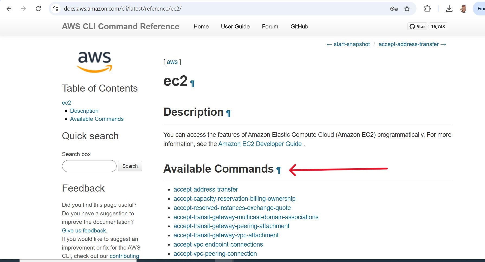

- Search for run instance.

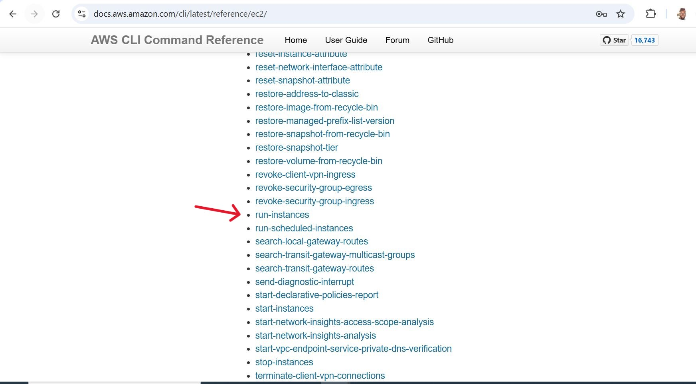

Here is an example of how you would create EC2 instances using the command line.

    aws ec2 run-instances \
        --image-id "ami-0cd59ecaf368e5ccf" \
        --instance-type "t2.micro" \
        --count 5 \
        --key-name MyKeyPair \
        --region eu-west-2

**Note:** Make sure you have a keypair created in the aws console. Replace the **'MyKeyPair'** with the keypair name. On the same page, if you search one of the arguments, you will be able to read more about how to pass different arguments to the cli.

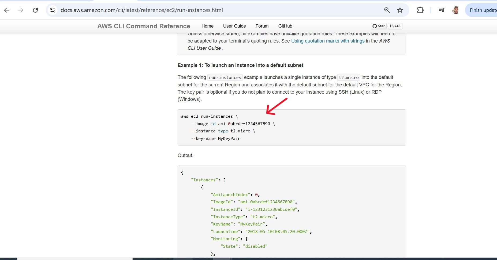

For the command to work, a keypair must already exist. You must create a keypair from the console. 

## To create a new keypair.

1. Navigate to the AWS EC2 console.

- Click on the keypair on the leftside bar of the EC2 dashboard and then click on "create key pair".

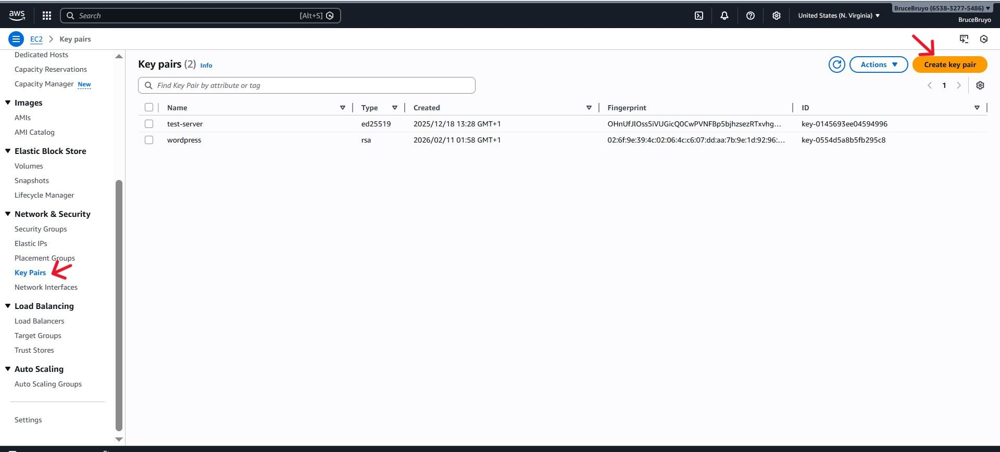

- Choose a key pair name. For a Amazon linux AMI choose RSA as the Key pair type and select the pem key pair format. Then click "create key pair".

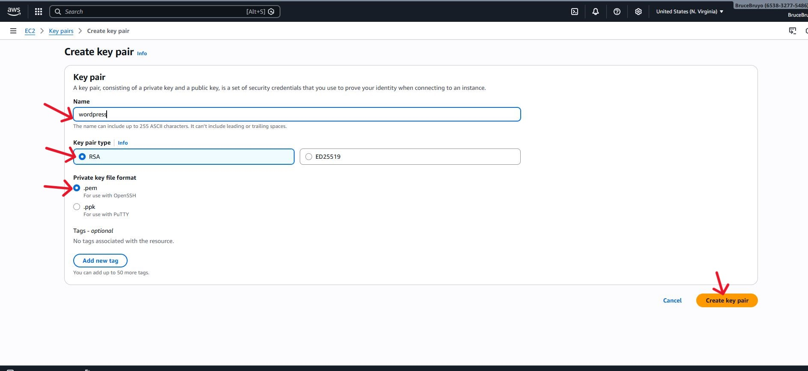

Now let's update the shell script and create a function that will be responsible for creating EC2 instances.

'#!/bin/bash

# Function to create EC2 instances

create_ec2_instances() {"\n\n    # Specify the parameters for the EC2 instances\n    instance_type=\"t2.micro\"\n    ami_id=\"ami-0cd59ecaf368e5ccf\"  \n    count=2  # Number of instances to create\n    region=\"eu-west-2\" # Region to create cloud resources\n    \n    # Create the EC2 instances\n    aws ec2 run-instances \\\n        --image-id \"$ami_id\" \\\n        --instance-type \"$instance_type\" \\\n        --count $count\n        --key-name MyKeyPair\n        \n    # Check if the EC2 instances were created successfully\n    if [ $? -eq 0 ]; then\n        echo \"EC2 instances created successfully.\"\n    else\n        echo \"Failed to create EC2 instances.\"\n    fi\n"}

# Call the function to create EC2 instances
create_ec2_instances'

Let's explain elements;

- **$?:** This is a special variable that holds the exit status of the last executed command. In this case, it checks if the aws ec2 instances command was successful, exixt status that equals 0 is interpreted as successful. Therefore if exit code is "0", then echo the message to confirm that the previous command was successful.

- we have once again used environment variable to hold the value of **ami_id, count and region** and replaced with their respective values with **amiid, count and $region**

'sudo nano aws_cloud_manager.sh"

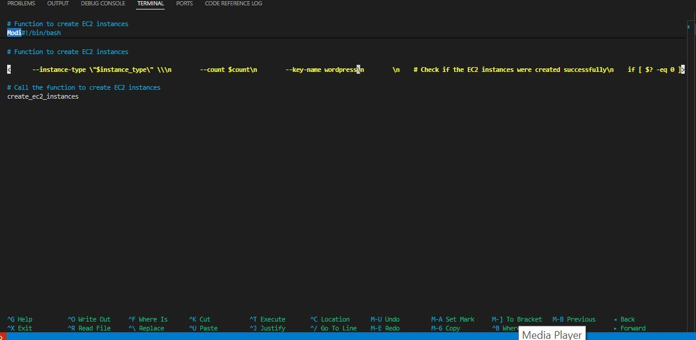

- To execute the script.

'chmod +x aws_cloud_manager.sh'

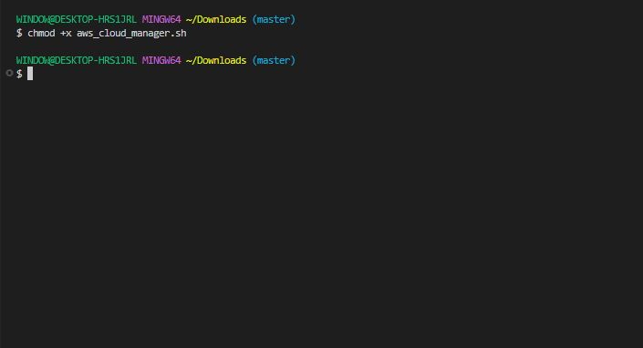

- Run script.

'./aws_cloud_manager.sh'

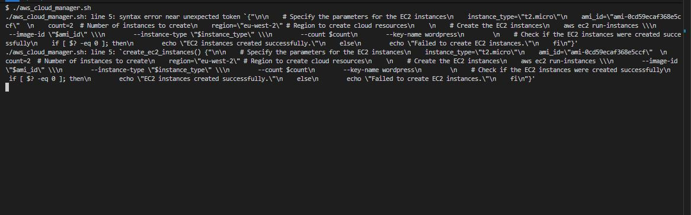

You’re still wrapping the function body in quotes ("...") and using \n.
That makes it a string, not executable Bash.

Also, your run-instances command is broken because:

Missing backslashes after some lines

- --key-name line isn’t escaped.

- region variable is defined but not used.

This is the correct version;

'sudo nano aws_cloud_manager.sh"

'#!/bin/bash
set -euo pipefail

# Function to create EC2 instances
create_ec2_instances() {

    # Specify parameters
    instance_type="t2.micro"      
    ami_id="ami-0cd59ecaf368e5ccf"
    count=1
    region="eu-west-2"
    key_name="wordpress"

    echo "Launching $count EC2 instances in $region..."

    # Create EC2 instances
    aws ec2 run-instances \
        --region "$region" \
        --image-id "$ami_id" \
        --instance-type "$instance_type" \
        --count "$count" \      
        --key-name "$key_name" \
        --query "Instances[*].InstanceId" \   
        --output text

    echo "EC2 instances created successfully."
}

# Call the function 
create_ec2_instances'

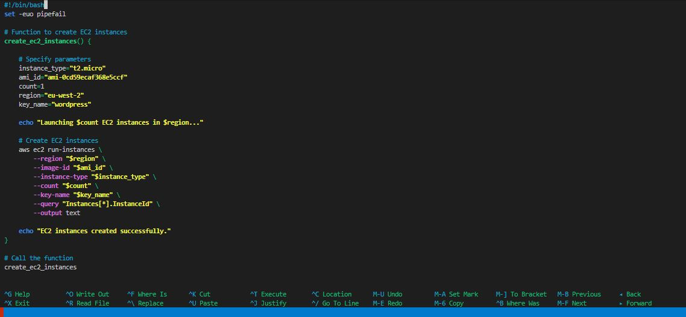


- Run script.

'./aws_cloud_manager.sh'

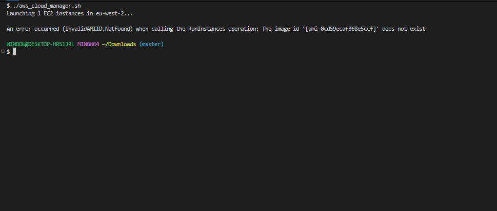

You can see that the script provisions the instance.

### Define function to create S3 buckets & learn about Arrays

We will be creating five distinct S3 buckets, each designated for storing data related Marketing, Sales, HR, Operations, and Media. To achieve all this, we'll utilize a fundamental data structure in shell scripting known as an "array". This is because, we need one single variable holding all the data, and then have the capability to loop through them.

### Arrays in shell scripting

An array is a versatile data structure that allow you to store multiple values under a single variable name. Particularly in shell scripting, arrays offer an efficient means of managing collections of related data, making them invaluable for our task ahead.

Below is what the function would look like:

'# Function to create S3 buckets for different departments

create_s3_buckets() {"\n    # Define a company name as prefix\n    company=\"datawise\"\n    # Array of department names\n    departments=(\"Marketing\" \"Sales\" \"HR\" \"Operations\" \"Media\")\n    \n    # Loop through the array and create S3 buckets for each department\n    for department in \"${departments[@]"}"; do
        bucket_name="${company}-${department}-Data-Bucket"
        # Create S3 bucket using AWS CLI
        aws s3api create-bucket --bucket "$bucket_name" --region your-region
        if [ $? -eq 0 ]; then
            echo "S3 bucket '$bucket_name' created successfully."
        else
            echo "Failed to create S3 bucket '$bucket_name'."
        fi
    done
}

# Call the function to create S3 buckets for different departments
create_s3_buckets'

Let's break down each part of the code:

- This line begins the definition of a shell function named **create_s3_buckets**.

'# Function to create S3 buckets for different departments

create_s3_buckets() {"\n    ```\n- Here, we define a variable named company and assign it the value \"datawise\". This variable will serve as the prefix for all S3 bucket names, ensuring their uniqueness. You should replace **datawise** with any other company name of your choice or any other unique identifier. This is because S3 buckets **MUST** be unique globally.\n  \n    ```\n    # Define a company name as prefix\n    company=\"datawise\"\n\n    ```\n\n- This is where we define a variable that is an array. An array named **departments** is declared, containing the names of different departments. Each department name will be used to construct the name of an S3 bucket.\n  ```\n    # Array of department names\n    departments=(\"Marketing\" \"Sales\" \"HR\" \"Operations\" \"Media\")\n  ```\n\n- This line initiates a loop that iterates over each element in the departments array. For each iteration, the value of the current department name is stored in the variable **department**.\n\n    ```\n    for department in \"${departments[@]"}"; do'


    'The syntax ${departments[@]} in Bash refers to all elements in the array departments.

    [@]: This is an index or slice syntax specific to arrays in Bash. It signifies that we want to access all elements of the array.

    If you were interested in accessing a single element from the array, you would still use the syntax $departments[index]}, where index is the position of the element you want to access. Remember that array indexing in Bash starts from 0.'


An example is:

'departments=("Marketing" "Sales" "HR" "Operations" "Media")

# Accessing the fourth element (Operations) from the array
echo "${departments[3]}"'

- Within the loop, we construct the name of the S3 bucket using the  **company_prefix**, the current **department** name, and suffix **"-Data-Bucket"**. This ensure that each bucket name is unique. 

'bucket_name="${company}-${department}-Data-Bucket"'

- Using the AWS CLI (aws s3api), we create an S3 bucket with the specified name from the variable ($bucket_name), in the specified AWS region (your-region). Make sure to replace **"your-region"** with the actual AWS region where you want to create the bucket.

'    # Create S3 bucket using AWS CLI

    aws s3api create-bucket --bucket "$bucket_name" --region your-region'

- This line checks the exit status of the previous command (aws s3api create-bucket). A value of 0 indicates success, while non-zero values indicate failure.

'    if [ $? -eq 0 ]; then'

- Based on the exit status of aws s3api command, we print a corresponding message indicating whether the bucket creation was successful or not.

'        echo "S3 bucket '$bucket_name' created successfully."

        else
            echo "Failed to create S3 bucket '$bucket_name'."
        fi
    done'
- This line marks the end of the **creat_s3_buckets** function definition.

The complete script so far will look like this:

'#!/bin/bash

# Environment variables
ENVIRONMENT=$1

check_num_of_args() {"\n# Checking the number of arguments\nif [ \"$#\" -ne 0 ]; then\n    echo \"Usage: $0 <environment>\"\n    exit 1\nfi\n"}

activate_infra_environment() {"\n# Acting based on the argument value\nif [ \"$ENVIRONMENT\" == \"local\" ]; then\n  echo \"Running script for Local Environment...\"\nelif [ \"$ENVIRONMENT\" == \"testing\" ]; then\n  echo \"Running script for Testing Environment...\"\nelif [ \"$ENVIRONMENT\" == \"production\" ]; then\n  echo \"Running script for Production Environment...\"\nelse\n  echo \"Invalid environment specified. Please use 'local', 'testing', or 'production'.\"\n  exit 2\nfi\n"}

# Function to check if AWS CLI is installed
check_aws_cli() {"\n    if ! command -v aws &> /dev/null; then\n        echo \"AWS CLI is not installed. Please install it before proceeding.\"\n        return 1\n    fi\n"}

# Function to check if AWS profile is set
check_aws_profile() {"\n    if [ -z \"$AWS_PROFILE\" ]; then\n        echo \"AWS profile environment variable is not set.\"\n        return 1\n    fi\n"}

# Function to create EC2 Instances
create_ec2_instances() {"\n\n    # Specify the parameters for the EC2 instances\n    instance_type=\"t2.micro\"\n    ami_id=\"ami-0cd59ecaf368e5ccf\"  \n    count=2  # Number of instances to create\n    region=\"eu-west-2\" # Region to create cloud resources\n    \n    # Create the EC2 instances\n    aws ec2 run-instances \\\n        --image-id \"$ami_id\" \\\n        --instance-type \"$instance_type\" \\\n        --count $count\n        --key-name MyKeyPair\n        \n    # Check if the EC2 instances were created successfully\n    if [ $? -eq 0 ]; then\n        echo \"EC2 instances created successfully.\"\n    else\n        echo \"Failed to create EC2 instances.\"\n    fi\n"}

# Function to create S3 buckets for different departments
create_s3_buckets() {"\n    # Define a company name as prefix\n    company=\"datawise\"\n    # Array of department names\n    departments=(\"Marketing\" \"Sales\" \"HR\" \"Operations\" \"Media\")\n    \n    # Loop through the array and create S3 buckets for each department\n    for department in \"${departments[@]"}"; do
        bucket_name="${company}-${department}-Data-Bucket"
        # Create S3 bucket using AWS CLI
        aws s3api create-bucket --bucket "$bucket_name" --region your-region
        if [ $? -eq 0 ]; then
            echo "S3 bucket '$bucket_name' created successfully."
        else
            echo "Failed to create S3 bucket '$bucket_name'."
        fi
    done
}

check_num_of_args
activate_infra_environment
check_aws_cli
check_aws_profile
create_ec2_instances
create_s3_buckets'

'sudo nano aws_cloud_manager.sh"


- Run script.

'./aws_cloud_manager.sh'

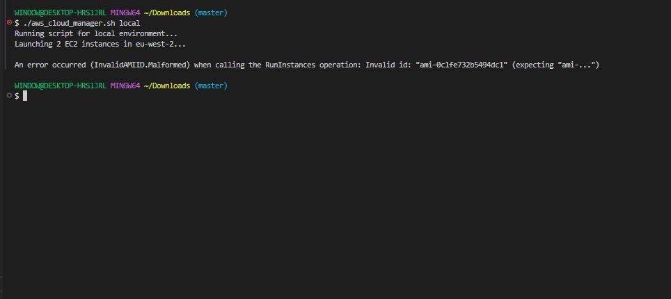

You can see their are multiple error so let's fix it.

**Corrected Version**

'sudo nano aws_cloud_manager.sh'

'#!/bin/bash
set -euo pipefail

############################################
# Check number of arguments
############################################
check_num_of_args() {
    if [ "$#" -ne 1 ]; then
        echo "Usage: $0 <environment>"
        exit 1
    fi
}

############################################
# Activate environment
############################################
activate_infra_environment() {
    case "$ENVIRONMENT" in
        local|testing|production)
            echo "Running script for $ENVIRONMENT environment..."
            ;;
        *)
            echo "Invalid environment. Use local | testing | production"
            exit 2
            ;;
    esac
}

############################################
# Check AWS CLI
############################################
check_aws_cli() {
    if ! command -v aws >/dev/null 2>&1; then
        echo "AWS CLI is not installed."
        exit 1
    fi
}

############################################
# Check AWS profile
############################################
check_aws_profile() {
    if [ -z "${AWS_PROFILE:-}" ]; then
        echo "AWS_PROFILE environment variable is not set."
        exit 1
    fi
}

############################################
# Create EC2 Instances
############################################
create_ec2_instances() {

    instance_type="t2.micro"
    ami_id="ami-0cd59ecaf368e5ccf"
    count=2
    region="eu-west-2"
    key_name="wordpress"

    echo "Launching $count EC2 instances in $region..."

    INSTANCE_IDS=$(aws ec2 run-instances \
        --region "$region" \
        --image-id "$ami_id" \
        --instance-type "$instance_type" \
        --count "$count" \
        --key-name "$key_name" \
        --query "Instances[*].InstanceId" \
        --output text)

    echo "EC2 instances created:"
    for id in $INSTANCE_IDS; do
        echo " - $id"
    done
}

############################################
# Create S3 Buckets
############################################
create_s3_buckets() {

    company="datawise"
    region="eu-west-2"

    departments=("marketing" "sales" "hr" "operations" "media")

    for department in "${departments[@]}"; do
        bucket_name="${company}-${department}-data-bucket"

        echo "Creating bucket: $bucket_name"

        aws s3api create-bucket \
            --bucket "$bucket_name" \
            --region "$region" \
            --create-bucket-configuration LocationConstraint="$region"

        echo "Bucket $bucket_name created."
    done
}

############################################
# MAIN EXECUTION
############################################

check_num_of_args "$@"
ENVIRONMENT=$1

check_aws_cli
check_aws_profile
activate_infra_environment
create_ec2_instances
create_s3_buckets'

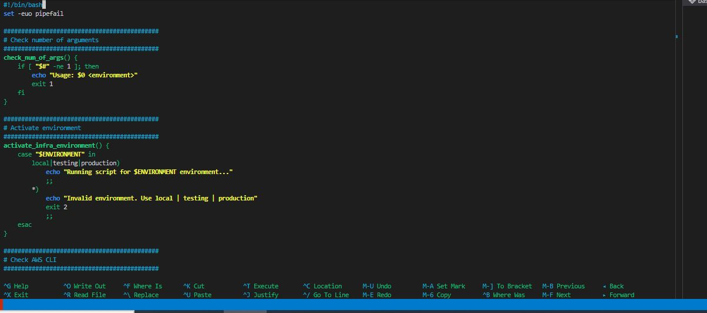

- Export the AWS PROFILE.

'export AWS_PROFILE=default'

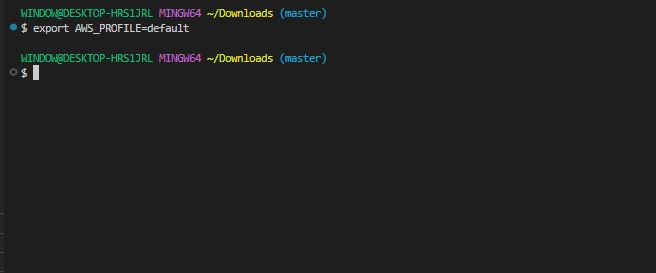

- Execute script.

'chmod +x aws_cloud_manager.sh'

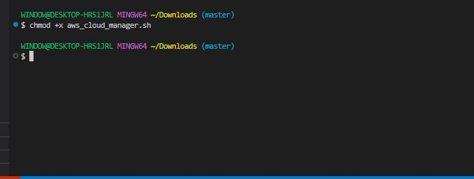

- Run script.

'./aws_cloud_manager.sh'


You have successfully created your resources.
