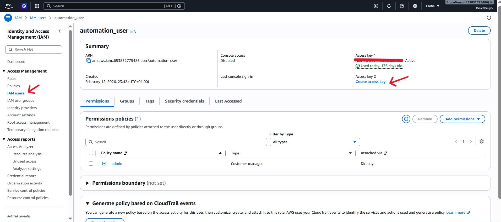
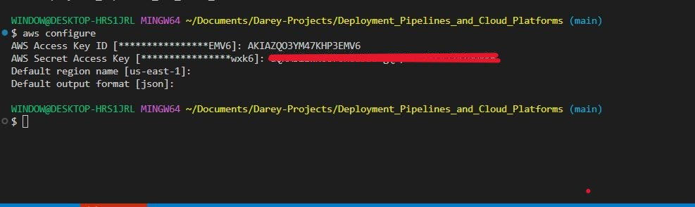
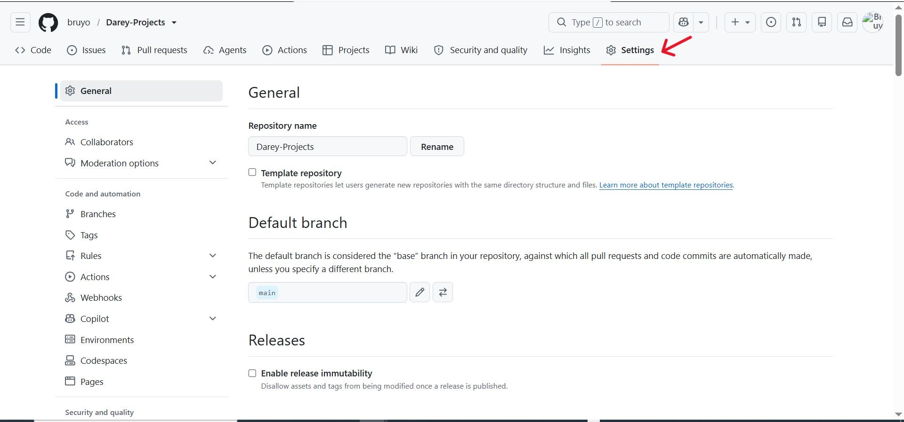
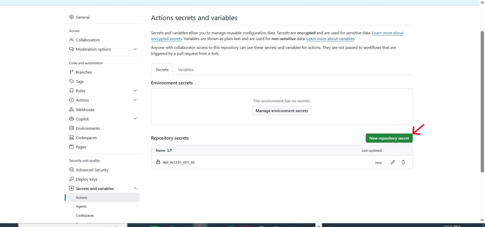
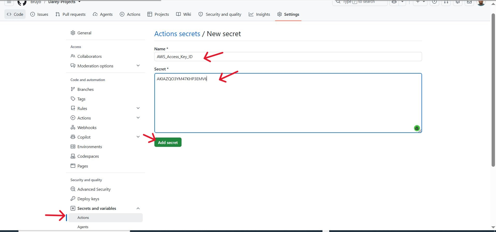
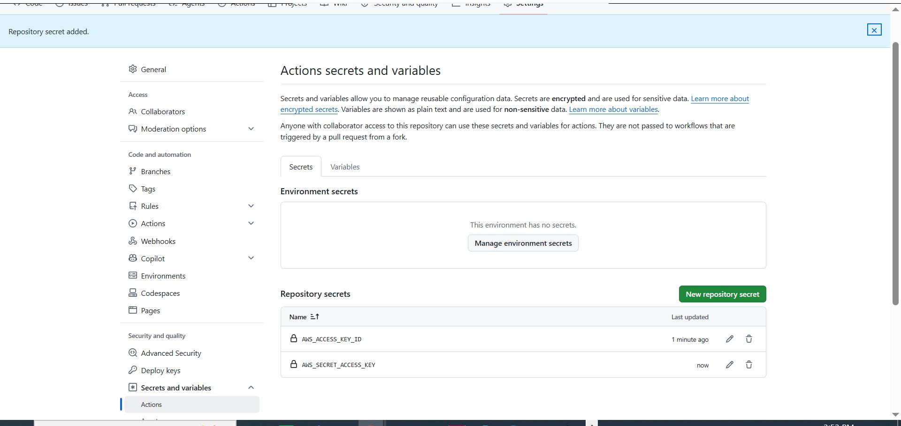

# Deployment Pipelines and Cloud Platforms

## Project Review: GitHub Actions and CI/CD

### Introduction to GitHub Actions: Deployment and Cloud Migration

In this project, we're going to explore how we can leverage GitHub Actions to automate your development process, effectively pushing your applications to various cloud environments. 

Deploying applications to the cloud without automation is like flying a plane manually without any advanced navigation systems which is possible but prone to errors, inefficiencies, and immense stress.  GitHub Actions provide the automation such as the autopilot which ensures that the deployment processes are as smooth, error-free, and efficient as possible.

### Project Tasks

**Introduction to Deployment Pipelines**

1. **Defining deployment stages:**

- **Deployment:** Writing and testing code in a local environment.

- **Integration:** Merging code changes to shared branch.

- **Testing:** Running automated tests to ensure code quality.

- **Staging:** Deploying code to a production-like environment for final testing.

- **Production:** Releasing the final version of your code to the end-users.

2. **Understanding the Deployment Strategies:**

- **Blue-Green Deployment:** Running two production environments, only one of which serves the end-users at any time.

- **Canary releases:** Rolling out changes to a small subset of users before full deployment.

- **Rolling Deployment:** Gradually replacing instances of the previous version of an application with the new version.

**Automated Releases and Versioning**

1. Automating versioning in CI/CD:

- Semantic Versioning: It uses a three-part version number, for example, **MAJOR.MINOR.PATCH'.**

- Automated versioning with GitHub Actions: It implements automated versioning with GitHub Actions to increment version number automatically based on code changes.

**Example of snippet for a versioning script in GitHub Actions.**

```bash
name: Bump version and tag
on:
  push:
    branches:
      - main

jobs:
  build:
    name: Create Tag
    runs-on: ubuntu-latest
    steps:
      - name: Checkout code
        uses: actions/checkout@v2
        # The checkout action checks out your repository under $GITHUB_WORKSPACE, so your workflow can access it.

      - name: Bump version and push tag
        uses: anothrNick/github-tag-action@1.26.0
        env:
          GITHUB_TOKEN: ${{" secrets.GITHUB_TOKEN "}}
          DEFAULT_BUMP: patch
        # This action automatically increments the patch version and tags the commit.
        # 'DEFAULT_BUMP' specifies the type of version bump (major, minor, patch).
```

- This action will automatically increment the patch version and create a new tag each time changes are pushed to the main branch.

**Creating and Managing Releases**

1. Automate Releases with GitHub Actions:

- Set up GitHub Actions to create a new release whenever a new tag is pushed to repository.

**Example of snippet to create a release**

```bash
on:
  push:
    tags:
      - '*'

jobs:
  build:
    name: Create Release
    runs-on: ubuntu-latest
    steps:
      - name: Checkout code
        uses: actions/checkout@v2
        # Checks out the code in the tag that triggered the workflow.

      - name: Create Release
        id: create_release
        uses: actions/create-release@v1
        env:
          GITHUB_TOKEN: ${{" secrets.GITHUB_TOKEN "}}
        with:
          tag_name: ${{" github.ref "}}
          release_name: Release ${{" github.ref "}}
          # This step creates a new release in GitHub using the tag name.
```

- The **'actions/create-release@v1'** action is used to create a release on GitHub. It uses the tag that triggered the workflow to name and label the release.

**Deploying to Cloud Platformss**

1. **Choose a Cloud Platform:**

- Decide on a cloud platform based on the project requirements. Each platform (AWS, Azure, GCP) has its own set of services and pricing models.

- Go to the IAM section with the search bar and click on. Create a user and access key.



- Configure aws on your terminal.

```bash
aws configure
```



2. **Set up GitHub Actions for Deployment:**

**Creating the workflow file:**

- Workflow files are YAML files stored in your repository's '.github/workflows' directory.

- Start by creating a file eg 'deploy-to-aws.yml' in the directory.

```bash
touch deploy-to-aws.yml
```

**Defining the Workflow:**

- A workflow is defined with series of steps that run on specified events.

**Example for AWS Deployment**

```bash
name: Deploy to AWS
on:
  push:
    branches:
      - main
  # This workflow triggers on a push to the 'main' branch.

jobs:
  deploy:
    runs-on: ubuntu-latest
    # Specifies the runner environment.

    steps:
    - name: Checkout code
      uses: actions/checkout@v2
      # Checks out your repository under $GITHUB_WORKSPACE.

    - name: Set up AWS credentials
      uses: aws-actions/configure-aws-credentials@v1
      with:
        aws-access-key-id: ${{" secrets.AWS_ACCESS_KEY_ID "}}
        aws-secret-access-key: ${{" secrets.AWS_SECRET_ACCESS_KEY "}}
        aws-region: us-east-1
      # Configures AWS credentials from GitHub secrets.

    - name: Deploy to AWS
      run: |
        # Add your deployment script here.
        # For example, using AWS CLI commands to deploy.
```

- This workflow deploys the application to AWS when changes are pushed to the main branch.


3. **Configuring Deployment Environments:**

**Setting up Environment Variables and Secrets:**

- Store sensitive information like API keys and access token as GitHub secrets.

- Use environment variables for non-sensitive configuration.









**Environment-Specific Workflow:**

- Tailor the workflow for different environments (development, stating, production) by using conditions or different wokflow files.