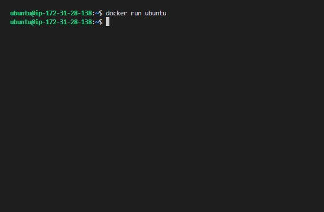
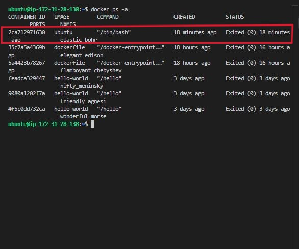
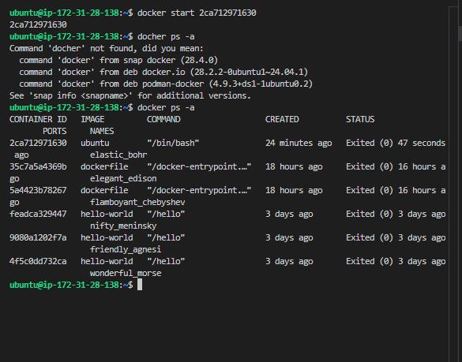
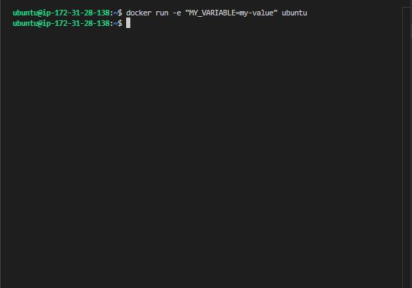
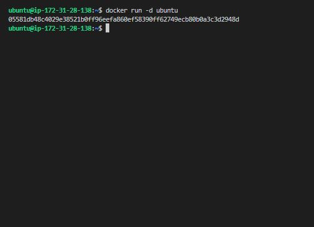
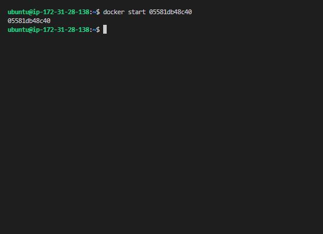
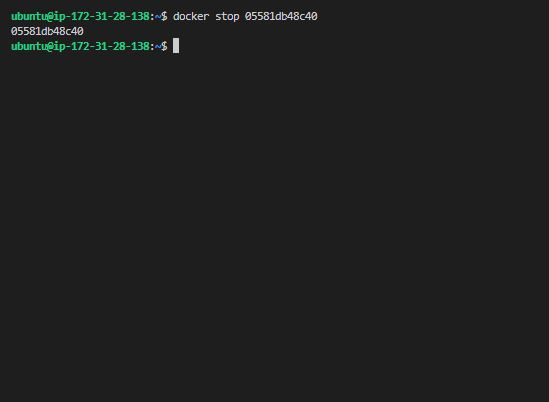
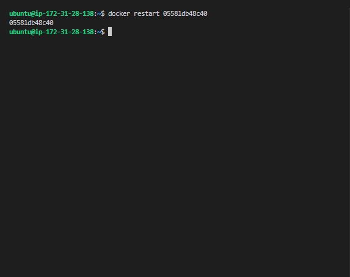
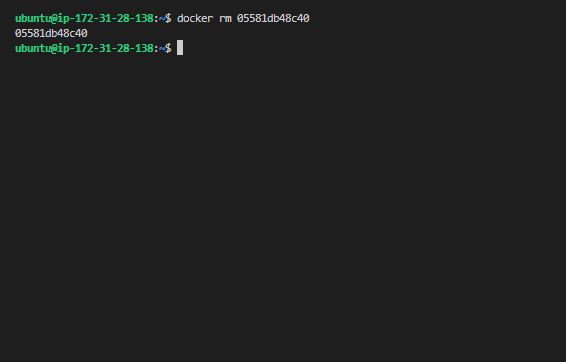

# Docker Containers

## Project Review

**Introduction to Docker Containers**

Docker containers are lightweight, portable, and executable units that encapsulate an application and its dependencies. We would delve deeper into the basics of working with Docker containers, from launching and running containers to managing their lifecycle.

### Task

- **Running Containers**

To run a container, you use the **'docker run'** command followed by the name of the image you want to use.

Let's create a container from the ubuntu image. This command launches a container based on the Ubuntu image.

'docker run ubuntu'

- To confirm

'docker ps -a'

The image above shows that the container is created but not running. We can start the container by running 

'docker start CONTAINER_ID'

In this case,

'docker start 2ca712971630'

- **Launching Containers with Different Options**

Docker provides various options to customize the behaviour of containers. For example, you can specify environment variables, map ports, and mount volumes. Here's an example of running a container with a specific environment variable:

'docker run -e "MY_VARIABLE=my-value" ubuntu'

- **Running Containers in the Background**

By default, containers run in the foreground, and the terminal is attached to the container's standard input/output. To run a container in the background, use the **'-d'** option:

'docker run -d ubuntu'

This command starts a container in the background, allowing you to continue using the terminal.

- **Container Lifecycle**

Containers have a lifecycle that includes creating, starting, stopping, and restarting. Once a container is created, it can be started and stopped multiple times.

**Starting, Stopping, and Restarting Containers**

- To start a stopped container.

'docker start container_name'

In this case;

'docker start 05581db48c40'

- To stop a running container.

'docker stop container_name'

'docker stop 05581db48c40'

- To restart a container.

'docker restart container_name'

'docker restart 05581db48c40'

**Removing Containers**

To remove a container, you use the **'docker rm'** command followed by the container's ID or name:

'docker rm container_name'

In this case 

'docker rm 05581db48c40'

This deletes the container, but keep in mind that the associated image remains on the system.

In this project, we've learned the basics of working with Docker containers, launching them, customizing their behaviour, managing their lifecycle, and removing them. Unsderstanding these fundamentals is crucial for effectively using Docker in your development and deployment workflows.