# Working with Docker Images

## Project Review

Docker images are the building blocks of containers. They are lightweight, portable, and self-sufficient packages that contain everything needed to run a software application, including the code, runtime, libraries, and system tools. Images are created from a set of instructions known as Dockerfile, which specifies the environment and configuration for the application.

### Task

**Pulling Images from Docker Hub**

Docker Hub is a cloud-based registry that hosts a vast collection of Docker Images. You can pull images from Docker Hub to your local machine using the **'docker pull'** command.

To explore available images on Docker Hub, the docker command provides a search subcommand. For instance, to find the ubuntu image, you can execute:

'docker search ubuntu'

This command allows you to discover and explore various images hosted on Docker Hub by providing relevant search results. In this case, the output will be similar to this:

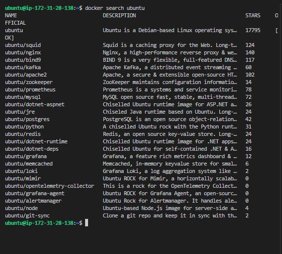

In the "OFFICIAL" column, the "OK" designation signifies that an image has been constructed and is officially supported by the organization responsible for the project. Once you have identified the desired the desired image, you can retrieve it to local machine using the "pull" subcommand. 

To download the official Ubuntu image to your computer, use the following command:

'docker pull ubuntu'

Executing this command will fetch the official Ubuntu image from Docker Hub and store it locally on your machine, making it ready for use in creating containers.

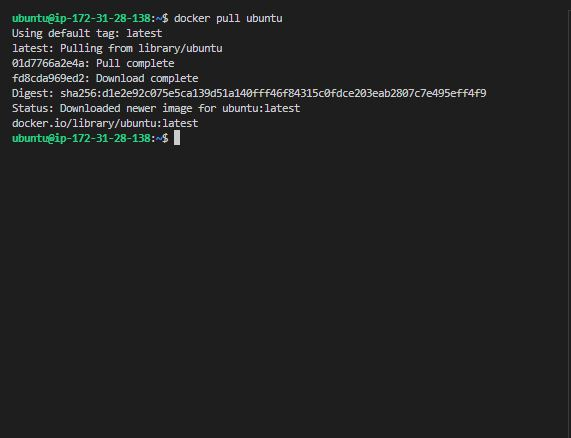

Once an image has been successfully downloaded, you can proceed to run a container using that downloadeded image by employing the "run" subcommand. Similar to the hello-world example, if an image is not present locally the **'docker run'** subcommand is invoked, Docker will automatically download the required image before initiating the container.

To view the list of images that have been downloaded and are available on your local machine, enter the following command.

'docker images'

Executing this command provides a comprehensive list of all the images stored locally, allowing you to verify the presence of the downloaded image and gather information about its size, version, and other relevant details.

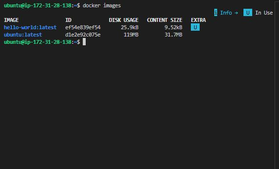

**Dockerfile**

A Dockerfile is a plaintext configuration file that contains a set of instructions for building a Docker image. It serves as a blueprint for creating a reproducible and consistent environment for your application. Dockerfiles are fundamental to the containerization process, allowing you to define the steps to assemble an image that encapsulates your application and its dependencies.

**Creating a Dockerfile**

In this dockerfile, we will be using an nginx image. **'Nginx'** is an open source software for web serving, reverse proxying, caching, load balancing, media streaming, and more. It started out as a web server designed for maximum performance and stability. 

To create a Dockerfile, use a text editor of your choice, such as vim or nano. Start by specifying a base image, defining the working directory, copying files, installing dependencies, and configuring the runtime environment.

Here's a simple example of a Dockerfile for a html file. Let's create an image with using a dockerfile. Paste the code snippet below in a file named **'dockerfile'**. This example assumes you have a basic file named **'index.html'** in the same as your Dockerfile.

'nano dockerfile'

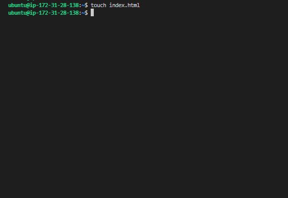

# Use the official NGINX base image
FROM nginx:latest

# Set the working directory in the container
WORKDIR  /usr/share/nginx/html/

# Copy the local HTML file to the NGINX default public directory
COPY index.html /usr/share/nginx/html/

# Expose port 80 to allow external access
EXPOSE 80

# No need for CMD as NGINX image comes with a default CMD to start the server

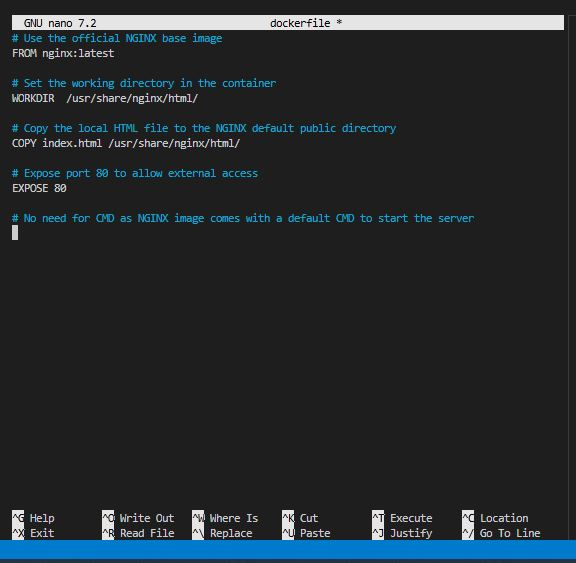

- Create the file named **'index.html'** in the same as your Dockerfile.

'touch index.html'

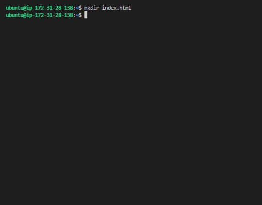

**Explanation of the code snippet above**

- **FROM nginx:latest:** Specifies the official NGINX base image from Docker Hub.

- **WORKDIR /usr/share/nginx/html:** Specifies the working directory in the container.

- **COPY index.html /usr/share/nginx/html:** Copies the local **'index.html'** file to the NGINX default public directory, which is where NGINX serves static content from.

- **EXPOSE 80:** Informs Docker that the NGINX server will use port 80. This is a documentation feature and doesn't actually publish the port.

- **CMD:** NGINX images come with a default CMD to start the server, so there's no need to specify it explicitly.

HTML file named **'index.html'** in the same directory as the dockerfile.

'echo "Welcome to Darey.io" >> index.html'

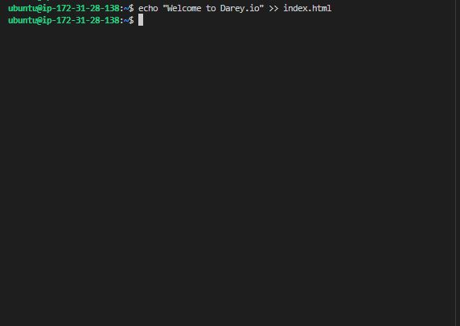

To build an image from this Dockerfile, navigate to the directory containing the file and run.

'docker build -t dockerfile .'

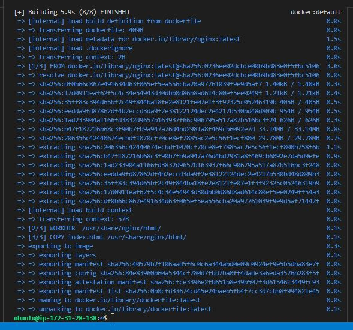

- Check the list of images.

'docker images'

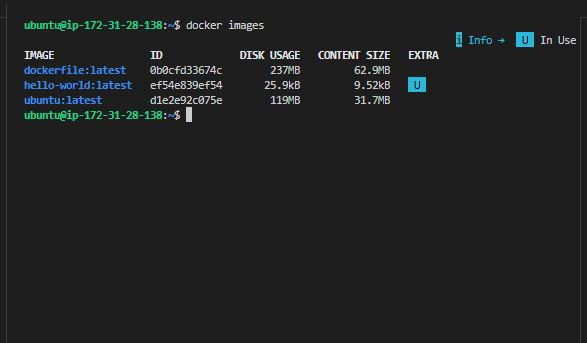

To run a container based on the custom NGINX image we created with a dockerfile, run the command.

'docker run -p 8080:80 dockerfile'

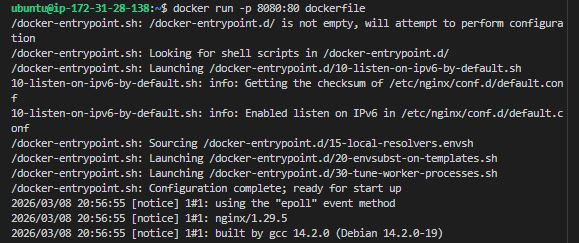

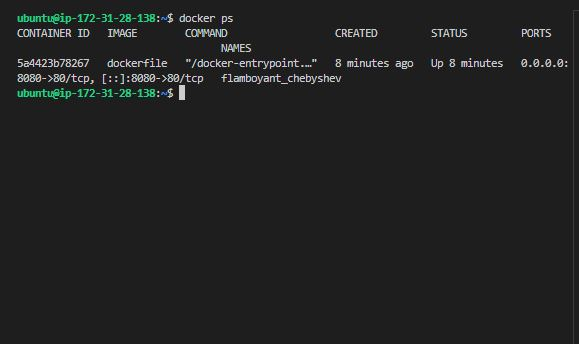

Running the command above will create a container that listens on port 8080 using the nginx image you created earlier. So we need to create a new rule in security group of the EC2 instance.

- On the EC2 instance, click on the security tab.

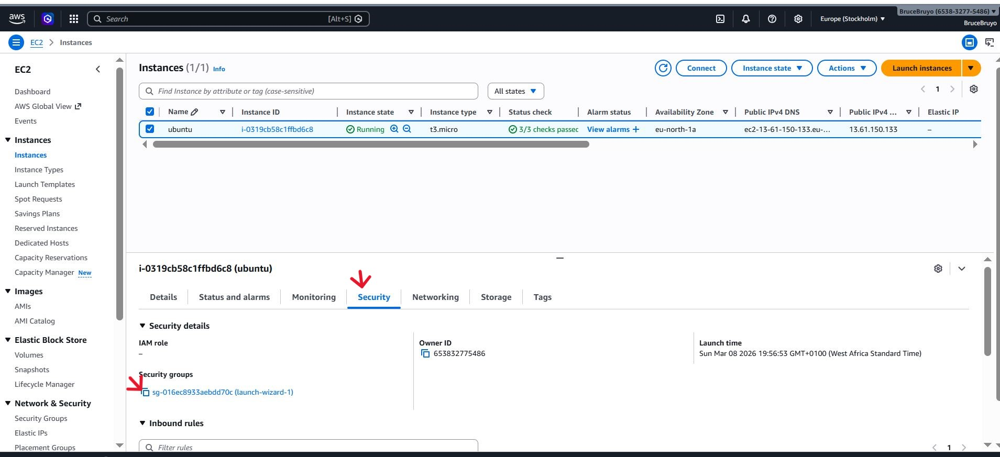

- Click on edit inbound rules to add new rules. This will allow incoming traffic to instance associated with the security group. Our aim is to allow incoming traffic on port 8080.

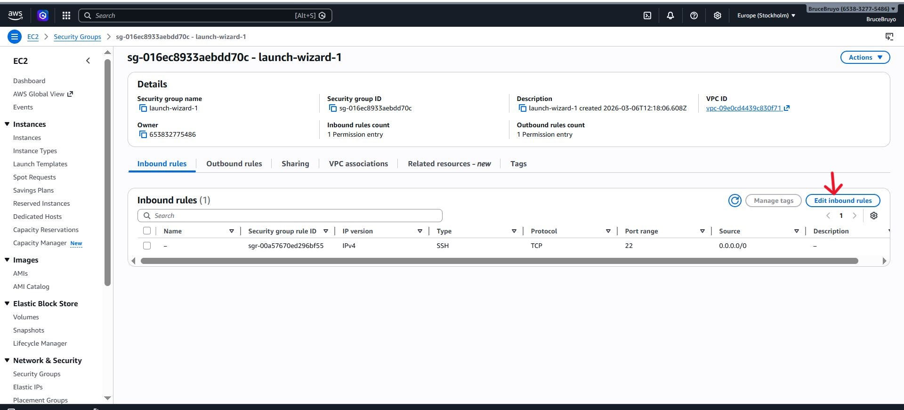

- Click on **'Add rule'** to add new rule.

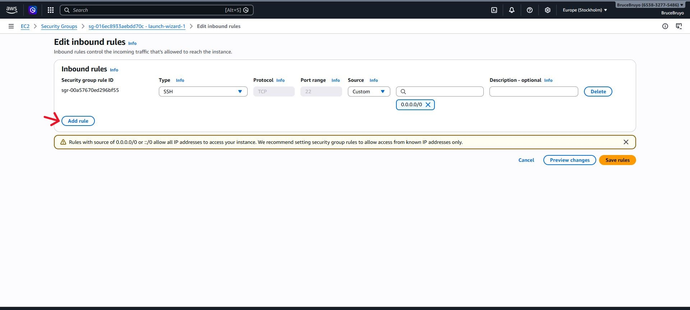

- Add port 8080 and click save.

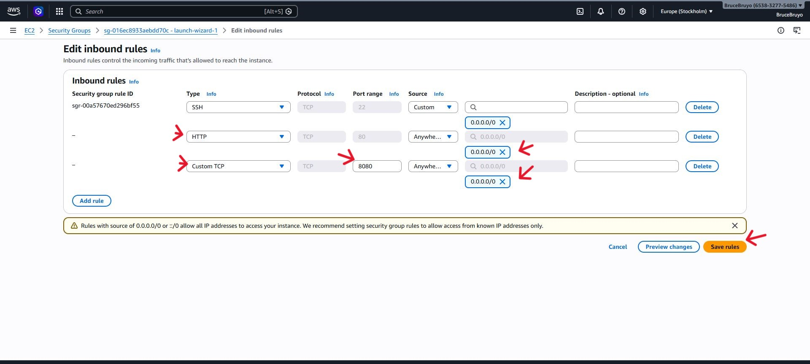

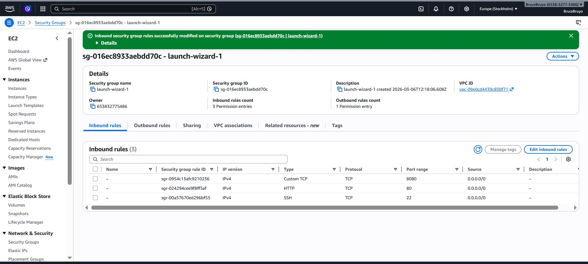

Let see the list of available containers

'docker ps -a'

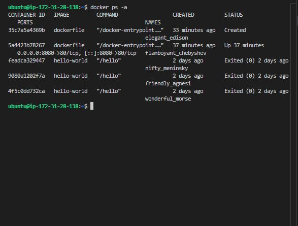

The image above show our container is not yet running. We can start it with the command below;

'docker start CONTAINER_ID'

'docker start 35c7a5a4369b'

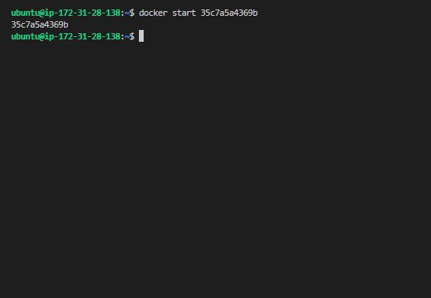

Let's confirm if it is running

'docker ps -a'

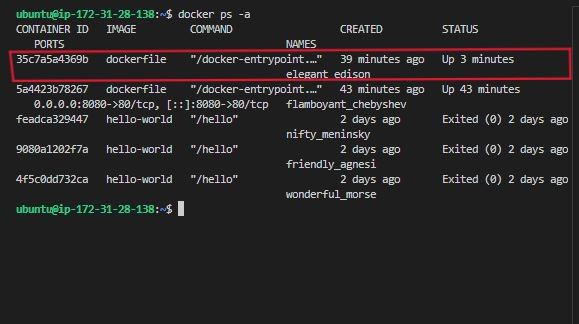

Now that we have started our container, we can access the content on the web browser with http://publicip_address:8080

'http://13.61.150.133:8080/'

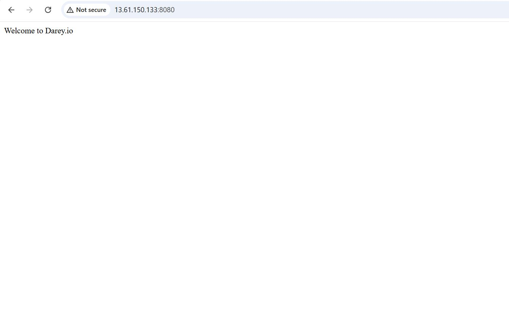

**Pushing Docker Image To Docker Hub**

Now that we have created a docker images on the computer, we need to think about how to reuse this image in the future or how do other people in other region make use of this image and possibly collaborate on it. This is where Docker Hub comes in. Let's go ahead and push our image to docker hub.

- Create an account on Docker Hub if you don't have one.

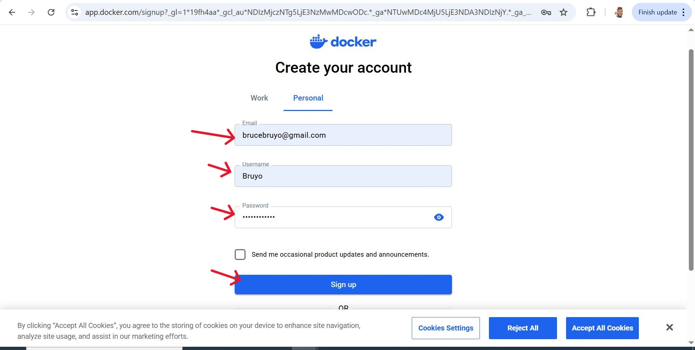

- Create a repository on docker hub.

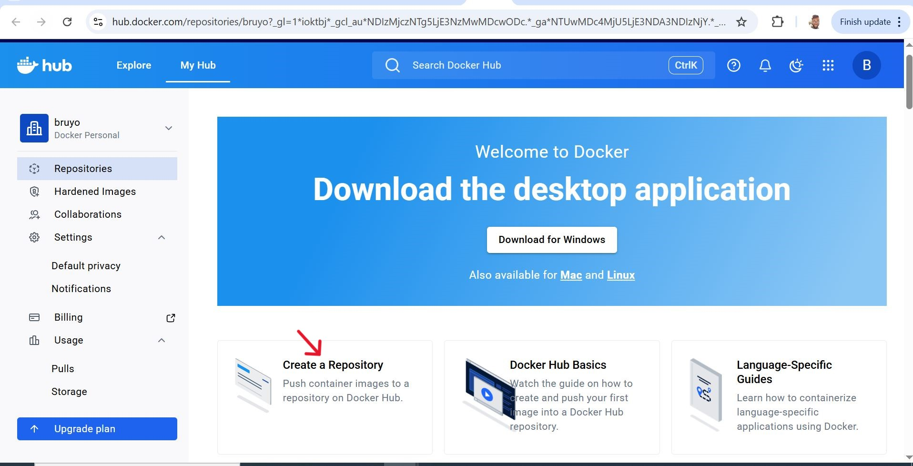

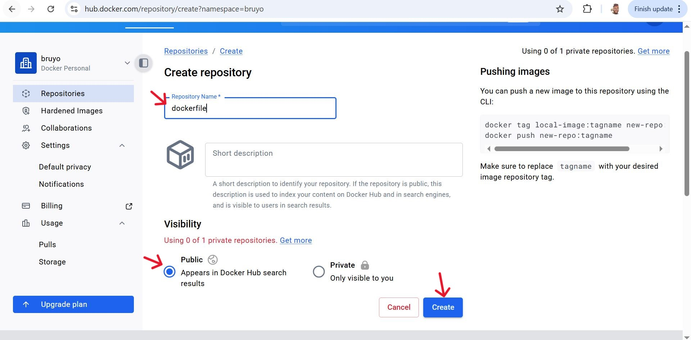

- Tag the Docker Image before pushing, ensure that the Docker image is appropriately tagged. You typically tag your image with the Docker Hub username and repository name. 

'docker tag <your-image-name> <your-dockerhub-username>/<your-repository-name>:<tag>'

'docker tag dockerfile bruyo/dockerfile:1'

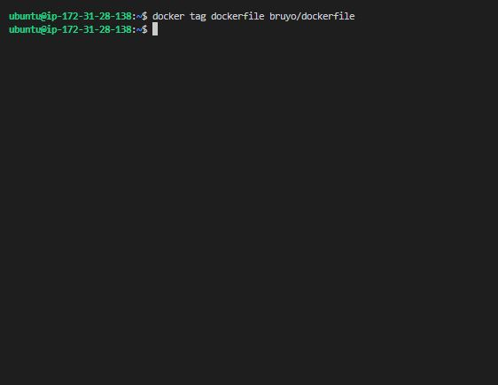

- Login to Docker hub.

'docker login -u <your-docker-hub-username>'

'docker login -u bruyo'

Running the command above will prompt you for a password. Authenticate using your docker hub password.

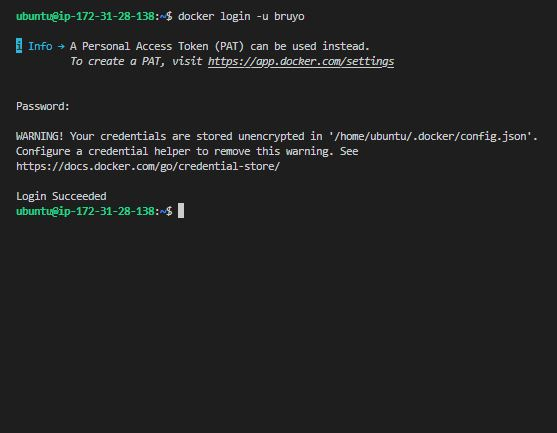

- Push the image to docker hub.

'docker push <your-dockerhub-username>/<your-repository-name>:<tag>'

'docker push bruyo/dockerfile:1'

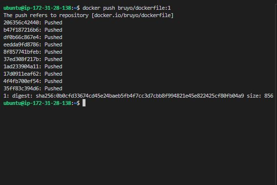

- Verify the image is in your docker hub repository

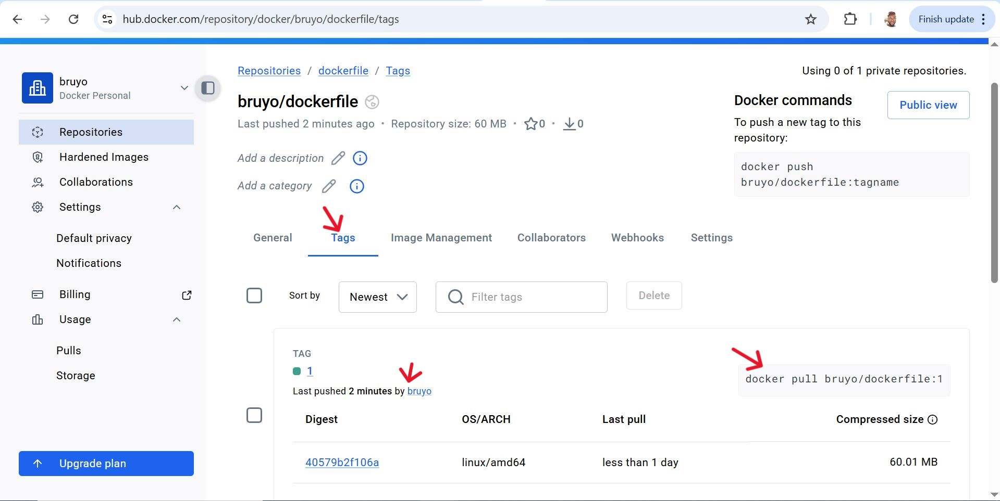

Now anyone can make use of the image you have on the docker hub repository.

