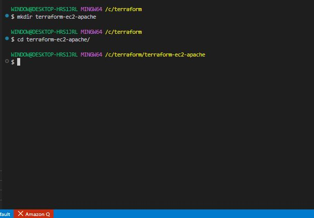
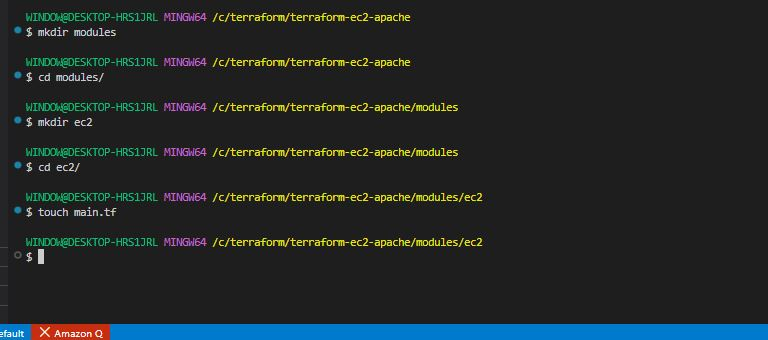
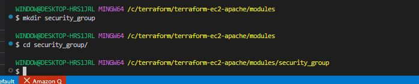
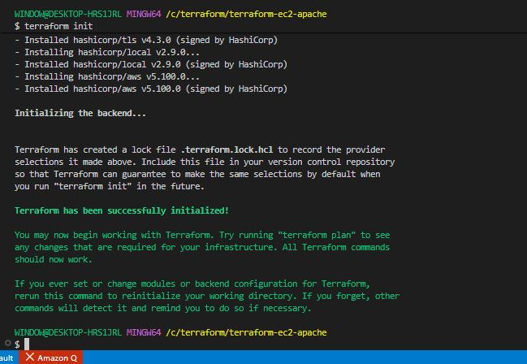
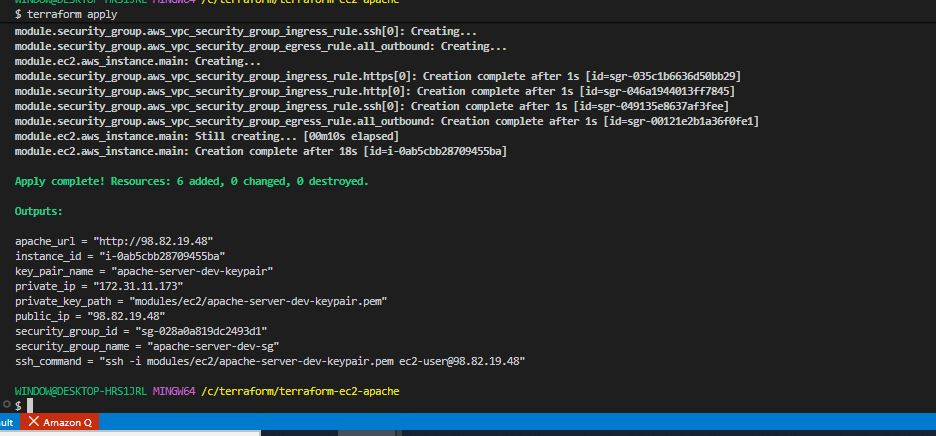
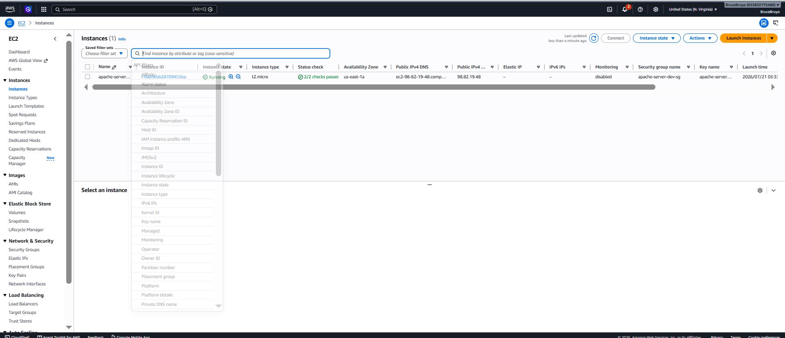
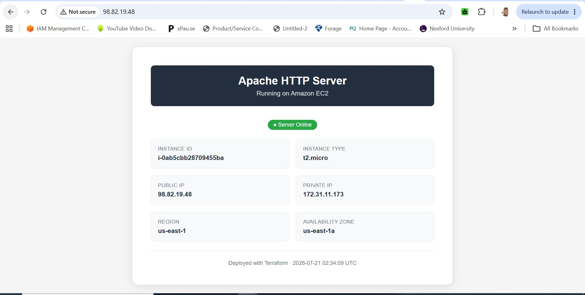
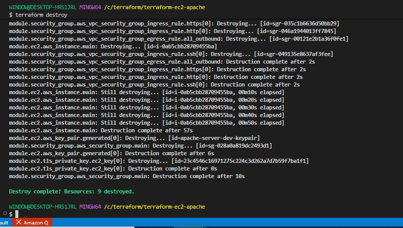

# EC2 Module and Security Group Module with Apache2 Usre Data

## Project Review

in this project, we will ise Terraform to create modularized configurations for deploying EC2 instance with a specified Security Group and Apache2 installed using User Data.

### Project Tasks

**EC2 Module:**

- Create a new directory for the Terraform project named **'terraform-ec2-apache'**.

```bash
mkdir terraform-ec2-apache
```

- Inside the project directory, create a directory for the EC2 module named **'modules/ec2'**.

```bash
cd terraform-ec2-apache
```




- Write a Terraform module named **'modules/ec2/main.tf'** to create EC2 instance.



```bash
nano main.tf
```

```bash
# -----------------------------------------------
# Latest Amazon Linux 2023 AMI
# -----------------------------------------------
data "aws_ami" "amazon_linux" {
  most_recent = true
  owners      = ["amazon"]

  filter {
    name   = "name"
    values = ["al2023-ami-*-x86_64"]
  }

  filter {
    name   = "virtualization-type"
    values = ["hvm"]
  }
}

# -----------------------------------------------
# Generate SSH Key Pair
# -----------------------------------------------
resource "tls_private_key" "ec2_key" {
  count     = var.key_pair_name == "" ? 1 : 0
  algorithm = "RSA"
  rsa_bits  = 4096
}

resource "aws_key_pair" "generated" {
  count      = var.key_pair_name == "" ? 1 : 0
  key_name   = "${var.instance_name}-keypair"
  public_key = tls_private_key.ec2_key[0].public_key_openssh

  tags = merge(
    {
      Name        = "${var.instance_name}-keypair"
      Environment = var.environment
    },
    var.tags
  )
}

resource "local_file" "private_key" {
  count           = var.key_pair_name == "" ? 1 : 0
  content         = tls_private_key.ec2_key[0].private_key_pem
  filename        = "${path.module}/${var.instance_name}-keypair.pem"
  file_permission = "0400"
}

# -----------------------------------------------
# Apache User Data Script
# -----------------------------------------------
locals {
  apache_user_data = <<-EOF
    #!/bin/bash
    yum update -y
    yum install -y httpd
    systemctl start httpd
    systemctl enable httpd

    # Get instance metadata
    TOKEN=$(curl -s -X PUT "http://169.254.169.254/latest/api/token" \
      -H "X-aws-ec2-metadata-token-ttl-seconds: 21600")
    INSTANCE_ID=$(curl -s -H "X-aws-ec2-metadata-token: $TOKEN" \
      http://169.254.169.254/latest/meta-data/instance-id)
    PUBLIC_IP=$(curl -s -H "X-aws-ec2-metadata-token: $TOKEN" \
      http://169.254.169.254/latest/meta-data/public-ipv4)
    AZ=$(curl -s -H "X-aws-ec2-metadata-token: $TOKEN" \
      http://169.254.169.254/latest/meta-data/placement/availability-zone)

    # Create index page
    cat <<HTML > /var/www/html/index.html
    <!DOCTYPE html>
    <html>
      <head>
        <title>Apache on EC2</title>
        <style>
          body { font-family: Arial, sans-serif; max-width: 800px; margin: 50px auto; }
          .info { background: #f0f0f0; padding: 20px; border-radius: 8px; }
          h1 { color: #232f3e; }
        </style>
      </head>
      <body>
        <h1>Apache HTTP Server on Amazon EC2</h1>
        <div class="info">
          <p><strong>Instance ID:</strong> $INSTANCE_ID</p>
          <p><strong>Public IP:</strong> $PUBLIC_IP</p>
          <p><strong>Availability Zone:</strong> $AZ</p>
          <p><strong>Environment:</strong> ${var.environment}</p>
          <p><strong>Deployed with:</strong> Terraform</p>
        </div>
      </body>
    </html>
    HTML

    chown -R apache:apache /var/www/html
    chmod -R 755 /var/www/html
  EOF

  no_apache_user_data = <<-EOF
    #!/bin/bash
    yum update -y
  EOF
}

# -----------------------------------------------
# EC2 Instance
# -----------------------------------------------
resource "aws_instance" "main" {
  ami                         = var.ami_id != "" ? var.ami_id : data.aws_ami.amazon_linux.id
  instance_type               = var.instance_type
  key_name                    = var.key_pair_name != "" ? var.key_pair_name : aws_key_pair.generated[0].key_name
  subnet_id                   = var.subnet_id
  vpc_security_group_ids      = [var.security_group_id]
  associate_public_ip_address = var.associate_public_ip

  user_data = filebase64("${path.root}/apache_userdata.sh")

  root_block_device {
    volume_size           = var.volume_size
    volume_type           = var.volume_type
    encrypted             = true
    delete_on_termination = true
  }

  tags = merge(
    {
      Name        = var.instance_name
      Environment = var.environment
      ManagedBy   = "terraform"
    },
    var.tags
  )
}
```

```bash
nano variables.tf
```

```bash
variable "instance_name" {
  description = "Name tag for the EC2 instance"
  type        = string
  default     = "apache-server"
}

variable "environment" {
  description = "Deployment environment"
  type        = string
  default     = "dev"
}

variable "instance_type" {
  description = "EC2 instance type"
  type        = string
  default     = "t2.micro"
}

variable "ami_id" {
  description = "AMI ID — leave empty to use latest Amazon Linux 2023"
  type        = string
  default     = ""
}

variable "key_pair_name" {
  description = "Name of the existing AWS key pair for SSH access"
  type        = string
  default     = ""
}

variable "vpc_id" {
  description = "VPC ID to launch the instance into"
  type        = string
}

variable "subnet_id" {
  description = "Subnet ID to launch the instance into"
  type        = string
}

variable "associate_public_ip" {
  description = "Associate a public IP address with the instance"
  type        = bool
  default     = true
}

variable "volume_size" {
  description = "Root volume size in GB"
  type        = number
  default     = 30
}

variable "volume_type" {
  description = "Root volume type"
  type        = string
  default     = "gp3"
}

variable "enable_apache" {
  description = "Install and configure Apache HTTP server via user data"
  type        = bool
  default     = true
}

variable "allowed_ssh_cidr" {
  description = "CIDR block allowed to SSH into the instance"
  type        = string
  default     = "0.0.0.0/0"
}

variable "allowed_http_cidr" {
  description = "CIDR block allowed to access HTTP"
  type        = string
  default     = "0.0.0.0/0"
}

variable "tags" {
  description = "Additional tags to apply to resources"
  type        = map(string)
  default     = {}
}

variable "security_group_id" {
  description = "Security group ID to attach to the EC2 instance"
  type        = string
  default     = ""
}
```

```bash
nano outputs.tf
```

```bash
output "instance_id" {
  description = "EC2 instance ID"
  value       = aws_instance.main.id
}

output "public_ip" {
  description = "Public IP address of the instance"
  value       = aws_instance.main.public_ip
}

output "private_ip" {
  description = "Private IP address of the instance"
  value       = aws_instance.main.private_ip
}

output "public_dns" {
  description = "Public DNS name of the instance"
  value       = aws_instance.main.public_dns
}

output "security_group_id" {
  description = "Security group ID"
  value       = var.security_group_id
}

output "key_pair_name" {
  description = "Key pair name used for the instance"
  value       = var.key_pair_name != "" ? var.key_pair_name : aws_key_pair.generated[0].key_name
}

output "private_key_path" {
  description = "Path to the generated private key file"
  value       = var.key_pair_name == "" ? local_file.private_key[0].filename : "Using existing key pair"
}

output "apache_url" {
  description = "URL to access Apache HTTP server"
  value       = var.enable_apache ? "http://${aws_instance.main.public_ip}" : "Apache not enabled"
}

output "ssh_command" {
  description = "SSH command to connect to the instance"
  value       = "ssh -i ${var.key_pair_name == "" ? local_file.private_key[0].filename : "~/.ssh/${var.key_pair_name}.pem"} ec2-user@${aws_instance.main.public_ip}"
}
```

```bash
naon versions.tf
```

```bash
terraform {
  required_version = ">= 1.0.0"

  required_providers {
    aws = {
      source  = "hashicorp/aws"
      version = "~> 5.0"
    }
    tls = {
      source  = "hashicorp/tls"
      version = "~> 4.0"
    }
    local = {
      source  = "hashicorp/local"
      version = "~> 2.0"
    }
  }
}
```


**Security Group Module:**


- Inside the project directory, create a directory for the Security Group module named **'modules/security_group'**.

```bash
cd modules
```

```bash
mkdir security_group
```




- Write a Terraform module named **'modules/securty_group/main.tf'** to create a Security Group for the EC2 instance.

```bash
nano main.tf
```

```bash
# -----------------------------------------------
# Security Group
# -----------------------------------------------
resource "aws_security_group" "main" {
  name        = var.name
  description = var.description
  vpc_id      = var.vpc_id

  tags = merge(
    {
      Name        = var.name
      Environment = var.environment
      ManagedBy   = "terraform"
    },
    var.tags
  )

  lifecycle {
    create_before_destroy = true
  }
}

# -----------------------------------------------
# SSH Ingress Rule — port 22
# -----------------------------------------------
resource "aws_vpc_security_group_ingress_rule" "ssh" {
  count             = var.enable_ssh ? 1 : 0
  security_group_id = aws_security_group.main.id
  description       = "SSH access"
  from_port         = 22
  to_port           = 22
  ip_protocol       = "tcp"
  cidr_ipv4         = var.allowed_ssh_cidrs[0]

  tags = merge(
    {
      Name        = "${var.name}-ssh-rule"
      Environment = var.environment
    },
    var.tags
  )
}

# -----------------------------------------------
# HTTP Ingress Rule — port 80
# -----------------------------------------------
resource "aws_vpc_security_group_ingress_rule" "http" {
  count             = var.enable_http ? 1 : 0
  security_group_id = aws_security_group.main.id
  description       = "HTTP access"
  from_port         = 80
  to_port           = 80
  ip_protocol       = "tcp"
  cidr_ipv4         = var.allowed_http_cidrs[0]

  tags = merge(
    {
      Name        = "${var.name}-http-rule"
      Environment = var.environment
    },
    var.tags
  )
}

# -----------------------------------------------
# HTTPS Ingress Rule — port 443
# -----------------------------------------------
resource "aws_vpc_security_group_ingress_rule" "https" {
  count             = var.enable_https ? 1 : 0
  security_group_id = aws_security_group.main.id
  description       = "HTTPS access"
  from_port         = 443
  to_port           = 443
  ip_protocol       = "tcp"
  cidr_ipv4         = var.allowed_https_cidrs[0]

  tags = merge(
    {
      Name        = "${var.name}-https-rule"
      Environment = var.environment
    },
    var.tags
  )
}

# -----------------------------------------------
# Custom Ingress Rules — any additional ports
# -----------------------------------------------
resource "aws_vpc_security_group_ingress_rule" "custom" {
  count             = length(var.custom_ingress_rules)
  security_group_id = aws_security_group.main.id
  description       = var.custom_ingress_rules[count.index].description
  from_port         = var.custom_ingress_rules[count.index].from_port
  to_port           = var.custom_ingress_rules[count.index].to_port
  ip_protocol       = var.custom_ingress_rules[count.index].protocol
  cidr_ipv4         = var.custom_ingress_rules[count.index].cidr_blocks[0]

  tags = merge(
    {
      Name        = "${var.name}-custom-rule-${count.index + 1}"
      Environment = var.environment
    },
    var.tags
  )
}

# -----------------------------------------------
# Egress Rule — allow all outbound traffic
# -----------------------------------------------
resource "aws_vpc_security_group_egress_rule" "all_outbound" {
  security_group_id = aws_security_group.main.id
  description       = "Allow all outbound traffic"
  ip_protocol       = "-1"
  cidr_ipv4         = var.egress_cidr_blocks[0]

  tags = merge(
    {
      Name        = "${var.name}-egress-rule"
      Environment = var.environment
    },
    var.tags
  )
}
```

```bash
nano variables.tf
```

```bash
variable "name" {
  description = "Name of the security group"
  type        = string
  default     = "ec2-apache-sg"
}

variable "description" {
  description = "Description of the security group"
  type        = string
  default     = "Security group for Apache EC2 instance"
}

variable "environment" {
  description = "Deployment environment"
  type        = string
  default     = "dev"
}

variable "vpc_id" {
  description = "VPC ID to create the security group in"
  type        = string
}

variable "allowed_ssh_cidrs" {
  description = "CIDR blocks allowed to SSH into the instance"
  type        = list(string)
  default     = ["0.0.0.0/0"]
}

variable "allowed_http_cidrs" {
  description = "CIDR blocks allowed to access HTTP port 80"
  type        = list(string)
  default     = ["0.0.0.0/0"]
}

variable "allowed_https_cidrs" {
  description = "CIDR blocks allowed to access HTTPS port 443"
  type        = list(string)
  default     = ["0.0.0.0/0"]
}

variable "enable_ssh" {
  description = "Enable SSH ingress rule on port 22"
  type        = bool
  default     = true
}

variable "enable_http" {
  description = "Enable HTTP ingress rule on port 80"
  type        = bool
  default     = true
}

variable "enable_https" {
  description = "Enable HTTPS ingress rule on port 443"
  type        = bool
  default     = true
}

variable "custom_ingress_rules" {
  description = "List of custom ingress rules to add"
  type = list(object({
    description = string
    from_port   = number
    to_port     = number
    protocol    = string
    cidr_blocks = list(string)
  }))
  default = []
}

variable "egress_cidr_blocks" {
  description = "CIDR blocks for outbound traffic"
  type        = list(string)
  default     = ["0.0.0.0/0"]
}

variable "tags" {
  description = "Additional tags to apply to the security group"
  type        = map(string)
  default     = {}
}
```

```bash
nano outputs.tf
```

```bash
output "security_group_id" {
  description = "ID of the security group"
  value       = aws_security_group.main.id
}

output "security_group_arn" {
  description = "ARN of the security group"
  value       = aws_security_group.main.arn
}

output "security_group_name" {
  description = "Name of the security group"
  value       = aws_security_group.main.name
}
```

**User Script:**


- Write a User Data script to install and configure Apache2 on EC2 instance, save it as a separate file named **'apache_userdata.sh'**.

```bash
nano apache_userdata.sh
```

```bash
#!/bin/bash
set -e  # Exit on any error

# -----------------------------------------------
# Logging — all output goes to cloud-init log
# -----------------------------------------------
exec > >(tee /var/log/apache-userdata.log | logger -t apache-userdata) 2>&1
echo "=========================================="
echo "Apache installation started: $(date)"
echo "=========================================="

# -----------------------------------------------
# System Update
# -----------------------------------------------
echo "[1/6] Updating system packages..."
yum update -y
echo "✓ System updated"

# -----------------------------------------------
# Install Apache
# -----------------------------------------------
echo "[2/6] Installing Apache HTTP server..."
yum install -y httpd
echo "✓ Apache installed"

# -----------------------------------------------
# Get Instance Metadata (IMDSv2)
# -----------------------------------------------
echo "[3/6] Fetching instance metadata..."
TOKEN=$(curl -s -X PUT "http://169.254.169.254/latest/api/token" \
  -H "X-aws-ec2-metadata-token-ttl-seconds: 21600")

INSTANCE_ID=$(curl -s \
  -H "X-aws-ec2-metadata-token: $TOKEN" \
  http://169.254.169.254/latest/meta-data/instance-id)

PUBLIC_IP=$(curl -s \
  -H "X-aws-ec2-metadata-token: $TOKEN" \
  http://169.254.169.254/latest/meta-data/public-ipv4)

PRIVATE_IP=$(curl -s \
  -H "X-aws-ec2-metadata-token: $TOKEN" \
  http://169.254.169.254/latest/meta-data/local-ipv4)

INSTANCE_TYPE=$(curl -s \
  -H "X-aws-ec2-metadata-token: $TOKEN" \
  http://169.254.169.254/latest/meta-data/instance-type)

AZ=$(curl -s \
  -H "X-aws-ec2-metadata-token: $TOKEN" \
  http://169.254.169.254/latest/meta-data/placement/availability-zone)

REGION=$(curl -s \
  -H "X-aws-ec2-metadata-token: $TOKEN" \
  http://169.254.169.254/latest/meta-data/placement/region)

echo "✓ Metadata fetched — Instance: $INSTANCE_ID"

# -----------------------------------------------
# Configure Apache
# -----------------------------------------------
echo "[4/6] Configuring Apache..."

# Set ServerName to avoid FQDN warning
echo "ServerName $PUBLIC_IP" >> /etc/httpd/conf/httpd.conf

# Create Virtual Host configuration
cat > /etc/httpd/conf.d/webapp.conf << 'VHOST'
<VirtualHost *:80>
    DocumentRoot /var/www/html
    DirectoryIndex index.html

    <Directory /var/www/html>
        Options -Indexes +FollowSymLinks
        AllowOverride All
        Require all granted
    </Directory>

    # Security headers
    Header always set X-Content-Type-Options "nosniff"
    Header always set X-Frame-Options "SAMEORIGIN"
    Header always set X-XSS-Protection "1; mode=block"

    ErrorLog /var/log/httpd/error.log
    CustomLog /var/log/httpd/access.log combined
</VirtualHost>
VHOST

echo "✓ Apache configured"

# -----------------------------------------------
# Create Web Page
# -----------------------------------------------
echo "[5/6] Creating web page..."

cat > /var/www/html/index.html << HTML
<!DOCTYPE html>
<html lang="en">
<head>
  <meta charset="UTF-8">
  <meta name="viewport" content="width=device-width, initial-scale=1.0">
  <title>Apache on EC2</title>
  <style>
    * { box-sizing: border-box; margin: 0; padding: 0; }
    body {
      font-family: Arial, sans-serif;
      background: #f5f5f5;
      display: flex;
      justify-content: center;
      align-items: center;
      min-height: 100vh;
    }
    .container {
      background: white;
      border-radius: 12px;
      padding: 40px;
      max-width: 700px;
      width: 90%;
      box-shadow: 0 4px 20px rgba(0,0,0,0.1);
    }
    .header {
      background: #232f3e;
      color: white;
      padding: 20px;
      border-radius: 8px;
      margin-bottom: 30px;
      text-align: center;
    }
    .header h1 { font-size: 24px; margin-bottom: 5px; }
    .header p  { font-size: 14px; opacity: 0.8; }
    .badge {
      display: inline-block;
      background: #28a745;
      color: white;
      padding: 4px 12px;
      border-radius: 20px;
      font-size: 12px;
      margin-bottom: 20px;
    }
    .info-grid {
      display: grid;
      grid-template-columns: 1fr 1fr;
      gap: 15px;
      margin-bottom: 20px;
    }
    .info-card {
      background: #f8f9fa;
      border: 1px solid #e9ecef;
      border-radius: 8px;
      padding: 15px;
    }
    .info-card .label {
      font-size: 11px;
      color: #6c757d;
      text-transform: uppercase;
      letter-spacing: 0.5px;
      margin-bottom: 5px;
    }
    .info-card .value {
      font-size: 14px;
      font-weight: bold;
      color: #232f3e;
      word-break: break-all;
    }
    .footer {
      text-align: center;
      font-size: 12px;
      color: #6c757d;
      margin-top: 20px;
      padding-top: 20px;
      border-top: 1px solid #e9ecef;
    }
  </style>
</head>
<body>
  <div class="container">
    <div class="header">
      <h1>Apache HTTP Server</h1>
      <p>Running on Amazon EC2</p>
    </div>
    <div style="text-align:center">
      <span class="badge">● Server Online</span>
    </div>
    <div class="info-grid">
      <div class="info-card">
        <div class="label">Instance ID</div>
        <div class="value">$INSTANCE_ID</div>
      </div>
      <div class="info-card">
        <div class="label">Instance Type</div>
        <div class="value">$INSTANCE_TYPE</div>
      </div>
      <div class="info-card">
        <div class="label">Public IP</div>
        <div class="value">$PUBLIC_IP</div>
      </div>
      <div class="info-card">
        <div class="label">Private IP</div>
        <div class="value">$PRIVATE_IP</div>
      </div>
      <div class="info-card">
        <div class="label">Region</div>
        <div class="value">$REGION</div>
      </div>
      <div class="info-card">
        <div class="label">Availability Zone</div>
        <div class="value">$AZ</div>
      </div>
    </div>
    <div class="footer">
      Deployed with Terraform · $(date '+%Y-%m-%d %H:%M:%S UTC')
    </div>
  </div>
</body>
</html>
HTML

# Set correct ownership and permissions
chown -R apache:apache /var/www/html
chmod -R 755 /var/www/html
echo "✓ Web page created"

# -----------------------------------------------
# Start and Enable Apache
# -----------------------------------------------
echo "[6/6] Starting Apache service..."
systemctl enable httpd
systemctl start httpd
systemctl status httpd

echo "=========================================="
echo "Apache installation completed: $(date)"
echo "Access your server at: http://$PUBLIC_IP"
echo "=========================================="
```

- Ensure that the User Data script is executable.

```bash
chmod +x apache_userdata.sh
```

**Main Terraform Configuration:**

- Create the main Terraform configuration file named **'main.tf'** in the project directory.

```bash
nano main.tf
```

```bash
# -----------------------------------------------
# Provider
# -----------------------------------------------
provider "aws" {
  region = var.aws_region

  default_tags {
    tags = {
      Project     = var.project_name
      Environment = var.environment
      ManagedBy   = "terraform"
    }
  }
}

# -----------------------------------------------
# Default VPC and Subnets
# -----------------------------------------------
data "aws_vpc" "default" {
  default = true
}

data "aws_subnets" "default" {
  filter {
    name   = "vpc-id"
    values = [data.aws_vpc.default.id]
  }
}

# -----------------------------------------------
# Security Group Module
# -----------------------------------------------
module "security_group" {
  source = "./modules/security_group"

  name        = "${var.project_name}-${var.environment}-sg"
  description = "Security group for ${var.project_name} Apache EC2 instance"
  environment = var.environment
  vpc_id      = data.aws_vpc.default.id

  # Toggle rules on/off
  enable_ssh   = true
  enable_http  = true
  enable_https = true

  # Access control
  allowed_ssh_cidrs   = var.allowed_ssh_cidrs
  allowed_http_cidrs  = var.allowed_http_cidrs
  allowed_https_cidrs = var.allowed_https_cidrs

  tags = {
    Project = var.project_name
  }
}

# -----------------------------------------------
# EC2 Module
# -----------------------------------------------
module "ec2" {
  source = "./modules/ec2"

  instance_name       = "${var.project_name}-${var.environment}"
  environment         = var.environment
  instance_type       = var.instance_type
  vpc_id              = data.aws_vpc.default.id
  subnet_id           = data.aws_subnets.default.ids[0]
  associate_public_ip = true
  volume_size         = var.volume_size
  enable_apache       = true

  # Pass security group ID from security_group module
  security_group_id   = module.security_group.security_group_id

  tags = {
    Project = var.project_name
  }
}
```

```bash
nano variables.tf
```

```bash
variable "aws_region" {
  description = "AWS region to deploy resources"
  type        = string
  default     = "us-east-1"
}

variable "project_name" {
  description = "Project name used for naming all resources"
  type        = string
  default     = "apache-server"
}

variable "environment" {
  description = "Deployment environment"
  type        = string
  default     = "dev"
}

variable "instance_type" {
  description = "EC2 instance type"
  type        = string
  default     = "t2.micro"
}

variable "volume_size" {
  description = "Root volume size in GB"
  type        = number
  default     = 30
}

variable "allowed_ssh_cidrs" {
  description = "CIDR blocks allowed SSH access"
  type        = list(string)
  default     = ["0.0.0.0/0"]
}

variable "allowed_http_cidrs" {
  description = "CIDR blocks allowed HTTP access"
  type        = list(string)
  default     = ["0.0.0.0/0"]
}

variable "allowed_https_cidrs" {
  description = "CIDR blocks allowed HTTPS access"
  type        = list(string)
  default     = ["0.0.0.0/0"]
}
```

```bash
nano outputs.tf
```

```bash
# -----------------------------------------------
# Security Group Outputs
# -----------------------------------------------
output "security_group_id" {
  description = "Security group ID"
  value       = module.security_group.security_group_id
}

output "security_group_name" {
  description = "Security group name"
  value       = module.security_group.security_group_name
}

# -----------------------------------------------
# EC2 Outputs
# -----------------------------------------------
output "instance_id" {
  description = "EC2 instance ID"
  value       = module.ec2.instance_id
}

output "public_ip" {
  description = "Public IP of the EC2 instance"
  value       = module.ec2.public_ip
}

output "private_ip" {
  description = "Private IP of the EC2 instance"
  value       = module.ec2.private_ip
}

output "apache_url" {
  description = "URL to access Apache HTTP server"
  value       = module.ec2.apache_url
}

output "ssh_command" {
  description = "SSH command to connect to the instance"
  value       = module.ec2.ssh_command
}

output "key_pair_name" {
  description = "Key pair name"
  value       = module.ec2.key_pair_name
}

output "private_key_path" {
  description = "Path to the generated private key"
  value       = module.ec2.private_key_path
}
```

```bash
nano versions.tf
```

```bash
terraform {
  required_version = ">= 1.0.0"

  required_providers {
    aws = {
      source  = "hashicorp/aws"
      version = "~> 5.0"
    }
    tls = {
      source  = "hashicorp/tls"
      version = "~> 4.0"
    }
    local = {
      source  = "hashicorp/local"
      version = "~> 2.0"
    }
  }
}
```

- Use the EC2 and Security Group modules to create the necessary infrastructure for the EC2 instance.


**Deployment:**

- Run 'terraform init' and 'terraform apply' to deploy the EC2 instance with Apache2.

```bash
terraform init
```




```bash
terraform apply
```



- Access the EC2 instance and verify that Apache2 is installed and running.



```bash
http://98.82.19.48/
```



- Clean up.

```bash
terraform destroy
```

