# Understanding Environment Variables & Infrastructure Environments

## Project Review

In this project, we will delve deep into the key differences between infrastructure environment and environment variable two essential concepts. They play distinct roles in the scripting and software development. 

### Infrastructure Enviroments

Infrastructure environments refer to the various settings where software applications are developed, tested, and deployed, each serving a unique purpose in the software lifecycle.

Let's say you are working with the development team to build a FinTech product. They have two different AWS accounts. The journey would be something like;

- **VirtualBox + Ubuntu:** The development environment where all local development is done on your laptop.

- **AWS Account 1:** The testing environment where, after local development is completed, the code is pushed to an EC2 instance here for further testing.

- **AWS Account 2:** The production environment, where after tests are completed in AWS account 1, the code is pushed to an EC2 instance AWS account 2, where customers consume the FinTech product through a website.

Each setup is considered as an Infrastructure environment. On the other hand, environment variables are key-value pairs used in scripts or computer code to manage configuration values and control software behaviour dynamically.

### Environment Variables

Imagine that the FinTech product needs to connect to a database to fetch financial data. However, the details of this database URL, username, and password differ between the development, testing, and production environments.

Here's how environment variables come into play:

**Development Environment (VirtualBox + Ubuntu):**

**Environment Variables:**

- DB_URL=localhost

- DB_USER=test_user

- DB_PASS=test_pass

Here, the environment variables point to a local database on your laptop where you can safely experiment without affecting real or test data.

**Testing Environment (AWS Account 1):**

**Environment Variables:**

- DB_URL=testing-db.example.com

- DB_USER=test_user

- DB_PASS=test_pass

in this environment, the variables are configured to connect to a remote database dedicated to testing. This ensures that tests are performed in a controlled environment that simulates production settings without risking the actual customer data.

**Production Environment (AWS Account 2):**

**Environment Variables:**

- DB_URL=production-db.example.com

- DB_USER=prod_user

- DB_PASS=prod_pass

Finally, when the application is running in the production environment, the environment variables switch to ensure the application connects to the live database. This is where real customer interactions happen, and the data need to be accurate and secure.

## Task

1. Go to your terminal and create a shell script named "aws_cloud_manager.sh".

'vim aws_cloud_manager.sh'

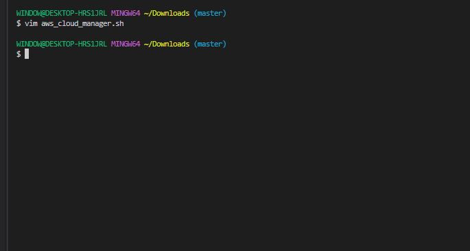

- Put the code below into the file.

'#!/bin/bash

# Checking and acting on the environment variable
if [ "$ENVIRONMENT" == "local" ]; then
echo "Running script for Local Environment..."
# Commands for local environment
elif [ "$ENVIRONMENT" == "testing" ]; then
echo "Running script for Testing Environment..."
# Commands for testing environment
elif [ "$ENVIRONMENT" == "production" ]; then
echo "Running script for Production Environment..."
# Commands for production environment
else
echo "No environment specified or recognized."
exit 2
fi'

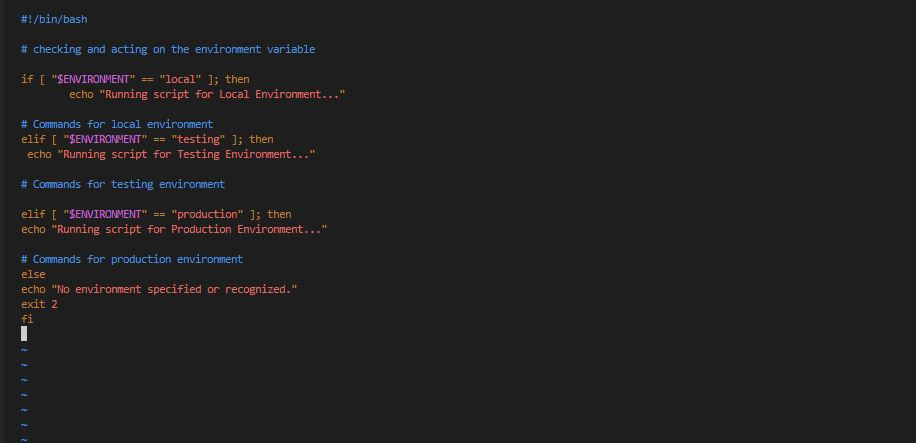

- Give it the relevant permission on the local terminal.

'sudo chmod +x aws_cloud_manager.sh'

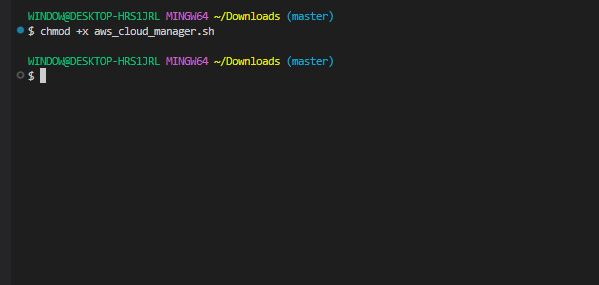

**Note:** If you execute this as it is, the execution will go into the else block just because there is no **$ENVIRONMENT** varaible set.

2. Go to the terminal, type the code below;

'export ENVIRONMENT=production'

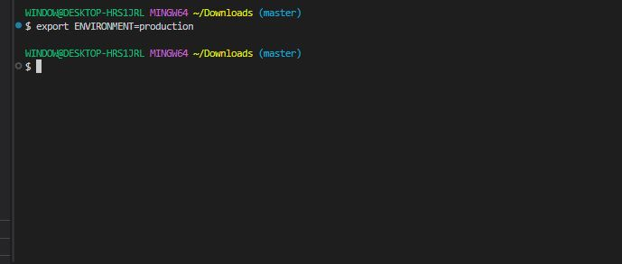

- Run the script.

'./aws_cloud_manager.sh'

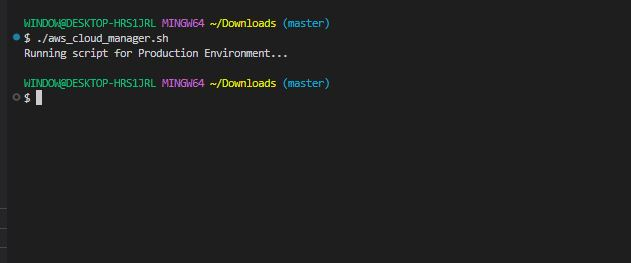

Now, you can see how environment variables can be used to dynamically apply logic in the script based on the requirement you are trying to satisfy.

the **export** command is used to set key and values for environment variables. 

You can also set the variable directly on the script. like this script below.

'#!/bin/bash

# Initialize environment variable
ENVIRONMENT="testing"

# Checking and acting on the environment variable
if [ "$ENVIRONMENT" == "local" ]; then
  echo "Running script for Local Environment..."
  # Commands for local environment
elif [ "$ENVIRONMENT" == "testing" ]; then
  echo "Running script for Testing Environment..."
  # Commands for testing environment
elif [ "$ENVIRONMENT" == "production" ]; then
  echo "Running script for Production Environment..."
  # Commands for production environment
else
  echo "No environment specified or recognized."
  exit 2
fi'

Running this version of the script would mean everytime you run it, it will consider the logic for testing environment, because the value has been "hard coded" in the script, and that is no longer dynamic. The best way to do this is a command line arguments.

### Positional parameters in shell scripting

As we've learned, hard-coding values directly into scripts is considered poor practice. Instead, let's aim for flexibility by allowing scripts to accept input dynamically. This is where positional parameters come in,  acapability in shell scripting that enables passing arguments to scripts at runtime, and then replaces the argument with the parameter inside the script. 

- To run the script above;

'./aws_cloud_manager.sh testing'

As in the case above, the argument is "testing" and it is also the value to the variable within the script.

'ENVIRONMENT=$1'

- The positional parameter inside the script.

### A better way to write the script;

Because it is possible to pass multiple parameters to a script, dollar sign $ is used to prefix the position of the argument passed to the script. Imagine if another variablw within the script is called **NUMBER_OF_INSTANCES** that determine how many EC2 instances get provisioned, the calling the script might look like;

'./aws_cloud_manager.sh testing 5'

The positional parameters inside the script would look like;

'ENVIRONMENT=$1

NUMBER_OF_INSTANCES=$2'

- Each positional parameter within the script corresponds to specific argument passed to the script, and each parameter has a position represented by an index number.

### Conditions to check number of arguments

Creating shell scripts to meet specific reqirements is one aspect of development, but ensuring their cleanliness and freedom from bugs is equally crucial. Integrating logical checks periodically to validate data is considered a best practice in script development. 

A prime example of this is verifying the number of arguments passed to the script, ensuring that the script receives the correct input required for its execution, and providing clear guidance to users in case of incorrect usage.

Below code ensures that when the script is executed, exactly one argument is passed to it, otherwise if fails with an exit code of one and an shows a message telling the user how to use the script.

'# Checking the number of arguments

if [ "$#" -ne 0 ]; then

    echo "Usage: $0 <environment>"
    exit 1
fi'

- "$#" is a special variable that holds the number of arguments passed to the script.

- "-ne" means "Not equal".

- "$0" represent the positional parameter of 0, which is the script itself. Hence, if number of arguments is not equal to "1", then show the echo message.

Here's the updated script;

'#!/bin/bash

# Checking the number of arguments
if [ "$#" -ne 0 ]; then
    echo "Usage: $0 <environment>"
    exit 1
fi

# Accessing the first argument
ENVIRONMENT=$1

# Acting based on the argument value
if [ "$ENVIRONMENT" == "local" ]; then

  echo "Running script for Local Environment..."

elif [ "$ENVIRONMENT" == "testing" ]; then

  echo "Running script for Testing Environment..."

elif [ "$ENVIRONMENT" == "production" ]; then

  echo "Running script for Production Environment..."

else

  echo "Invalid environment specified. Please use 'local', 'testing', or 'production'."

  exit 2

fi'

- Edit the script.

'sudo nano aws_cloud_manager.sh'

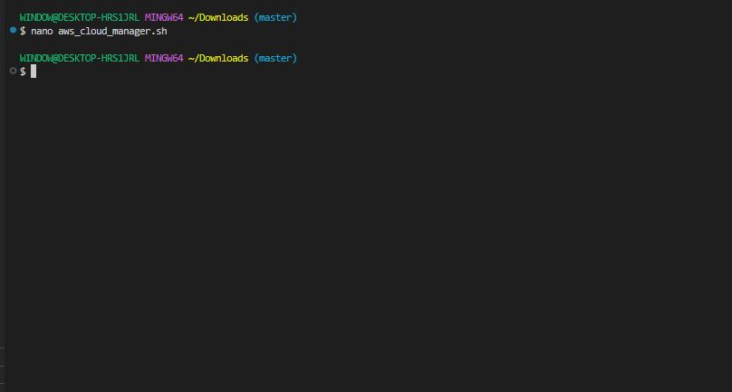

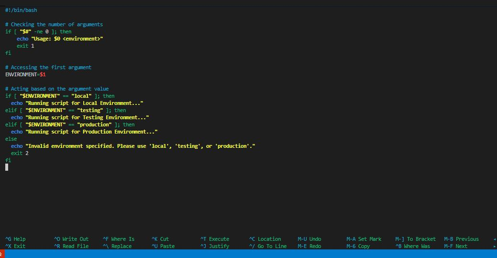

- Run it on the Testing Environment.

'export ENVIRONMENT=testing'

'./aws_cloud_manager.sh testing'

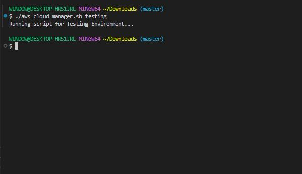

'./aws_cloud_manager.sh production'

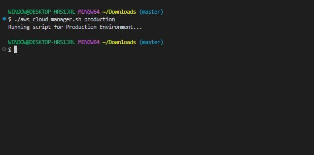

'./aws_cloud_manager.sh local'

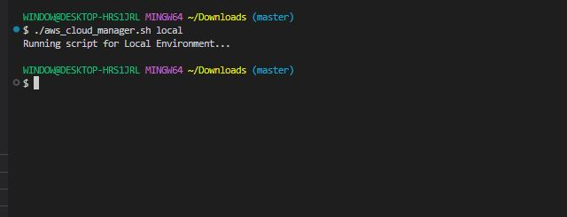

You can see that the script runs on the different environments based on the environment variable.

- Edit and run script to provision 2 ec2 instances dynamically based on the environment variables.

'sudo nano aws_cloud_manager.sh'

'#!/bin/bash
set -euo pipefail

############################
# ARGUMENT VALIDATION
############################
if [ "$#" -ne 1 ]; then
    echo "Usage: $0 <environment>"
    exit 1
fi

ENVIRONMENT=$1
INSTANCE_COUNT=2
AWS_REGION="us-east-1"
INSTANCE_TYPE="t3.micro"
KEY_NAME="wordpress"
AMI_ID="ami-0c1fe732b5494dc14"   
TAG_PREFIX="cloud-manager"

############################
# ENVIRONMENT CHECK
############################
case "$ENVIRONMENT" in
  local|testing|production)
    echo "🚀 Running script for $ENVIRONMENT environment..."
    ;;
  *)
    echo "❌ Invalid environment. Use local | testing | production"
    exit 2
    ;;
esac

############################
# PROVISION EC2 INSTANCES
############################
echo "🖥️ Launching $INSTANCE_COUNT EC2 instances..."

INSTANCE_IDS=$(aws ec2 run-instances \
  --region "$AWS_REGION" \
  --image-id "$AMI_ID" \
  --instance-type "$INSTANCE_TYPE" \
  --count "$INSTANCE_COUNT" \
  --key-name "$KEY_NAME" \
  --tag-specifications "ResourceType=instance,Tags=[{Key=Name,Value=${TAG_PREFIX}-${ENVIRONMENT}},{Key=Environment,Value=${ENVIRONMENT}}]" \
  --query "Instances[*].InstanceId" \
  --output text)

echo "✅ EC2 Instances created:"
for id in $INSTANCE_IDS; do
  echo " - $id"
done'

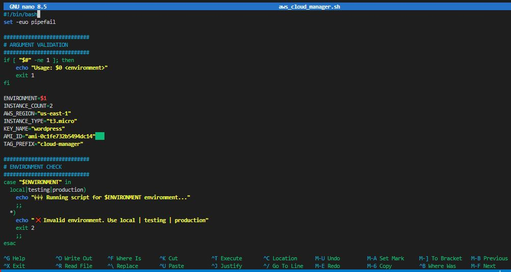

- Run script.

'./aws_cloud_manager.sh testing'

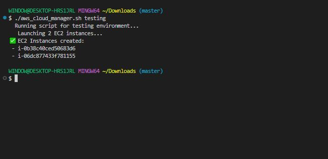

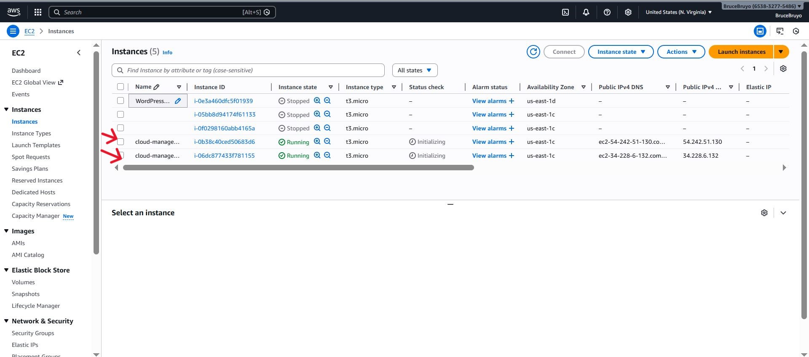

'./aws_cloud_manager.sh production'

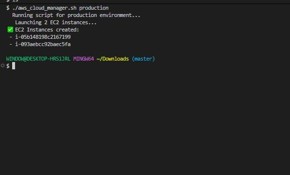

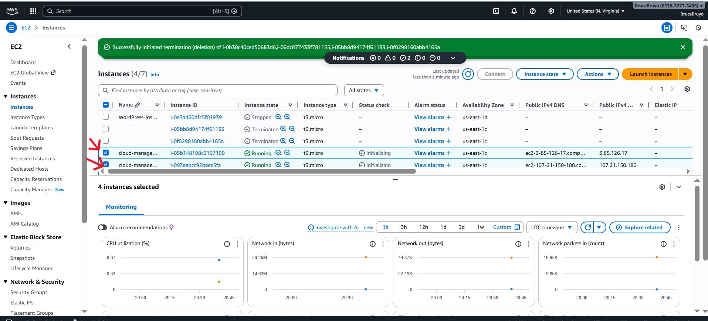

'./aws_cloud_manager.sh local'

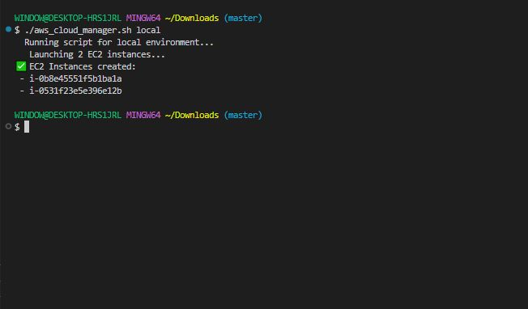

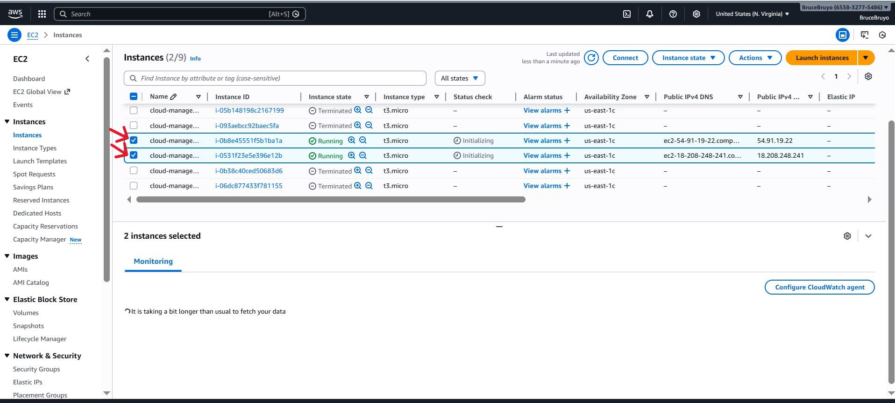

You can see it automatically provision two ec2 instances.

