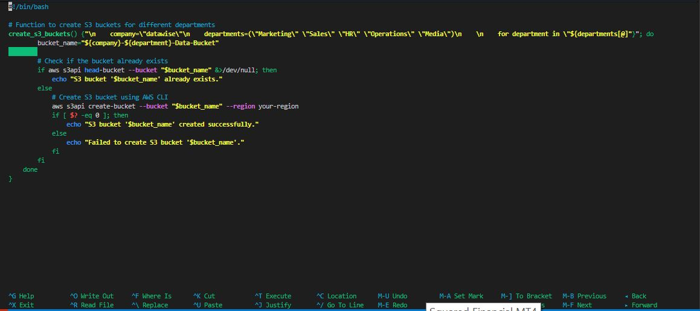
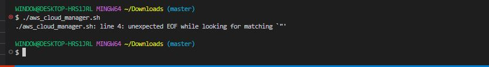
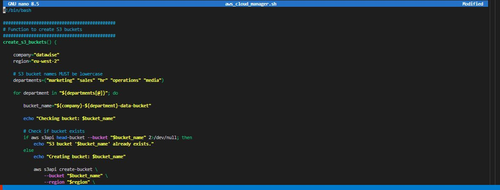
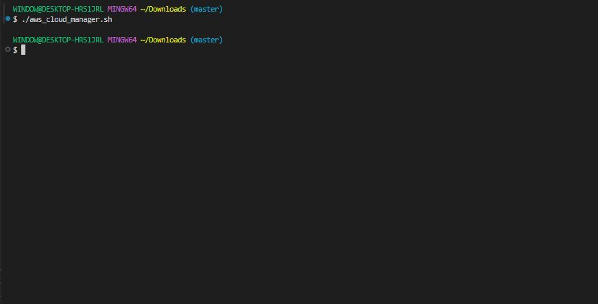
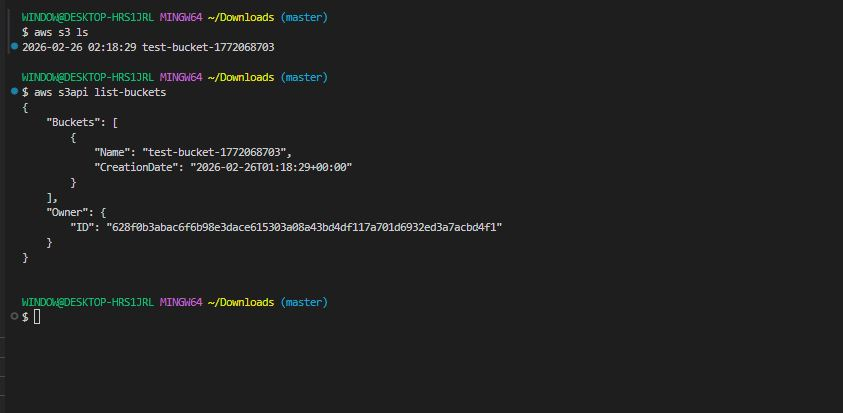

# Error Handling in Shell Scripting

## Project Review

Error handling is a crucial aspect of scripting that involves anticipating and managing errors that may occur during script execution. These errors could arise from various factors such as incorrect user input, unexpected system behaviour, or resource unavailability. Proper error handling is essential for improving the reliability, robustness, and usability of shell scripts. 

### Implementing Error Handling

When implementing error handling in shell scripting, it's essential to consider various scenarios and develop strategies to handle them effectively. Here are some key steps to think through and implement error handling:

- **Identify Potential Errors:** Begin by identifying potential sources of errors in your script, such as user input validation, command execution, or file operations. Anticipate scenarios where errors may occur and how they could impact script execution.

- **Use Conditional Statements:** Utilize conditional statements (if, elif, else) to check for error conditions and respond accordingly. Evaluate the exit status **($?)** of commands to determine whether they executed successfully or encountered an error.

**Provide Informative Messages:** When errors occur, provide descriptive error messages that clearly indicate what went wrong and how users can resolve the issue.

### Task

### Handling S3 Bucket Existence Error

In the context of our script to create S3 buckets, an error scenario could arise if the bucket already exists when attempting to create it. To handle this error, we can modify the script to check if the bucket exists before attempting to create it. If the bucket already exists, we can display a message indicating that the bucket is already present.

Here's an updated version of the **create_s3_buckets** function with error handling for existing buckets.

'sudo nano aws_cloud_manager.sh'

- Type in the code snippet.

'# Function to create S3 buckets for different departments
create_s3_buckets() {"\n    company=\"datawise\"\n    departments=(\"Marketing\" \"Sales\" \"HR\" \"Operations\" \"Media\")\n    \n    for department in \"${departments[@]"}"; do
        bucket_name="${company}-${department}-Data-Bucket"
        
        # Check if the bucket already exists
        if aws s3api head-bucket --bucket "$bucket_name" &>/dev/null; then
            echo "S3 bucket '$bucket_name' already exists."
        else
            # Create S3 bucket using AWS CLI
            aws s3api create-bucket --bucket "$bucket_name" --region your-region
            if [ $? -eq 0 ]; then
                echo "S3 bucket '$bucket_name' created successfully."
            else
                echo "Failed to create S3 bucket '$bucket_name'."
            fi
        fi
    done
}'

- Run the script.

'./aws_cloud_manager.sh'

The code has broken syntax, so we have to correct and update it.

Let's see the update script.

'############################################
# Function to create S3 buckets
############################################
create_s3_buckets() {

    company="datawise"
    region="eu-west-2"

    # S3 bucket names MUST be lowercase
    departments=("marketing" "sales" "hr" "operations" "media")

    for department in "${departments[@]}"; do

        bucket_name="${company}-${department}-data-bucket"

        echo "Checking bucket: $bucket_name"

        # Check if bucket exists
        if aws s3api head-bucket --bucket "$bucket_name" 2>/dev/null; then
            echo "S3 bucket '$bucket_name' already exists."
        else
            echo "Creating bucket: $bucket_name"

            aws s3api create-bucket \
                --bucket "$bucket_name" \
                --region "$region" \
                --create-bucket-configuration LocationConstraint="$region"

            echo "S3 bucket '$bucket_name' created successfully."
        fi

    done
}'

- Run the updated script.

'./aws_cloud_manager.sh'

In this updated version, before attempting to create each bucket, we use the **aws s3api head-bucket** command to check if the bucket already exists. If the bucket exists, a message is displayed indicating its presence. Otherwise, the script proceeds to create the bucket as before. This approach helps prevent errors and ensures that existing buckets are not recreated unnecessarily.

Let's check for the buckets.

'aws s3 ls'

'aws s3api list-buckets'

