# Working with functions 

## Project Review

Organizing your code is key to maintaining clarity and efficiency. One powerful technique for achieving this is through the use of functions. By encapsulating specific logic within functions, you can streamline your scripts and improve readability. Going forward, you will be craeting functions for every piece of requirement you wish to satisfy. 

To create a function in a shell script, you simply have to define it using the following syntax.

'function_name() {"\n    # Function body\n    # You can place any commands or logic here\n"}'

Here's a breakdown of the syntax:

- **Function name:** This is the name of your function. Choose a descriptive name that reflects the purpose of the function.

- **():** Parentheses are used to define the function. They can be omitted in simpler cases, but it's good practice to include them for clarity.

- **:** Curly braces enclose the body of the function, where you define the commands or logic that the function will execute.

### Function: Check if script has an argument

'sudo nano aws_cloud_manager.sh'

Here is a code below without a function.

'#!/bin/bash

# Checking the number of arguments
if [ "$#" -ne 1 ]; then

    echo "Usage: $0 <environment>"
    exit 1
fi

# Accessing the first argument
ENVIRONMENT=$1

# Acting based on the argument value
if [ "$ENVIRONMENT" == "local" ]; then

  echo "Running script for Local Environment..."

elif [ "$ENVIRONMENT" == "testing" ]; then

  echo "Running script for Testing Environment..."

elif [ "$ENVIRONMENT" == "production" ]; then

  echo "Running script for Production Environment..."

else

  echo "Invalid environment specified. Please use 'local', 'testing', or 'production'."

  exit 2

fi'

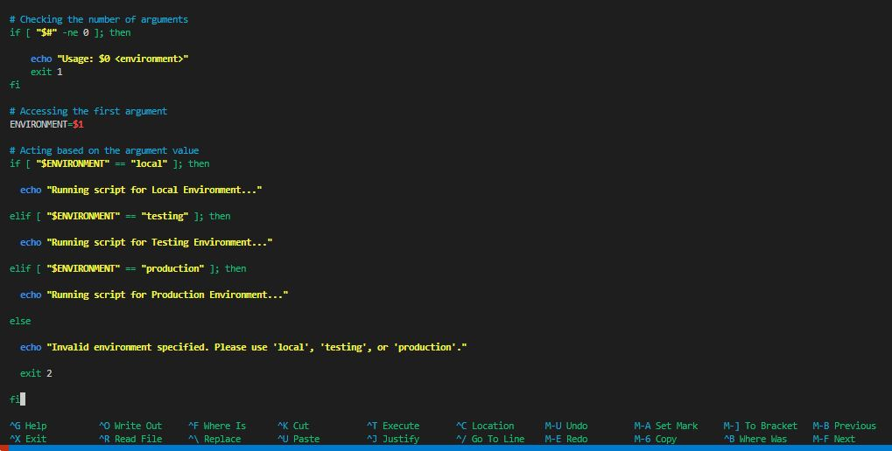

- Execute and run the script.

'chmod +x aws_cloud_manager.sh'

'./aws_cloud_manager.sh production'

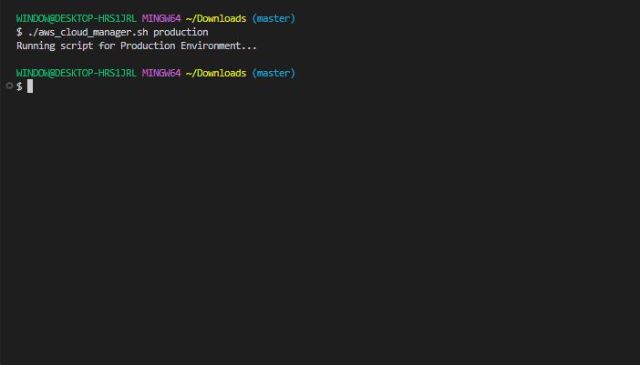

It would look like this with a function called **check_num_of_args**.

'#!/bin/bash

check_num_of_args() {"\n# Checking the number of arguments\nif [ \"$#\" -ne 0 ]; then\n    echo \"Usage: $0 <environment>\"\n    exit 1\nfi\n"}

# Accessing the first argument
ENVIRONMENT=$1

# Acting based on the argument value
if [ "$ENVIRONMENT" == "local" ]; then

  echo "Running script for Local Environment..."

elif [ "$ENVIRONMENT" == "testing" ]; then

  echo "Running script for Testing Environment..."

elif [ "$ENVIRONMENT" == "production" ]; then

  echo "Running script for Production Environment..."

else

  echo "Invalid environment specified. Please use 'local', 'testing', or 'production'."

  exit 2

fi'

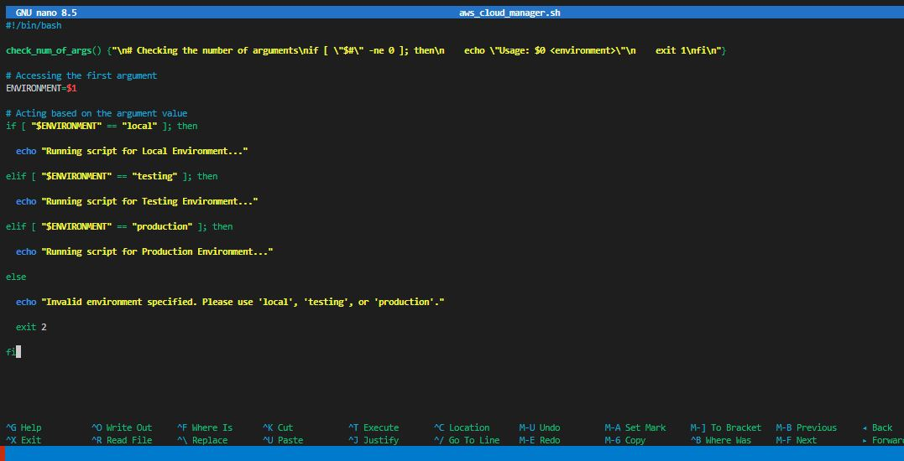

'./aws_cloud_manager.sh production'

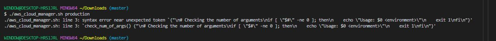

Your function is written incorrectly and it’s never being executed properly.

When a function is defined in a shell script, it remains inactive until it is invoked or called within the script. To execute the code within the function, you must place a call to function in a relevant part of your script. It's crucial to consider the order in which the interpreter evaluates each line of code. Placing the function where it logically fits within the flow of your script ensures that it is available and ready to be executed when needed. This organization helps maintain the readability and coherenceof the script, making it easier to understand and debug.

Let's see what that would look like;

'#!/bin/bash

# Environment variables
ENVIRONMENT=$1

check_num_of_args() {"\n# Checking the number of arguments\nif [ \"$#\" -ne 0 ]; then\n    echo \"Usage: $0 <environment>\"\n    exit 1\nfi\n"}

check_num_of_args()

# Acting based on the argument value
if [ "$ENVIRONMENT" == "local" ]; then

  echo "Running script for Local Environment..."

elif [ "$ENVIRONMENT" == "testing" ]; then

  echo "Running script for Testing Environment..."

elif [ "$ENVIRONMENT" == "production" ]; then

  echo "Running script for Production Environment..."

else

  echo "Invalid environment specified. Please use 'local', 'testing', or 'production'."

  exit 2

fi'

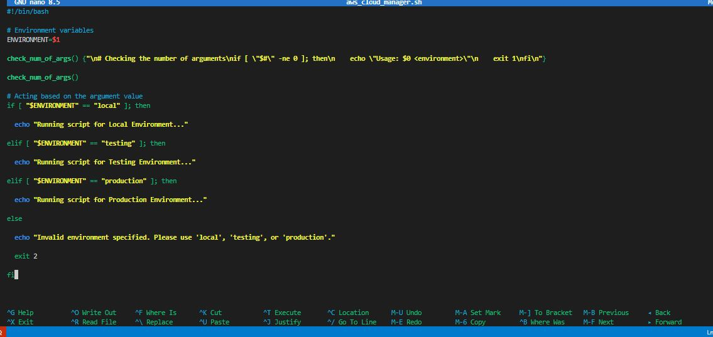

'./aws_cloud_manager.sh production'

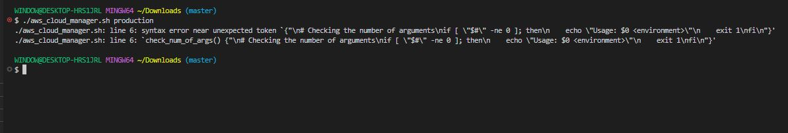

Your function is written incorrectly and it’s never being executed properly.

With a refactored version of the code, we now have the flow like this;

- Environment variable moved to the top.

- Function defined.

- Fucntion call.

- Activate based on infrastructure environment section.

What we could also do is encapsulate number 4 in a function and call all the functions at the end of the script. This is what you would see most times in the real world.

This is the new look;

'#!/bin/bash

# Environment variables
ENVIRONMENT=$1

check_num_of_args() {"\n# Checking the number of arguments\nif [ \"$#\" -ne 0 ]; then\n    echo \"Usage: $0 <environment>\"\n    exit 1\nfi\n"}

activate_infra_environment() {"\n# Acting based on the argument value\nif [ \"$ENVIRONMENT\" == \"local\" ]; then\n  echo \"Running script for Local Environment...\"\nelif [ \"$ENVIRONMENT\" == \"testing\" ]; then\n  echo \"Running script for Testing Environment...\"\nelif [ \"$ENVIRONMENT\" == \"production\" ]; then\n  echo \"Running script for Production Environment...\"\nelse\n  echo \"Invalid environment specified. Please use 'local', 'testing', or 'production'.\"\n  exit 2\nfi\n"}

check_num_of_args
activate_infra_environment'

With the updated version of the code, you can now see how clean the code looks. You can easily understand what each function is doing based on its name, comments, and the order in which the functions are called at the end.

### Let's create a function to check if AWS CLI is installed.

'#!/bin/bash

# Function to check if AWS CLI is installed
check_aws_cli() {
    if ! command -v aws >/dev/null 2>&1; then
        echo "❌ AWS CLI is not installed."
        exit 1
    fi
}
'

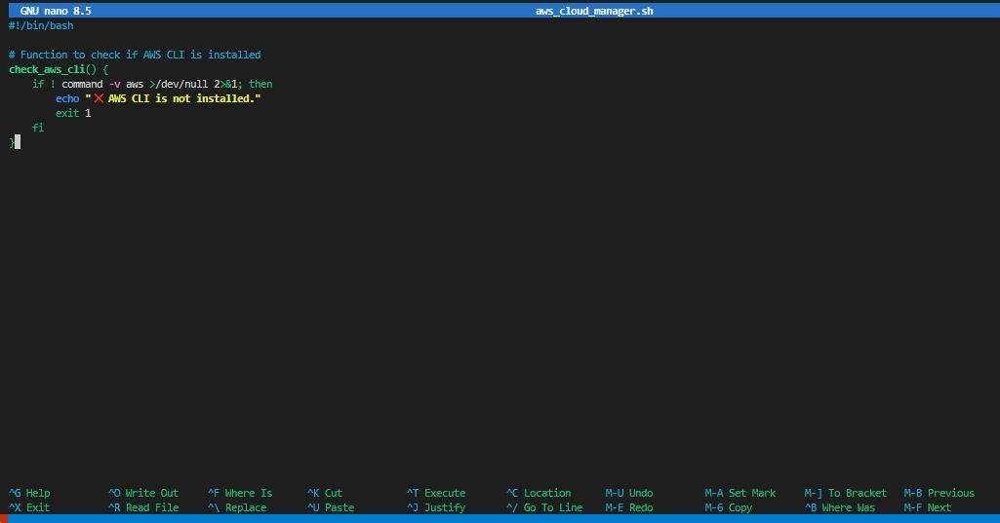

'./aws_cloud_manager.sh production'

This show that it worked since it didn't echo "AWS CLI is not installed".

Let's break down this section of the code;

- **if ! command -v aws &> /dev/null; then:** This line contains an if statement. Here's the breakdown:

- **!:** This is the logical negation operator. It reverses the result of a command, so ! command means "if Not".

- **command -v aws:** This command checks if the aws command is available in the system. It returns the path to the aws executable if it doesn't. If you run this on your system, it will tell you the path to the 'aws' cli that you installed previously. 

Hence, the **"command -v"** utilty also returns the same thing that the **"which"** command returns. With the "!" operator, we are saying that if the path for "aws" does not exist, then return 1. 

- **&> /dev/null:** This pert redirects both standard output (stdout) and standard error (stderr) to **/dev/null**, a special device file that discards all output. This effectively suppresses any output from the command -v command. 

- **then:** This keyword indicates the beginning of the code block to execute if the condition in the if statement is true.

- **echo "AWS CLI is not installed. Please install it before proceeding.":** This line prints an error message to the standard output if the AWS CLI is not installed.

- return 1: This line causes the function to exit with a non-zero exit status (1). A non-zero exit status conventionally indicates an error condition in Unix-like systems.

### Let's create a function to check if environment variable exists to authenticate to AWS

To pragrammatically create resources in AWS, you need to configure authentication using various means such as environment variables, configuration files, or IAM roles. The **~/.aws/credentials** and **~/.aws/config** files are commonly used to store AWS credentials and configuration settings, respectively. 

Running the **aws configure** command you ran earlier creates these files. You can use the cat command to open them and see the content.

**Credentials File (~/.aws/credentials)**

The credentials file typically contains AWS  access key ID and secret key pairs. You will have only default section at first. But you can add other environments as required. Just as we have for testing and production below, it is formatted as follows:

'[default]

aws_access_key_id = YOUR_ACCESS_KEY_ID

aws_secret_access_key = YOUR_SECRET_ACCESS_KEY

[profile testing]

aws_access_key_id = YOUR_TESTING_ENVIRONMENT_ACCESS_KEY_ID

aws_secret_access_key = YOUR_TESTING_ENVIRONMENT_SECRET_ACCESS_KEY

[profile production]

aws_access_key_id = YOUR_PRODUCTION_ENVIRONMENT_ACCESS_KEY_ID

aws_secret_access_key = YOUR_PRODUCTION_ENVIRONMENT_SECRET_ACCESS_KEY'

**Config File (~/.aws/config)**

The config file stores configuration settings for AWS services and clients. It can include settings such as the default region, output format, and profiles. An example config file might look likr this:

'[default]

region = us-east-1

output = json

[profile testing]

region = us-west-2

output = json

[profile production]

region = us-west-2

output = json'

The profile will enable you to easily switch between different AWS configuration. if you set an environment varaible by running the command **export AWS_PROFILE=testing** - this will pick up the configuration from both file and authenticate you to the testing environment. 

**AWS PROFILE:** The AWS_PROFILE environment variable allows users to specify which profile to use from their AWS config and credentials files. If AWS_PROFILE is not set, the default profile is used.

Here is what it looks like:

'#!/bin/bash

# Function to check if AWS profile is set
check_aws_profile() {"\n    if [ -z \"$AWS_PROFILE\" ]; then\n        echo \"AWS profile environment variable is not set.\"\n        return 1\n    fi\n"}'

- The **-z** flag is used to test if the value of the string variable (in this case, the value stored in the $AWS_PROFILE variable) has zero length, meaning it is empty or null.

Our shell script will now look like this:

'#!/bin/bash

# Environment variables
ENVIRONMENT=$1

check_num_of_args() {"\n# Checking the number of arguments\nif [ \"$#\" -ne 0 ]; then\n    echo \"Usage: $0 <environment>\"\n    exit 1\nfi\n"}

activate_infra_environment() {"\n# Acting based on the argument value\nif [ \"$ENVIRONMENT\" == \"local\" ]; then\n  echo \"Running script for Local Environment...\"\nelif [ \"$ENVIRONMENT\" == \"testing\" ]; then\n  echo \"Running script for Testing Environment...\"\nelif [ \"$ENVIRONMENT\" == \"production\" ]; then\n  echo \"Running script for Production Environment...\"\nelse\n  echo \"Invalid environment specified. Please use 'local', 'testing', or 'production'.\"\n  exit 2\nfi\n"}

# Function to check if AWS CLI is installed
check_aws_cli() {"\n    if ! command -v aws &> /dev/null; then\n        echo \"AWS CLI is not installed. Please install it before proceeding.\"\n        return 1\n    fi\n"}

# Function to check if AWS profile is set
check_aws_profile() {"\n    if [ -z \"$AWS_PROFILE\" ]; then\n        echo \"AWS profile environment variable is not set.\"\n        return 1\n    fi\n"}

check_num_of_args
activate_infra_environment
check_aws_cli'

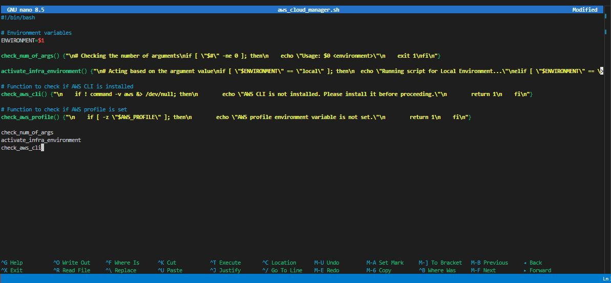

'./aws_cloud_manager.sh production'

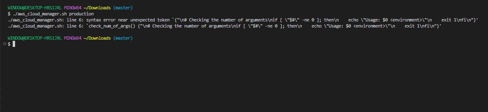

This script is still having syntax error.

This is the correct one:

'#!/bin/bash
set -euo pipefail

#####################################
# Check number of arguments
#####################################
check_num_of_args() {
    if [ "$#" -ne 1 ]; then
        echo "Usage: $0 <environment>"
        exit 1
    fi
}

#####################################
# Activate infrastructure environment
#####################################
activate_infra_environment() {
    case "$ENVIRONMENT" in
        local)
            echo "Running script for Local Environment..."
            ;;
        testing)
            echo "Running script for Testing Environment..."
            ;;
        production)
            echo "Running script for Production Environment..."
            ;;
        *)
            echo "Invalid environment specified. Use local | testing | production"
            exit 2
            ;;
    esac
}

#####################################
# Check if AWS CLI is installed
#####################################
check_aws_cli() {
    if ! command -v aws >/dev/null 2>&1; then
        echo "❌ AWS CLI is not installed."
        exit 1
    fi
}

#####################################
# Check if AWS profile is set
#####################################
check_aws_profile() {
    if [ -z "${AWS_PROFILE:-}" ]; then
        echo "❌ AWS_PROFILE environment variable is not set."
        exit 1
    fi
}

#####################################
# MAIN EXECUTION FLOW
#####################################

check_num_of_args "$@"

ENVIRONMENT=$1

check_aws_cli
check_aws_profile
activate_infra_environment'

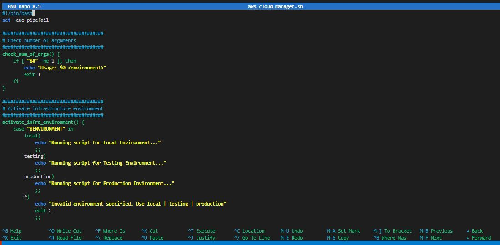

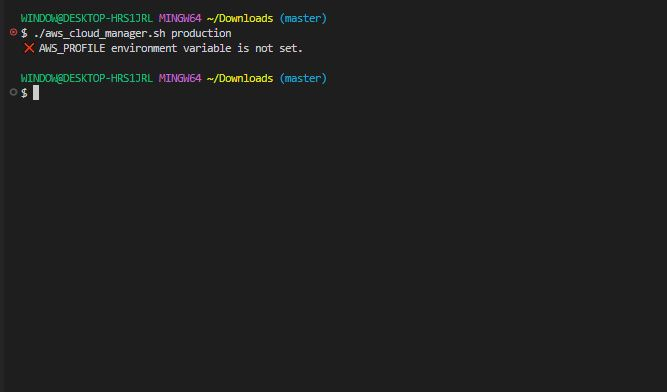

You have successfully set a scirpt to confirm if AWS CLI is installed and also authenticate your AWS profile.

