# GitHub actions and CI/CD Project - YAML

## Project Review

In this project, we'll embark on a journey to master the art of automating software development processes using one of the most powerful tools available on GitHub. This project is designed to equip with the essential skills needed to streamline the development workflow, enhance the quality of the code, and significantly reduce the time to deploy new features and fixes.

### Lesson Details:

1. **YAML Syntax for Workflows:**

- YAML is a human-readable data serialization standard used for configuration files.

- Key concepts: indentation, key-value pairs, lists.

- Example snippet:

```bash
name: Example Workflow
on: [push]
```
2. **Workflow Structure and Components:**

- **Workflow File:** Located in **'.github/workflows'** directory.

- **Jobs:** Define tasks like building, testing, deploying.

- **Steps:** Individual tasks within a job.

- **Actions:** Reusable units of code within steps.

- **Events:** Triggers for the workflow.

- **Runners:** The server where the job runs.

### Project Task

### Implementing Continuous Integration

1. Set up your github repository.

- Create a github repository named "github-actions".

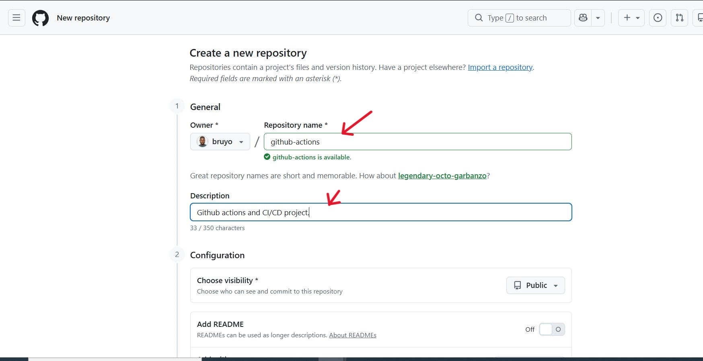

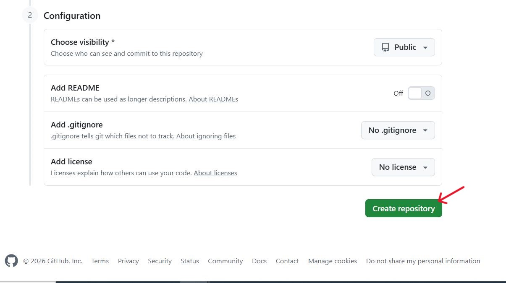

- Clone your repository to your local machine.

```bash
git clone https://github.com/bruyo/github-actions.git
```
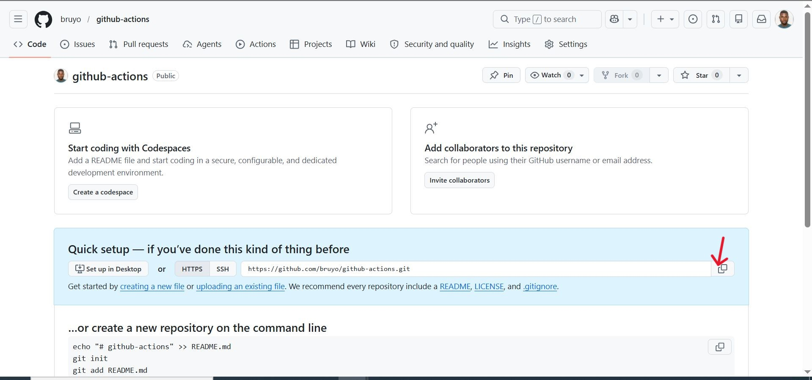

2. Initialize Node.js.

```bash
npm init
```

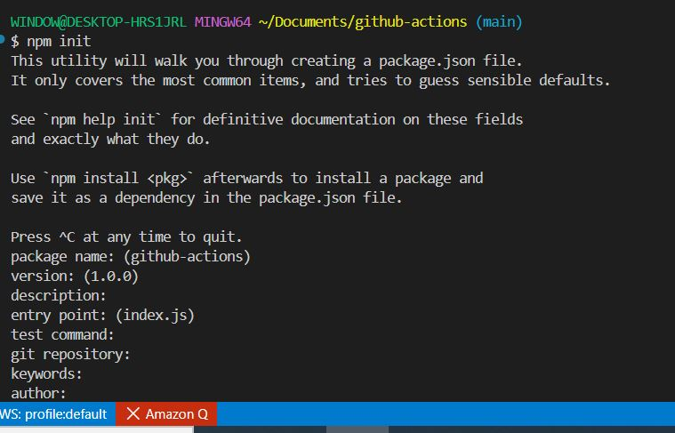

- Create a simple server using Express.js to serve a static web page.

```bash
nano index.js
```

```bash
// Example: index.js
const express = require('express');
const app = express();
const port = process.env.PORT || 3000;

app.get('/', (req, res) => {"\n     res.send('Hello World!');\n   "});

app.listen(port, () => {
  console.log(`App listening at http://localhost:${port}`);
});
```

3. Create a .github/workflow file named **'main.yml'**.

```bash
mkdir .github
```

```bash
mkdir workflows
```

```bash
nano main.yml
```

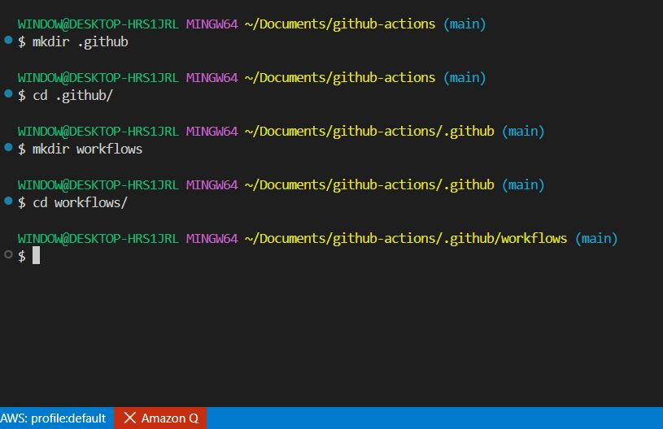

4. **Building and testing code**

- Defining the build job. In the github actions worklfow, start by defining a job named **'build'**. This job is responsible for building your code.

```bash
jobs:
  build:
    runs-on: ubuntu-latest
    steps:
    # Steps will be defined next
```

5. **Adding Build Steps:**

- Each step in the job performs a specific task. Here, we add three steps: checking out the code, installing dependencies, and running the build script.

```bash
steps:
- uses: actions/checkout@v2
  # 'actions/checkout@v2' is a pre-made action that checks out your repository under $GITHUB_WORKSPACE, so your workflow can access it.

- name: Install dependencies
  run: npm install
  # 'npm install' installs the dependencies defined in your project's 'package.json' file.

- name: Build
  run: npm run build
  # 'npm run build' runs the build script defined in your 'package.json'. This is typically used for compiling or preparing your code for deployment.
```

- For the main.yml file, copy and paste the YAML script below.

```bash
name: Node.js CI

on:
  push:
    branches: [ main ]

jobs:
  build:
    runs-on: ubuntu-latest

    strategy:
      matrix:
        node-version: [16.x, 18.x]

    steps:
      - name: Checkout repository
        uses: actions/checkout@v4

      - name: Setup Node.js
        uses: actions/setup-node@v4
        with:
          node-version: ${{ matrix.node-version }}
          cache: npm

      - name: Install dependencies
        run: npm ci

      - name: Build application
        run: npm run build --if-present

      - name: Run tests
        run: npm test
```


- Push code to remote repository.

```bash
git add .
```

```bash
git commit -m "first commit for github-actions"
```

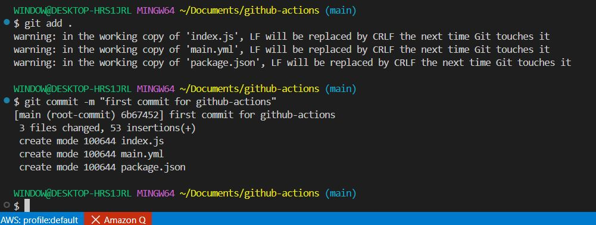

```bash
git push origin main
```

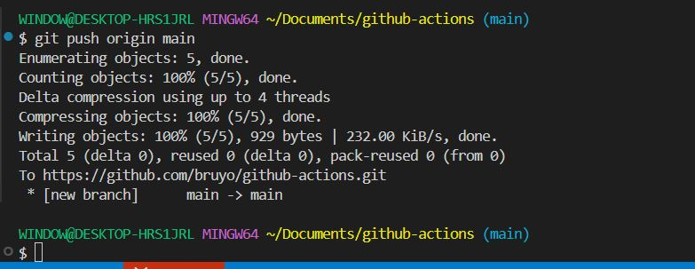

### Running Tests in the Workflow

1. **Adding Build Steps:**

- After the build steps, we will include steps to execute the test scripts. This ensures that the code is not only built but also passes all tests.


In the package.json file, replace the code line

```bash
"scripts": {
    "test": "echo \"Error: no test specified\" && exit 1"
  },
```

with;

```bash
"scripts": {
  "start": "node index.js",
  "test": "node test.js"
}
```

- Add a lock file named "package-lock.json".

```bash
npm install
```

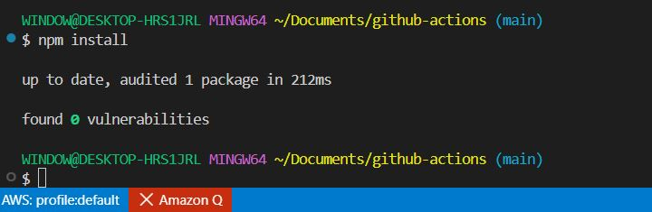

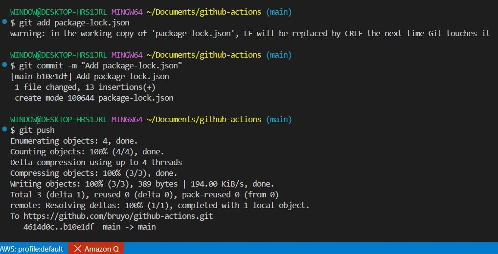

-  Update package.json to use Jest.

```bash
{
  "name": "github-actions",
  "version": "1.0.0",
  "scripts": {
    "test": "jest",
    "test:unit": "jest tests/unit",
    "test:integration": "jest tests/integration"
  },
  "devDependencies": {
    "jest": "^29"
  }
}
```

- Install Jest.

```bash
npm install
```

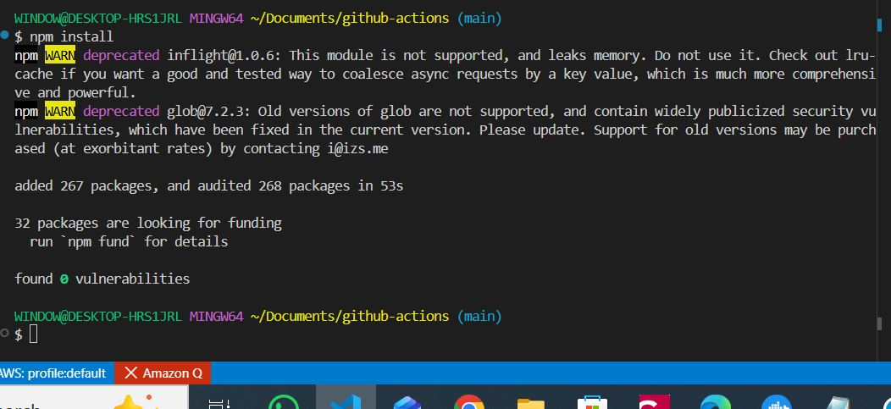

- Add a jest.config.js to the .github/workflow.

```bash
nano jest.config.js
```

```bash
// jest.config.js
module.exports = {
  testMatch: ["**/tests/**/*.test.js"],
  testPathIgnorePatterns: ["/node_modules/", "/.github/"]
};
```

- Create a test file named "test.js". Copy and paste the script.

```bash
nano test.js
```

```bash
test('adds 2 + 2 correctly', () => {
  expect(2 + 2).toBe(4);
});
```
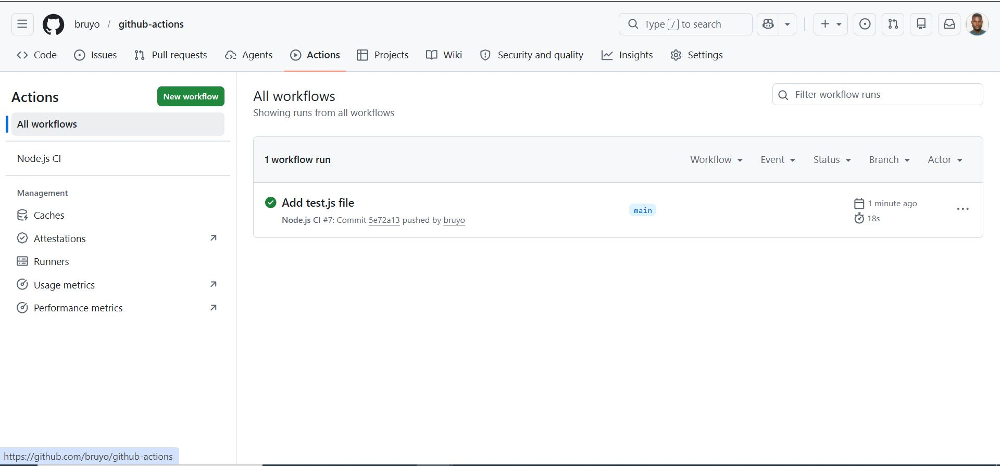

##   Congratulations! We have successfully deployed our application.


### Additional YAML Concepts in GitHub Actions

**Detailed Steps and Code Explanation:**

1. **Using Environment Variables:**

- Environment variables can be defined at the workflow, job, or step level.

- They allow you to dynamically pass configuration and settings.

```bash
env:
  CUSTOM_VAR: value
  # Define an environment variable 'CUSTOM_VAR' at the workflow level.
jobs:
  example:
    runs-on: ubuntu-latest
    steps:
    - name: Use environment variable
      run: echo $CUSTOM_VAR
      # Access 'CUSTOM_VAR' in a step.
```

2. **Working with Secrets:**

- Secrets are encrypted variables set in the GitHub repository settings.

- Ideal for storing sensitive data like access tokens, password, etc.

```bash
jobs:
  deploy:
    runs-on: ubuntu-latest
    steps:
    - name: Use secret
      run: |
        echo "Access Token: ${{" secrets.ACCESS_TOKEN "}}"
        # Use 'ACCESS_TOKEN' secret defined in the repository settings.
```

3. **Conditional Execution:**

- You can control when jobs, steps, or workflows run based on conditions.

```bash
jobs:
  conditional-job:
    runs-on: ubuntu-latest
    if: github.event_name == 'push' && github.ref == 'refs/heads/main'
    # The job runs only for push events to the 'main' branch.
    steps:
    - uses: actions/checkout@v2
```

4. **Using Outputs and Inputs between Steps:**

- Share data between steps in a job using outputs.

```bash
jobs:
  example:
    runs-on: ubuntu-latest
    steps:
    - id: step-one
      run: echo "::set-output name=value::$(echo hello)"
      # Set an output named 'value' in 'step-one'.
    - id: step-two
      run: |
        echo "Received value from previous step: ${{" steps.step-one.outputs.value "}}"
        # Access the output of 'step-one' in 'step-two'.
```

### Notes:

- Environment variables and secrets are crucial for managing configurations and sensitive data in the CI/CD pipelines.

- Conditional execution helps tailor the workflow based on specific criteria, making the CI/CD process more efficient.

- Sharing data between steps using outputs allows for more complex workflows where the output of one step can influence or provide data to subsequent steps.

- These advanced features enhamce the feasibility and security of the GitHub Actions workflows, enabling a more robust CI/CD pipelines.

### Corrected and Combined Workflow

```bash
name: Advanced GitHub Actions Example

on:
  push:
    branches:
      - main

# -----------------------------------
# Workflow Environment Variables
# -----------------------------------
env:
  CUSTOM_VAR: value

jobs:

  # -----------------------------------
  # Example Job: Environment Variables
  # -----------------------------------
  example:
    runs-on: ubuntu-latest

    steps:
      - name: Use environment variable
        run: echo $CUSTOM_VAR

  # -----------------------------------
  # Deployment Job with Secrets
  # -----------------------------------
  deploy:
    runs-on: ubuntu-latest

    steps:
      - name: Use secret
        run: |
          echo "Access Token: ${{ secrets.ACCESS_TOKEN }}"

  # -----------------------------------
  # Conditional Job
  # -----------------------------------
  conditional-job:
    runs-on: ubuntu-latest

    if: github.event_name == 'push' &&
        github.ref == 'refs/heads/main'

    steps:
      - uses: actions/checkout@v4

  # -----------------------------------
  # Step Outputs Example
  # -----------------------------------
  outputs-example:
    runs-on: ubuntu-latest

    steps:
      - id: step-one
        run: echo "value=hello" >> $GITHUB_OUTPUT

      - id: step-two
        run: |
          echo "Received value from previous step: ${{ steps.step-one.outputs.value }}"
```

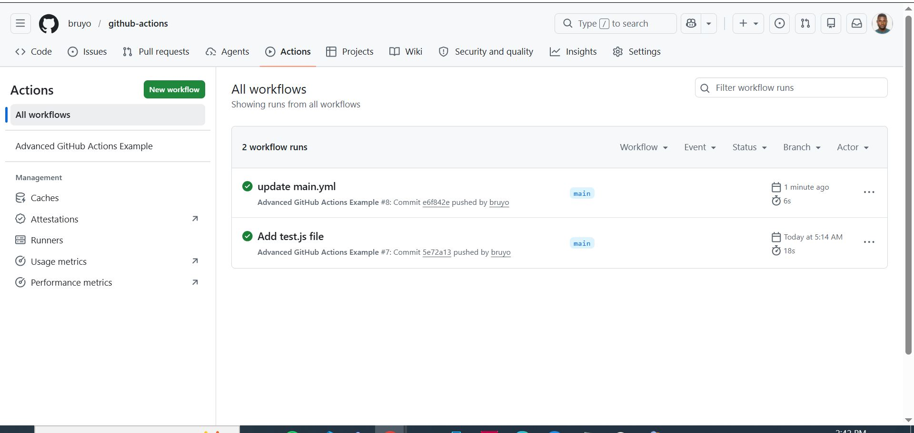

### Configuring Build Matrices

- Implement parallel and matrix builds.

- Manage dependencies across different environments.

### Configuring Build Matrices in GitHub Actions

Build matrices allow you to test your application across multiple environments simultaneously. This is one of the most powerful CI/CD features because it improves compatibility, reliability, and deployment confidence.

**What Is a Build Matrix?**

A build matrix automatically creates multiple job combinations based on variables such as:

- Node.js versions
- operating systems
- dependency versions
- environments

Instead of writing separate jobs manually, GitHub Actions generates them dynamically.

**Benefits of Matrix Builds**

**Parallel Execution**

Jobs run simultaneously, reducing CI/CD pipeline time.

Example:

- Node.js 16 test
- Node.js 18 test
- Ubuntu test
- Windows test

all execute in parallel.

**Cross-Environment Compatibility**

Ensures your application works across:

- multiple Node.js versions
- different operating systems
- varying dependency versions

**Faster Bug Detection**

Environment-specific bugs are identified early before deployment.

### Basic Matrix Build

```bash
name: Matrix Build Example

on:
  push:
    branches:
      - main

jobs:
  build:
    runs-on: ubuntu-latest

    strategy:
      matrix:
        node-version: [16.x, 18.x]

    steps:
      - name: Checkout Repository
        uses: actions/checkout@v4

      - name: Setup Node.js
        uses: actions/setup-node@v4
        with:
          node-version: ${{ matrix.node-version }}

      - name: Install Dependencies
        run: npm ci

      - name: Run Tests
        run: npm test
```
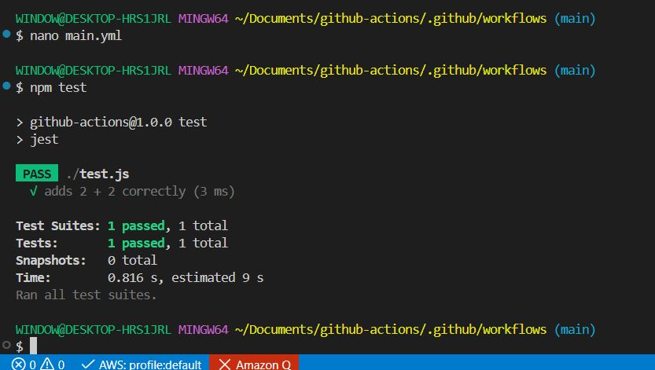

### Complete Advanced Matrix Workflow

```bash
name: Advanced Matrix CI

on:
  push:
    branches:
      - main

jobs:
  test:
    strategy:
      matrix:
        os: [ubuntu-latest, windows-latest]
        node-version: [16.x, 18.x]

    runs-on: ${{ matrix.os }}

    steps:
      - name: Checkout Repository
        uses: actions/checkout@v4

      - name: Setup Node.js
        uses: actions/setup-node@v4
        with:
          node-version: ${{ matrix.node-version }}
          cache: npm

      - name: Install Dependencies
        run: npm ci

      - name: Run Tests
        run: npm test
```
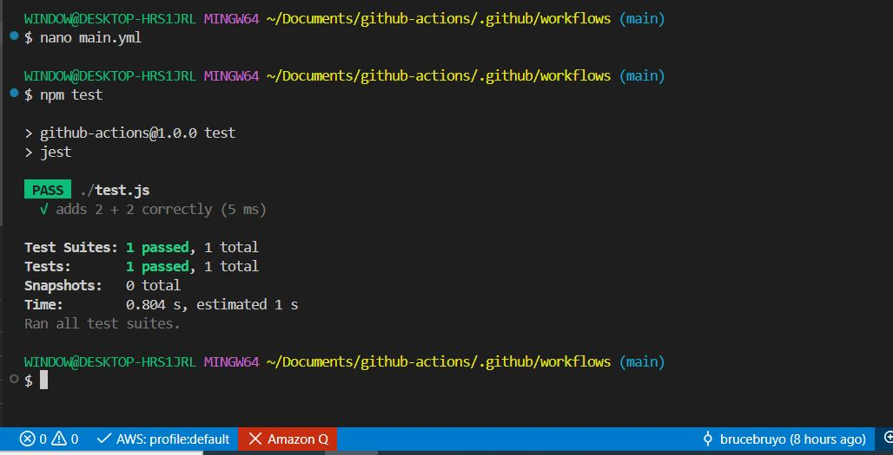

### Production-Level Matrix

```bash
name: Production Matrix Pipeline

on:
  push:
    branches:
      - main

jobs:
  build-and-test:

    strategy:
      fail-fast: false

      matrix:
        os: [ubuntu-latest, windows-latest]
        node-version: [16.x, 18.x]

    runs-on: ${{ matrix.os }}

    steps:
      - name: Checkout Repository
        uses: actions/checkout@v4

      - name: Setup Node.js
        uses: actions/setup-node@v4
        with:
          node-version: ${{ matrix.node-version }}
          cache: npm

      - name: Install Dependencies
        run: npm ci

      - name: Run Linter
        run: npm run lint --if-present

      - name: Build Application
        run: npm run build --if-present

      - name: Run Tests
        run: npm test
```
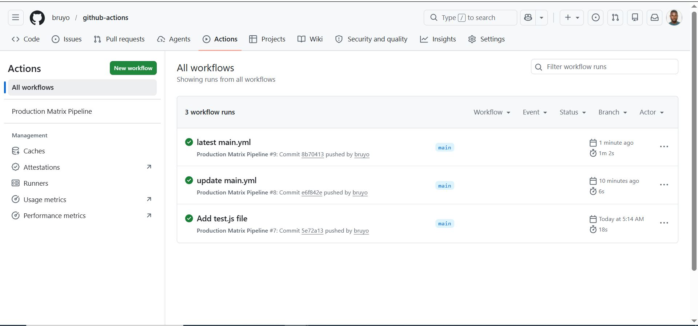

### Best Practices for Matrix Builds

1. **Keep Matrix Small Initially.**

Too many combinations increase:

- workflow time
- GitHub Actions usage
- debugging complexity


2. **Test Supported Versions Only.**

Avoid testing deprecated runtimes unless necessary.

For Node.js, prefer active LTS versions.

3. **Cache Dependencies.**

Always enable caching for faster pipelines.

4. **Use Parallel Builds Carefully.**

Large matrices can consume many GitHub runner minutes quickly.