# Hosting a Dynamic Web App on AWS with Terraform Module, Docker, Amazon ECR, and ECS

## Project Review

In this project, we will use Terraform to create a modular infrastructure for hosting a dynamic web applicationon Amazon ECS (Elastic Container Service). The project involves containerizing the web application using Docker, pushing the Docker image to Amazon ECR (Elastic Container Registry), and deploying the app on ECS.

### Project Tasks

**Dockerization of Web App:**

- Create a dynamic web application using a technology of your choice (e.g Node.js, Flask, Django).

```bash
mkdir ecs-webapp
```

```bash
cd ecs-webapp
```

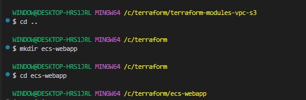

```bash
npm init
```

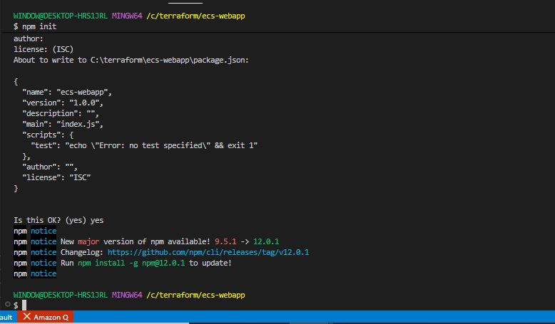

```bash
npm install
```

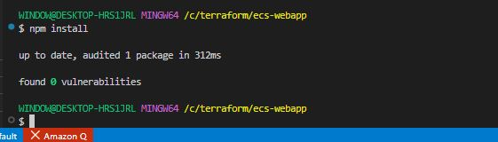

Update Package.json;

```bash
{
  "name": "ecs-webapp",
  "version": "1.0.0",
  "description": "Dynamic web app for ECS deployment",
  "main": "app.js",
  "scripts": {
    "start": "node app.js"
  },
  "dependencies": {
    "express": "^4.18.2"
  }
}
```

Create **'app.js'** file and paste the script below;

```bash
nano app.js
```

```bash
const express = require('express')
const os = require('os')
const app = express()
const PORT = process.env.PORT || 3000

app.get('/', (req, res) => {
  res.send(`
    <!DOCTYPE html>
    <html>
      <head><title>ECS Web App</title></head>
      <body>
        <h1>Dynamic Web App on Amazon ECS</h1>
        <p>Hostname: ${os.hostname()}</p>
        <p>Platform: ${os.platform()}</p>
        <p>Uptime: ${Math.floor(os.uptime())} seconds</p>
        <p>Environment: ${process.env.APP_ENV || 'development'}</p>
      </body>
    </html>
  `)
})

app.get('/health', (req, res) => {
  res.status(200).json({ status: 'healthy', timestamp: new Date() })
})

app.listen(PORT, () => {
  console.log(`Server running on port ${PORT}`)
})
```

- Write a **'Dockerfile'** file to containerize the web application.

```bash
nano Dockerfile
```

```bash
# Use official Node.js LTS image
FROM node:20-alpine

# Set working directory
WORKDIR /app

# Copy package files first (layer caching)
COPY package*.json ./

# Install dependencies
RUN npm ci --omit=dev

# Copy application source
COPY app.js .

# Create non-root user for security
RUN addgroup -S appgroup && adduser -S appuser -G appgroup
USER appuser

# Expose port
EXPOSE 3000

# Health check
HEALTHCHECK --interval=30s --timeout=10s --start-period=5s --retries=3 \
  CMD wget --no-verbose --tries=1 --spider http://localhost:3000/health || exit 1

# Start the application
CMD ["node", "app.js"]
```

- Test the Docker image locally to ensure the web app runs successfully within a container.

```bash
cd ecs-webapp

# Build the image
docker build -t ecs-webapp:latest .

# Run locally
docker run -p 3000:3000 -e APP_ENV=development ecs-webapp:latest

# Test it
curl http://localhost:3000
curl http://localhost:3000/health
```

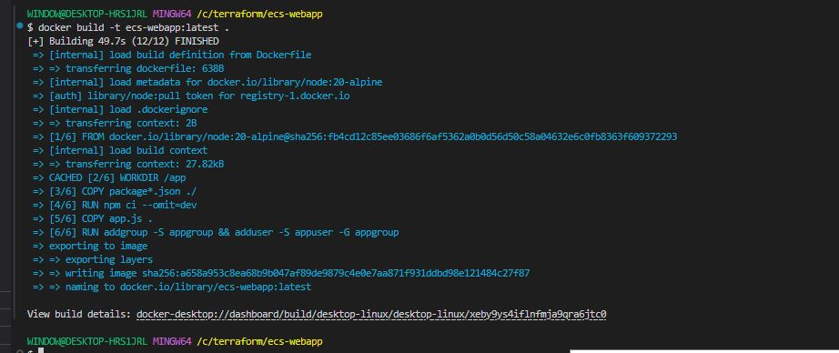

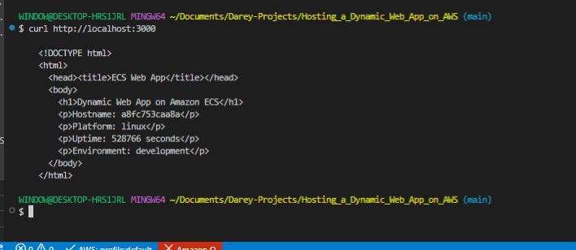

**Terraform Module for Amazon ECR:**

- Create a new directory for the Terraform project named **'terraform-ecs-webapp'**.

```bash
mkdir terraform-ecs-webapp
```

- Inside the project directory, create a directory for the Amazon ECR module named **'modules/ecr'**.

```bash
cd terraform-ecs-webapp
```

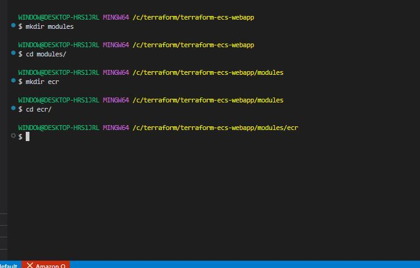


- Write a Terraform module named **'modules/ecr/main.tf'** to create Amazon ECR repository for storing Docker images.

```bash
nano main.tf
```

```bash
# -----------------------------------------------
# ECR Repository
# -----------------------------------------------
resource "aws_ecr_repository" "main" {
  name                 = var.repository_name
  image_tag_mutability = var.image_tag_mutability

  image_scanning_configuration {
    scan_on_push = var.scan_on_push
  }

  encryption_configuration {
    encryption_type = "AES256"
  }

  tags = merge(
    {
      Name        = var.repository_name
      Environment = var.environment
      ManagedBy   = "terraform"
    },
    var.tags
  )
}

# -----------------------------------------------
# Lifecycle Policy — keep only latest N images
# -----------------------------------------------
resource "aws_ecr_lifecycle_policy" "main" {
  count      = var.lifecycle_policy_enabled ? 1 : 0
  repository = aws_ecr_repository.main.name

  policy = jsonencode({
    rules = [
      {
        rulePriority = 1
        description  = "Keep last ${var.max_image_count} images"
        selection = {
          tagStatus   = "any"
          countType   = "imageCountMoreThan"
          countNumber = var.max_image_count
        }
        action = {
          type = "expire"
        }
      }
    ]
  })
}
```

```bash
nano variables.tf
```

```bash
variable "repository_name" {
  description = "Name of the ECR repository"
  type        = string
}

variable "environment" {
  description = "Deployment environment"
  type        = string
  default     = "dev"
}

variable "image_tag_mutability" {
  description = "Image tag mutability (MUTABLE or IMMUTABLE)"
  type        = string
  default     = "MUTABLE"
}

variable "scan_on_push" {
  description = "Scan images for vulnerabilities on push"
  type        = bool
  default     = true
}

variable "lifecycle_policy_enabled" {
  description = "Enable lifecycle policy to clean up old images"
  type        = bool
  default     = true
}

variable "max_image_count" {
  description = "Maximum number of images to keep"
  type        = number
  default     = 10
}

variable "tags" {
  description = "Additional tags"
  type        = map(string)
  default     = {}
}
```

```bash
nano outputs.tf
```

```bash
output "repository_url" {
  description = "ECR repository URL"
  value       = aws_ecr_repository.main.repository_url
}

output "repository_arn" {
  description = "ECR repository ARN"
  value       = aws_ecr_repository.main.arn
}

output "repository_name" {
  description = "ECR repository name"
  value       = aws_ecr_repository.main.name
}

output "registry_id" {
  description = "ECR registry ID"
  value       = aws_ecr_repository.main.registry_id
}
```


**Terraform Module for Amazon ECS:**

- Inside the project directory, create a directory for the Amazon ECS module named **'modules/ecs'**.

```bash
mkdir ecs
```

```bash
cd ecs
```

- Write a Terraform module named **'modules/ecs/main.tf'** to provision an ECS cluster and deploy the Dockerized web app.

```bash
nano main.tf
```

```bash
# -----------------------------------------------
# ECS Cluster
# -----------------------------------------------
resource "aws_ecs_cluster" "main" {
  name = var.cluster_name

  setting {
    name  = "containerInsights"
    value = "enabled"
  }

  tags = merge(
    {
      Name        = var.cluster_name
      Environment = var.environment
      ManagedBy   = "terraform"
    },
    var.tags
  )
}

# -----------------------------------------------
# IAM Role for ECS Task Execution
# -----------------------------------------------
resource "aws_iam_role" "ecs_task_execution" {
  name = "${var.app_name}-ecs-task-execution-role"

  assume_role_policy = jsonencode({
    Version = "2012-10-17"
    Statement = [{
      Action    = "sts:AssumeRole"
      Effect    = "Allow"
      Principal = { Service = "ecs-tasks.amazonaws.com" }
    }]
  })

  tags = merge(
    { Environment = var.environment },
    var.tags
  )
}

resource "aws_iam_role_policy_attachment" "ecs_task_execution" {
  role       = aws_iam_role.ecs_task_execution.name
  policy_arn = "arn:aws:iam::aws:policy/service-role/AmazonECSTaskExecutionRolePolicy"
}

# -----------------------------------------------
# CloudWatch Log Group
# -----------------------------------------------
resource "aws_cloudwatch_log_group" "app" {
  name              = "/ecs/${var.app_name}"
  retention_in_days = 30

  tags = merge(
    { Environment = var.environment },
    var.tags
  )
}

# -----------------------------------------------
# Security Group for ECS Service
# -----------------------------------------------
resource "aws_security_group" "ecs_service" {
  name        = "${var.app_name}-ecs-sg"
  description = "Allow traffic to ECS tasks"
  vpc_id      = var.vpc_id

  ingress {
    description = "App port"
    from_port   = var.container_port
    to_port     = var.container_port
    protocol    = "tcp"
    cidr_blocks = ["0.0.0.0/0"]
  }

  ingress {
    description = "HTTP"
    from_port   = 80
    to_port     = 80
    protocol    = "tcp"
    cidr_blocks = ["0.0.0.0/0"]
  }

  egress {
    from_port   = 0
    to_port     = 0
    protocol    = "-1"
    cidr_blocks = ["0.0.0.0/0"]
  }

  tags = merge(
    {
      Name        = "${var.app_name}-ecs-sg"
      Environment = var.environment
    },
    var.tags
  )
}

# -----------------------------------------------
# ECS Task Definition
# -----------------------------------------------
resource "aws_ecs_task_definition" "app" {
  family                   = var.app_name
  network_mode             = "awsvpc"
  requires_compatibilities = ["FARGATE"]
  cpu                      = var.cpu
  memory                   = var.memory
  execution_role_arn       = aws_iam_role.ecs_task_execution.arn

  container_definitions = jsonencode([
    {
      name      = var.app_name
      image     = var.container_image
      essential = true

      portMappings = [
        {
          containerPort = var.container_port
          protocol      = "tcp"
        }
      ]

      environment = [
        {
          name  = "APP_ENV"
          value = var.app_env
        },
        {
          name  = "PORT"
          value = tostring(var.container_port)
        }
      ]

      logConfiguration = {
        logDriver = "awslogs"
        options = {
          "awslogs-group"         = aws_cloudwatch_log_group.app.name
          "awslogs-region"        = "us-east-1"
          "awslogs-stream-prefix" = "ecs"
        }
      }

      healthCheck = {
        command     = ["CMD-SHELL", "wget -q http://localhost:${var.container_port}/health || exit 1"]
        interval    = 30
        timeout     = 10
        retries     = 3
        startPeriod = 5
      }
    }
  ])

  tags = merge(
    { Environment = var.environment },
    var.tags
  )
}

# -----------------------------------------------
# ECS Service
# -----------------------------------------------
resource "aws_ecs_service" "app" {
  name            = "${var.app_name}-service"
  cluster         = aws_ecs_cluster.main.id
  task_definition = aws_ecs_task_definition.app.arn
  desired_count   = var.desired_count
  launch_type     = "FARGATE"

  network_configuration {
    subnets          = var.public_subnet_ids
    security_groups  = [aws_security_group.ecs_service.id]
    assign_public_ip = true
  }

  lifecycle {
    ignore_changes = [task_definition]
  }

  tags = merge(
    { Environment = var.environment },
    var.tags
  )
}
```

```bash
nano variables.tf
```

```bash
variable "cluster_name" {
  description = "Name of the ECS cluster"
  type        = string
}

variable "environment" {
  description = "Deployment environment"
  type        = string
  default     = "dev"
}

variable "app_name" {
  description = "Name of the application"
  type        = string
}

variable "container_image" {
  description = "Docker image URI from ECR"
  type        = string
}

variable "container_port" {
  description = "Port the container listens on"
  type        = number
  default     = 3000
}

variable "cpu" {
  description = "CPU units for the task (256, 512, 1024, 2048, 4096)"
  type        = number
  default     = 256
}

variable "memory" {
  description = "Memory in MB for the task"
  type        = number
  default     = 512
}

variable "desired_count" {
  description = "Number of tasks to run"
  type        = number
  default     = 1
}

variable "vpc_id" {
  description = "VPC ID to deploy into"
  type        = string
}

variable "public_subnet_ids" {
  description = "Public subnet IDs for the ECS service"
  type        = list(string)
}

variable "app_env" {
  description = "Application environment variable"
  type        = string
  default     = "production"
}

variable "tags" {
  description = "Additional tags"
  type        = map(string)
  default     = {}
}
```

```bash
nano outputs.tf
```

```bash
output "cluster_id" {
  description = "ECS cluster ID"
  value       = aws_ecs_cluster.main.id
}

output "cluster_name" {
  description = "ECS cluster name"
  value       = aws_ecs_cluster.main.name
}

output "service_name" {
  description = "ECS service name"
  value       = aws_ecs_service.app.name
}

output "task_definition_arn" {
  description = "Task definition ARN"
  value       = aws_ecs_task_definition.app.arn
}

output "security_group_id" {
  description = "ECS service security group ID"
  value       = aws_security_group.ecs_service.id
}
```


**Main Terraform Configuration:**

- Create the main Terraform configuration file **'main.tf'** in the project directory.

```bash
nano main.tf
```

```bash
# -----------------------------------------------
# Provider
# -----------------------------------------------
provider "aws" {
  region = var.aws_region

  default_tags {
    tags = {
      Project     = var.project_name
      Environment = var.environment
      ManagedBy   = "terraform"
    }
  }
}

# -----------------------------------------------
# Current AWS account details
# -----------------------------------------------
data "aws_caller_identity" "current" {}

# -----------------------------------------------
# Default VPC and Subnets
# -----------------------------------------------
data "aws_vpc" "default" {
  default = true
}

data "aws_subnets" "default" {
  filter {
    name   = "vpc-id"
    values = [data.aws_vpc.default.id]
  }
}

# -----------------------------------------------
# ECR Module — container image registry
# -----------------------------------------------
module "ecr" {
  source = "./modules/ecr"

  repository_name          = "${var.project_name}-${var.environment}"
  environment              = var.environment
  image_tag_mutability     = "MUTABLE"
  scan_on_push             = true
  lifecycle_policy_enabled = true
  max_image_count          = var.max_image_count

  tags = {
    Project     = var.project_name
    Environment = var.environment
  }
}

# -----------------------------------------------
# ECS Module — cluster, task definition, service
# -----------------------------------------------
module "ecs" {
  source = "./modules/ecs"

  cluster_name    = "${var.project_name}-${var.environment}-cluster"
  app_name        = var.project_name
  environment     = var.environment
  container_image = "${module.ecr.repository_url}:latest"
  container_port  = var.container_port
  cpu             = var.cpu
  memory          = var.memory
  desired_count   = var.desired_count
  vpc_id          = data.aws_vpc.default.id
  public_subnet_ids = data.aws_subnets.default.ids
  app_env         = var.environment

  tags = {
    Project     = var.project_name
    Environment = var.environment
  }
}
```

- Use the ECR and ECS modules to create the necessary infrastructure for hosting the web app.

```bash
nano versions.tf
```

```bash
terraform {
  required_version = ">= 1.0.0"

  required_providers {
    aws = {
      source  = "hashicorp/aws"
      version = "~> 5.0"
    }
  }
}
```

```bash
nano variables.tf
```

```bash
variable "aws_region" {
  description = "AWS region"
  type        = string
  default     = "us-east-1"
}

variable "project_name" {
  description = "Project name used for naming resources"
  type        = string
  default     = "ecs-webapp"
}

variable "environment" {
  description = "Deployment environment"
  type        = string
  default     = "dev"
}

variable "container_port" {
  description = "Port the container listens on"
  type        = number
  default     = 3000
}

variable "cpu" {
  description = "CPU units for ECS task"
  type        = number
  default     = 256
}

variable "memory" {
  description = "Memory in MB for ECS task"
  type        = number
  default     = 512
}

variable "desired_count" {
  description = "Number of ECS tasks to run"
  type        = number
  default     = 1
}

variable "max_image_count" {
  description = "Maximum number of ECR images to retain"
  type        = number
  default     = 10
}
```

```bash
nano outputs.tf
```

```bash
# -----------------------------------------------
# ECR Outputs
# -----------------------------------------------
output "ecr_repository_url" {
  description = "ECR repository URL for pushing Docker images"
  value       = module.ecr.repository_url
}

output "ecr_repository_name" {
  description = "ECR repository name"
  value       = module.ecr.repository_name
}

output "ecr_registry_id" {
  description = "ECR registry ID"
  value       = module.ecr.registry_id
}

# -----------------------------------------------
# ECS Outputs
# -----------------------------------------------
output "ecs_cluster_name" {
  description = "ECS cluster name"
  value       = module.ecs.cluster_name
}

output "ecs_service_name" {
  description = "ECS service name"
  value       = module.ecs.service_name
}

output "ecs_task_definition_arn" {
  description = "ECS task definition ARN"
  value       = module.ecs.task_definition_arn
}

# -----------------------------------------------
# Useful commands output
# -----------------------------------------------
output "docker_login_command" {
  description = "Command to authenticate Docker with ECR"
  value       = "aws ecr get-login-password --region ${var.aws_region} | docker login --username AWS --password-stdin ${module.ecr.repository_url}"
}

output "docker_push_commands" {
  description = "Commands to build, tag and push Docker image to ECR"
  value       = <<-EOT
    docker build -t ${var.project_name} ./app
    docker tag ${var.project_name}:latest ${module.ecr.repository_url}:latest
    docker push ${module.ecr.repository_url}:latest
  EOT
}

output "ecs_deploy_command" {
  description = "Command to force a new ECS deployment"
  value       = "aws ecs update-service --cluster ${module.ecs.cluster_name} --service ${module.ecs.service_name} --force-new-deployment"
}
```

**Deployment:**

- Build the Docker image of the webb app.

- Push the Docker image to Amazon ECR repository created by Terraform.

- Run **'terraform init'** and **'terraform apply'** to deploy the ECS cluster and the web app.

- Access the web app through the public ip or DNS of the ECS service.

```bash
terraform init
```

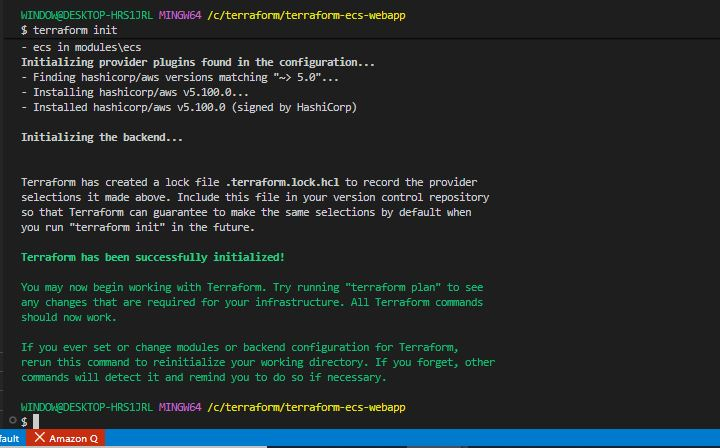


```bash
terraform apply
```

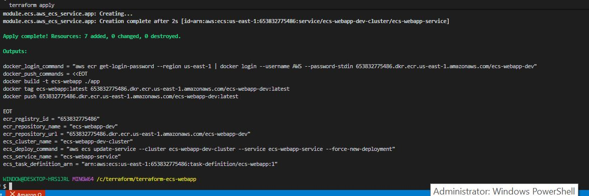

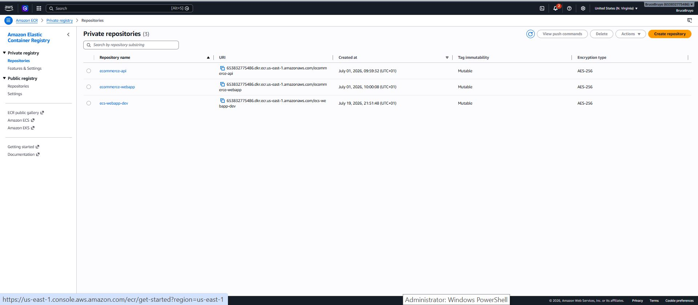

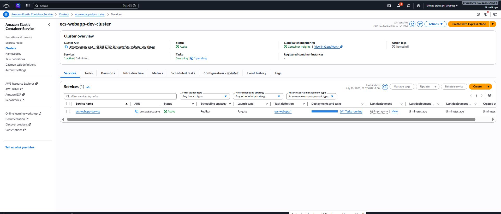

- Authenticate Docker with ECR.

```bash
aws ecr get-login-password --region us-east-1 | \
  docker login --username AWS --password-stdin \
  653832775486.dkr.ecr.us-east-1.amazonaws.com
```

- Build the image.

```bash
cd ecs-webapp
docker build -t ecs-webapp:latest .
```

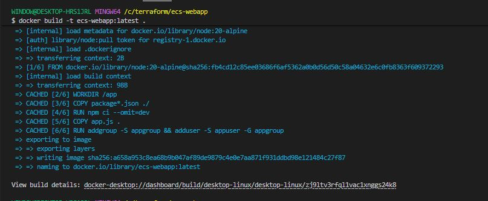

- Tag the image for ECR.

```bash
docker tag ecs-webapp:latest \
  653832775486.dkr.ecr.us-east-1.amazonaws.com/ecs-webapp-dev:latest
```

- Push to ECR.

```bash
docker push \
  653832775486.dkr.ecr.us-east-1.amazonaws.com/ecs-webapp-dev:latest
```

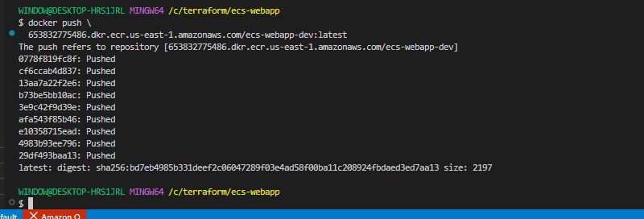

- Verify image is in ECR

```bash
aws ecr list-images --repository-name ecs-webapp-dev
```

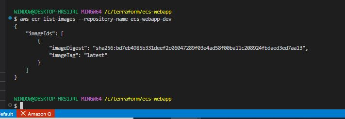

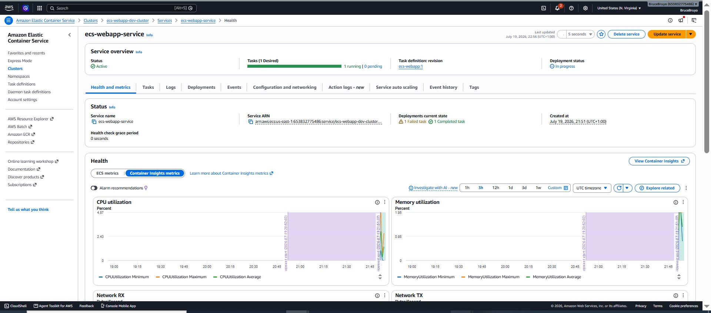

