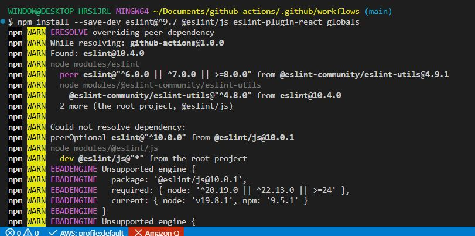
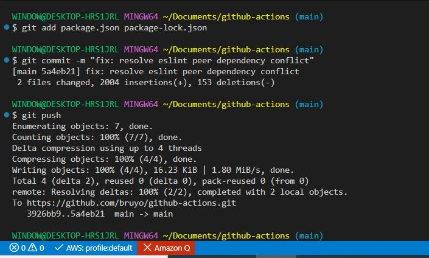
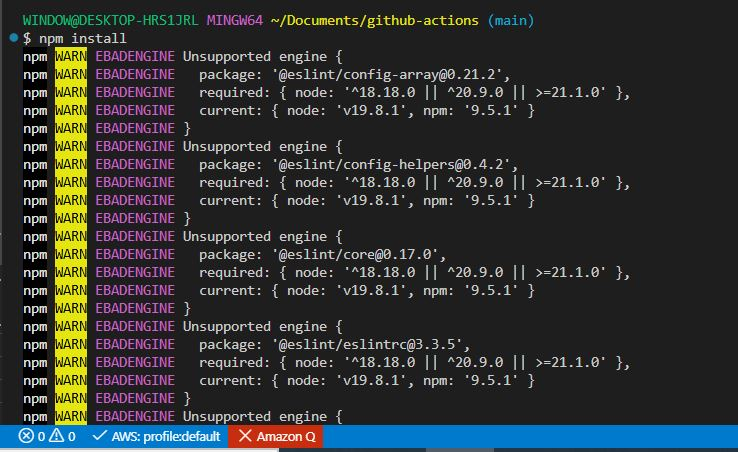
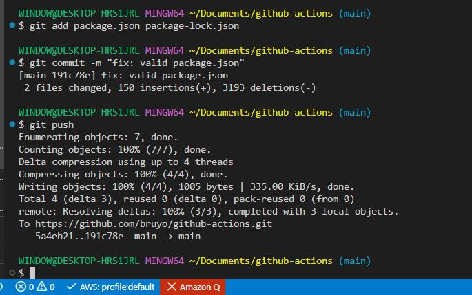
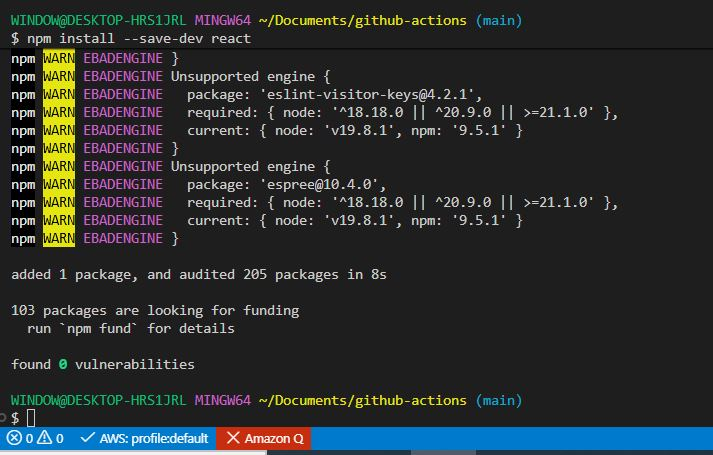
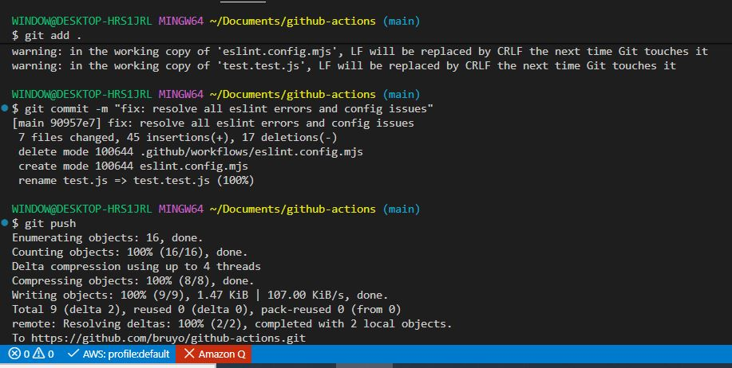
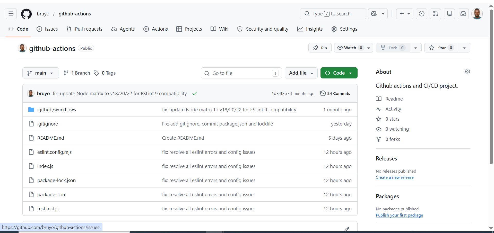
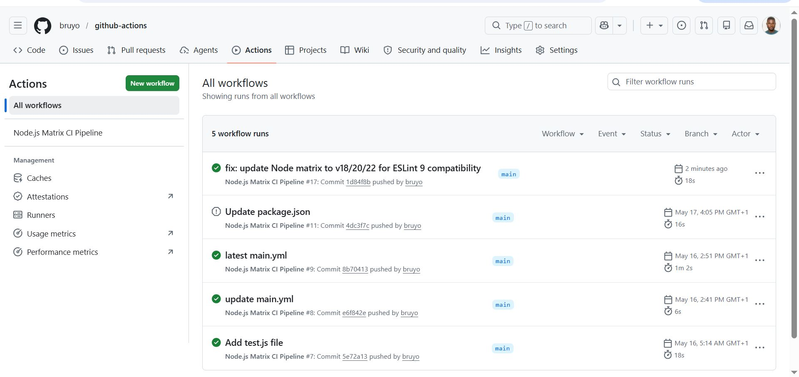

# Implementing Continuous Integration with GitHub Actions

## Project Review

In this project, we will delve into more advanced aspects of GitHub Actions, learning how to configure build matrices for testing across multiple environments and integrating essential code quality checks. 

### Configuring Build Matrices

**Detailed Steps and Code Explanation:**

1. Parallel and Matrix Builds: 

- a matrix build allows you to run jobs across multiple environments and versions simultaneously, increasing efficiency.

- This is useful for testing your application in different versions of runtime environments or dependencies.

```bash
strategy:
  matrix:
    node-version: [12.x, 14.x, 16.x]
    # This matrix will run the job multiple times, once for each specified Node.js version (12.x, 14.x, 16.x).
    # The job will be executed separately for each version, ensuring compatibility across these versions.
```

2. Managing Build Dependencies:

- Handling dependencies and services required for your build process is crucial. 

- Utilize caching to reduce the time spent on downloading and installing dependencies repeatedly.

```bash
- name: Cache Node Modules
  uses: actions/cache@v2
  with:
    path: ~/.npm
    key: ${{" runner.os "}}-node-${{" hashFiles('**/package-lock.json') "}}
    restore-keys: |
      ${{" runner.os "}}-node-
  # This snippet caches the installed node modules based on the hash of the 'package-lock.json' file.
  # It helps in speeding up the installation process by reusing the cached modules when the 'package-lock.json' file hasn't changed.
```

### Integrating Code Quality Checks

1. Adding Code Analysis Tools:

- Include steps in your workflow to run tools that analyze code quality and adherence to coding standards.

```bash
- name: Run Linter
  run: npx eslint .
  # 'npx eslint .' runs the ESLint tool on all the files in your repository.
  # ESLint is a static code analysis tool used to identify problematic patterns in JavaScript code.
```

2. Configuring Linters and Static Code Analyzers:

- Ensure your repository includes configuration files for these tools, such as **'.eslintrc'** for ESLint.

```bash
# Ensure to include a .eslintrc file in your repository
# This file configures the rules for ESLint, specifying what should be checked.
# Example .eslintrc content:
# {"\n   #   \"extends\": \"eslint:recommended\",\n   #   \"rules\": {\n   #     // additional, custom rules here\n   #   "}
# }
```


### Complete Advanced Matrix Workflow

In our previous project, we created a Node.js file named main.yml. Copy and paste the below.

```bash
nano main.yml
```

```bash
name: Node.js Matrix CI Pipeline

on:
  push:
    branches:
      - main

jobs:
  build:
    runs-on: ubuntu-latest

    strategy:
    matrix:
    node-version: [18.x, 20.x, 22.x]

    steps:
      # Checkout repository
      - name: Checkout Repository
        uses: actions/checkout@v4

      # Setup Node.js
      - name: Setup Node.js
        uses: actions/setup-node@v4
        with:
          node-version: ${{ matrix.node-version }}

      # Cache npm dependencies
      - name: Cache Node Modules
        uses: actions/cache@v4
        with:
          path: ~/.npm
          key: ${{ runner.os }}-node-${{ hashFiles('**/package-lock.json') }}
          restore-keys: |
            ${{ runner.os }}-node-

      # Install dependencies
      - name: Install Dependencies
        run: npm ci

      # Run linter
      - name: Run Linter
        run: npx eslint .

      # Run tests
      - name: Run Tests
        run: npm test

``` 
        
### Production-Level CI Pipeline

```bash
name: Production CI Pipeline

on:
  push:
    branches:
      - main

jobs:
  build:
    runs-on: ubuntu-latest

    strategy:
      fail-fast: false

      matrix:
        node-version: [18.x, 20.x, 22.x]

    steps:
      - uses: actions/checkout@v4

      - uses: actions/setup-node@v4
        with:
          node-version: ${{ matrix.node-version }}
          cache: npm

      - run: npm ci

      - run: npx eslint .

      - run: npm run build --if-present

      - run: npm test
```

- Install ESLint on your local machine.

```bash
npm install --save-dev eslint@^9.7 @eslint/js eslint-plugin-react globals
```



- Push to repo. 

```bash
git add package.json package-lock.json
git commit -m "fix: resolve eslint peer dependency conflict"
git push
```



- Update the old package.json with the script below and push to repo.

```bash
{
  "name": "github-actions",
  "version": "1.0.0",
  "devDependencies": {
    "eslint": "^9.7",
    "@eslint/js": "^9.0",
    "eslint-plugin-react": "^7.37.5",
    "globals": "^16.0"
  }
}
```

```bash
npm install
```



```bash
git add package.json package-lock.json
git commit -m "fix: valid package.json"
git push
```



- Add a test script to your package.json file.

```bash
{
  "name": "github-actions",
  "version": "1.0.0",
  "scripts": {
    "test": "eslint ."
  },
  "devDependencies": {
    "eslint": "^9.7",
    "@eslint/js": "^9.0",
    "eslint-plugin-react": "^7.37.5",
    "globals": "^16.0"
  }
}
```

- Replace the script inside the 'eslint.config.mjs' file with the script below.

```bash
import js from "@eslint/js";
import globals from "globals";
import pluginReact from "eslint-plugin-react";
import { defineConfig } from "eslint/config";

export default defineConfig([
  {
    files: ["**/*.{js,mjs,cjs,jsx}"],
    plugins: { js },
    extends: ["js/recommended"],
    languageOptions: { globals: { ...globals.browser, ...globals.node } }
  },
  { files: ["**/*.js"], languageOptions: { sourceType: "commonjs" } },
  { files: ["**/*.test.js"], languageOptions: { globals: globals.jest } },
  pluginReact.configs.flat.recommended,
  {
    settings: { react: { version: "detect" } },
    rules: {
      semi: ["error", "always"],
      quotes: ["error", "single"]
    }
  }
]);
```

- Replace inde.js with the script below.

```bash
const express = require('express');
const app = express();
const port = process.env.PORT || 3000;

app.get('/', (req, res) => {
  res.send('Hello World!');
});

app.listen(port, () => {
  console.log(`App listening at http://localhost:${port}`);
});
```

- Install react.

```bash
npm install --save-dev react
```









