# Introduction to Docker

## Project Review

In this project, we will grasp the concept of containers, their isolation, and their role in packaging applications, get familiar with Docker features, commands and best practices and also comprehend how Docker containers contribute to resource efficiency compared to traditional virtual machines.

**What are Containers?**

In realm of software development and deployment, professionals used to face a dilemma. They creafted brilliant code on their local machines, only to find that when deployed to other environments, it sometimes does not work.

Get started with Docker, a tool that emerged to a major problem IT industry. A man named Solomon Hykes, who, in 2013, unveiled Docker, a containerisation platform that promised to revolutionize the way IT professionals built, shipped, and ran applications. 

Imagine containers as magical vessels that encapsulate everything an application needs to run smoothly; its code, libraries, dependencies, and even a dash of configuration magic. These containers ensure that an application remains consistent and behaves the same, whether it's running on a developer's laptop, a testing server, or a live production environment. Docker had bestoed upon IT professionals the power to say goodbye to the days of "it works on my machine".

Docker simplifies the deployment process, making it as easy as waving a wand. Gone are the days of wrestling with complex installation procedures and compatibility issues. Docker containers provide a standardized, portable environment, ensuring that your applications run seamlessly across various platforms.

**Advantages of Containers**

- **Portability Across Different Environments:** In the past, deploying applications was akin to navigating a treacherous maze, with compatibility issues lurking at every turn. Docker's containers, however, encapsulate the entire application along with its dependencies and configurations. 

- **Resource Efficiency Compared to Virtual Machines:** Docker containers share the underlying host's operating system kernel, making them lightweight and nimble. This efficiency allows you to run multiple containers on a single host without the extravagant resource demands of traditional virtual machines.

- **Rapid Application Deployment and Scaling:** Docker containers can be effortlessly spun up or torn down, facilitating the swift deployment of applications. Whether you're facing a sudden surge in demand or orchestrating a grand-scale production, Docker allows you to scale your application seamlessly. 

**Comparison of Docker Containers with Virtual Machines**

Docker and virtual machines (VMs) are both technologies used for application deployment, but they differ in their approach to virtualization. Virtual machines emulate entire operating systems, resulting in higher resource overhead and slower performance. In contrast, Docker utilizes containerization, encapsulating applications and their dependencies while sharing the host OS's kernel. This lightweight approach reduces resource consumption, provide faster startup times, and ensures portability across different environments. Docker emphasis on microservices and standardized packaging fosters scalability and efficiency, making it a preferred choice for modern, agile application development, whereas virtual machines excel in scenarios requiring stronger isolation but at the cost of increased resource usage. The choice between Docker and VM's depends on specific use cases and the desired balance between performance and isolation.

**Importance of Docker**

- **Technology and Industry Impact:** The significance of Docker in the technology landscape cannot be overstated. Docker and containerization have revolutionized software development, deployment, and management. The ability to package applications and their dependencies into lightweight, portable containers addresses key challenges in software development such as consistency across different environments and efficient resource utilization.

- **Reail-World Impact:** Implementing Docker brings tangible benefits to organizations. It streamlines the development process, promotes collaboration between development and operations teams, and accelerates the delivery of applications. Docker's containerization technology enhances scalability, facilitates rapid deployment, and ensures the consistency of application across diverse environments. This not only save time and resources but also contributes to a more resilient and agile software development lifecycle.

### Task

### Getting started with Docker

1. **Installing Docker**

We need to launch an ubuntu 20.04 LTS instance and connect to it, then follow the steps below.

Before installing Docker Engine for the first time on a new host machine, it is necessary to configure the Docker repository. Following this setup, we can proceed to install and update Docker directly from the repository.

1. To launch an ubuntu 20.04 LTS instance and connect to, go to the EC2 instance dashboard and click on "launch instance".

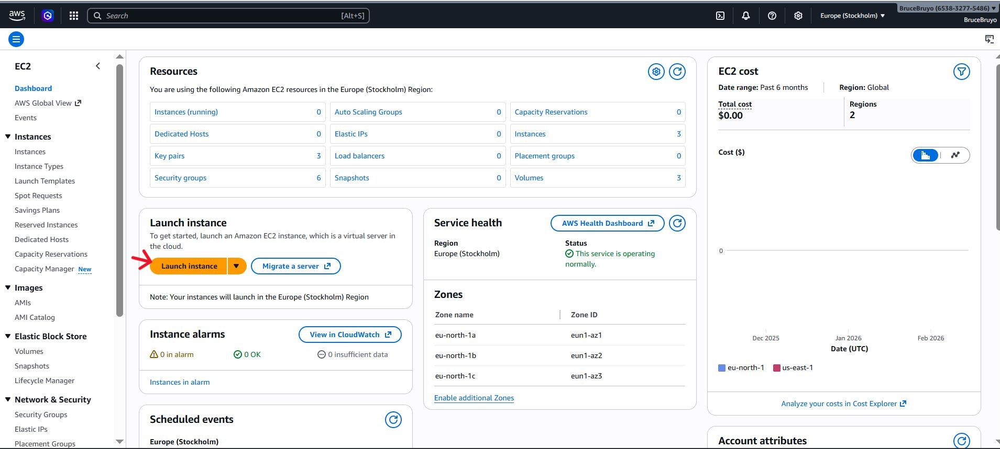

- Set up your Ubuntu 20.04 virtual Machine.

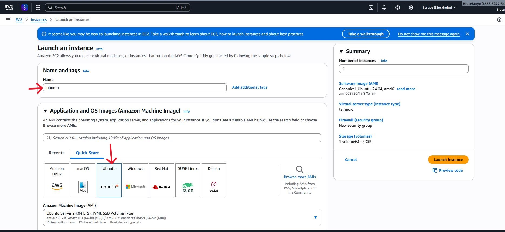

- Set up the Key pair.

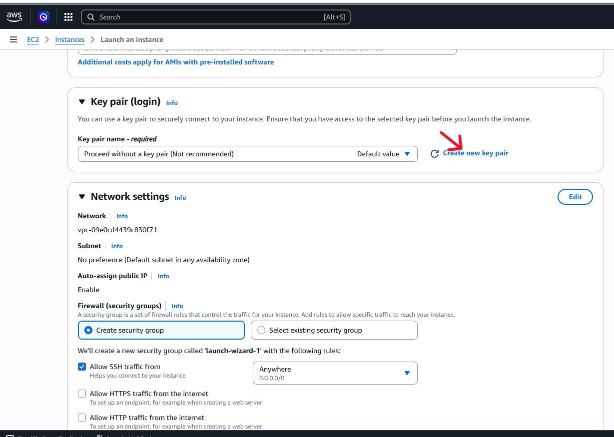

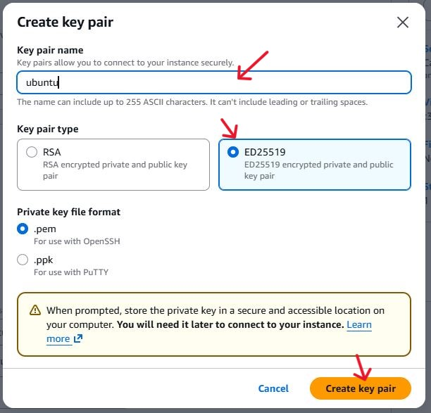

- Select "Create security group".

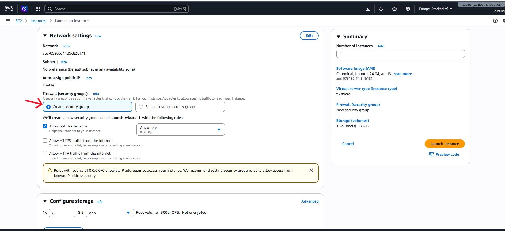

- Click on "launch instance".

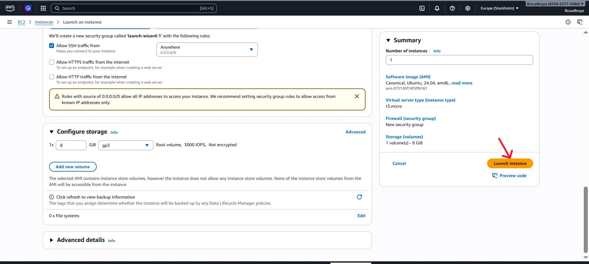

- Connect to instance from your local computer.

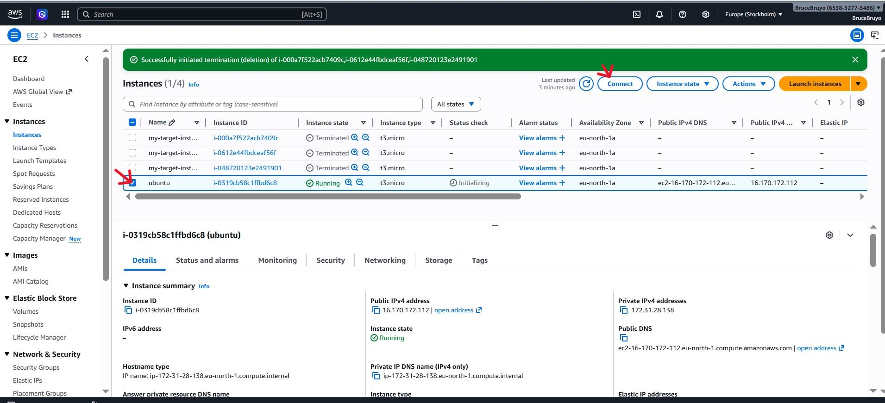

- Connect with ssh, copy the code and paste on your terminal.

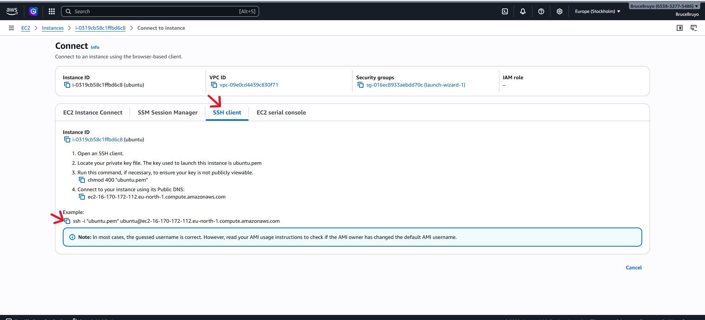

'ssh -i "ubuntu.pem" ubuntu@ec2-16-170-172-112.eu-north-1.compute.amazonaws.com'

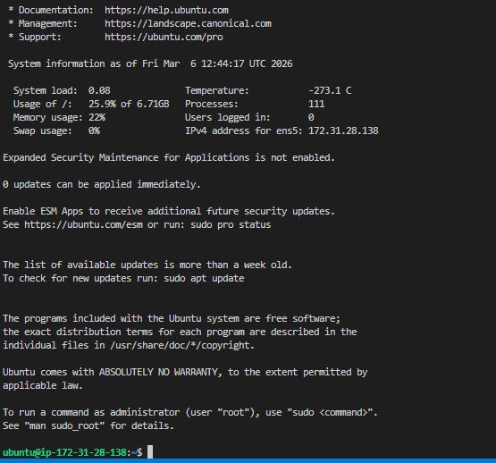

- Now let's first add docker's officail GPG key.

'sudo apt-get update'

This is a linux command that refreshes the package list on a Debian-based system, ensuring the latest software information is available for installation.

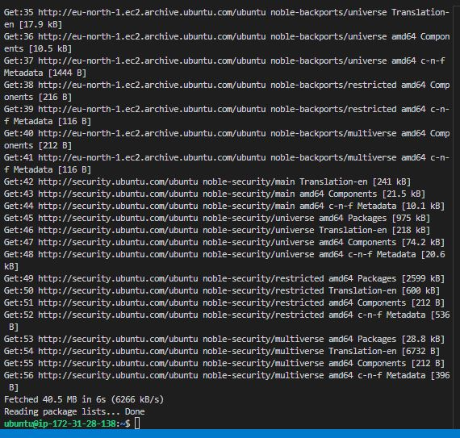

'sudo apt-get install ca-certificates curl gnupg'

This linux command installs essential packages including certificate authorities, a data transfer tool (curl), and the GNU Privacy Guard for secure communication and package verification.

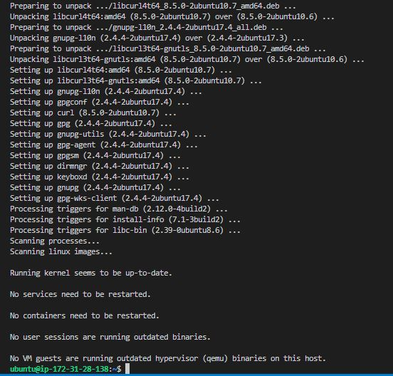

'sudo install -m 0755 -d /etc/apt/keyrings'

The command above creates a directory (/etc/apt/keyrings) with specific permissions (0755) for storing keyring files, which are used for docker's authentication.

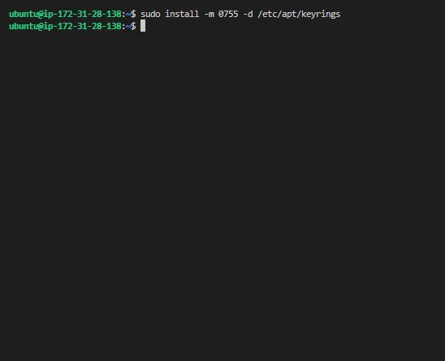

'curl -fsSL https://download.docker.com/linux/ubuntu/gpg | sudo gpg --dearmor -o /etc/apt/keyrings/docker.gpg'

This downloads the Docker GPG key using **'curl'**.

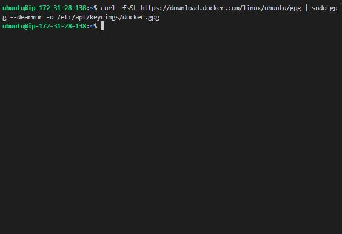

'sudo chmod a+r /etc/apt/keyrings/docker.gpg'

Sets read permissions for all users on the Docker GPG key file within the APT keyring directory.

**Let's add the repository to Apt sources**

'echo \
  "deb [arch=$(dpkg --print-architecture) signed-by=/etc/apt/keyrings/docker.gpg] https://download.docker.com/linux/ubuntu \
  $(. /etc/os-release && echo "$VERSION_CODENAME") stable" | \
  sudo tee /etc/apt/sources.list.d/docker.list > /dev/null'

The "echo" command creates a Docket APT repository configuration entry for the Ubuntu system, incorporating the system architecture and Docker GPG key, and  then "sudo tee /etc/apt/sources.list.d/docker.list > /dev/null" writes this configuration to the "/etc/apt/sources.list.d/docker.list" file.

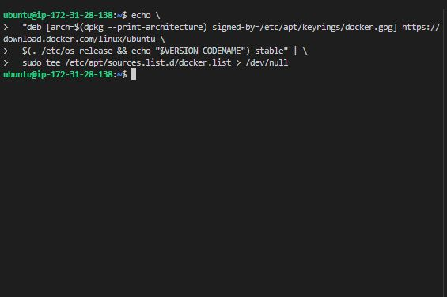

'sudo apt-get update'

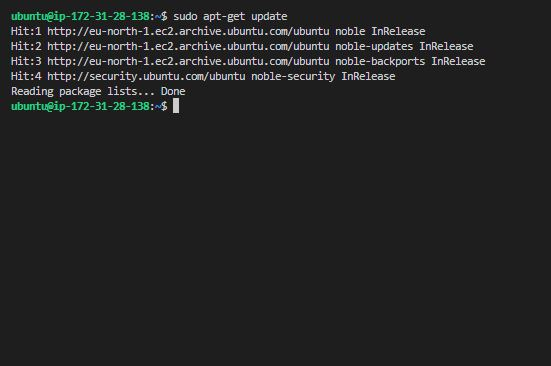 

- Install the latest version of docker.

'sudo apt-get install docker-ce docker-ce-cli containerd.io docker-buildx-plugin docker-compose-plugin'

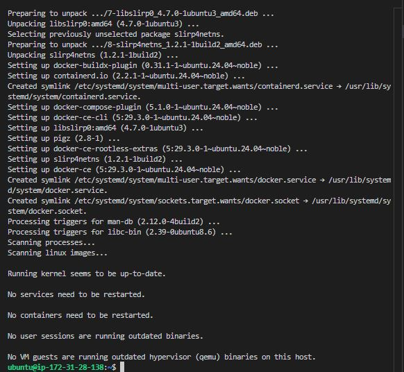

- Verify that docker has been successfully installed.

'sudo systemctl status docker'

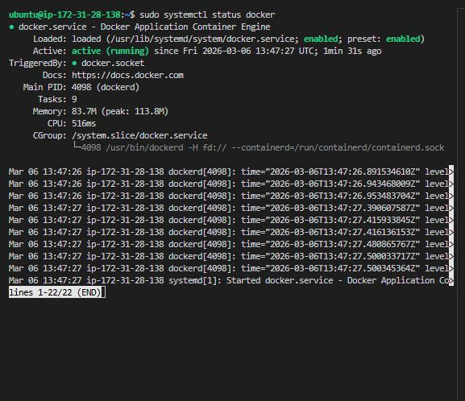

By default, after installing docker, it can only be run by root user **'sudo'** command. To run the docker without sudo execute the command below

'sudo usermod -aG docker ubuntu'

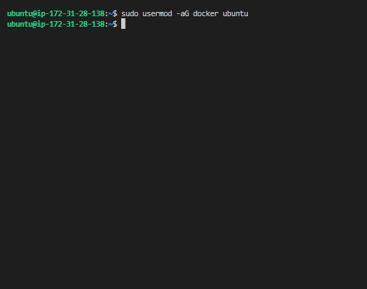

After executing the command above, we can run docker command without using superuser priviledges.

### Running the "Hello World" Container

**Using the 'docker run' Command**

The **'docker run'** command is the entry point to execute containers in Docker.  it allows you to create and start a container based on a specified Docker image. The most straightforward example is the "Hello World" container, a minimalistic container that prints a greeting message when executed.

- Run the "Hello World" container

'docker run hello-world'

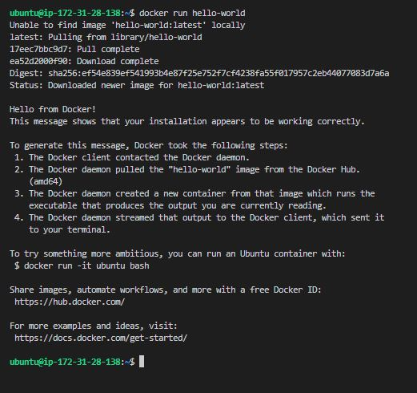

When you execute this command, Docker performs the following steps:

- **Pulls Image (if not available locally):** Docker checks if the **'hello-world'** image is availabe locally. If not, it automatically pulls it from the Docker Hub, a centralized repository for Docker Images. 

- **Creates a Container:** Docker creates a container based on the **'hello-world'** image. This container is an instance of the image with its own isolated filesystem and runtime environment.

- **Starts the Container:** The container is started, and it executes the predefined command in the **'hello-world'** image, which prints a friendly message.

### Understanding the Docker Image and Container Lifecycle.

**Docker Image:** A Docker image is a lightweight, standalone, and executable package that includes everything needed to run a piece of software, including the code, runtime, libraries, and system tools. Images are immutable, meaning they cannot be modified once created. Changes result in the creation of a new image.

- **Container Lifecycle:** Containers are running instances of Docker images.

- They have a lifecycle: **'create, start, stop, and delete'**.

- Once a container is created from an image, it can be started, and restarted.

**Verifying the Successful Execution**

You can check if the images is now in your local environment with Example Output:

'docker images'

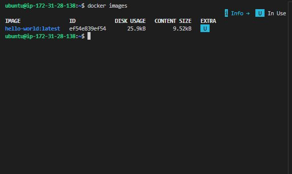

This simple "Hello World" example serves as a basic introduction to running containers with Docker. It helps verify that your Docker environment is set up correctly and provides insight into the image and container lifecycle. 

### Basic Docker Commands

**Docker Run**

The **'docker run'** command is fundamental for executing containers. It creates and starts a container based on a specified image.

- Run a container based on the "nginx" image

'docker run hello-world'

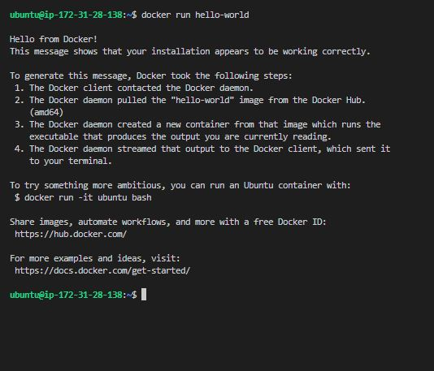

This example pulls the "nginx" image from Docker Hub (if not available locally) and starts a container using that image.

**Docker PS**

The **'docker ps'** command displays a list of running containers. This is useful for monitoring active containers and obtaining information such as container IDs, names, and status.

- List running containers

'docker ps'

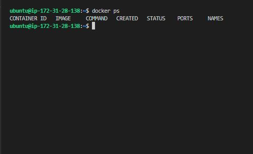

To view all containers, including those that have stopped, add the **'-a'** option:

- List all containers (running and stopped)

'docker ps -a'

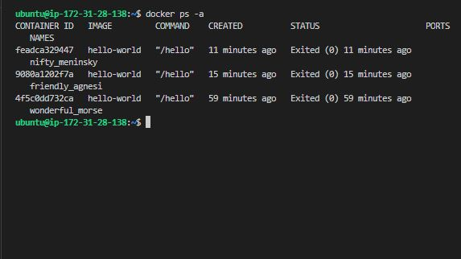

**Docker Stop**

The **'docker stop'** command halts a running container.

- Stop a running container (replace CONTAINER_ID with the actual container ID)

'docker stop 4f5c0dd732ca'

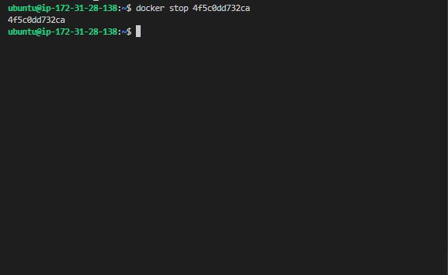

**Docker Pull**

The **'docker pull'** command downloads a Docker image from a registry, such as Docker Hub, to your local machine.

- Pull the latest version of the "ubuntu" image from Docker Hub

'docker pull ubuntu'

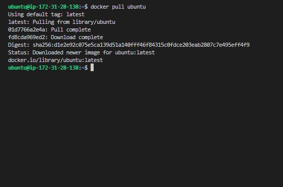

**Docker Push**

The **'docker push'** command uploads a local Docker image to a registry, making it available for others to pull.

- Push a local image to Docker Hub

'docker push your-username/image-name'

Ensure you've logged in to Docker Hub using **'docker login'** before pushing images.

**Docker Images**

The **'docker images'** command lists all locally available Docker images.

- List all local Docker images

'docker images'

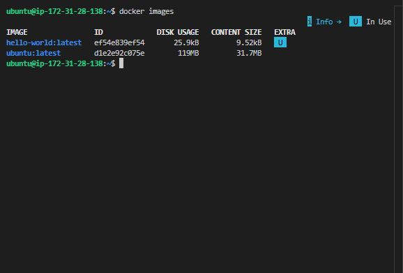

**Docker RMI**

The **'docker rmi"** command removes one or more images from the local machine.

- Remove a Docker image (replace IMAGE_ID with the actual image ID)

'docker rmi IMAGE_ID'

'docker rmi d1e2e92c075e'

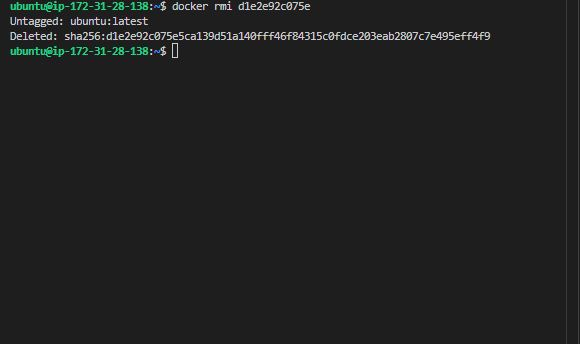

These basic Docker commands provide a foundation for working with containers. Understanding how to run, list, stop, pull, push, and manage Docker images is crucial for effective containerization and orchestration. As you delve deeper into Docker, you'll discover additional commands and features that enhance your ability to develop, deploy, and maintain containerized applications. 
