# Introduction to Helm Chart

## Project Review: Deploying a Web Application Using Helm in Kubernetes.

In this project, we will deploy a simple web application in a Kubernetes cluster using Helm. This project covers using Helm Charts, customizing deployments with templates and values, installing Helm, and integrating Helm into a basic CI/CD pipeline.

### Introductio into Helm

Helm is a package manager for Kubernetes applications. It simplifies the deployment and management of applications on Kubernetes by providing a way to define, install, and upgrade even the most complex Kubernetes applications. 

Inmagine you're a chef in a large, busy kitchen. In this scenaro, Kubernetes is the kitchen itself, equipped with all the necessary tools and stations, while the individual dishes you need to prepare are the applications. Now, Helm acts like a recipe book that only contains recipes but also automates the preparation process. Each Helm chart is a recipe, specifying ingredients (containers, services etc.) and the steps needed to create the dish (application). By uisng Helm, you're not just cooking one dish at a time, you're efficiently managing multiple dishes, ensuring each is prepared consistently and to the highest standard, no matter how busy the kitchn gets. This project will help you learn to be that efficient chef in the Kubernetes kitchen, making the process of deploying and managing applications as seamless as preparing a well-structured meal.

### Project Tasks

**Install Helm**

1. Open vscode:

- Run your vscode as an administrator.

- Access your CLI by opening the Terminal.

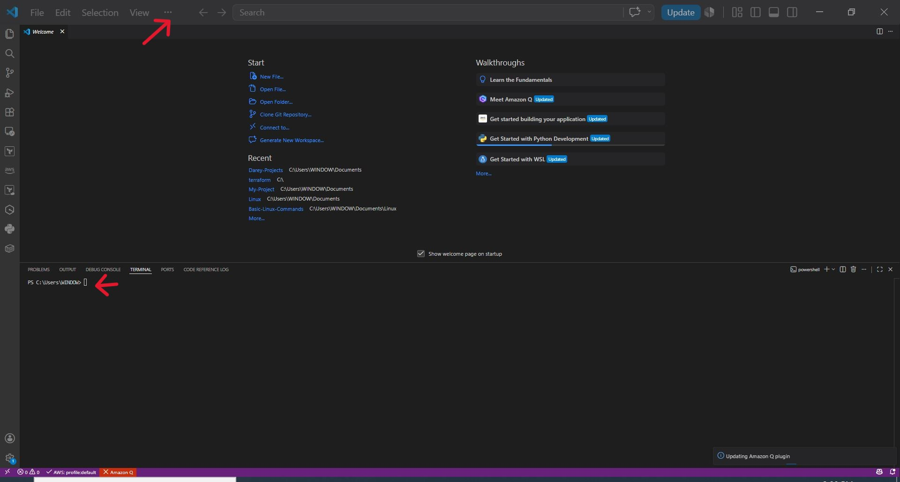

2. Download Helm:

- For linux, use **'curl'** to download Helm.

```bash
curl -L https://get.helm.sh/helm-v3.5.0-linux-amd64.tar.gz -o helm.tar.gz
```

- For macOS, use **'curl'** to download Helm.

```bash
curl -L https://get.helm.sh/helm-v3.5.0-darwin-amd64.tar.gz -o helm.tar.gz
```

Let's fix SSL verification;

```bash
curl -L --ssl-no-revoke \
  https://get.helm.sh/helm-v3.5.0-linux-amd64.tar.gz \
  -o helm.tar.gz
```

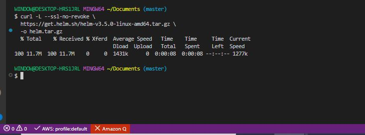

- For Windows, use winget to install Helm on Powershell;

```bash
winget install Helm.Helm
```

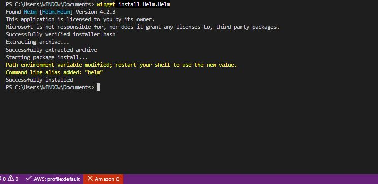

3. Extract the Downloaded File.

For Linux:

```bash
tar -zxvf helm.tar.gz
```

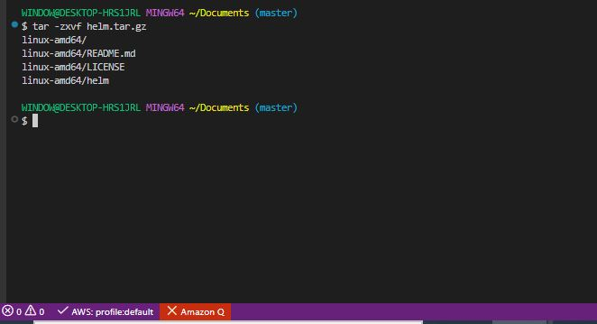

- For Windows, Find where Helm is installed:

```bash
Get-ChildItem "$env:LOCALAPPDATA\Microsoft\WinGet\Packages" -Filter helm.exe -Recurse -ErrorAction SilentlyContinue
```

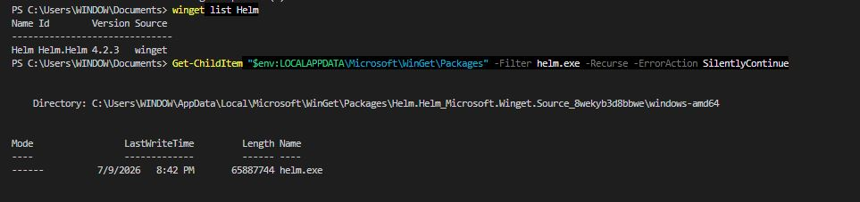


4. Move the Helm Binary.

- For linux:

```bash
mv linux-amd64/helm /usr/local/bin/helm
```

- For macOS:

```bash
mv darwin-amd64/helm /usr/local/bin/helm
```

Note:  Use **'sudo'** if necessary.


- For Windows, Add it to your PATH on Powershell and verify.

```bash
$env:Path += ";C:\Users\WINDOW\AppData\Local\Microsoft\WinGet\Packages\Helm.Helm_Microsoft.Winget.Source_8wekyb3d8bbwe\windows-amd64"
```


```bash
helm version
```

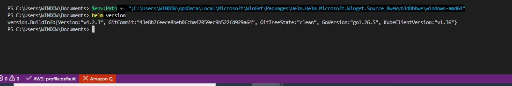

5. Clean up

- For linux,

```bash
rm helm.tar.gz && rm -r *-amd64
```

**Create a New Helm Chart**

Now that we have helm installed on our environment, let's create a helm chart.

- Create Project Directory:

```bash
mkdir helm-web-app

cd helm-web-app
```

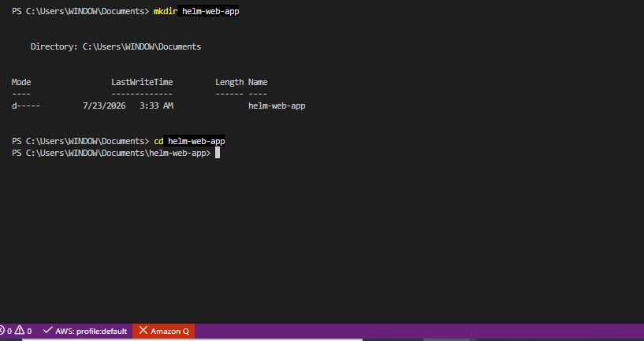

- Create a New Chart.

```bash
helm create webapp
```

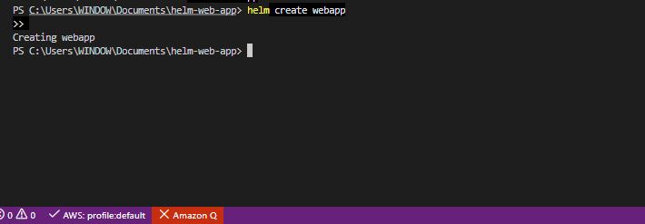

- Initialize a Git Repository:

```bash
git init
git add .
git commit -m "Initial Helm webapp chart"
```

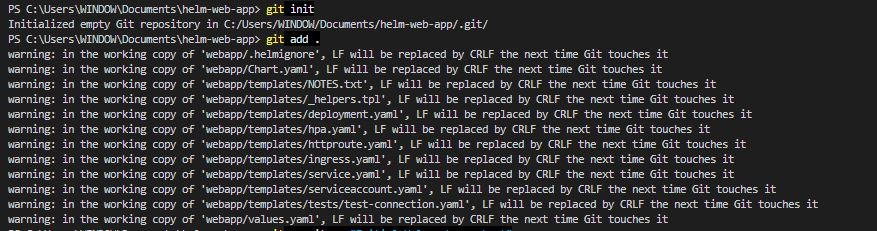

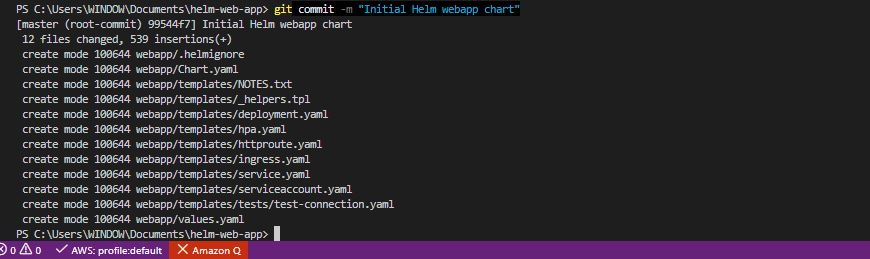

- Push to Remote Repository.

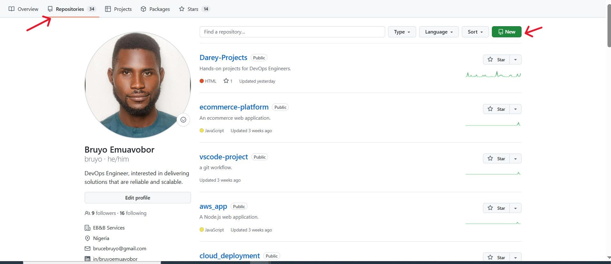

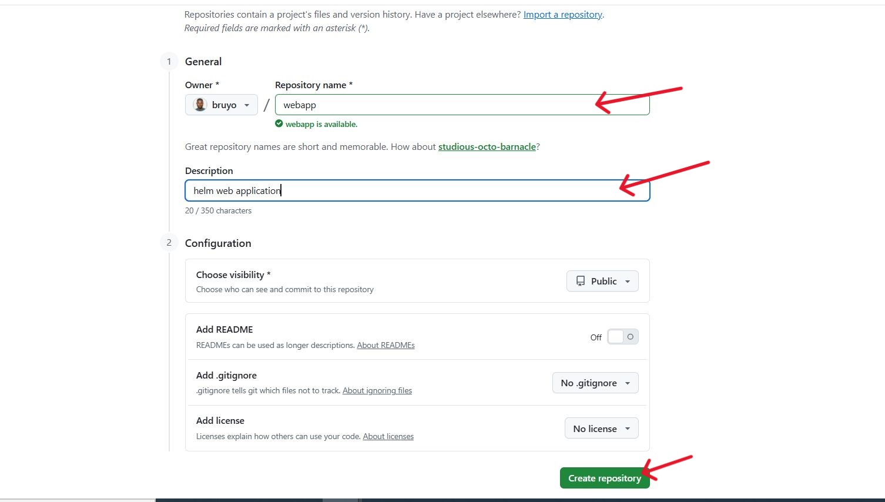

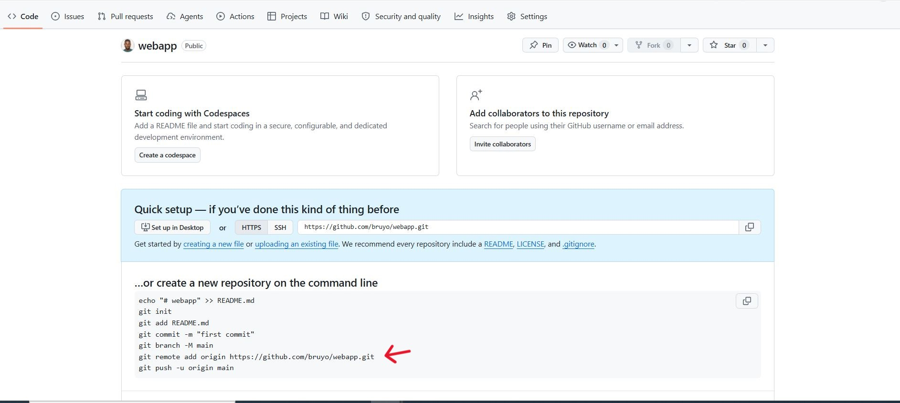

```bash
git remote add origin https://github.com/bruyo/webapp.git

git push -u origin main
```

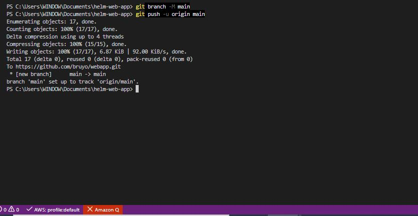

