# Jenkins Pipeline Job

## Project Review

### What is a Jenkins Pipeline Job

A Jenkins Pipeline Job is a way to define and automate a series of steps in the software delivery process. It allows you to  script and organize your entire build, test, and deployment. Jenkins pipelines enable organizations to define, visualize, and execute intricate build, test, and deployment processes as code. This facilitates the seamless integration of continuous integration and continuous delivery (CI/CD) practices into software development.

### Creating a Pipeline Job

Let's create our first pipeline job.

- From the dashboard menu on the left side, click on new item.

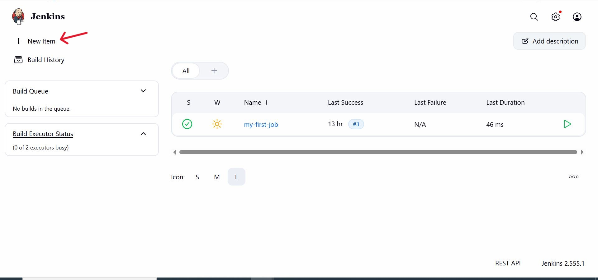

- Create a pipeline job and name it "my-pipeline-job".

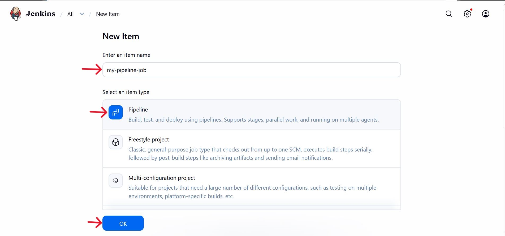

### Configuring Build Trigger

Like we did with the freestyle job project previously, we will create a build trigger for jenkins new build.

- Click on "Configure" your job and add this configurations.

- Click on build trigger to configure triggering the job from GitHub webhook.

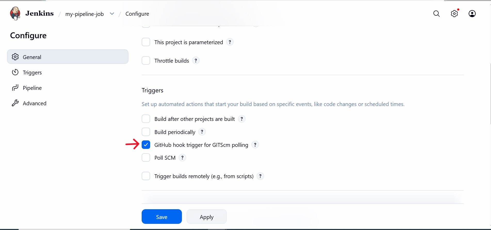

- Since we have already created a github webhook previously, we do not need to create another one again.

Now let's work on our pipeline script

### Writing Jenkins Pipeline Script

A jenkins pipeline script refers to a script that defines and orchestrates the steps and stages of a continuous integration and continuous delivery (CI/CD) pipeline. Jenkins pipelines can be defined using either declarative or scripted syntax. Declarative syntax is a more structured and concise way to define pipelines. It uses a domain-specific language to describe the pipeline stages, steps, and other configurations while scripted syntax provides more flexibility and is suitable for complex scripting requirements.

Let's write our pipeline script

```bash
pipeline {"\n    agent any\n\n    stages {\n        stage('Connect To Github') {\n            steps {\n                    checkout scmGit(branches: [[name: '*/main']], extensions: [], userRemoteConfigs: [[url: 'https://github.com/bruyo/jenkins-scm.git']])\n            "}
        }
        stage('Build Docker Image') {"\n            steps {\n                script {\n                    sh 'docker build -t dockerfile .'\n                "}
            }
        }
        stage('Run Docker Container') {"\n            steps {\n                script {\n                    sh 'docker run -itd -p 8081:80 dockerfile'\n                "}
            }
        }
    }
}
```

**Explanation of the script above**

The provided Jenkins pipeline script defines a series of stages for a continuous integration and continuous delivery (CI/CD) process. Let's breakdown each stage:

- **Agent Configuration:**

```bash
agent any
```

Specifices that the pipeline can run any available agent (an agent can either be a jenkins master or node). This means the pipeline is not tied to a specific node type.

- **Stages:**

```bash
stages {"\n      // Stages go here\n   "}
```

Defines the various stages of the pipeline, each representing a phase in the software delivery process.

- **Stages 1: Connect to GitHub:**

```bash
stage('Connect To Github') {"\n      steps {\n         checkout scmGit(branches: [[name: '*/main']], extensions: [], userRemoteConfigs: [[url: 'https://github.com/bruyo/jenkins-scm.git']])\n      "}
}
```

- This stage checks out the source code from a GitHub repository ('https://github.com/bruyo/jenkins-scm.git').

- It specificies that the pipeline should use the 'main' branch.

- **Stages 2: Build Docker Image:**

```bash
stage('Build Docker Image') {"\n      steps {\n         script {\n            sh 'docker build -t dockerfile .'\n         "}
   }
}
```

- This stage builds a Docker image named 'dockerfile' using the source code obtained from the GitHub repository.

- The 'docker build' command is executed using the shell ('sh').

- **Stages 3: Run Docker Container:**

```bash
stage('Run Docker Container') {"\n      steps {\n         script {\n            sh 'docker run -itd --name nginx -p 8081:80 dockerfile'\n         "}
   }
}
```

- This stage runs a Docker container named 'nginx' in detached mode ('-itd').

- The container is mapped to port 8081 on the host machine ('-p 8081:80').

- The Docker image used is the one built in the previous stage ('dockerfile').

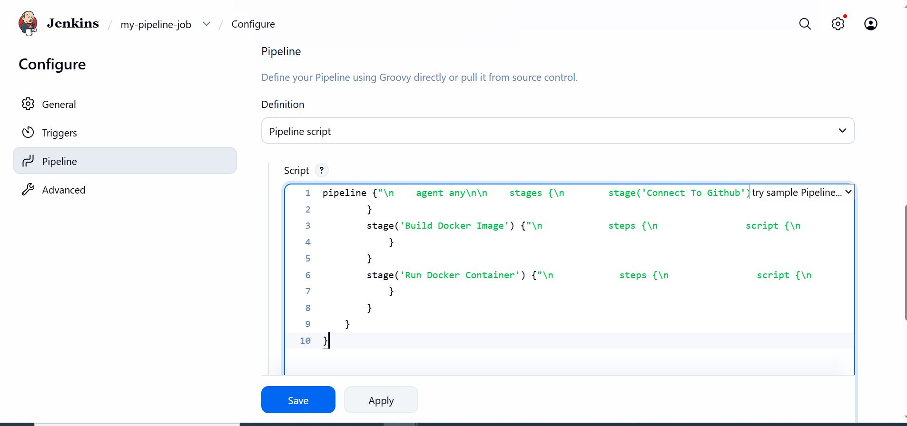

The stage 1 of the script connects jenkins to github repository. To generate syntax for github repository, follow the steps below:

- Click on the pipeline syntax.

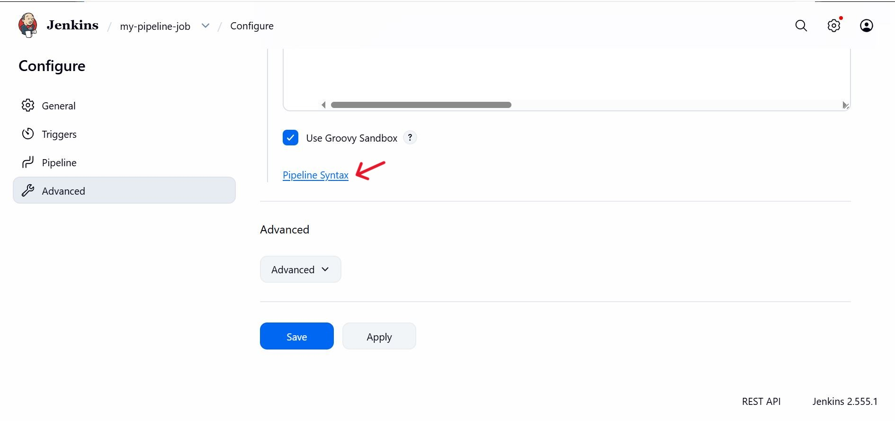

- Select the drop down to search for **'checkout: Check out from version control'**

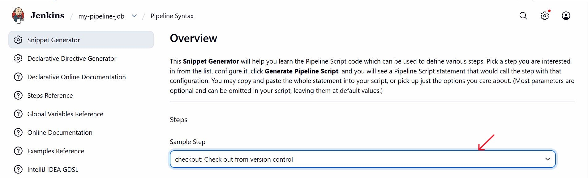

- Paste the repository url and make sure your branch is main.

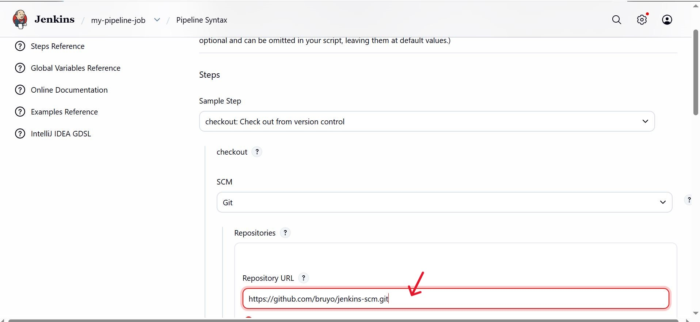

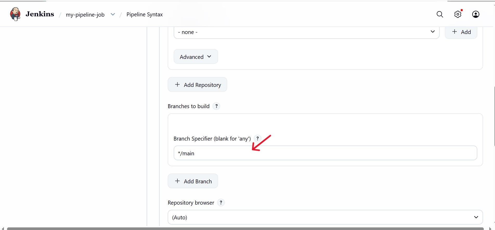

- Generate the pipeline script

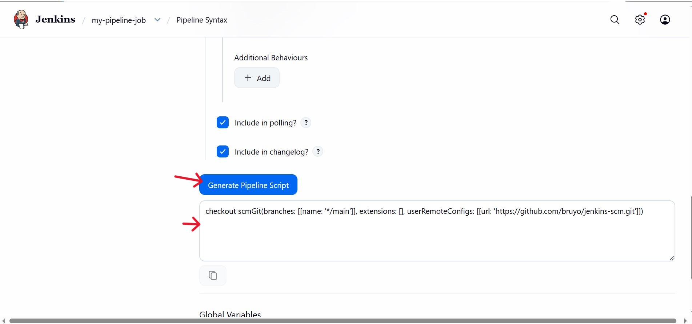

Now you can replace the generated script for connect jenkins with github.

### Install Docker

Before jenkins can run docker commands, we need to install docker on the same instance jenkins was installed. From our shell scripting knowledge, let's install docker with shell script.

- Create a file named docker.sh

```bash
nano docker.sh
```

- Open the file and paste the script below

```bash
# Update system
sudo yum update -y

# Install Docker
sudo yum install docker -y

# Start Docker service
sudo systemctl start docker

# Enable Docker on boot
sudo systemctl enable docker

# Add ec2-user to docker group
sudo usermod -aG docker ec2-user

# Verify Docker status
sudo systemctl status docker

# Verify Docker version
docker --version

```

- Save and close the file.


- Make the file executable.

```bash
chmod u+x docker.sh
```

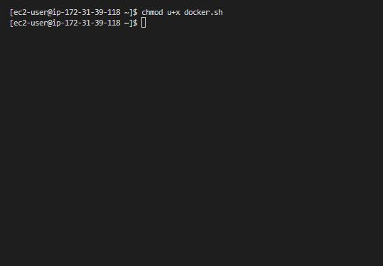

- Execute the file.

```bash
./docker.sh
```


we have successfully installed docker.

### Building Pipeline Script

Now that we have docker installed on the same instance with jenkins, we need to create a dockerfile before we can run our pipeline script. 

- Create a new file named **'dockerfile'**.

```bash
nano dockerfile
```

- Paste the code snippet below in the file.

```bash
# Use official NGINX image
FROM nginx:latest

# Set working directory
WORKDIR /usr/share/nginx/html

# Remove default NGINX static files
RUN rm -rf ./*

# Copy application files
COPY index.html .

# Expose web port
EXPOSE 80

# Start NGINX
CMD ["nginx", "-g", "daemon off;"]
```

- Create an **'index.html'** file and paste the content below.

```bash
nano index.html
```

```bash
Congratulations, You have successfully run your first pipeline code.
```

Pushing these files 'dockerfile' and 'index.html' will trigger jenkins to automatically run new build for our pipeline.

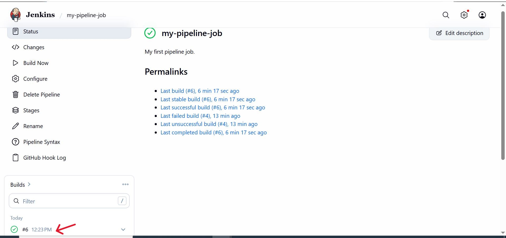

- To access the content of 'index.html' on the web browser, you need to first edit inbound rules and open the port we mapped our container to (8081)

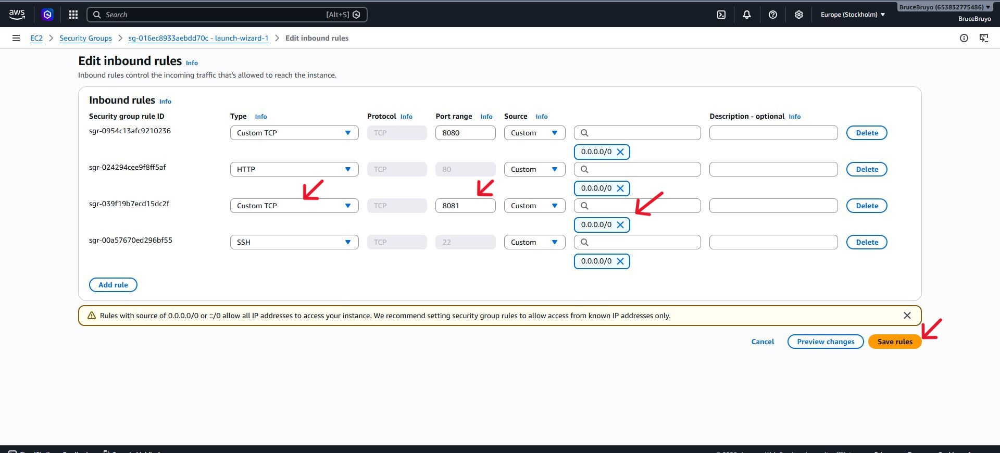

- We can now access the content of index.html on our web brower.

```bash
http://13.61.104.56:8081
```

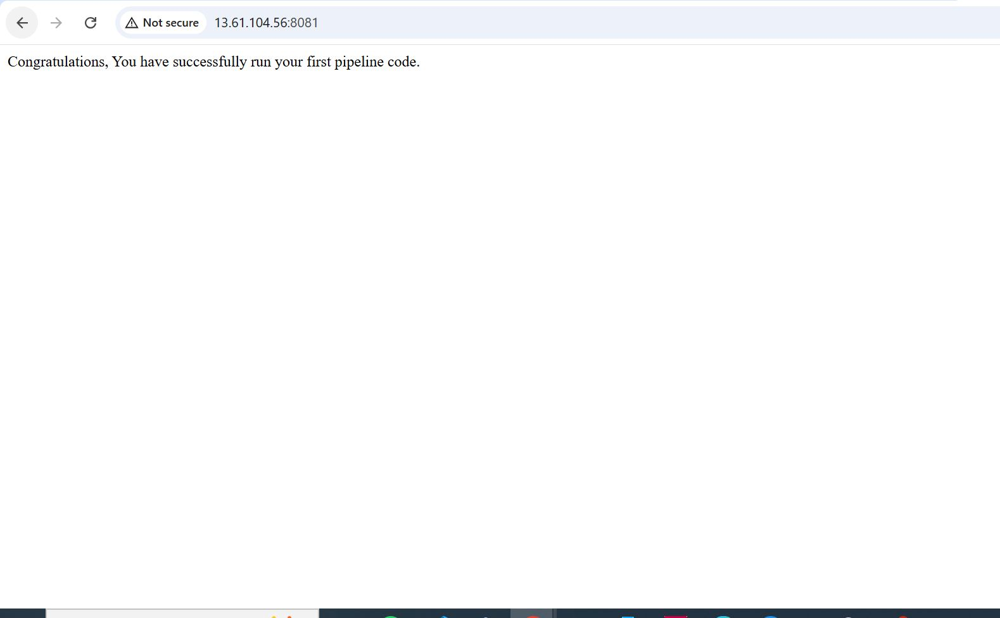


