# Introduction of Jenkins

## Project Reviews

We will explore how Jenkins simplifies and streamlines your development workflows, empowering you to build, test, and deploy software with ease.

### Introduction to CICD

Continuous Integration and Continuous Delivery (CI/CD) is a set of best practices and methodologies that revolutionize the software development lifecycle by enhancing efficiency, reliability, and speed. CI/CD represents a seamless integration of automation and collaboration throughout the development process, aiming to deliver high-quality software consistently and rapidly. 

In the realm of CI, developers regularly integrate their code changes into a shared repository, triggering automated builds and tests to detect integration issues early. On the other hand, CD encompasses both Continuous Delivery and Continuous Deployment, ensuring that software is always in a deployable state and automating the deployment process for swift and reliable releases. The CI/CD pipeline fosters a culture of continuous improvement, allowing development teams to iterate quickly, reduce manual interventions, and deliver software with confidence.

### What is Jenkins?

Jenkins is widely employed as a crucial CI/CD tool for automating software development processes. Teams utilize Jenkins to automate building, testing, and deploying applications, streamlining the development lifecycle. With Jenkins pipeline, developers can define, version and execute entire workflows as code, ensuring consistent and reproducible builds. Integration with version control systems allows Jenkins to trigger builds automatically upon code changes, facilitating early detection of issues and enabling teams to deliver high-quality software at a faster pace. Jenkins' flexibility, extensibility through plugins, and support for various tools make it a preferred choice for organizations aiming to implement efficient and automated DevOps practices.

### Task

**Getting Started with Jenkins**

1. Let's install jenkins.

- Update package repositories.

'sudo apt update'

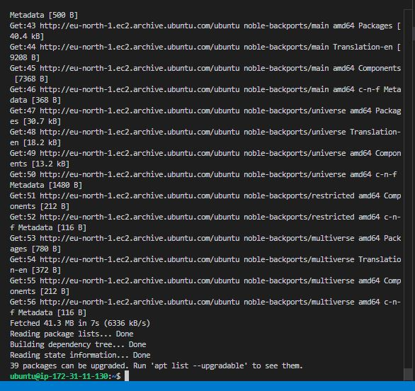

- Install JDK

'sudo apt install default-jdk-headless'

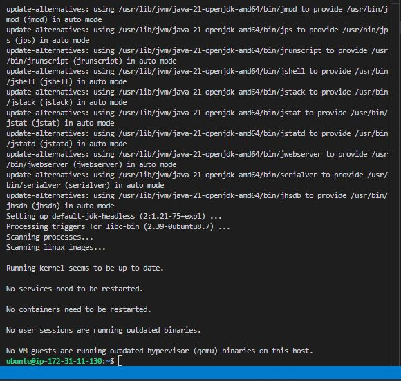

- Install Jenkins.

'    wget -q -O - https://pkg.jenkins.io/debian-stable/jenkins.io.key | sudo apt-key add -
    sudo sh -c 'echo deb https://pkg.jenkins.io/debian-stable binary/ > \
    /etc/apt/sources.list.d/jenkins.list'
    sudo apt update
    sudo apt-get install jenkins'

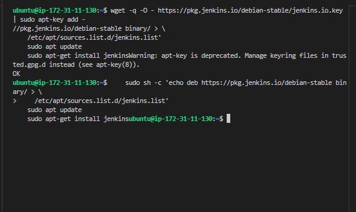

The command installs Jenkins. It involves importing the Jenkins GPG key for package verification, adding the Jenkins repository to the system's source, updating package lists, and finally, installing Jenkins through the package manager (apt-get).

- Check if jenkins has been installed, and it is up and running.

'sudo systemctl status jenkins'

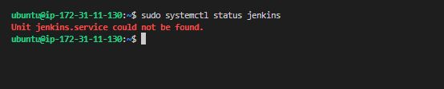

Let's resolve this:

- Confirm ALL Jenkins repo files.

'ls /etc/apt/sources.list.d/'

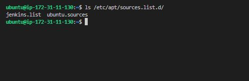

- Remove ALL Jenkins configs.

'sudo rm -f /etc/apt/sources.list.d/jenkins.*'

'sudo rm -f /usr/share/keyrings/jenkins-keyring.asc'

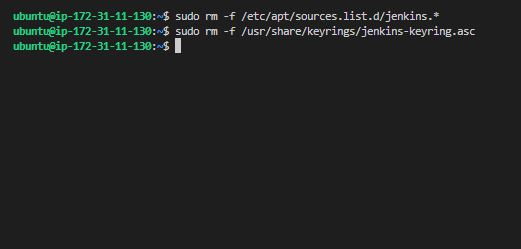

- Fix the .sources file properly.

'sudo nano /etc/apt/sources.list.d/jenkins.sources'

'Types: deb
URIs: https://pkg.jenkins.io/debian
Suites: binary/
Components:
Signed-By: /usr/share/keyrings/jenkins-keyring.asc'

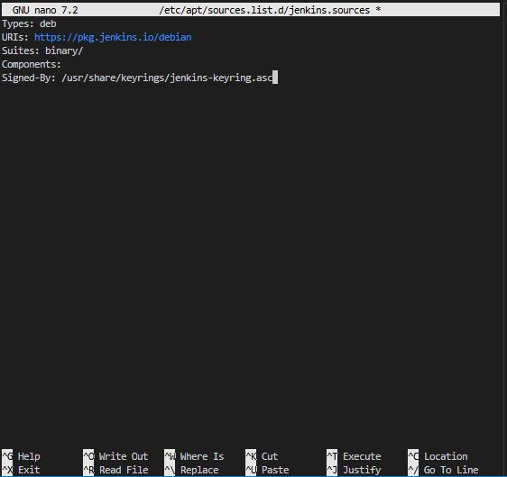

- Remove everything Jenkins-related (clean reset).

'sudo rm -f /etc/apt/sources.list.d/jenkins.list'

'sudo rm -f /etc/apt/sources.list.d/jenkins.sources'

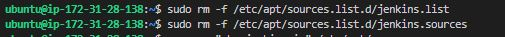

- Make sure nothing is left.

'grep -r "pkg.jenkins.io" /etc/apt/'

- Update.

'sudo apt update'

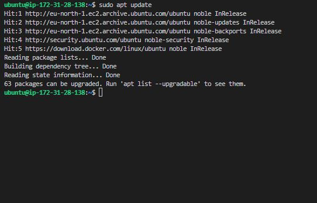

- Re-add Jenkins properly.

- Add key.

'curl -fsSL https://pkg.jenkins.io/debian/jenkins.io-2023.key | sudo tee \'

'/usr/share/keyrings/jenkins-keyring.asc > /dev/null'

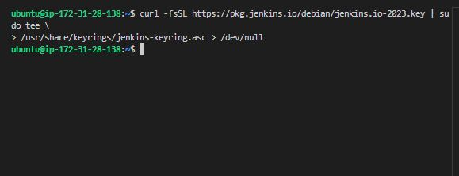

- Add repo.

'echo "deb [signed-by=/usr/share/keyrings/jenkins-keyring.asc] https://pkg.jenkins.io/debian binary/" | \'

'sudo tee /etc/apt/sources.list.d/jenkins.list'

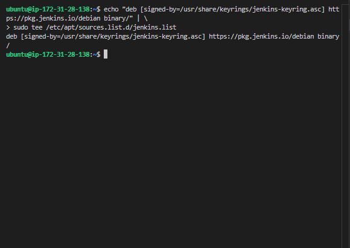

- Update.

'sudo apt update'

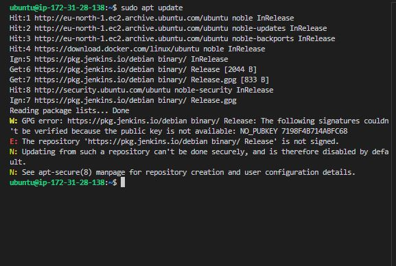

- Let's pinpoint the exact hidden file still causing the issue.

'grep -r "jenkins" /etc/apt/'

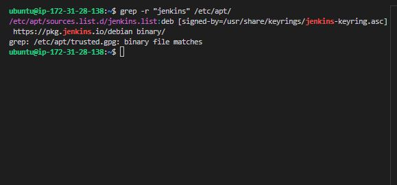

Now we can see that we still have the file '/etc/apt/sources.list.d/jenkins.list', even though it looks correct, the error is NO_PUBKEY 7198F4B714ABFC68 which means the key file it references is either:

- missing.
- empty.
- corrupted.

- Remove ALL Jenkins-related files.

'sudo rm -f /etc/apt/sources.list.d/jenkins.*'

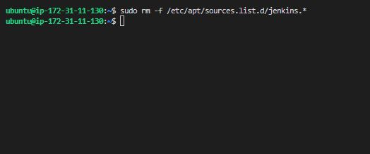

- Recreate the key properly.

'sudo rm -f /usr/share/keyrings/jenkins-keyring.asc'

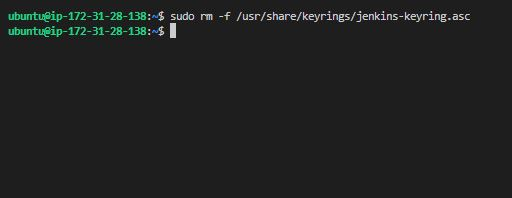

- Clear APT cache.

'sudo rm -rf /var/lib/apt/lists/*'

- Let's now add it again.

'curl -fsSL https://pkg.jenkins.io/debian-stable/jenkins.io.key | \'

'sudo gpg --dearmor -o /usr/share/keyrings/jenkins-keyring.asc'

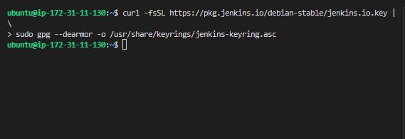

- Fix permissions.

'sudo chmod 644 /usr/share/keyrings/jenkins-keyring.asc'

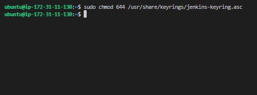

- Confirm the repo file is correct.

'sudo nano /etc/apt/sources.list.d/jenkins.list'

'deb [signed-by=/usr/share/keyrings/jenkins-keyring.asc] https://pkg.jenkins.io/debian-stable binary/'

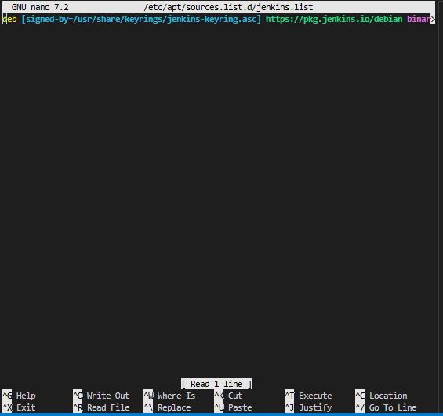

- Update again.

'sudo apt update'

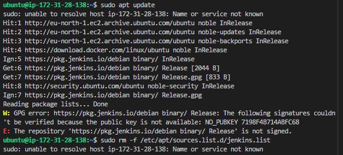

This is a hostname resolution problem not Jenkins.

- Check your hostname.

'hostname'

- Fix /etc/hosts.

'sudo nano /etc/hosts'

127.0.0.1 localhost
127.0.1.1 ip-172-31-28-138 (replace with hostname)

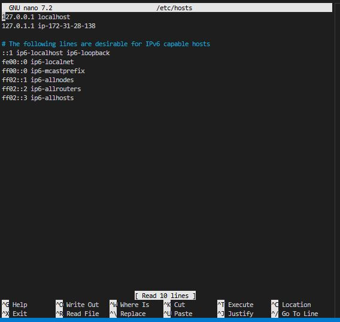

- Then test.

'sudo ls'

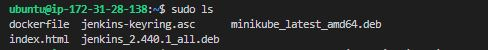

- Update.

'sudo apt update'

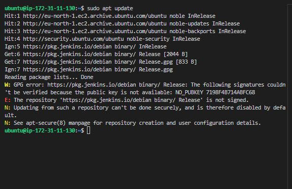

**We’ll bypass the broken repo completely and install Jenkins directly.**

- Install Java (required)

'sudo apt install openjdk-17-jdk -y'

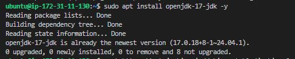

- Download Jenkins .deb package directly.

'wget https://get.jenkins.io/debian-stable/jenkins_2.452.1_all.deb'

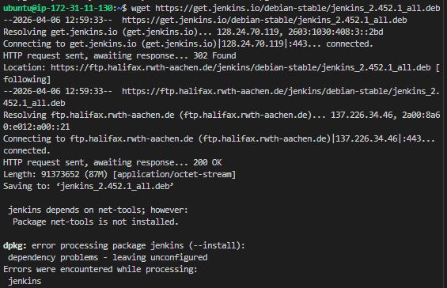

- Install it.

'sudo dpkg -i jenkins_2.452.1_all.deb'

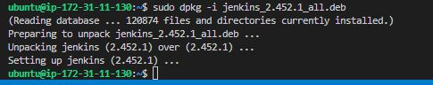

'sudo apt -f install -y'

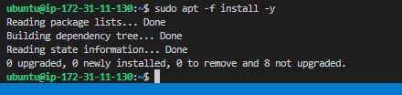

- Start Jenkins.

'sudo systemctl start jenkins'

'sudo systemctl enable jenkins'

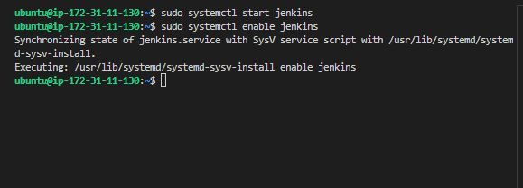

- Let's check if jenkins has been installed, and it is up and running.

'sudo systemctl status jenkins'

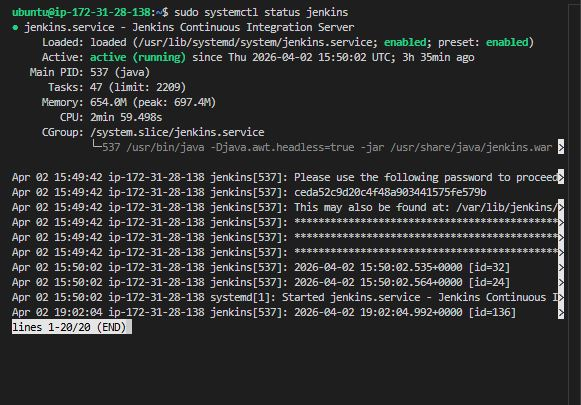

On our Jenkins, create a new inbound rule for port 8080 in the security group. By default, jenkins listens on port 8080, we need to create an inbound rule for this in the security group of our jenkins instance.

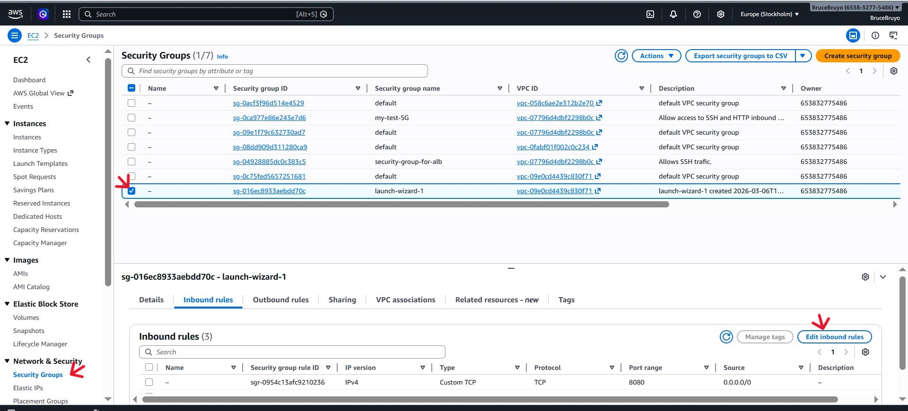

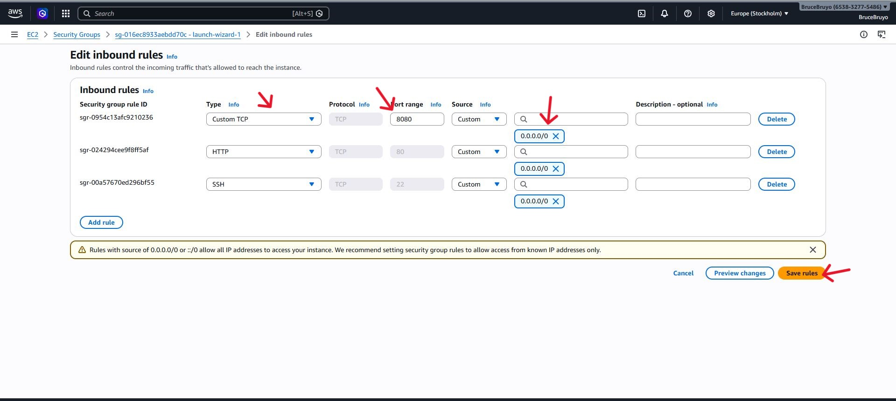

2. **Set up Jenkins on the Web Console**

- Input your jenkins instance ip addresses on the browser i.e http://public_ip_address:8080.

'http://51.20.118.129:8080'

- On the Jenkins instance, check "/var/lib/jenkins/secrets/initialAdminPassword" to know your password.

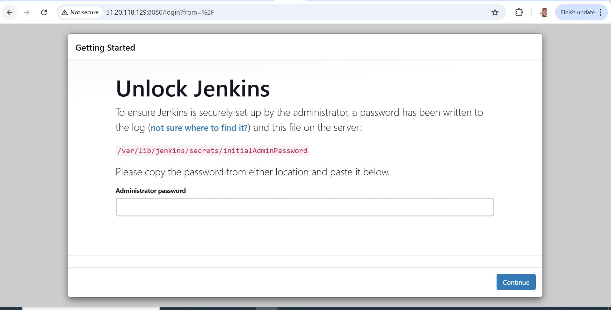

'sudo cat /var/lib/jenkins/secrets/initialAdminPassword'

- Install suggested plugins.

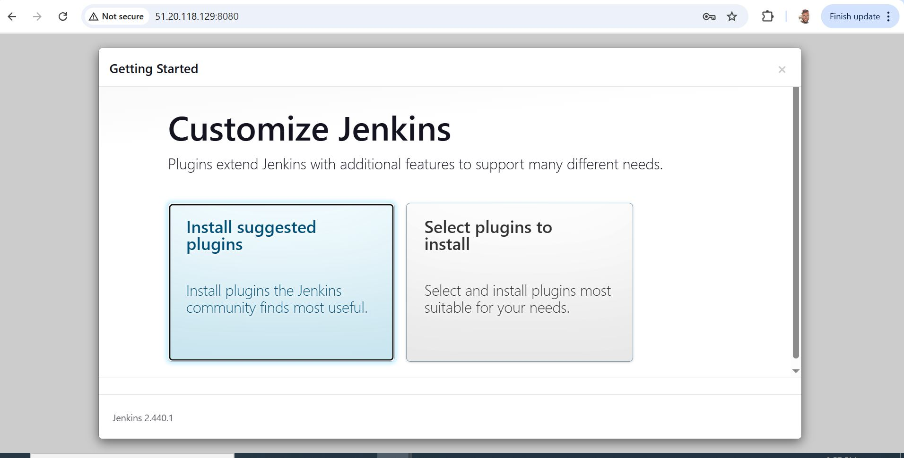

- Create a user account.

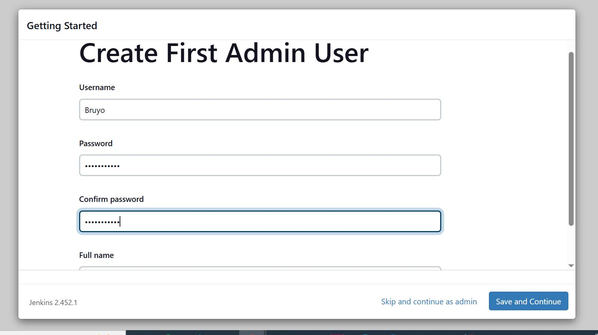

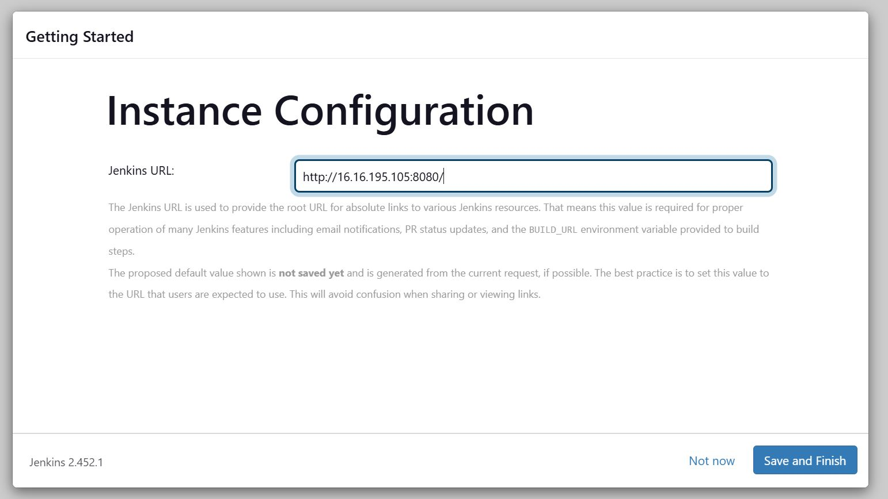

- Log in to jenkins console.

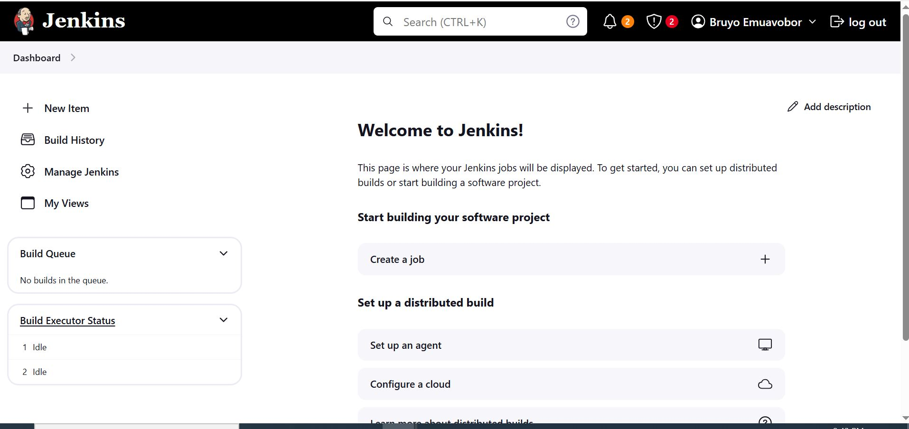
