# Jenkins Job

## Project Review

In Jenkins, a job is a unit of work or a task that can be executed by the Jenkins automation server.

A Jenkins job represents a specific task or set of tasks that needs to be performed as part of a build or deployment process. Jobs in jenkins are created to automate the execution of various steps such as compiling code, running tests, packaging applications, and deploying them to servers. Each Jenkins job is configured with a series of build steps, post-build actions, and other settings that define how the job should be executed.

### Task (Creating a Freestyle Project)

- From the dashboard menu on the left side, click on new item.

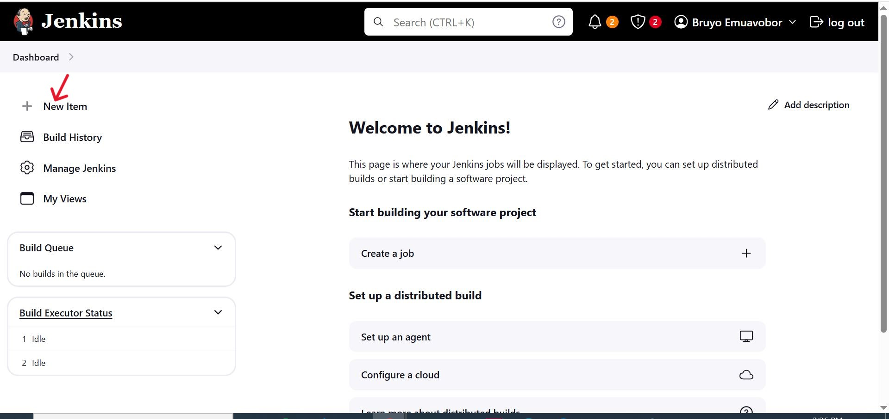

- Create a freestyle project and name it "my-first-job".

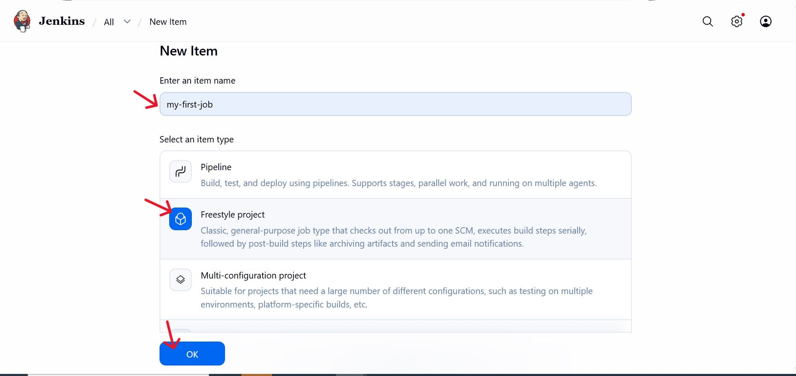

- Set up configuration and save.

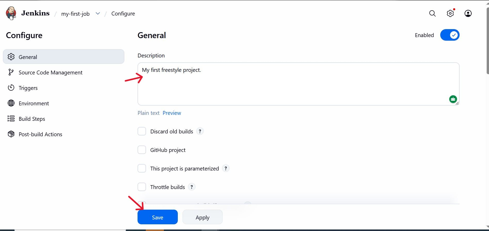

**Connecting Jenkins to our Source Code Management**

Now, that we have created a freestyle project, let's connect jenkins with github.

- Create a new github repository called jenkins-scm with github.

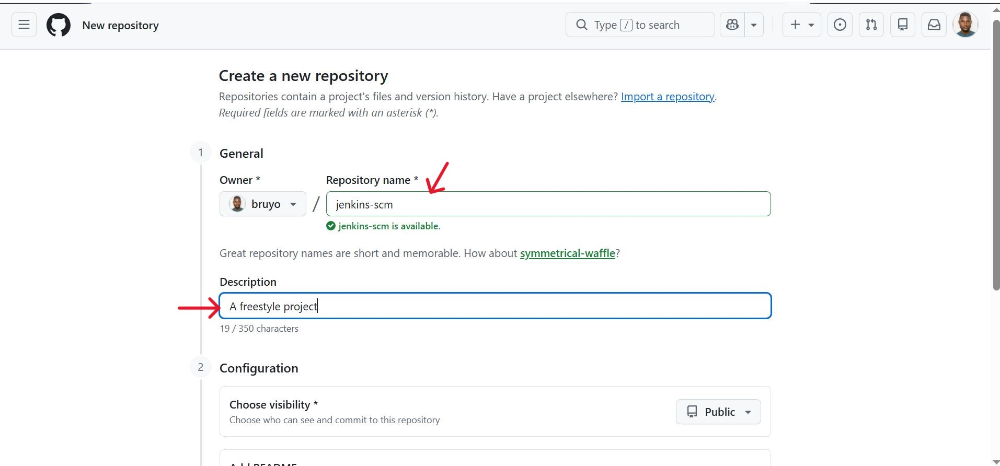

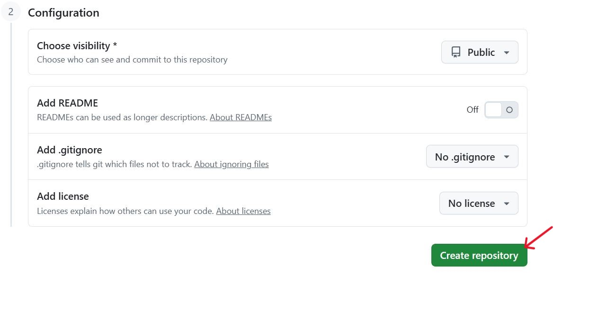

- Connect **'jenkins'** to **'jenkins-scm'** repository by pasting the repository url in the area selected below. Make sure your current branch is main.

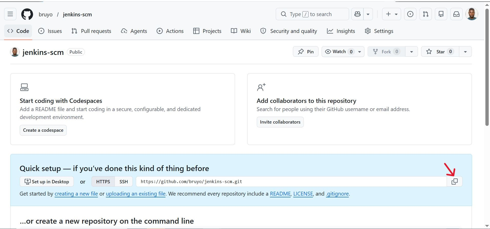

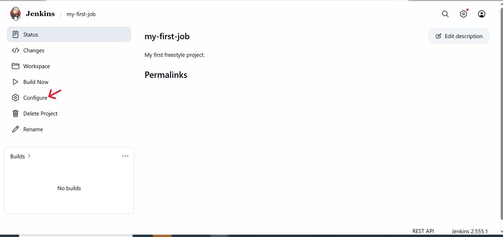

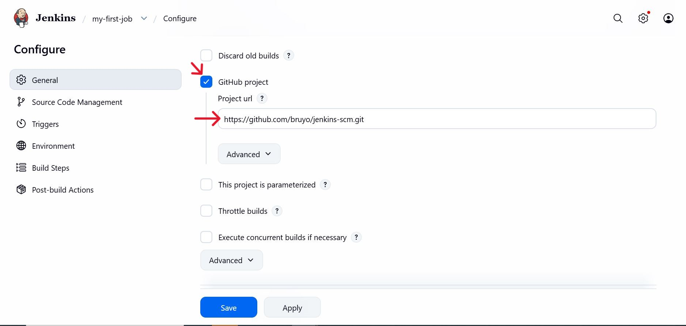

**Configuring Build Trigger**

As an engineer, we need to automate things and make our work easier in possible ways. We have connected **'jenkins'** to **'jenkins-scm'**, but we cannot run a new build by clicking on 'build now'. To eliminate this, we need to configure a build trigger to the jenkins job. With this, jenkins will run a new build anytime a change is made to the github repository.

- Click "Configure" your job and add this configuartions.

- Click on build trigger to configure triggering the job from GitHub webhook.

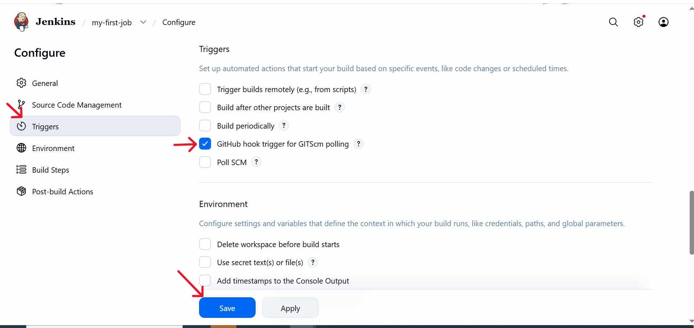

- Save the configuration and run 'build now' to connect jenkins to the repository.

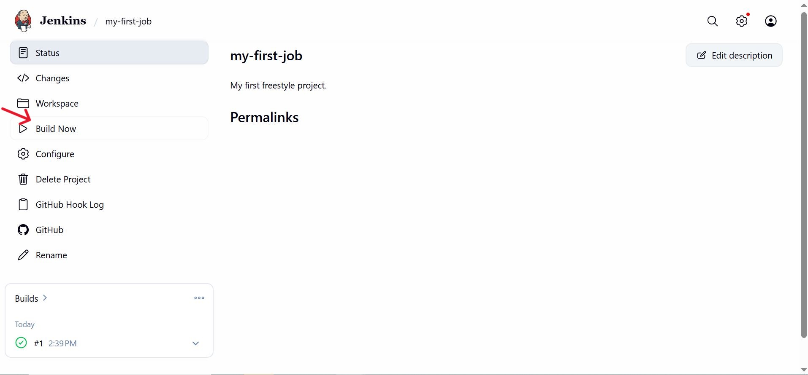

- Create a github webhook using jenkins ip address and port.

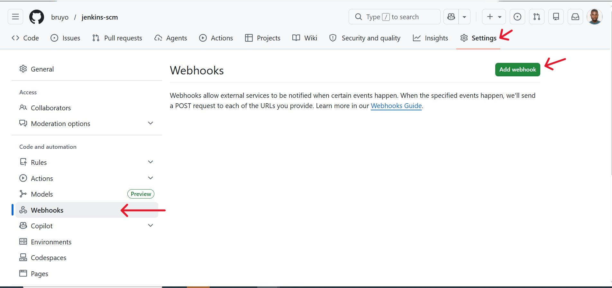

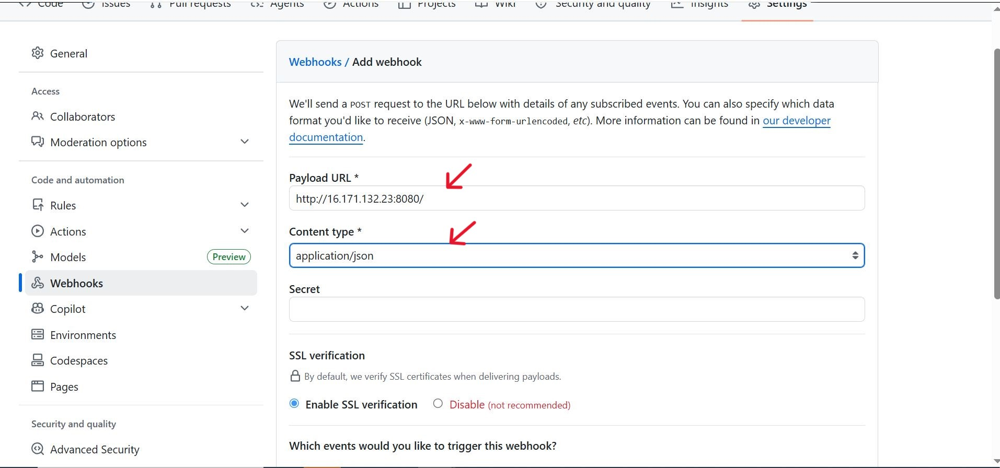

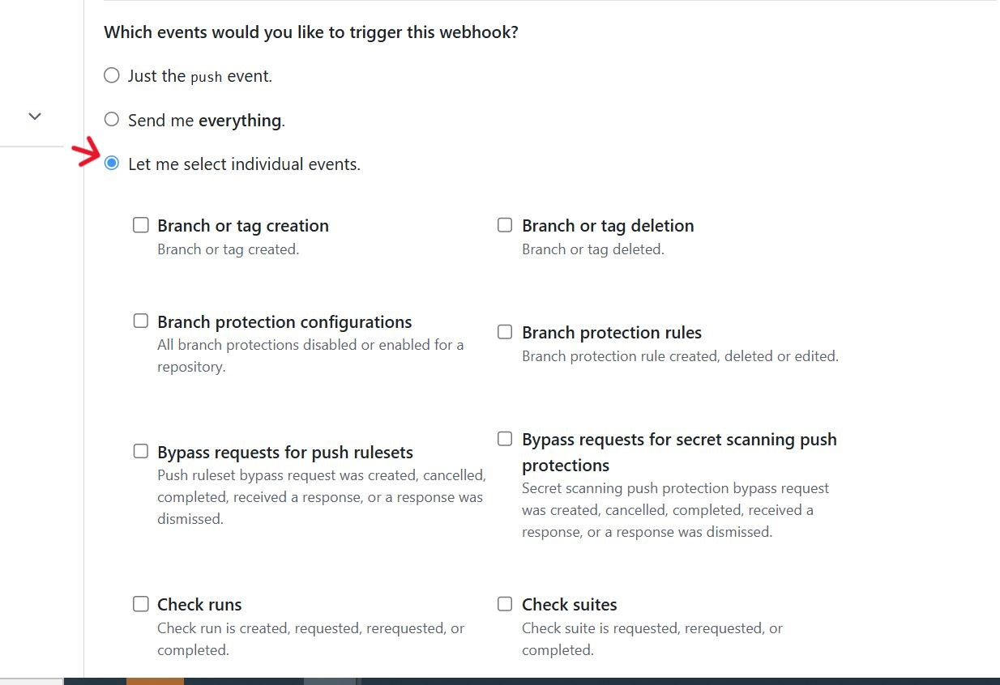

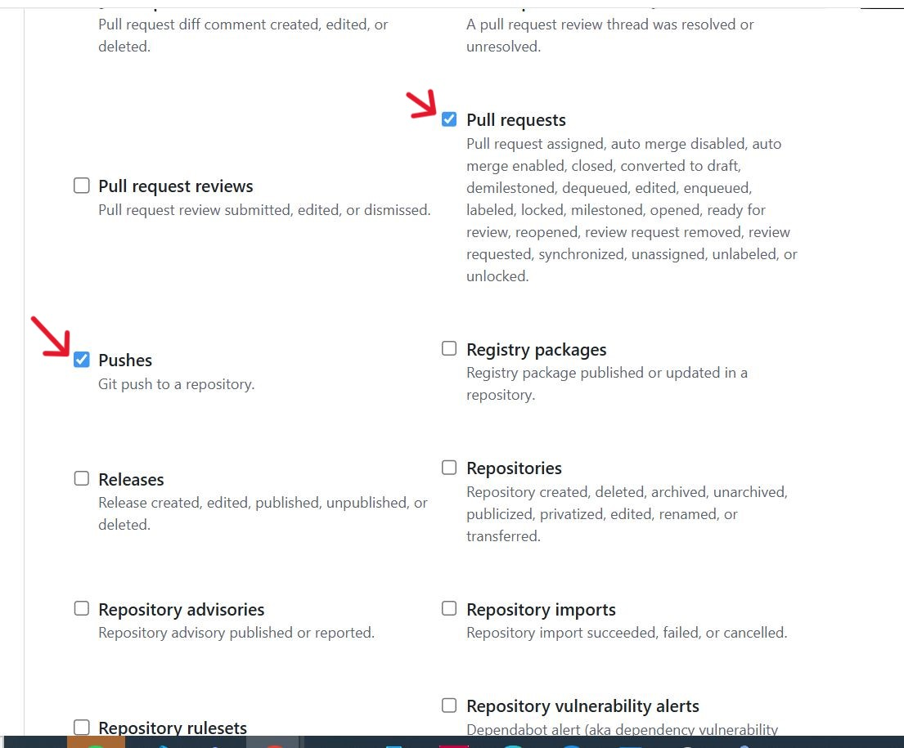

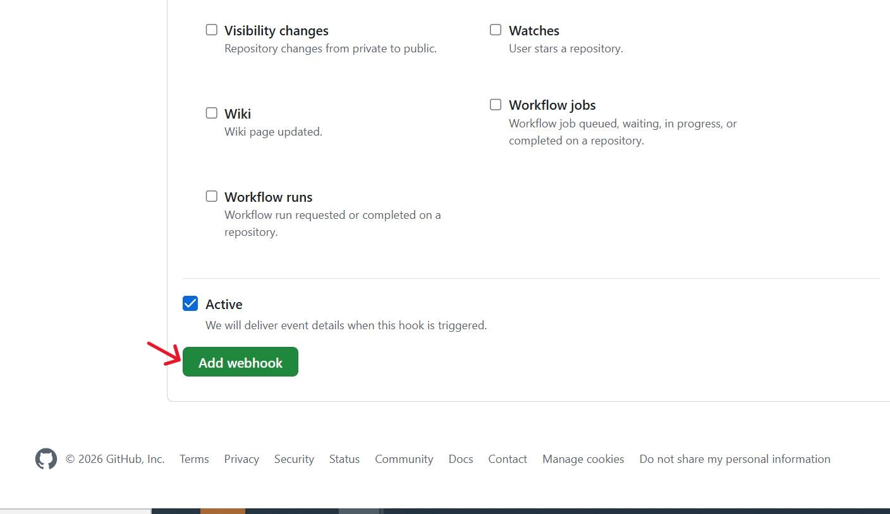

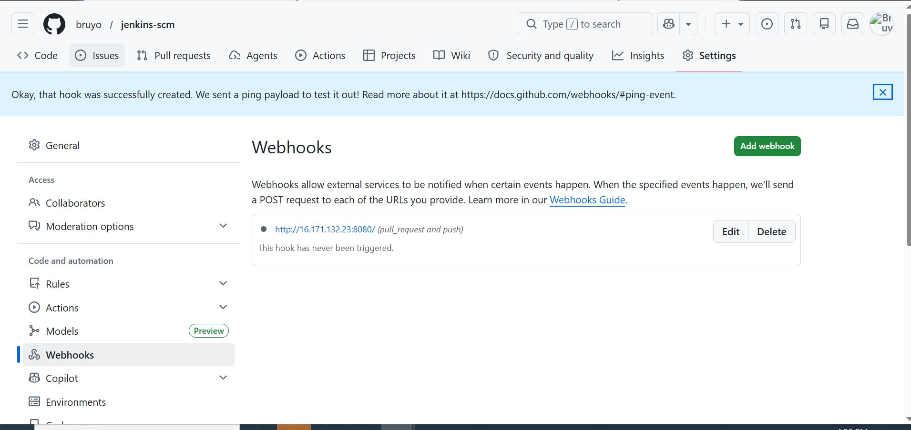

Now, we can go ahead to make some changes in any file in the GitHub repository and push the changes to the master branch.

- Clone your repository to your local computer and create a "README.md" file.

- Push to the GitHub repository.

'''git clone https://github.com/bruyo/jenkins-scm.git'''

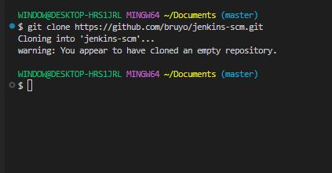

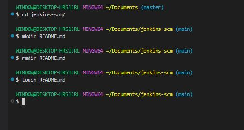

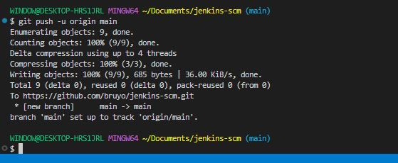

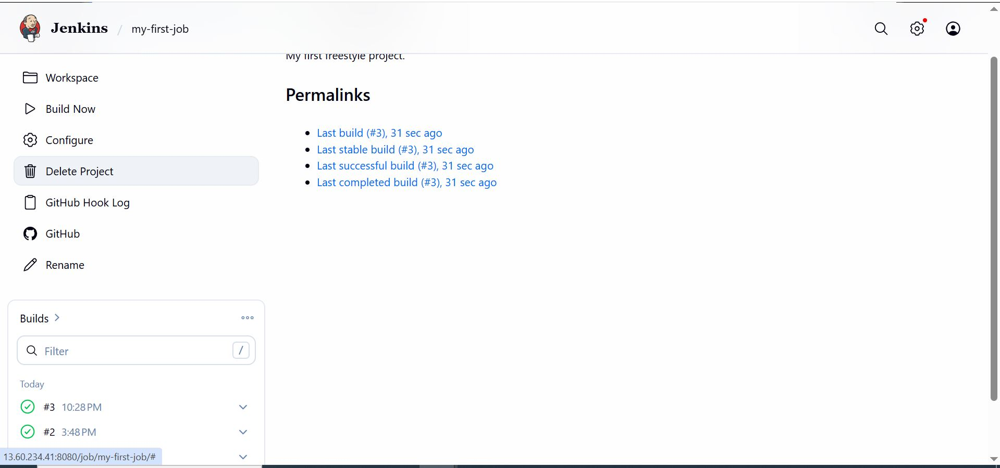

 