# Setting up Minikube

## Project Overview

In this project, we will gain comprehensive understanding of Kubernetes, and its fundamental concepts, master the usage of Minikube for local Kubernetes cluster deployment and experimentation, acquire hands-on experience with Docker, understanding containerization principles and how to create, manage, and distribute containerized applications and build, and deploy applications on minikube.

### Container Orchestration with Kubernetes

Imagine orchestrating a vibrant culinary event with various chefs preparing different dishes. Container orchestration, seamlessly coordinates each chef (container) to ensure the perfcet serving, timing, and overall dining experience. Just as a skilled event planner brings order to choas, Kubernetes, a notable orchestrator, orchestrates containers, making it the go-to choice for managing the intricate dance modern applications. Container orchestration is a critical aspect of managing and scaling containerized applications efficiently. It involves automating deployment, scaling, and operations of containerized applications, ensuring seamless coordination among multiple containers to deliver high availability and optimal performance. One widely used container orchestration tool is kubernetes. Developed by Google, Kubernetes has become the de facto standard for automating the deployment, scaling, and management of conterized applications.

### What is Kubernetes?

Kubernetes is an open-source container orchestration platform that automates the deployment, scaling, and management of contanerized applications. Developed by Google and later open-sourced, kubernetes is widely adopted for its ability to streamline and automate the deployment, scaling, and management of containerized applications in a highly efficient and consistent manner. It provides a centralized platform that abstracts away the complexities of distributed systems, offering features such as automated load balancing, self-healing capabilities, and seamless rolling updates. 

### Components of Kubernetes

- **Control Plane or Master Node:** The control plane, often referred to as the master node, is the brain of a Kubernetes cluster. It manages the entire cluster, making high-level decisions about the state of the system. Components like the API Server, Scheduler, Controller Manager, and etcd (key-value state for cluster data) constitute the control plane.

- **Nodes:** Nodes are individual machines within a kubernetes cluster responsible for running containerized applications. Each node is equipped with a container runtime (e.g Docker), a kubelet (communicates with the master and manages containers on the node), and a kube-proxy (maintains network rules). Nodes execute and manage containers, distribute workloads, and communicate with the control plane to maintain the desired state of the system. The collaboration of multiple nodes creates scalable and resilient environment, forming the foundation for deploying and orchestrating containerized applications in Kubernetes.

- **Pods:** Pods are the fundamental deployment units in Kubernetes, representing one or more closely related containers that share the same network namespace, storage, and set of specifications. Containers within a Pod work together and are scheduled to run on the same node. Pods encapsulate the basic building blocks for deploying for deploying and scaling applications, fostering tight communication between co-located containers.

- **Containers:** Containers in Kubernetes encapsulate and package applications, along with their dependencies and runtime environment, ensuring consistency across various computing environments. Leveraging containerization technology, such as Docker, containers provide lightweight, portable, and efficient way to deploy and run applications. In Kubernetes, containers are organized into Pods, the smallest deployable units.

- **API Server:** The API server is the contol plane component in Kubernetes that serves as the front end for the Kunernetes control plane. It exposes the Kubernetes API, allowing users, other components, and external entities to interact with the cluster, managing resources, and initiating various actions.

- **Contoller Manager:** The Controller Manager is a contol plane component in Kubernetes responsible for maintaining the desired state of the cluster. It includes various controllers that watch the state of the cluster through the API Server and take corrective actions to ensure that the actual state aligns with the desired state.

- **Scheduler:** The Scheduler is a control plane component in Kubernetes that assigns workloads to node in the cluster based on resource requrements, constraints, and availability. It plays a crucial role in distributing workloads evenly and efficiently across the worker nodes, optimizing resource utilization.

- **etcd:** etcd is a distributed key-value store that acts as the cluster's single source of truth for all persistent cluster data. In Kubernetes, etcd is used to store configuration details, state information, and metadata, providing a reliable and consistent data store that ensures the integrity of the cluster information.

- **Kubelet:** The kubelet is a vital component in Kubernetes running each nodes in the cluster. It communicates with the Kubernetes control plane, specifically the API Server, to ensure that containers are running in a Pod as expected. Kubelet plays a key role in managing the containers on a node, handling tasks such as starting, stopping, and monitoring container processes based on the specifications received from the control plane.

- **kube-proxy:** Kube-proxy or Kubernetes Proxy, is responsible for maintaining network rules on nodes. It enables communication between Pods and external entities, handling network routing and ensuring that the correct network policies are applied.

### Minikube

Minikube is an open-source tool that enables us to run Kubernetes clusters locally on our machines. As we now know that Kubernetes is a container orchestration platform that automates the deployment, scaling, and management of containerized applications. Minikube streamlines the creation of a local Kubernetes environment, providing a user-friendly playground where we can safely build and test applications before deploying them to a production setting.

### Task

### Getting Started with Minikube

1. Installing Minikube on Windows.

- Go to the windows search bar and launch a terminal with administrative access.

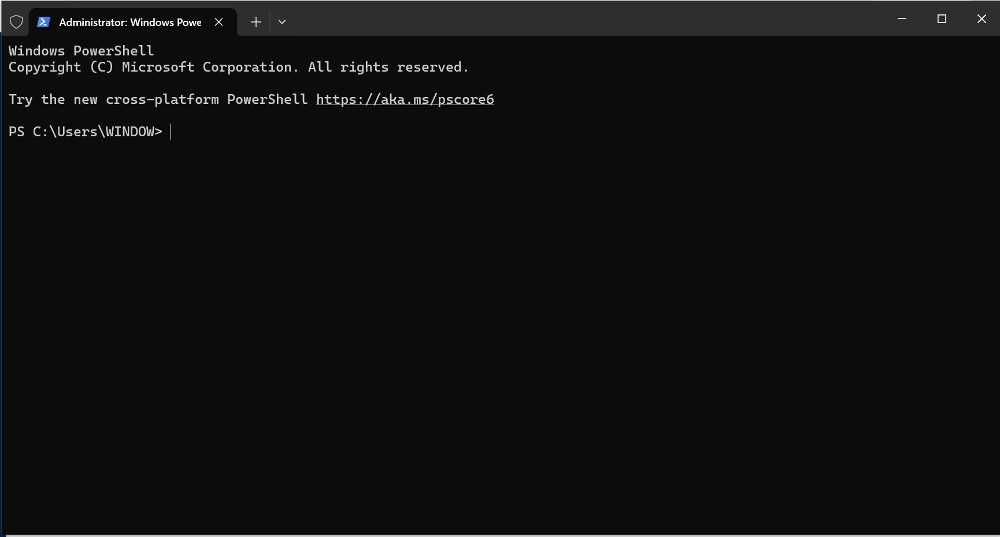

- Install Minikube.

'choco install minikube'

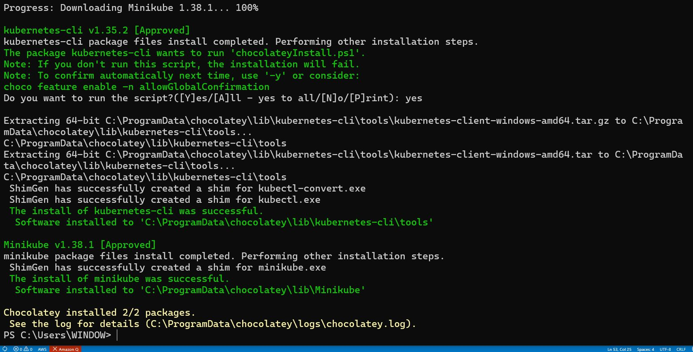

- Minikube needs docker as a driver and also to pull it's base image, therefore we need to install docker desktop for windows.

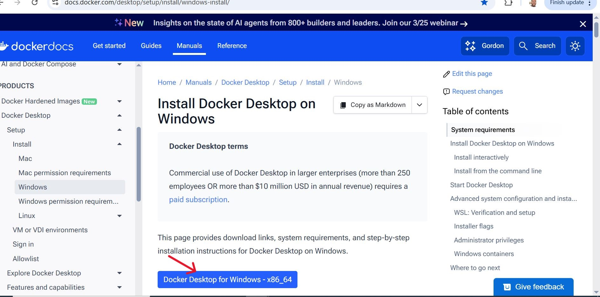

- Run the command below to start minikube using docker as the driver.

'minikube start --driver=docker'

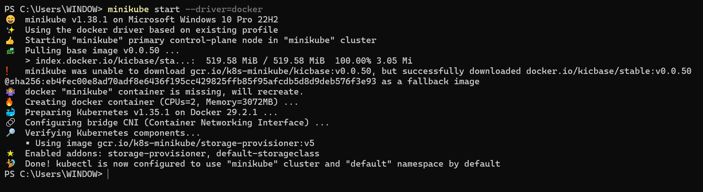

Ensure that docker is running in your local machine by using the code below.

'docker ps'

if not running use this:

'Get-Service *docker*'

'Start-Service com.docker.service'

'Restart-Service com.docker.service'

### Installing Minikube on Linux

For linux users, let's install minikube.

- Launch a terminal with administrative access.

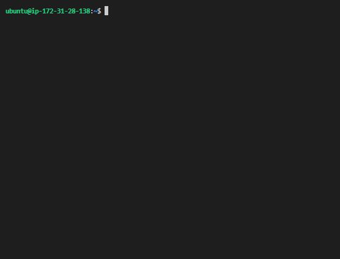

- We need to install docker as a driver for minikube and also for minikube to pull base images for the kubernetes cluster.

'sudo apt-get update'

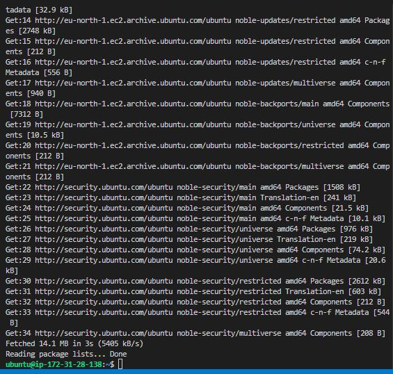

This is a linux command that refreshes the packages list on a Debian-based system, ensuring the latest software information is available for installation.

'sudo apt-get install ca-certificates curl gnupg'

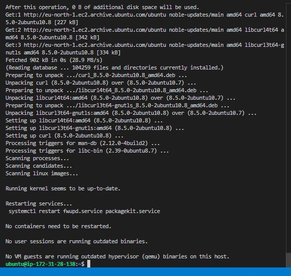

This is a linux command installs essential packages including certificate authorities, a data transfer tool (curl), and the GNU Privacy Guard for secure communication and package verification.

'sudo install -m 0755 -d /etc/apt/keyrings'

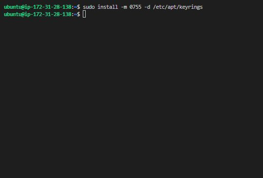

The command above creates a directory (/etc/apt/keyrings) with specific permissions (0755) for storing keyring files, which are used for docker's authentication.

'curl -fsSL https://download.docker.com/linux/ubuntu/gpg | sudo gpg --dearmor -o /etc/apt/keyrings/docker.gpg'

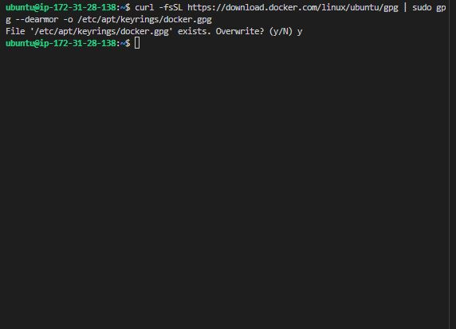

This downloads the Docker GPG key using **'curl'**.

'sudo chmod a+r /etc/apt/keyrings/docker.gpg'

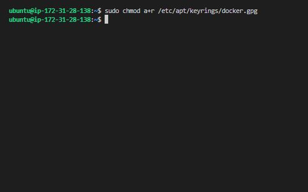

**Let's add the repository to Apt sources**

echo \
  "deb [arch=$(dpkg --print-architecture) signed-by=/etc/apt/keyrings/docker.gpg] https://download.docker.com/linux/ubuntu \
  $(. /etc/os-release && echo "$VERSION_CODENAME") stable" | \
  sudo tee /etc/apt/sources.list.d/docker.list > /dev/null

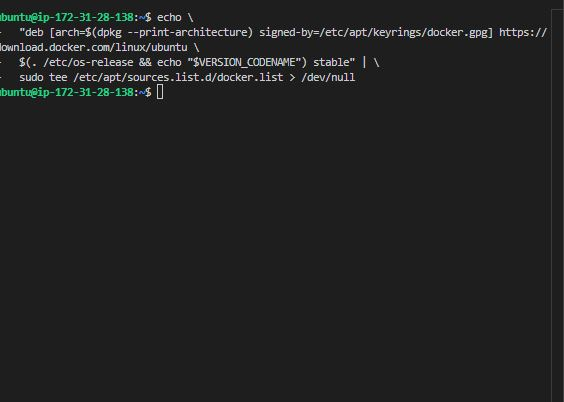

The "echo" command creates a Docket APT repository configuration entry for the Ubuntu system, incorporating the system architecture and Docker GPG key, and  then "sudo tee /etc/apt/sources.list.d/docker.list > /dev/null" writes this configuration to the "/etc/apt/sources.list.d/docker.list" file.

'sudo apt-get update'

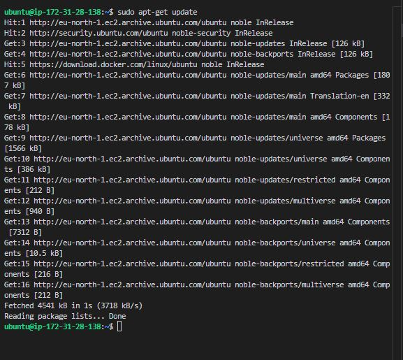

- Install the latest version of docker.

'sudo apt-get install docker-ce docker-ce-cli containerd.io docker-buildx-plugin docker-compose-plugin'

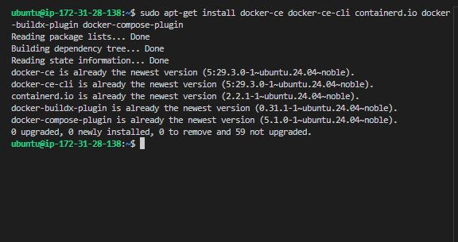

- Verify that docker has been successfully installed.

'sudo systemctl status docker'

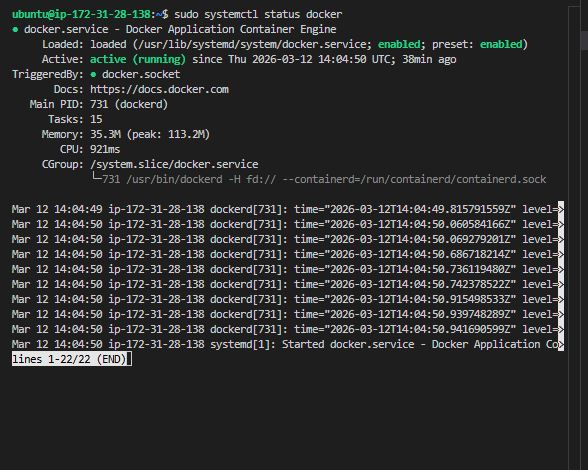

- Install minikube.

'curl -LO https://storage.googleapis.com/minikube/releases/latest/minikube_latest_amd64.deb'

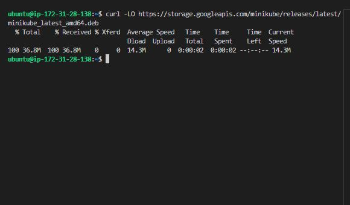

'sudo dpkg -i minikube_latest_amd64.deb'

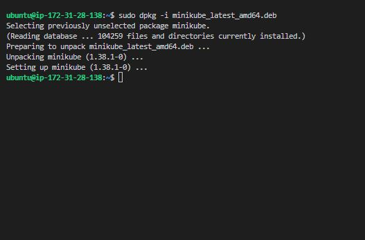

The command above downloads minikube's binary and install minikube using dpkg.

- Start minikube.

'minikube start --driver=docker'

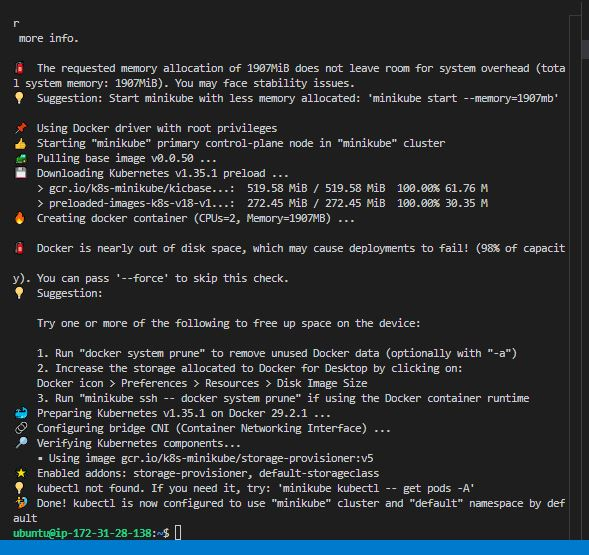

- Kubectl is the command-line interface (CLI) tool for interacting with and managing Kubernetes clusters, allowing users to deploy, inspect, and manage applications within the Kubernetes environment. Let's install kubectl

'sudo snap install kubectl --classic'

This will download the kubernetes command line (kubectl) tool to interact with Kubernetes cluster.