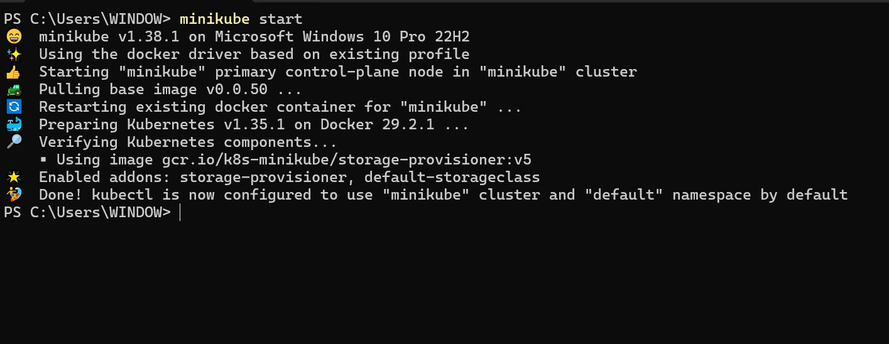
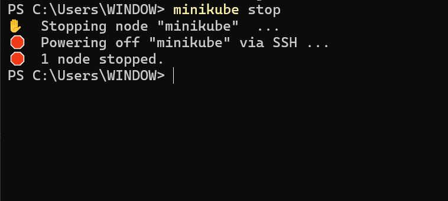
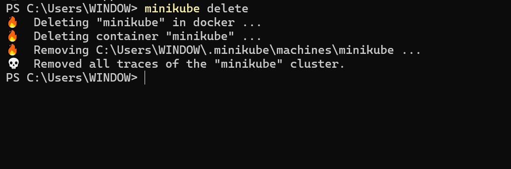
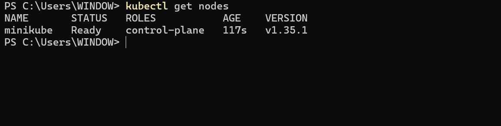
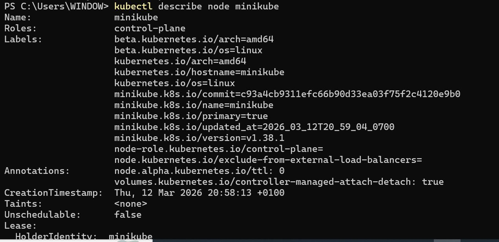

# Working with Kubernetes Node

## Project Review

### Kubernetes Nodes

Now that we have our minikube cluster setup, let's dive into nodes in Kubernetes.

### What is a Node

In Kubernetes, think of a node as a dedicated worker, like a dependable employee in an office, responsible for executing tasks and hosting containers to ensure seamless application performance. A kubernetes Node is a physical or virtual machine that runs the Kubernetes software and serves as a worker machine in the cluster. Nodes are responsible for running Pods, which are the basic deployable units in Kubernetes. Each node in a Kubernetes cluster typically represents a single host system.

### Managing Nodes in Kubernetes:

Minikube simplifies the management of Kubernetes for development and testing purposes. But in context of minikube (a kubernetes cluster), we need to start it up before we can be able to access our cluster.

- Start Minikube cluster.

'minikube start'

This command starts a local Kubernetes cluster (minikube) using a single-node Minikube setup. It provisions a virtual machine (VM) as the Kubernetes node.

- Stop Minikube cluster.

'minikube stop'

This stops the running Minikube (local Kubernetes cluster), preserving the cluster state.

- Delete Minikube cluster.

'minikube delete'

This deletes the Minikube Kubernetes cluster and its associated resources.

- View Nodes.

'kubectl get nodes'

List all the nodes in the Kubernetes cluster along with their current status.

- Inspect a Node.

'kubectl describe node <node-name>'

In this case,

'kubectl describe node minikube'

Provides detailed information about a specific node, including its capacity, allocated resources, and status.

### Node Scaling and Maintenance:

Minikube, as it's often used for local development and testing, scaling nodes may not be as critical as in production environments. However, understanding the concepts is beneficial:

- **Node Scaling:** Minikube is typically a single-node cluster, meaning you have one worker node. For larger, production-like environments.

- **Node Upgrades:** Minikube allows you to easily upgrade your local cluster to a new Kubernetes version, ensuring that your development environment aligns with the target production version.

By effectively managing nodes in Minikube Kubernetes cluster, we can create, test, and deploy appplications locally, simulating a Kubernetes cluster without the need for a full-scale production setup. This is particularly useful for debugging, experimenting, and developing applications in a controlled environment.
