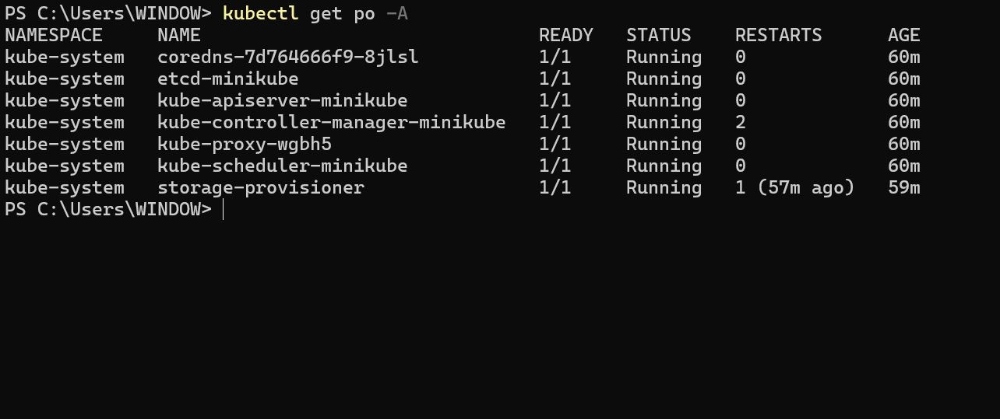
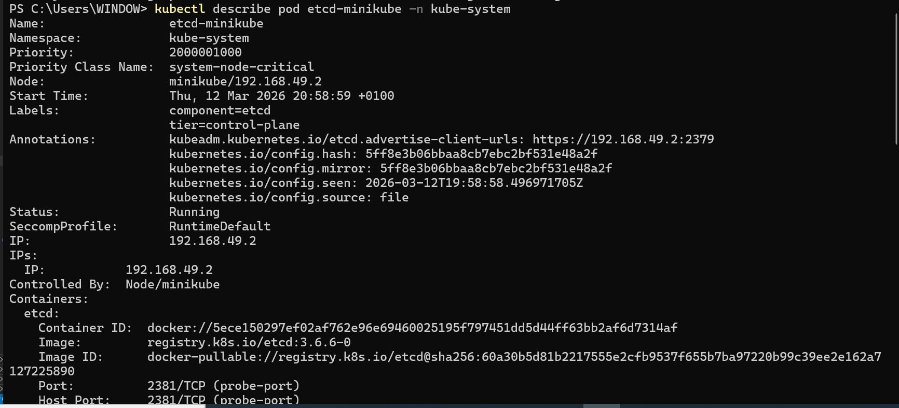
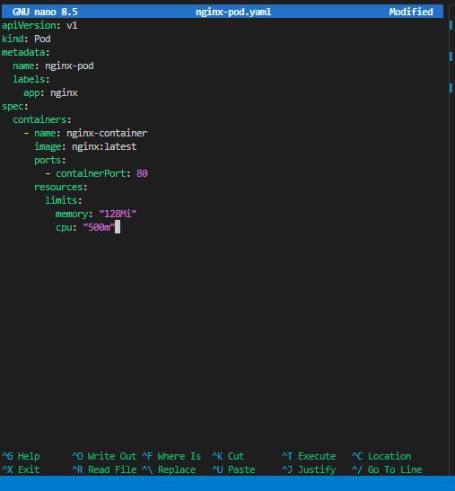
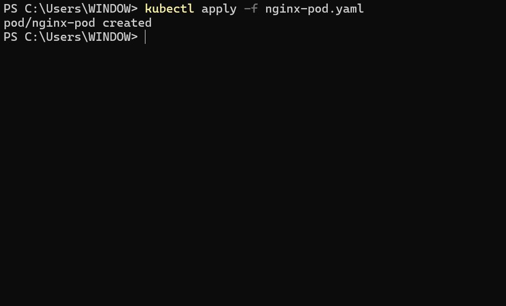
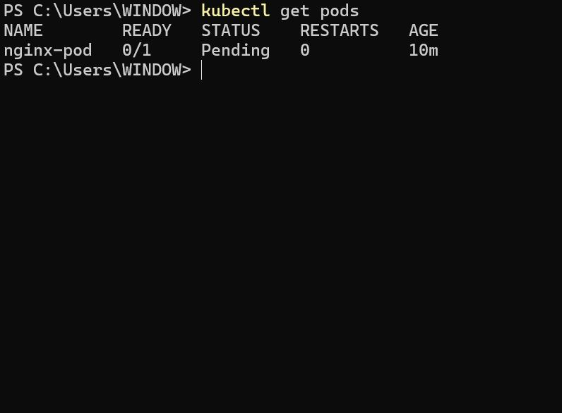

# Working with Kubernetes Pods

## Project Review

### Pods in Kubernetes

A Pod in Kubernetes is like a small container for running parts of an application. It can have one or more containers inside it that work closely together. These containers share the same network and storage, which makes them communicate and cooperate easily. A Pod is the smallest thing you can create and manage in Kubernetes. In Minikube, which is a tool to run Kubernetes easily, Pods are used to set up, change the size, and control applications.

### Creating and Managing Pods:

Interaction with Pods in Minikube involves using the powerful **'kubectl'** command-line tool. Kubectl is the command-line interface (CLI) tool for interacting with Kubernetes clusters. It allows users to deploy and manage applications, inspect and amange cluster resources, and execute various commands against Kubernetes clusters.

- List Pods:

'kubectl get po -A'

This command provides an overview of the current status of Pods within the Minikube cluster.

- Inspect a Pod:

'kubectl describe pod <pod-name>'

'kubectl describe pod etcd-minikube -n kube-system'

The command above can be used to gain detailed insights into a specific Pod, including events, container information, and overall configuration.

- Delete a Pod:

'kubectl delete pod <pod-name>'

'kubectl delete pod etcd-minikube -n kube-system

Removing a Pod from the Minikube cluster is as simple as issuing this command.

### Containers in Kubernetes

From our knowledge of docker, we know Container represents a lightweight, standalone, and executable software package that encapsulates everything needed to run a piece of software, including the code, runtime, libraries, and system tools. Containers are the fundamental units deployed within Pods, which are orchestrated by Kubernetes. In Minikube, containers play a central role in providing a consistent and portable environment for applications, ensuring they run reliably across various stages of the development lifecycle.

### Integrating Containers in Pods:

- **Pod Definition with containers:** In the Kubernetes world, containers come to life within Pods. Developers define a Pod YAML file that specifies the containers to run, their images, and other configuration details. This Pod becomes the unit of deployment, representing a cohesive application.

Using **'kubectl'**, we can deploy Pods and, consequently, the containers within them to the Minikube cluster. This process ensures that the defined containers work in concert within the shared context of a Pod.

Let's define a Pod YAML file for the Container:

'nano nginx-pod.yaml'

'apiVersion: v1
kind: Pod
metadata:
  name: nginx-pod
  labels:
    app: nginx
spec:
  containers:
    - name: nginx-container
      image: nginx:latest
      ports:
        - containerPort: 80
      resources:
        limits:
          memory: "128Mi"
          cpu: "500m"'

Explanation of Key Sections

| Section      | Description                                                    |
| ------------ | -------------------------------------------------------------- |
| `apiVersion` | Kubernetes API version used to create the resource             |
| `kind`       | Type of resource (Pod, Deployment, Service, etc.)              |
| `metadata`   | Information about the pod such as name and labels              |
| `spec`       | The specification of the pod                                   |
| `containers` | List of containers that will run inside the pod                |
| `image`      | Container image pulled from a registry (Docker Hub, ECR, etc.) |
| `ports`      | Network port exposed by the container                          |
| `resources`  | CPU and memory limits assigned to the container                |

- Create the Pod.

'kubectl apply -f nginx-pod.yaml'

- Verify the Pod.

'kubectl get pods'

