# Working with Kubernetes Resources

## Project Review

### Introduction to YAML

A Kubernetes YAML file is a text written in YAML syntax that describes and defines Kubernetes resources. YAML is a human-readable data serialization format that is commonly used for configuration files. In the context of Kubernetes, these YAML files serve as a declarative way to specify the desired state of the resources such as pods, container, service and deployment you want to deploy and manage within a Kubernetes cluster.

### Basic Structure of YAML File

YAML uses indentation to represent the hierarchy of data, and it uses whitespace (usually spaces, not tabs) for indentation.

key1: value1
key2:
  subkey1: subvalue1
  subkey2: subvalue2
key3:
  - item1
  - item2

**Data Types**

**Scalars:** Scalars are single values.

- Strings:

name: John Doe

- Numbers:

age: 25

- Booleans:

is_student: true

**Collections**

- Lists (arrays):

fruits:
  - apple
  - banana
  - orange

- Maps (Key-value pairs):

person:
  name: Alice
  age: 30

**Nested Structures:** YAML allows nesting of structures:

employee:
  name: John Doe
  position: developer
  skills:
    - Python
    - JavaScript

**Comments**

In YAML, comments starts with '#':

# This is a comment
key: value

**Multiline Strings**

Multiline strings can be represented using the '|' or '>' characters:

description: |
  This is a multiline
  string in YAML.

**Anchors and Aliases**

You can use '&' to create an anchor and '*' to create an alias:

first: &name John
second: *name

### Deploying Applications inKubernetes

In Kubernetes, deploying applications is a fundamental skill that every beginner needs to grasp. Deployment involves the process of taking your application code and running it on a Kubernetes cluster, ensuring that it scales, manages resources efficiently, and stays resilient. 

Let's explain the following:

- Deployment in Kubernetes: In Kubernetes, a deployment is a declarative approach to managing and scaling applications. It provides a blueprint for the desired state of your application, allowing Kubernetes to handle the complexities of deploying and managing replicas. Whether you're running a simple web server or a more complex microservices architecture, Deployments are the conerstone for maintaining application consistency and availability.

- Services in Kubernetes: Once your application is deployed, it needs a way to be accessed by other parts of the system or external users. This is where services come into play. In Kubernetes, a Service is an abstraction that defines a logical set of Pods and a policy by which to access them. It acts as a stable endpoint to connect to your application, allowing for easy communication within the cluster or from external sources. Some of the several types of Services in Kubernetes:

- **ClusterIP:** Exposes the Service on a cluster-internal IP. Accessible only within the cluster.

- **NodePort:** Exposes the Service on each Node's IP at a static port (NodePort). Accessible externally using 'NodeIP'.

- **LoadBalancer:** Exposes the Service externally using a cloud provider's load balancer. Accessible externally through the load balancer's IP.

### Deploying a Minikube Sample Application

Using YAML files for deployments and services in Kubernetes is like crafting a detailed plan for ypur application, while direct deployment with 'kubectl' command is more like giving quick, on-the-spot instructions to launch and manage your application. Let's create a minikube deployment and service with 'kubectl'.

'kubectl create deployment hello-minikube --image=kicbase/echo-server:1.0'

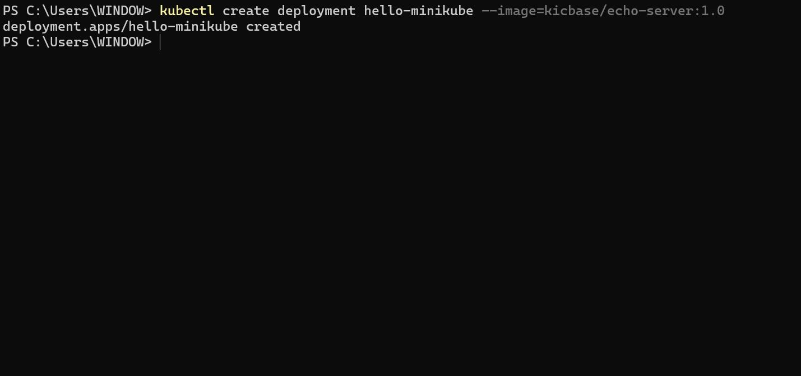

The command above creates Kubernetes Deployment named "hello-minikube"  running the "kicbase/echo-server:1.0" container image.

'kubectl expose deployment hello-minikube --type=NodePort --port=8080'

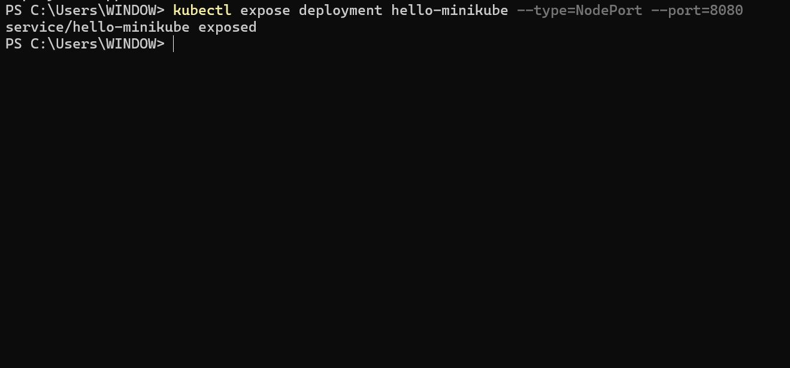

The command above exposes the Kubernetes Deployment named "hello-minikube" as a NodePort service on port 8080.

'kubectl get services hello-minikube'

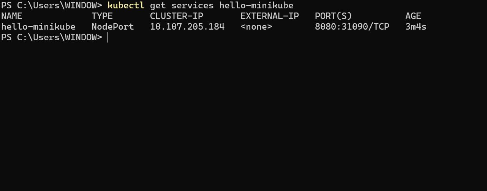

The easiest way to access this service is to let minikube launch a web browser for you;

minkube service hello-minikube

**Working with YAML Files**

- Create a new folder 'my-nginx-yaml'

'mkdir my-nginx-yaml'

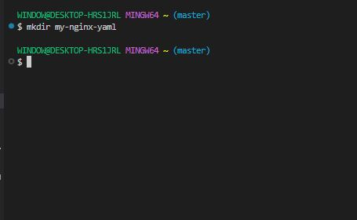

- Create a new file 'nginx-deployment.yaml' and paste the content below

'touch nginx-deployment.yaml'

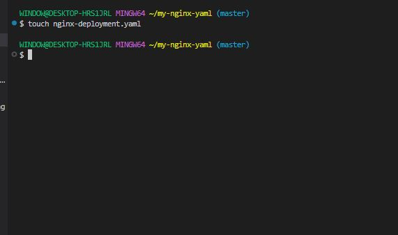

apiVersion: apps/v1
kind: Deployment
metadata:
  name: my-nginx-deployment
spec:
  replicas: 1
  selector:
    matchLabels:
      app: my-nginx
  template:
    metadata:
      labels:
        app: my-nginx
    spec:
      containers:
      - name: my-nginx
        image: dareyregistry/my-nginx:1.0
        ports:
        - containerPort: 80

'nano nginx-deployment.yaml'

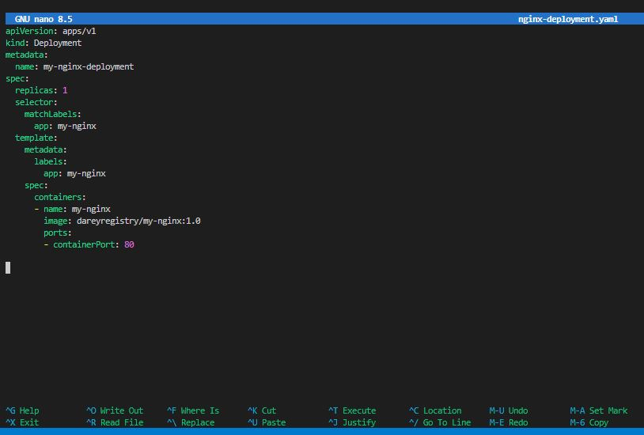

The provided YAML snippet defines a Kubernetes Deployment for deploying an instance of the Nginx web server. Let's breakdown the key components:

- **apiVersion (apps/v1):** Specifies the Kubernetes API version for the object being created, in this case, a Deployment in the "apps" group.

- **Kind (Deployment):** Defines the type of Kubernetes resources being created, which is a Deployment. Deployments are used to manage the deployment and scaling of applications.

- **Metadata:** Contains metadata for the Deployment, including the name of the Deployment, which is set to "my-nginx-deployment".

- **Spec:** Describes the desired state of the Deployment.

- **Replicas (1):** Specifies that the desired number of replicas (instances) of the Pods controlled by this Deployment is 1.

- **Selector:** Defines how the Deployment selects which Pods to manage. In this case, it uses the label "app:my-nginx" to match Pods.

- **Template:** Specifies the templates for creating new Pods.

- **Metadata:** Contains labels for the Pods, and in this case, the label is set to "app:my-nginx".

- **Spec:** Describes the Pod specification.

- **Containers:** Define the containers within the Pod.

- **Name (my-nginx):** Sets the name of the container to "my-nginx".

- **Image (dareyregistry/my-nginx:1.0):** Specifies the Docker image to be used for the Nginx container. The image is "dareyregistry/my-nginx" with version "1.0".

- **Port:** Specifies the port mapping for the container, and in this case, it exposes port 80.

- Create a new file called **"nginx-service.yaml" and paste the content below:

'nano nginx-service.yaml'

apiVersion: v1
kind: Service
metadata:
  name: my-nginx-service
spec:
  selector:
    app: my-nginx
  ports:
    - protocol: TCP
      port: 80
      targetPort: 80
  type: NodePort

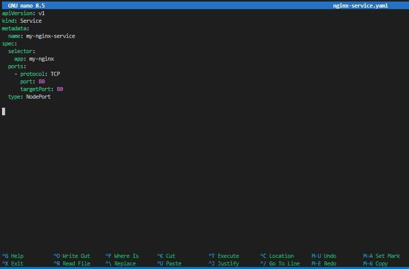

The provided YAML snippet defines a Kubernetes Service exposing the Nginx application to the external world. Let's breakdown the key components:

- **apiVersion (apps/v1):** Specifies the Kubernetes API version for the object being created, in this case, a Service.

- **Kind (Service):** Defines the type of Kubernetes resources being created, which is a Service. Services provide a stable endpoint for accessing a set of Pods.

- **Metadata:** Contains metadata for the Service, including the name of the Service, which is set to "my-nginx-service".

- **Spec:** Describes the desired state of the Service.

- **Selector:** Specifies the labels used to select which Pods the Service will route traffic to. In this case, it selects the Pods with the label "app:my-nginx".

- **Ports:** Specifies the ports configuration for the Service.

- **Protocol (TCP):** Specifies the transport layer protocol, which is TCP in this case.

- **Port (80):** Defines the port on which the Service will be exposed.

- **targetPort (80):** Specifies the port on the Pods to which the traffic will be forwarded.

- **type (NodePort):** Sets the type of the Service to NodePort. This means that the Service will be accessible externally on each Node's IP address at a static port, which will be automatically assigned unless specified.

- Run the command below for the deployment on the cluster.

'kubectl apply -f nginx-deployment.yaml'

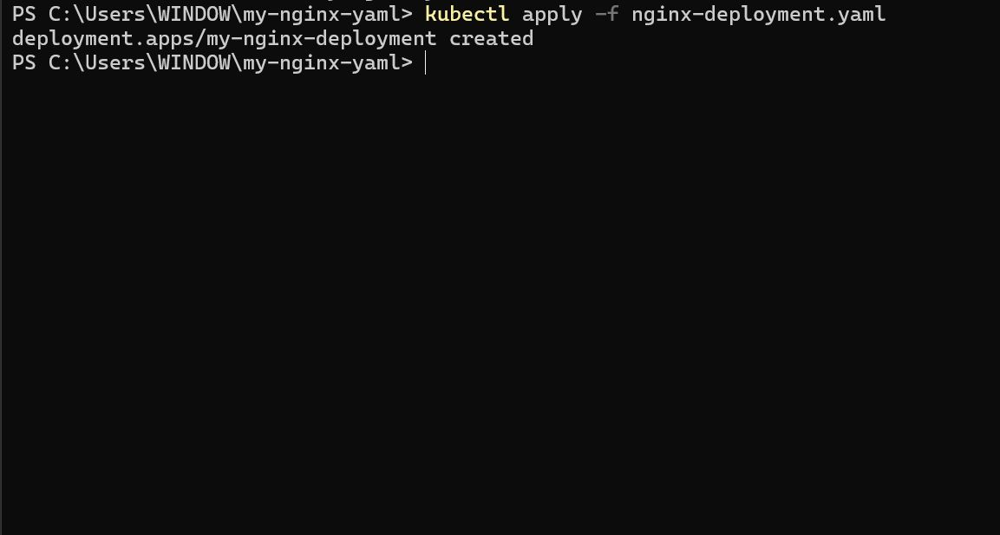

'kubectl apply -f nginx-service.yaml'

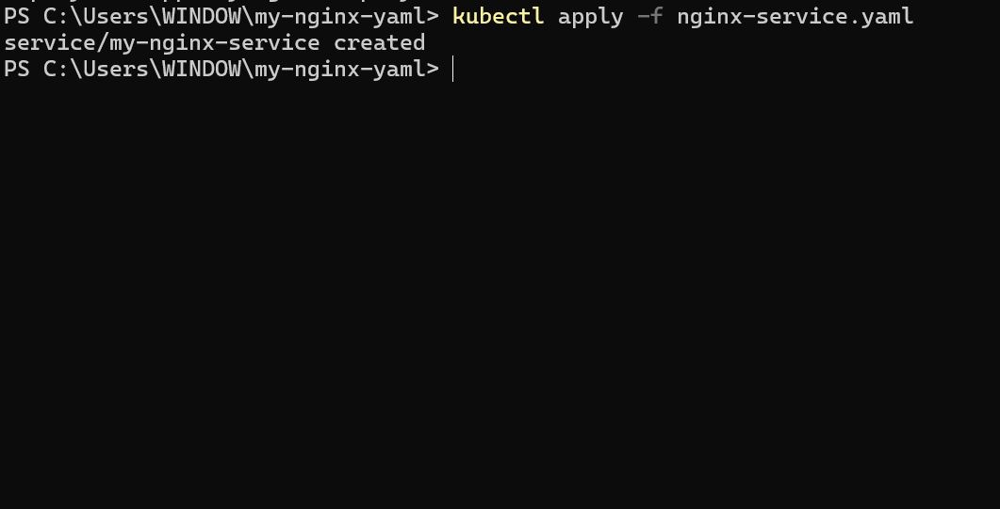

- Verify the deployments.

'kubectl get deployments'

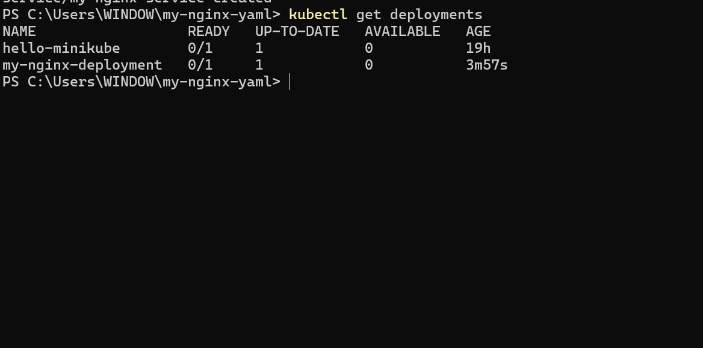

'kubectl get services'

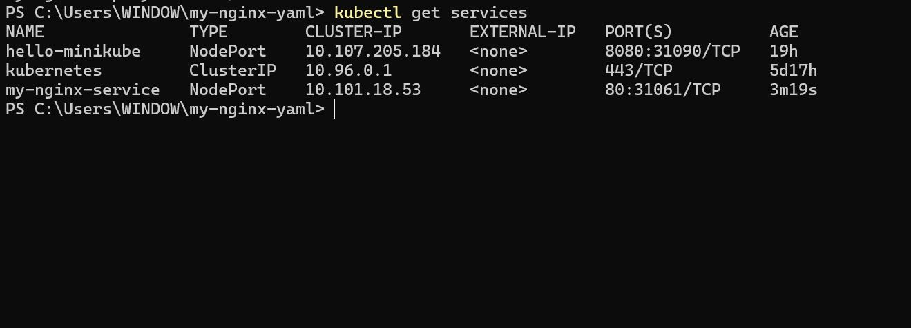

- Access the deployment on web browser.

'minikube service my-nginx-service --url' 

Follow the ip address to access the application on the web broswer. 

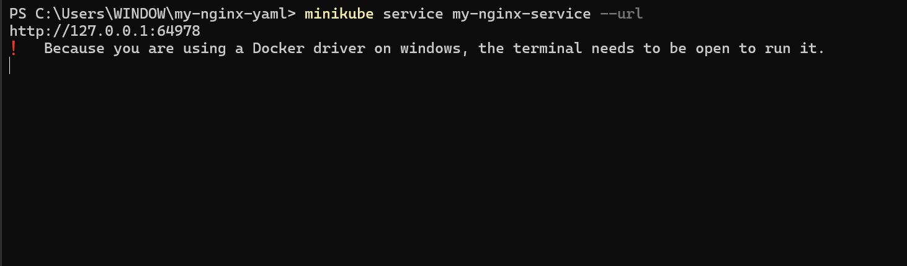

'http://127.0.0.1:64978'

