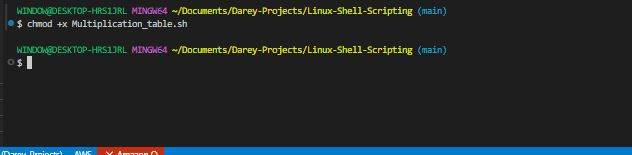
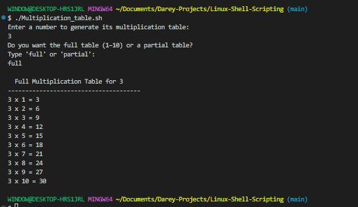
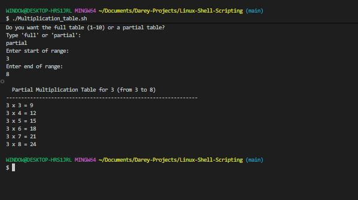
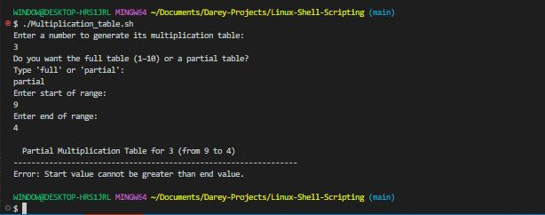
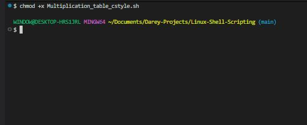
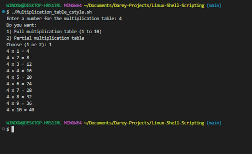
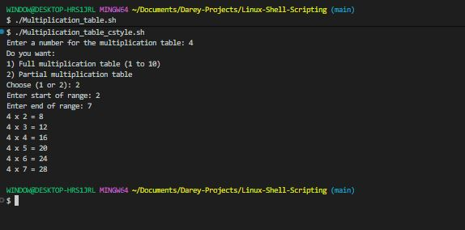

# Bash Script For Generating a Multiplication Table

**Objective**: Create a Bash script that generates a multiplication table for a number entered by the user. This project will help to practice using loops, handling user input, and applying conditional logic in Bash scripting.

## Project Description

The script should prompt the user to enter a number and then ask if they prefer to see full multiplication table from 1 to 10 or a partial table within a specified range. Based on the user's choice, the script will display the corresponding multiplication table.

### Task

### Using the list form

- Create a file "Multiplication_table.sh".

'nano Multiplication_table.sh'

- Type in the code snippet.

echo "Enter a number to generate its multiplication table:"
read number

echo "Do you want the full table (1–10) or a partial table?"
echo "Type 'full' or 'partial':"
read choice

if [[ "$choice" == "full" ]]; then
    echo ""
    echo "📌 Full Multiplication Table for $number"
    echo "--------------------------------------"
    
    for i in {1..10}
    do
        result=$((number * i))
        echo "$number x $i = $result"
    done

elif [[ "$choice" == "partial" ]]; then
    echo "Enter start of range:"
    read start

    echo "Enter end of range:"
    read end

    echo ""
    echo "📌 Partial Multiplication Table for $number (from $start to $end)"
    echo "----------------------------------------------------------------"

    # Ensure start <= end
    if (( start > end )); then
        echo "Error: Start value cannot be greater than end value."
        exit 1
    fi

    for ((i=start; i<=end; i++))
    do
        result=$((number * i))
        echo "$number x $i = $result"
    done

else
    echo "Invalid choice! Please run script again and choose 'full' or 'partial'."
fi'

- Execute the script.

'chmod +x Multiplication_table.sh'

- Run script.

'./Multiplication_table.sh'

1. For full table for number 3;

2. For partial for number 3;

4. For invalid range;

### Using a C-Style form

- Create a file "Multiplication_table_cstyle.sh".

'nano Multiplication_table.sh'

- Type in the code snippet.

'#!/bin/bash

###############################################
# 1. Ask user for number
# 2. Ask user for table type (full or partial)
# 3. If partial → ask for start and end range
# 4. Generate multiplication table with logic
###############################################

# (C-style comment) Ask user to enter a number
read -p "Enter a number for the multiplication table: " number

# (C-style comment) Ask user if full or partial table is needed
echo "Do you want:"
echo "1) Full multiplication table (1 to 10)"
echo "2) Partial multiplication table"
read -p "Choose (1 or 2): " choice

# (C-style comment) Decision handling
if [ "$choice" -eq 1 ]; then
    # List-style comment:
    # - Generate full table from 1 to 10
    for i in {1..10}
    do
        echo "$number x $i = $((number * i))"
    done

elif [ "$choice" -eq 2 ]; then
    # List-style comment:
    # - Ask user for start of range
    # - Ask user for end of range
    read -p "Enter start of range: " start
    read -p "Enter end of range: " end

    # (C-style comment) Generate partial table using loop
    for (( i=start; i<=end; i++ ))
    do
        echo "$number x $i = $((number * i))"
    done
else
    echo "Invalid choice. Exiting."
fi'

- Execute the script.

'chmod +x Multiplication_table_cstyle.sh'

- Run script.

'./Multiplication_table_cstyle.sh'

1. For full table for number 3;

2. For partial for number 3;

4. For invalid range;

### Conclusion

In conclusion, you can either use the list form or C-Style form to write your script to execute the Multiplication Table task.

