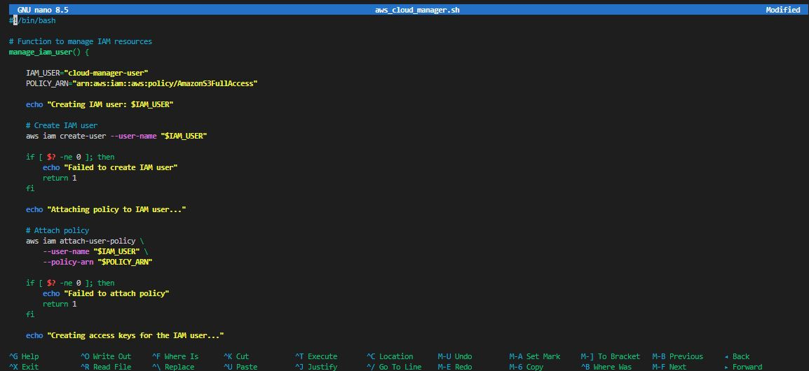
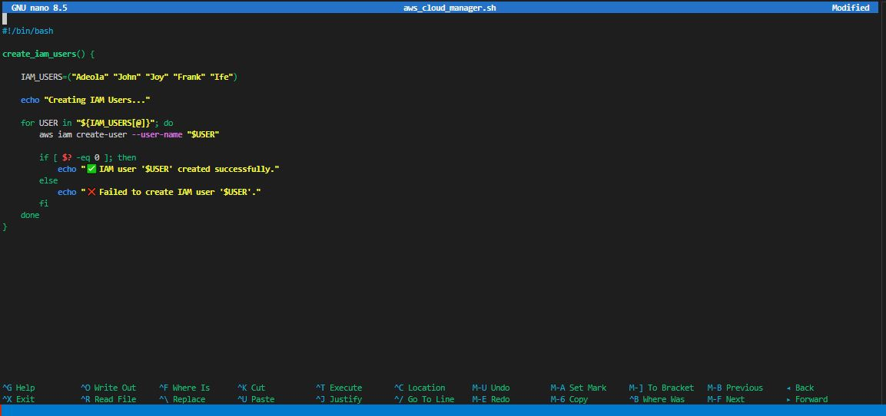
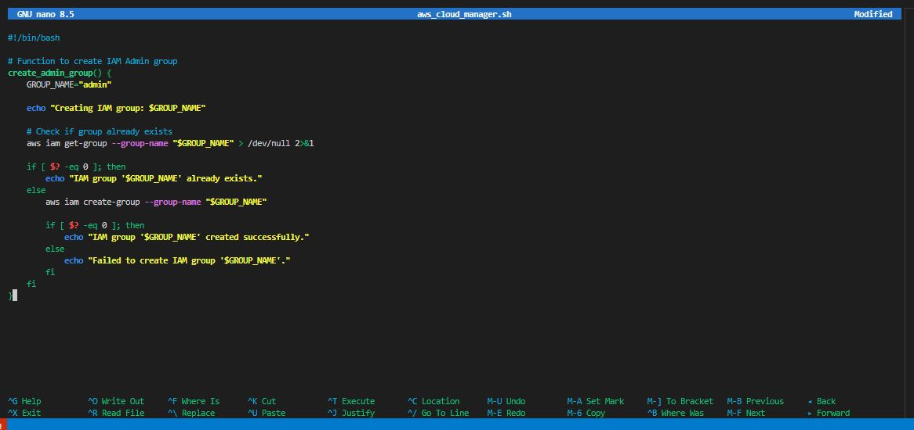
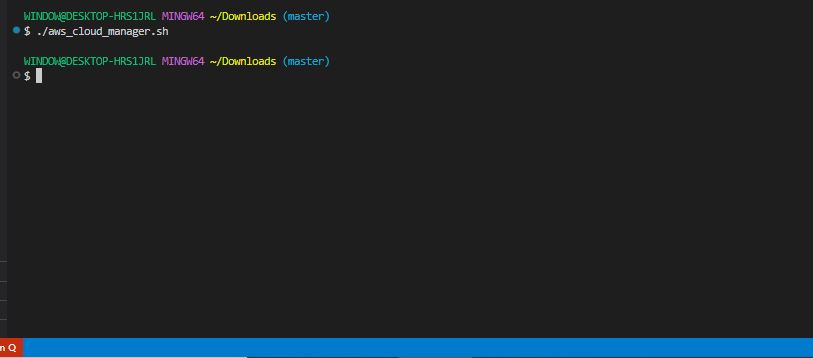
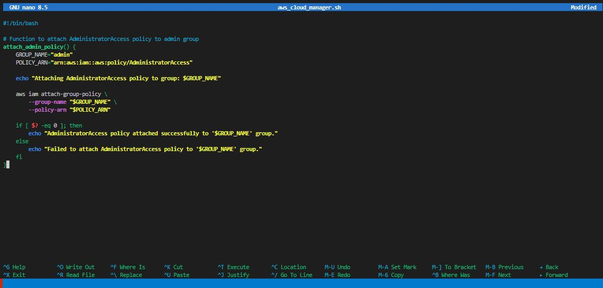
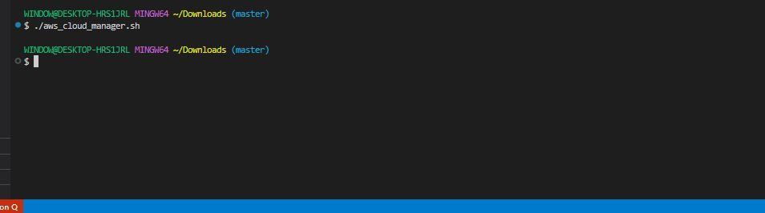
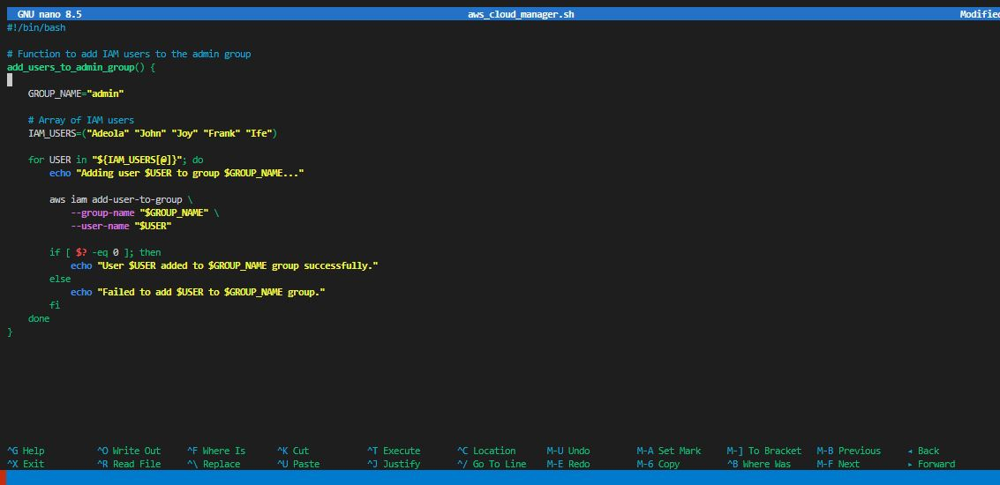
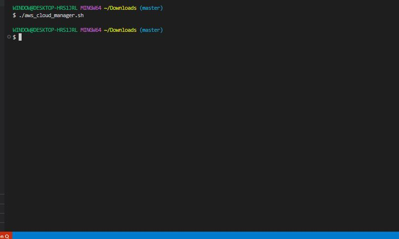

# Shell Script for AWS IAM Management

## Project Review

CloudOps Solutions is a growing company that recently adopted AWS to manage its cloud infrastructure. As the company scales, they have decided to automate the process of managing AWS identity and Access Management (IAM) resources. This includes creation of users, user groups, and the assignment of permissions for new hires, especially for their DevOps team.

### Task

### Script Enhancement

- Create function that extends the **"aws_cloud_manager.sh"** to include IAM management.

'sudo nano aws_cloud_manager.sh'

'#!/bin/bash

# Function to manage IAM resources
manage_iam_user() {

    IAM_USER="cloud-manager-user"
    POLICY_ARN="arn:aws:iam::aws:policy/AmazonS3FullAccess"

    echo "Creating IAM user: $IAM_USER"

    # Create IAM user
    aws iam create-user --user-name "$IAM_USER"

    if [ $? -ne 0 ]; then
        echo "Failed to create IAM user"
        return 1
    fi

    echo "Attaching policy to IAM user..."

    # Attach policy
    aws iam attach-user-policy \
        --user-name "$IAM_USER" \
        --policy-arn "$POLICY_ARN"

    if [ $? -ne 0 ]; then
        echo "Failed to attach policy"
        return 1
    fi

    echo "Creating access keys for the IAM user..."

    # Create access keys
    aws iam create-access-key --user-name "$IAM_USER"

    if [ $? -ne 0 ]; then
        echo "Failed to create access key"
        return 1
    fi

    echo "IAM user setup completed successfully."
}'

### Define IAM User Names Array.

- Store the names of the five IAM users in an array for easy iteration during user creation.

'#!/bin/bash

create_iam_users() {

    IAM_USERS=("Adeola" "John" "Joy" "Frank" "Ife")

    echo "Creating IAM Users..."

    for USER in "${IAM_USERS[@]}"; do
        aws iam create-user --user-name "$USER"

        if [ $? -eq 0 ]; then
            echo "✅ IAM user '$USER' created successfully."
        else
            echo "❌ Failed to create IAM user '$USER'."
        fi
    done
}'

- Run the script.

'./aws_cloud_manager.sh'

### Create IAM Users

- Iterate through the IAM user names array and create IAM users for each employee using AWS CLI commands.

'create_iam_users() {

    IAM_USERS=("Adeola" "John" "Joy" "Frank" "Ife")

    echo "Creating IAM users..."

    for USER in "${IAM_USERS[@]}"; do
        aws iam create-user --user-name "$USER"

        if [ $? -eq 0 ]; then
            echo "✅ IAM user '$USER' created successfully."
        else
            echo "❌ Failed to create IAM user '$USER'"
        fi
    done
}'

**Note:**

| Part                  | Meaning                                |
| --------------------- | -------------------------------------- |
| `for USER in`         | Start looping through each item        |
| `"${IAM_USERS[@]}"`   | Access every element in the array      |
| `aws iam create-user` | AWS CLI command to create the IAM user |
| `$USER`               | The current user in the loop           |

### Create IAM Group

- Define a function to create an IAm group named "admin" using the AWS CLI.

'#!/bin/bash
# Function to create IAM Admin group
create_admin_group() {
    GROUP_NAME="admin"

    echo "Creating IAM group: $GROUP_NAME"

    # Check if group already exists
    aws iam get-group --group-name "$GROUP_NAME" > /dev/null 2>&1

    if [ $? -eq 0 ]; then
        echo "IAM group '$GROUP_NAME' already exists."
    else
        aws iam create-group --group-name "$GROUP_NAME"

        if [ $? -eq 0 ]; then
            echo "IAM group '$GROUP_NAME' created successfully."
        else
            echo "Failed to create IAM group '$GROUP_NAME'."
        fi
    fi
}'

- Run script.

'./aws_cloud_manager.sh'

### Attach Administrative Policy to Group

- Attach an AWS-managed administrative policy like **"AdministratorAccess"** to the "admin"  group to grant administrative privileges. 

'#!/bin/bash

# Function to attach AdministratorAccess policy to admin group
attach_admin_policy() {
    GROUP_NAME="admin"
    POLICY_ARN="arn:aws:iam::aws:policy/AdministratorAccess"

    echo "Attaching AdministratorAccess policy to group: $GROUP_NAME"

    aws iam attach-group-policy \
        --group-name "$GROUP_NAME" \
        --policy-arn "$POLICY_ARN"

    if [ $? -eq 0 ]; then
        echo "AdministratorAccess policy attached successfully to '$GROUP_NAME' group."
    else
        echo "Failed to attach AdministratorAccess policy to '$GROUP_NAME' group."
    fi
}'

- Run script.

'./aws_cloud_manager.sh'

### Assign Users to Group:

- Iterate through the array of IAM user names and assign each user to the "admin" group using AWS CLI commands.

'#!/bin/bash

# Function to add IAM users to the admin group
add_users_to_admin_group() {

    GROUP_NAME="admin"

    # Array of IAM users
    IAM_USERS=("Adeola" "John" "Joy" "Frank" "Ife")

    for USER in "${IAM_USERS[@]}"; do
        echo "Adding user $USER to group $GROUP_NAME..."

        aws iam add-user-to-group \
            --group-name "$GROUP_NAME" \
            --user-name "$USER"

        if [ $? -eq 0 ]; then
            echo "User $USER added to $GROUP_NAME group successfully."
        else
            echo "Failed to add $USER to $GROUP_NAME group."
        fi
    done
}'

'sudo nano aws_cloud_manager.sh'

- Run script.

'./aws_cloud_manager.sh'

You've now successfully created user names for the five new employees ("Adeola", "John", "Joy", "Frank", and "Ife") and assign to a user group "admin" with the "AdministratorAccess" policy. The script ran without any syntax error or break in the line of code in AWS CLI.

