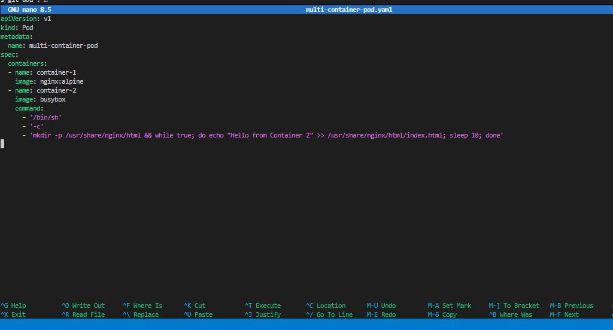
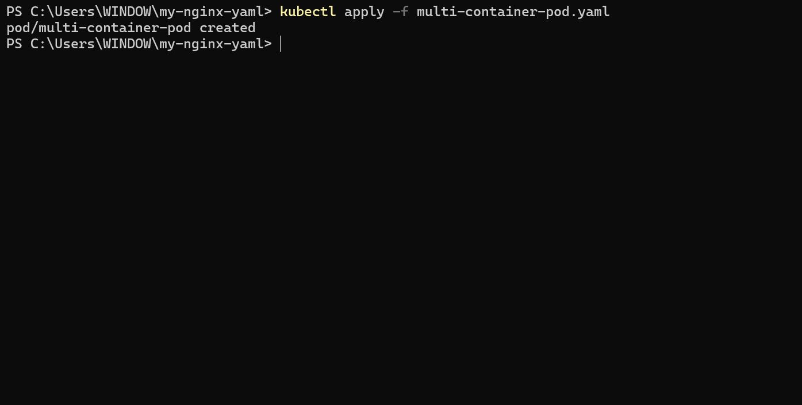
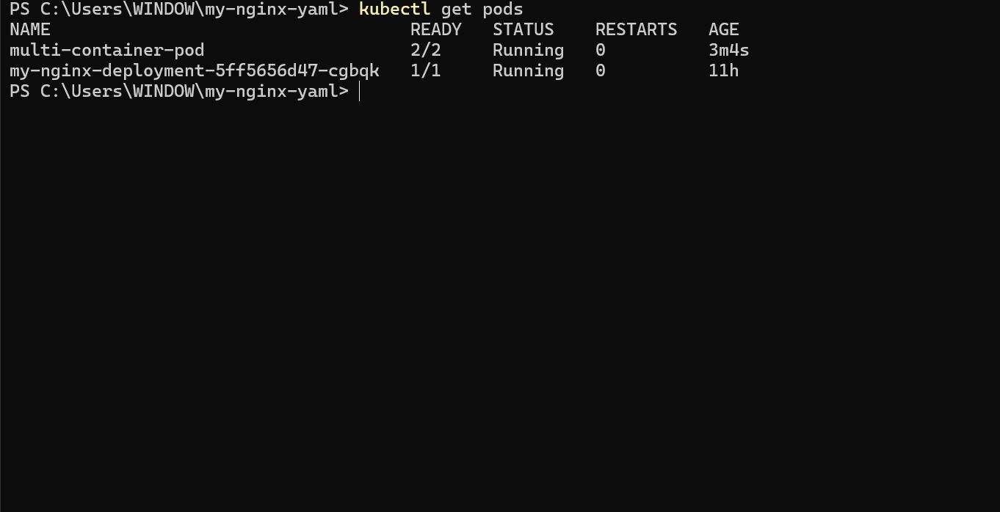
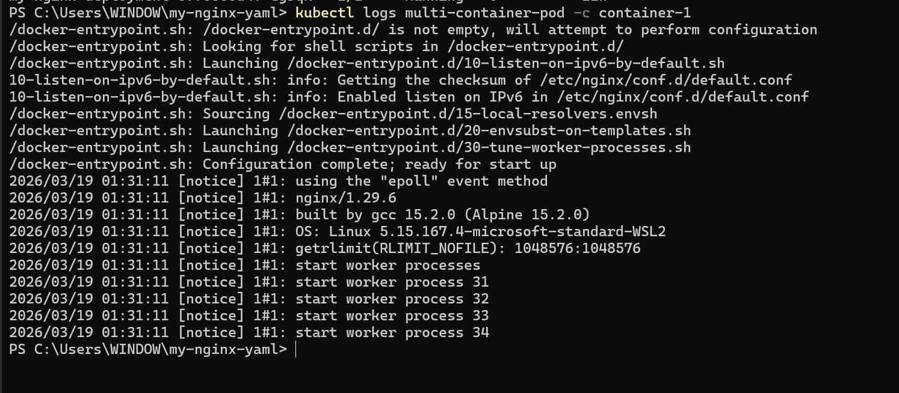
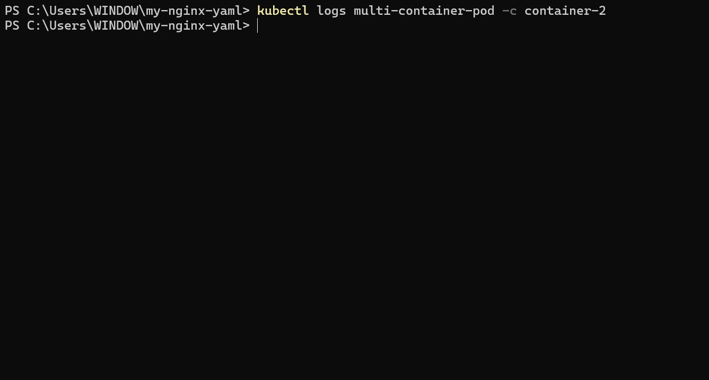
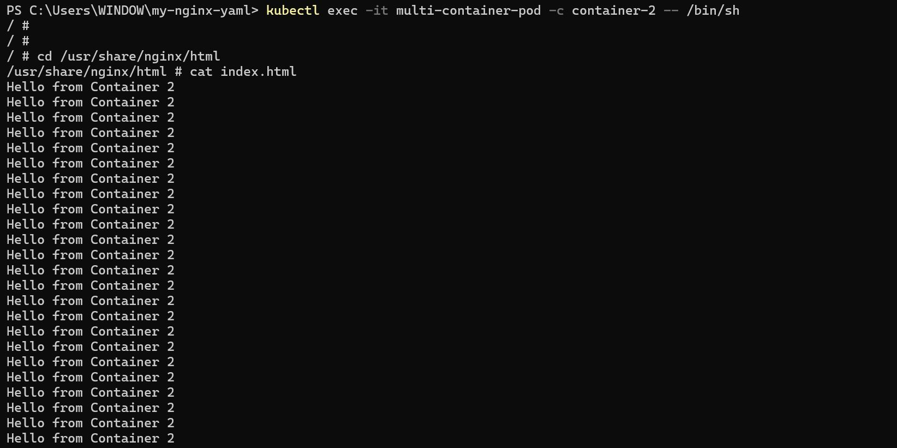
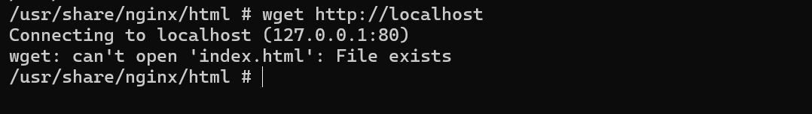

# Networking in Kubernetes

## Project Review

### Networking

Networking refers to the mechanisms and configuration that allow communication between different components (pods, services, and other resources) within a Kubernetes cluster. Kubernetes provides a flexible and powerful networking model to enable seamless interaction between containers and services, whether they are running on the same node or across different nodes in a cluster.

### Some Key aspects of networking in Kubernetes

- **Pod Networking:** Containers within a pod share the same network namespace, allowing them to communicate with each other using localhost. This enables tight coupling between containers within the same pod.

- **Service Networking:** Kubernetes Services provide a way to expose a group of pods as a single, stable network endpoint. Services have an associated Cluster IP that allows other pods to communicate with the service. Services can be exposed internally within the cluster or externally to the outside world.

- **Pod-to-Pod Communication:** Pods communicate with each other using their individual IP addresses. Kubernetes ensures that pods can reach each other directly, regardless of the node they are running on, by using an overlay network.

- **Ingress:** Ingress is a Kubernetes resource that allows external access to services with the cluster. It defines rules for routing external HTTP and HTTPS traffic to different services based on the host or path. Ingress controllers manage the actual routing and traffic flow.

- **Network Policies:** Kubernetes Network Policies define rules for controlling the communication between pods. These policies allow administrators to specify how pods can communicate with each other, enhancing security within the cluster.

- **Container Network Interface (CNI):** Kubernetes relies on Container Network Interfaces to implement networking solutions. CNIs provide a standardized interface for networking plugins to integrate with Kubernetes, allowing for flexibility and choice in networking implementations.

### Task

- Create a Multi-Container Pod YAML file named multi-container-pod.yaml and paste the snippet below:

'nano multi-container-pod.yaml'

apiVersion: v1
kind: Pod
metadata:
  name: multi-container-pod
spec:
  containers:
  - name: container-1
    image: nginx:alpine
  - name: container-2
    image: busybox
    command:
      - '/bin/sh'
      - '-c'
      - 'mkdir -p /usr/share/nginx/html && while true; do echo "Hello from Container 2" >> /usr/share/nginx/html/index.html; sleep 10; done'

**Explanation of the yaml snippet above**

- **apiVersion (v1):** Specifies the Kubernetes API version for the object being created, in this case, a Pod.

- **Kind (Pod):** Defines the type of Kubernetes resources being created, which is a Pod. Pods are the smallest deployable units in Kubernetes and can host one or more containers.

- **Metadata:** Contains metadata for the Pod, including the name of the Pod, which is set to "multi-container-pod".

- **Spec:** Describes the desired state of the Pod.

- **Containers:** Specifies the containers configuration for the Pod.

- **name (container-1):** Defines the first container in Pod with the name "container-1" and uses the 'nginx:alpine' image.

- **name (container-2):** Defines the second container in Pod with the name "container-2" and uses the 'busybox' image. Additionally, it specifies a command to create an HTML file in the Nginx directory and continuously appends "Hello from Container 2" to it every 10 seconds.

The pod has two containers, one running the Nginx web server and another running BusyBox with a simple command to continuously append "Hello from Container 2" to the Nginx default HTML file.

- Apply the Pod configuration:

'kubectl apply -f multi-container-pod.yaml'

- Check Pod Status and Log:

'kubectl get pods'

'kubectl logs multi-container-pod -c container-1'

'kubectl logs multi-container-pod -c container-2'

You'll observe that both containers are running within the same pod, and they share the same network namespace. The Nginx container serves its default page, and the BusyBox container continuously updates the HTML file.

- Access Nginx from BusyBox Container:

'kubectl exec -it multi-container-pod -c container-2 -- /bin/sh'

Now, within the BusyBox container, you can use tools like curl or wget to access http://localhost and see the Nginx page.

'wget http://localhost'

This demonstrates how containers within the same pod can communicate with each other using 'localhost'.