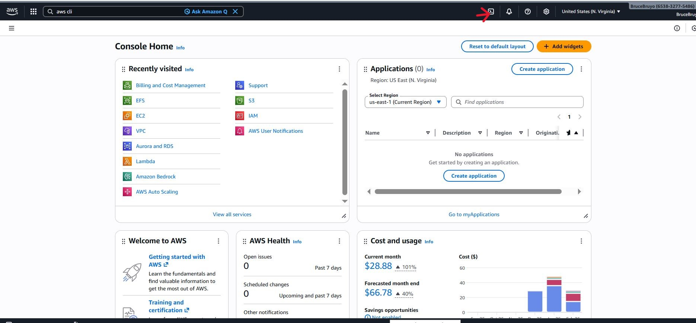
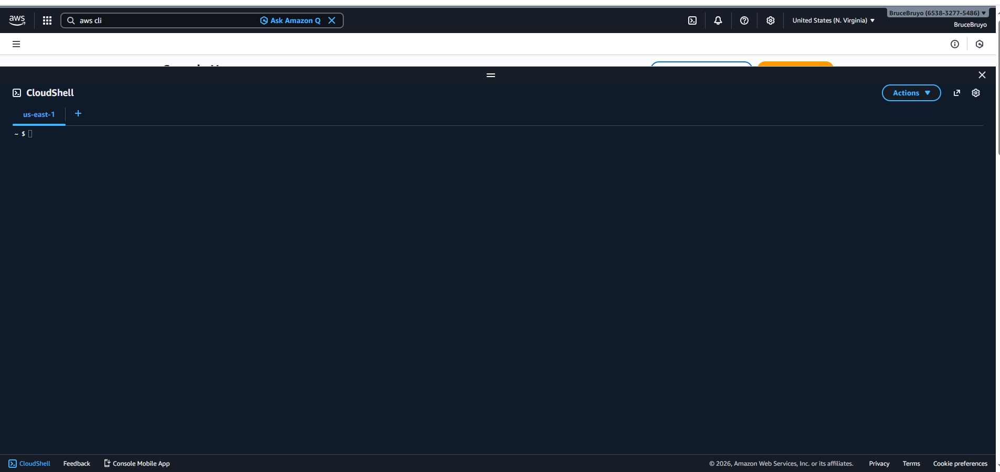
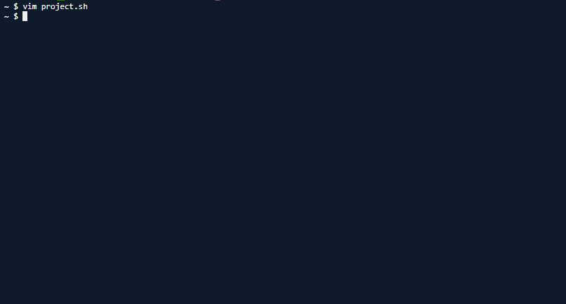
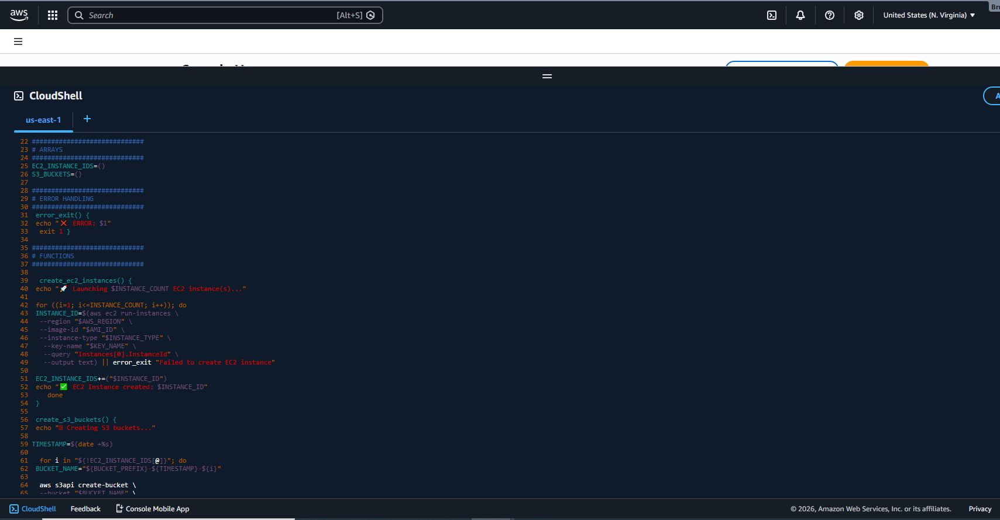
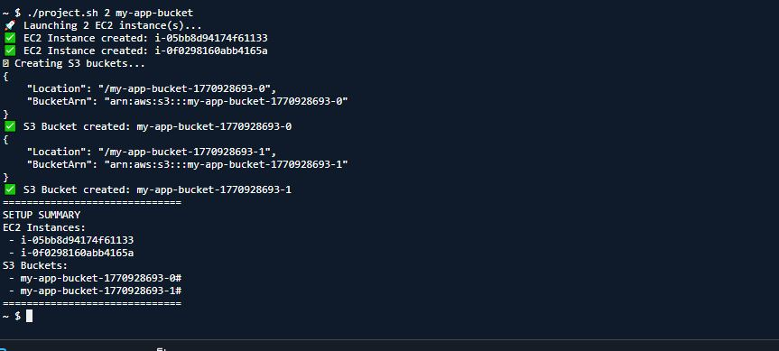
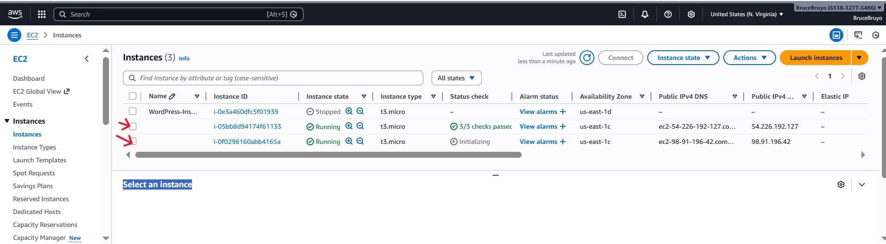
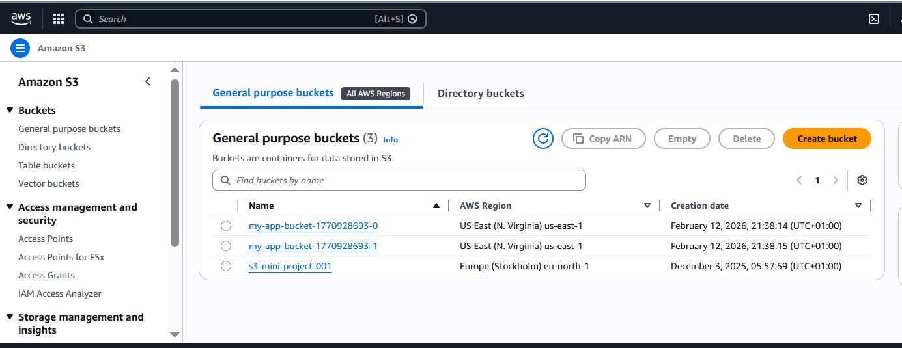

# Shell Scripting with cloud computing

## Project Review

This project is aim to elevate your capabilities to a level where you can confidently navigate and harness the power of both shell scripting and cloud computing. This combination is not just about learning commands and services, but understanding how to leverage the tools in unison to build, deploy, and manage scalable, efficient, and robust system in the cloud.

### Task

**DataWise Solutions** is a forward-thinking Data Science Consulting Company that specializes in deploying analytical and machine learning environments to support data-driven decision making for its clients. Recognizing the need for agility and efficiency in setting up such environments, DataWise has decided to streamline its deployment process on AWS, focusing on simplicity and automation.

One of DataWise Solution's clients, a burgeoning e-commerce startup, is looking to harness the power of data science to analyze customer behaviour and enhance their shopping experience. The startup wishes to deploy their data science workspace on AWS, utilizing EC2 instances for computational tasks and S3 buckets for storing their vast datasets of customer interactions.

- Go to AWS CLI and open a text editor. Create a file named "project.sh".

'vim project.sh'

- Input the code snippet. Edit according to create the ec2 instances and s3 buckets.

'#!/bin/bash

############################
# ENVIRONMENT VARIABLES
############################

export AWS_REGION="us-east-1"
export AMI_ID="ami-0c1fe732b5494dc14"  
export INSTANCE_TYPE="t3.micro"
export KEY_NAME="wordpress"

############################
# COMMAND LINE ARGUMENTS
############################

INSTANCE_COUNT=$1
BUCKET_PREFIX=$2

if [[ -z "$INSTANCE_COUNT" || -z "$BUCKET_PREFIX" ]]; then
  echo "Usage: $0 <instance-count> <s3-bucket-prefix>"
  exit 1
fi

############################
# ARRAYS
############################

EC2_INSTANCE_IDS=()
S3_BUCKETS=()

############################
# ERROR HANDLING
############################

error_exit() {
  echo "❌ ERROR: $1"
  exit 1
}

############################
# FUNCTIONS
############################

create_ec2_instances() {
  echo "🚀 Launching $INSTANCE_COUNT EC2 instance(s)..."

  for ((i=1; i<=INSTANCE_COUNT; i++)); do
    INSTANCE_ID=$(aws ec2 run-instances \
      --region "$AWS_REGION" \
      --image-id "$AMI_ID" \
      --instance-type "$INSTANCE_TYPE" \
      --key-name "$KEY_NAME" \
      --query "Instances[0].InstanceId" \
      --output text) || error_exit "Failed to create EC2 instance"

    EC2_INSTANCE_IDS+=("$INSTANCE_ID")
    echo "✅ EC2 Instance created: $INSTANCE_ID"
  done
}

create_s3_buckets() {
  echo "🪣 Creating S3 buckets..."

  TIMESTAMP=$(date +%s)

  for i in "${!EC2_INSTANCE_IDS[@]}"; do
    BUCKET_NAME="${BUCKET_PREFIX}-${TIMESTAMP}-${i}"

    aws s3api create-bucket \
      --bucket "$BUCKET_NAME" \
      --region "$AWS_REGION" || error_exit "Failed to create S3 bucket"

    S3_BUCKETS+=("$BUCKET_NAME")
    echo "✅ S3 Bucket created: $BUCKET_NAME"
  done
}

summary() {
  echo "=============================="
  echo "SETUP SUMMARY"
  echo "EC2 Instances:"
  for id in "${EC2_INSTANCE_IDS[@]}"; do
    echo " - $id"
  done

  echo "S3 Buckets:"
  for bucket in "${S3_BUCKETS[@]}"; do
    echo " - $bucket"
  done
  echo "=============================="
}

############################
# MAIN EXECUTION
############################

create_ec2_instances
create_s3_buckets
summary'

- Execute the script.

'chmod +x project.sh'

To run it, either use 

bash project.sh <instance-count> <s3-bucket-prefix>

./project.sh <instance-count> <s3-bucket-prefix>

'./project.sh 2 my-app-bucket'

'bash project.sh 2 my-app-bucket'

**Note:** Ensure you use an existing keypair and also the right AMI ID on the us-east region.

### The Five Critical Shell Scripting Concepts

**Function:** This improves readability, reuse, and maintainability by grouping related logic into reusable blocks.

**Array:** This is used to track dynamically created resources (e.g., EC2 instance IDs and S3 bucket names) for later processing and reporting.

**Environmental Variable:** This makes the script configurable and portable by externalizing values such as region, AMI ID, and instance type.

**Command Line Argument:** This allows users to pass runtime parameters (such as instance count and bucket prefix), making the script flexible without modifying the code.

**Error Handling:** This ensures the script fails gracefully by detecting command failures early, displaying meaningful error messages, and preventing partial or inconsistent resource creation.