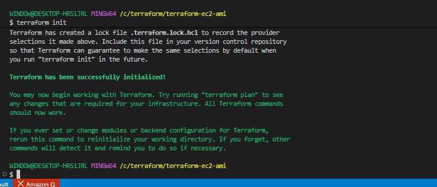
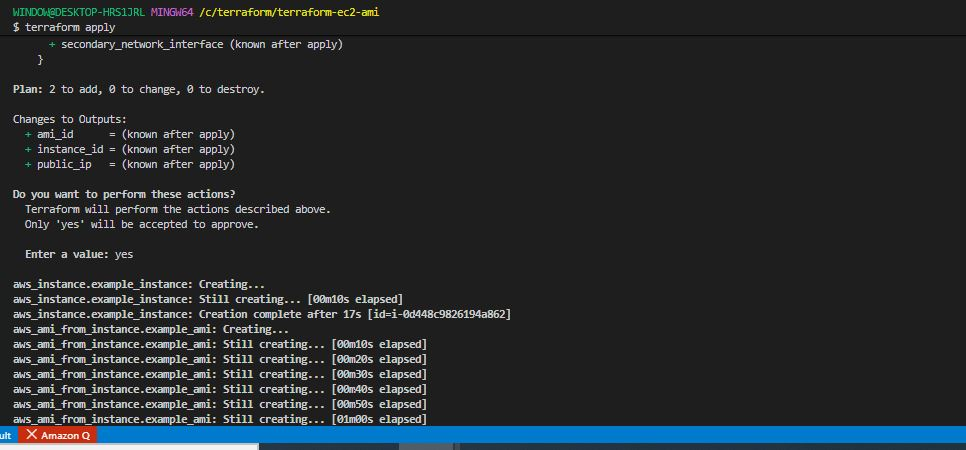
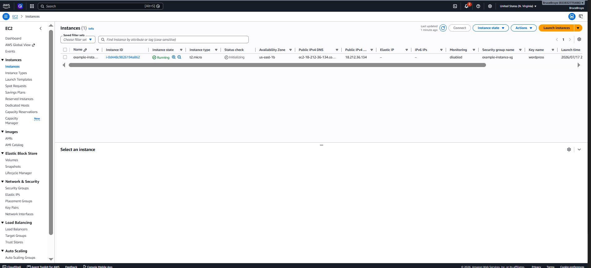
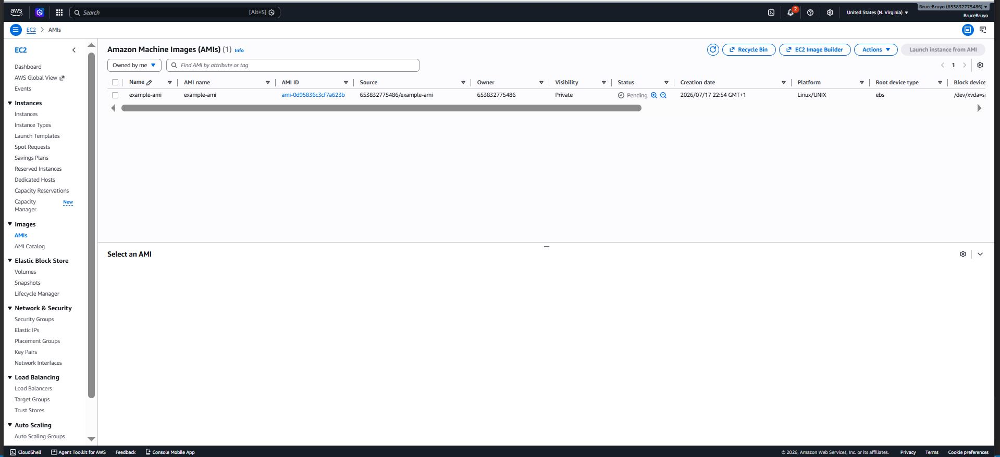

# Terraform EC2 Instance and AMI Creation

## Project Review:

In this mini project, we will use Terraform to automate the creation of an EC2 instance on AWS and then create an Amazon Machine Image (AMI) from that instance.

### Project Tasks:

**Terraform Configuration for EC2 Instance**

- Create a new directory for the Terraform project named **'terraform-ec2-ami'**.

```bash
mkdir terraform-ec2-ami
```

- Inside the project directory, create a Terraform configuration file named **'main.tf'**.

```bash
touch main.tf
```

- Write Terraform code to create an EC2 instance. Specify instance type, keypair, security group.

```bash
nano main.tf
```

```bash
provider "aws" {
  region = "us-east-1"
}

# Get the default VPC
data "aws_vpc" "default" {
  default = true
}

# Security Group
resource "aws_security_group" "instance_sg" {
  name        = "example-instance-sg"
  description = "Allow SSH and HTTP"
  vpc_id      = data.aws_vpc.default.id

  ingress {
    description = "SSH"
    from_port   = 22
    to_port     = 22
    protocol    = "tcp"
    cidr_blocks = ["0.0.0.0/0"] # Restrict to your IP in production
  }

  ingress {
    description = "HTTP"
    from_port   = 80
    to_port     = 80
    protocol    = "tcp"
    cidr_blocks = ["0.0.0.0/0"]
  }

  egress {
    from_port   = 0
    to_port     = 0
    protocol    = "-1"
    cidr_blocks = ["0.0.0.0/0"]
  }

  tags = {
    Name = "example-instance-sg"
  }
}

# Latest Amazon Linux 2023 AMI
data "aws_ami" "amazon_linux" {
  most_recent = true

  owners = ["amazon"]

  filter {
    name   = "name"
    values = ["al2023-ami-*-x86_64"]
  }

  filter {
    name   = "virtualization-type"
    values = ["hvm"]
  }
}

# EC2 Instance
resource "aws_instance" "example_instance" {
  ami                    = data.aws_ami.amazon_linux.id
  instance_type          = "t2.micro"
  key_name               = "wordpress"
  vpc_security_group_ids = [aws_security_group.instance_sg.id]

  root_block_device {
    volume_size = 30
    volume_type = "gp3"
    encrypted   = true
  }

  tags = {
    Name = "example-instance"
  }
}

# Create an AMI from the EC2 instance
resource "aws_ami_from_instance" "example_ami" {
  name               = "example-ami"
  description        = "AMI created from EC2 instance"
  source_instance_id = aws_instance.example_instance.id

  tags = {
    Name = "example-ami"
  }
}

# Outputs
output "instance_id" {
  value = aws_instance.example_instance.id
}

output "public_ip" {
  value = aws_instance.example_instance.public_ip
}

output "ami_id" {
  value = aws_ami_from_instance.example_ami.id
}
```

- Initialize the Terraform project using the command.

```bash
terraform init
```



- Apply the terraform configuration using the command;

```bash
terraform apply
```





