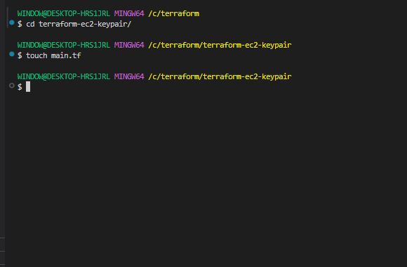
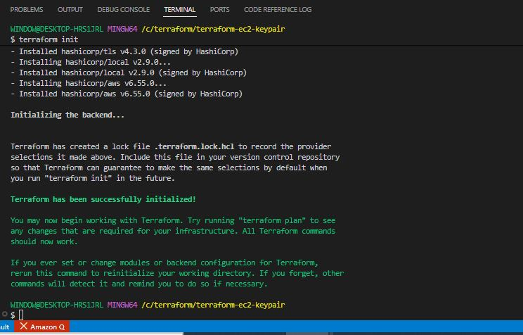
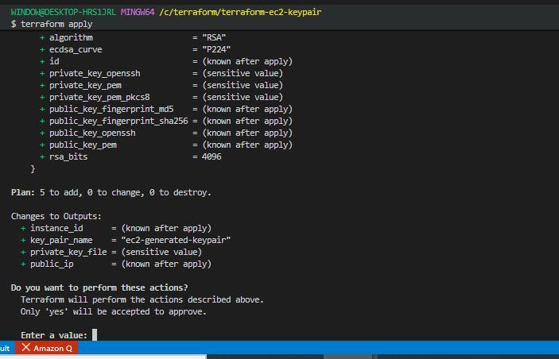
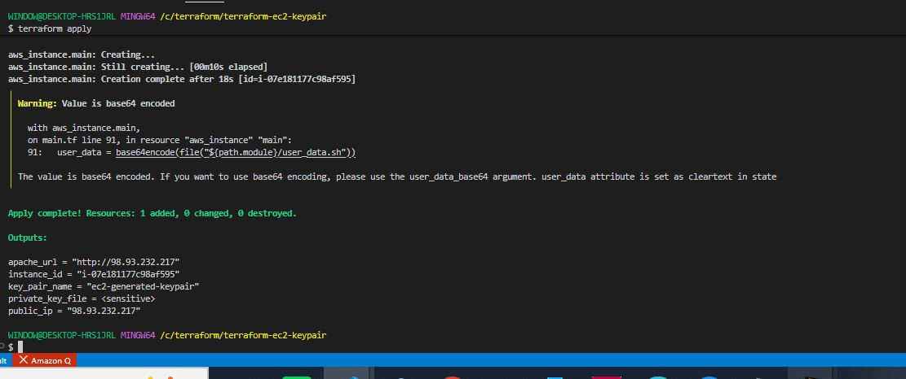
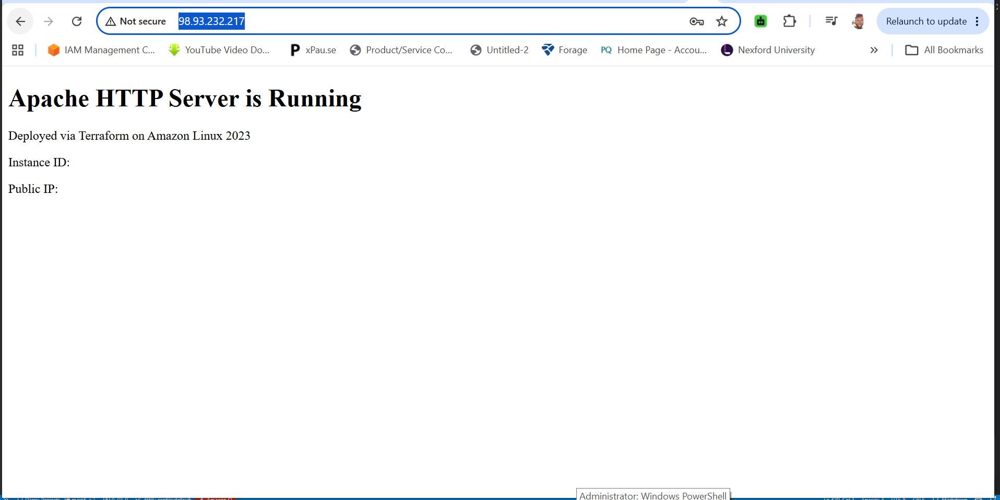
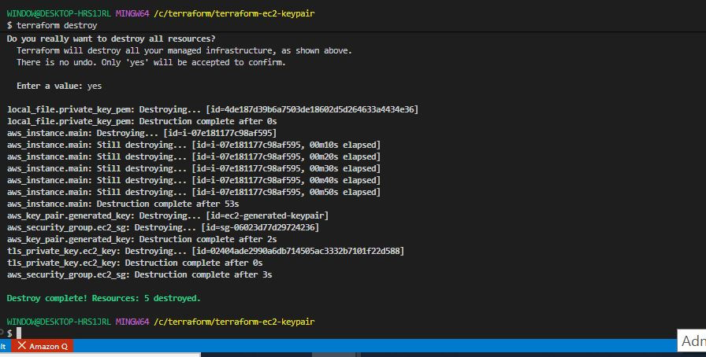
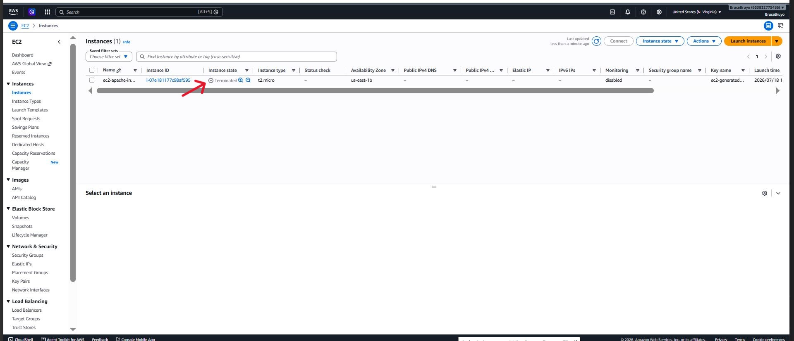

# Terraform EC2 Instance with Key Pair and User Data

## Project Overview

In this project, we will use Terraform to automate the launch of an EC2 instance on aws. The project include the generation of a downloadable key pair for the instance and the execution of the user data script to install and configure Apache HTTP server.


### Project Task

**Terraform Configuration for EC2 Instance**

- Create a new directory for the Terraform project named **'terraform-ec2-keypair'**.

```bash
mkdir terraform-ec2-keypair
```

- Inside the project directory, create a Terraform configuration file named **'main.tf'**.

```bash
touch main.tf
```



- Write the Terraform code to create EC2 instance with the following specifications;

```bash 
instance type: **t2.micro**
Key pair: Generate a new key pair and make it downloadable.
Security group: Allow incoming traffic on port 80.
```

```bash
provider "aws" {
  region = var.aws_region
}

# -----------------------------------------------
# Generate a new TLS private key
# -----------------------------------------------
resource "tls_private_key" "ec2_key" {
  algorithm = "RSA"
  rsa_bits  = 4096
}

# -----------------------------------------------
# Upload the public key to AWS as a key pair
# -----------------------------------------------
resource "aws_key_pair" "generated_key" {
  key_name   = var.key_pair_name
  public_key = tls_private_key.ec2_key.public_key_openssh

  tags = {
    Name = var.key_pair_name
  }
}

# -----------------------------------------------
# Save the private key locally as a .pem file
# -----------------------------------------------
resource "local_file" "private_key_pem" {
  content         = tls_private_key.ec2_key.private_key_pem
  filename        = "${path.module}/${var.key_pair_name}.pem"
  file_permission = "0400"   # read-only, owner only
}

# -----------------------------------------------
# Get the default VPC
# -----------------------------------------------
data "aws_vpc" "default" {
  default = true
}

# -----------------------------------------------
# Security Group — allow HTTP on port 80
# -----------------------------------------------
resource "aws_security_group" "ec2_sg" {
  name        = "ec2-http-sg"
  description = "Allow incoming traffic on port 80"
  vpc_id      = data.aws_vpc.default.id

  ingress {
    description = "HTTP"
    from_port   = 80
    to_port     = 80
    protocol    = "tcp"
    cidr_blocks = ["0.0.0.0/0"]
  }

  ingress {
    description = "SSH"
    from_port   = 22
    to_port     = 22
    protocol    = "tcp"
    cidr_blocks = ["0.0.0.0/0"]   # restrict to your IP in production
  }

  egress {
    from_port   = 0
    to_port     = 0
    protocol    = "-1"
    cidr_blocks = ["0.0.0.0/0"]
  }

  tags = {
    Name = "ec2-http-sg"
  }
}

# -----------------------------------------------
# Latest Amazon Linux 2023 AMI
# -----------------------------------------------
data "aws_ami" "amazon_linux" {
  most_recent = true
  owners      = ["amazon"]

  filter {
    name   = "name"
    values = ["al2023-ami-*-x86_64"]
  }

  filter {
    name   = "virtualization-type"
    values = ["hvm"]
  }
}

# -----------------------------------------------
# EC2 Instance
# -----------------------------------------------
resource "aws_instance" "main" {
  ami                    = data.aws_ami.amazon_linux.id
  instance_type          = var.instance_type
  key_name               = aws_key_pair.generated_key.key_name
  vpc_security_group_ids = [aws_security_group.ec2_sg.id]

  root_block_device {
    volume_size = 20
    volume_type = "gp3"
    encrypted   = true
  }

  tags = {
    Name = "ec2-http-instance"
  }
}
```

```bash
touch variables.tf
```

```bash
variable "aws_region" {
  description = "AWS region"
  type        = string
  default     = "us-east-1"
}

variable "instance_type" {
  description = "EC2 instance type"
  type        = string
  default     = "t2.micro"
}

variable "key_pair_name" {
  description = "Name for the generated key pair"
  type        = string
  default     = "ec2-generated-keypair"
}
```

```bash
touch outputs.tf
```

```bash
output "instance_id" {
  description = "EC2 instance ID"
  value       = aws_instance.main.id
}

output "public_ip" {
  description = "Public IP of the EC2 instance"
  value       = aws_instance.main.public_ip
}

output "key_pair_name" {
  description = "Name of the generated key pair"
  value       = aws_key_pair.generated_key.key_name
}

output "private_key_file" {
  description = "Path to the downloaded private key"
  value       = local_file.private_key_pem.filename
  sensitive   = true
}
```

- Initialize the Terraform project using the command;

```bash
terraform init
```



- Apply Terraform configuration to create the EC2 instance using the command;

```bash
terraform apply
```



**User Data Script Execution**

- Extend the Terraform configuration to include of the provided user data script. Create a new file **user_data.sh** in your project folder:

```bash
nano user_data.sh
```

```bash
#!/bin/bash
# Update system packages
yum update -y

# Install Apache HTTP server
yum install -y httpd

# Start Apache and enable it on boot
systemctl start httpd
systemctl enable httpd

# Create a simple test page
cat <<EOF > /var/www/html/index.html
<!DOCTYPE html>
<html>
  <head>
    <title>Apache on EC2</title>
  </head>
  <body>
    <h1>Apache HTTP Server is Running</h1>
    <p>Deployed via Terraform on Amazon Linux 2023</p>
    <p>Instance ID: $(curl -s http://169.254.169.254/latest/meta-data/instance-id)</p>
    <p>Public IP: $(curl -s http://169.254.169.254/latest/meta-data/public-ipv4)</p>
  </body>
</html>
EOF

# Set correct permissions
chown -R apache:apache /var/www/html
chmod -R 755 /var/www/html
```

- Modify the user data script to install and configure Apache HTTP server.

```bash
nano main.tf
```

```bash
provider "aws" {
  region = var.aws_region
}

# Generate TLS private key
resource "tls_private_key" "ec2_key" {
  algorithm = "RSA"
  rsa_bits  = 4096
}

# Upload public key to AWS
resource "aws_key_pair" "generated_key" {
  key_name   = var.key_pair_name
  public_key = tls_private_key.ec2_key.public_key_openssh

  tags = {
    Name = var.key_pair_name
  }
}

# Save private key locally
resource "local_file" "private_key_pem" {
  content         = tls_private_key.ec2_key.private_key_pem
  filename        = "${path.module}/${var.key_pair_name}.pem"
  file_permission = "0400"
}

# Get default VPC
data "aws_vpc" "default" {
  default = true
}

# Security group
resource "aws_security_group" "ec2_sg" {
  name        = "ec2-apache-sg"
  description = "Allow HTTP and SSH traffic"
  vpc_id      = data.aws_vpc.default.id

  ingress {
    description = "HTTP"
    from_port   = 80
    to_port     = 80
    protocol    = "tcp"
    cidr_blocks = ["0.0.0.0/0"]
  }

  ingress {
    description = "SSH"
    from_port   = 22
    to_port     = 22
    protocol    = "tcp"
    cidr_blocks = ["0.0.0.0/0"]
  }

  egress {
    from_port   = 0
    to_port     = 0
    protocol    = "-1"
    cidr_blocks = ["0.0.0.0/0"]
  }

  tags = {
    Name = "ec2-apache-sg"
  }
}

# Latest Amazon Linux 2023 AMI
data "aws_ami" "amazon_linux" {
  most_recent = true
  owners      = ["amazon"]

  filter {
    name   = "name"
    values = ["al2023-ami-*-x86_64"]
  }

  filter {
    name   = "virtualization-type"
    values = ["hvm"]
  }
}

# EC2 Instance with Apache user data
resource "aws_instance" "main" {
  ami                         = data.aws_ami.amazon_linux.id
  instance_type               = var.instance_type
  key_name                    = aws_key_pair.generated_key.key_name
  vpc_security_group_ids      = [aws_security_group.ec2_sg.id]
  associate_public_ip_address = true

  user_data = base64encode(file("${path.module}/user_data.sh"))

  root_block_device {
    volume_size = 30
    volume_type = "gp3"
    encrypted   = true
  }

  tags = {
    Name = "ec2-apache-instance"
  }
}
```

```bash
nano outputs.tf
```

```bash
output "instance_id" {
  description = "EC2 instance ID"
  value       = aws_instance.main.id
}

output "public_ip" {
  description = "Public IP of the EC2 instance"
  value       = aws_instance.main.public_ip
}

output "apache_url" {
  description = "Apache HTTP server URL"
  value       = "http://${aws_instance.main.public_ip}"
}

output "key_pair_name" {
  description = "Name of the generated key pair"
  value       = aws_key_pair.generated_key.key_name
}

output "private_key_file" {
  description = "Path to the downloaded private key"
  value       = local_file.private_key_pem.filename
  sensitive   = true
}
```

- Apply the updated terraform configuration to launch the EC2 instance with the user data script using the command;

```bash
terraform apply
```




**Accessing the Web Server**

- After the EC2 instance is created and running, access the Apache web server by using its public ip address.

- Verify that the web server displays the "Hello World" message generated by the user data script. 

```bash
http://98.93.232.217/
```




**Terminate EC2 Instance**

- Terminate the EC2 instance by using the command;

```bash
terraform destroy
```



- Verify on aws.

