# Terraform Modules - VPC and S3 Bucket with Backend Storage

## Project Review

In this project, we will use Terraform to to create a modularized configurations for building an Amazon Virtual Private Cloud (VPC) and an Amazon S3 Bucket. Additionally, we will configure Terraform to use Amazon S3 as the backend storage for storing the Terraform state file.

### Project Tasks

**VPC Module:**

- Create a new directory for the Terraform project named **'terraform-modules-vpc-s3'**.

```bash
mkdir terraform-modules-vpc-s3
```

- Inside the project directory, create a directory the VPC module file named **'modules/vpc'**.

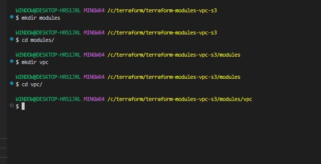

- Write a Terraform Module (**'modules/vpc/main.tf'**) for creating a VPC with customizable configuration such as CIDR block, subnets etc.

```bash
nano main.tf
```

```bash
# -----------------------------------------------
# VPC
# -----------------------------------------------
resource "aws_vpc" "main" {
  cidr_block           = var.vpc_cidr
  enable_dns_support   = var.enable_dns_support
  enable_dns_hostnames = var.enable_dns_hostnames

  tags = merge(
    {
      Name        = var.vpc_name
      Environment = var.environment
    },
    var.tags
  )
}

# -----------------------------------------------
# Internet Gateway
# -----------------------------------------------
resource "aws_internet_gateway" "main" {
  vpc_id = aws_vpc.main.id

  tags = merge(
    {
      Name        = "${var.vpc_name}-igw"
      Environment = var.environment
    },
    var.tags
  )
}

# -----------------------------------------------
# Public Subnets
# -----------------------------------------------
resource "aws_subnet" "public" {
  count             = length(var.public_subnet_cidrs)
  vpc_id            = aws_vpc.main.id
  cidr_block        = var.public_subnet_cidrs[count.index]
  availability_zone = var.availability_zones[count.index]

  # Instances launched in public subnets get a public IP
  map_public_ip_on_launch = true

  tags = merge(
    {
      Name        = "${var.vpc_name}-public-subnet-${count.index + 1}"
      Environment = var.environment
      Type        = "public"
    },
    var.tags
  )
}

# -----------------------------------------------
# Private Subnets
# -----------------------------------------------
resource "aws_subnet" "private" {
  count             = length(var.private_subnet_cidrs)
  vpc_id            = aws_vpc.main.id
  cidr_block        = var.private_subnet_cidrs[count.index]
  availability_zone = var.availability_zones[count.index]

  map_public_ip_on_launch = false

  tags = merge(
    {
      Name        = "${var.vpc_name}-private-subnet-${count.index + 1}"
      Environment = var.environment
      Type        = "private"
    },
    var.tags
  )
}

# -----------------------------------------------
# Elastic IPs for NAT Gateways
# -----------------------------------------------
resource "aws_eip" "nat" {
  # One EIP per NAT gateway
  count  = var.enable_nat_gateway ? (var.single_nat_gateway ? 1 : length(var.public_subnet_cidrs)) : 0
  domain = "vpc"

  tags = merge(
    {
      Name        = "${var.vpc_name}-nat-eip-${count.index + 1}"
      Environment = var.environment
    },
    var.tags
  )

  depends_on = [aws_internet_gateway.main]
}

# -----------------------------------------------
# NAT Gateways (for private subnet internet access)
# -----------------------------------------------
resource "aws_nat_gateway" "main" {
  count         = var.enable_nat_gateway ? (var.single_nat_gateway ? 1 : length(var.public_subnet_cidrs)) : 0
  allocation_id = aws_eip.nat[count.index].id
  subnet_id     = aws_subnet.public[count.index].id

  tags = merge(
    {
      Name        = "${var.vpc_name}-nat-gw-${count.index + 1}"
      Environment = var.environment
    },
    var.tags
  )

  depends_on = [aws_internet_gateway.main]
}

# -----------------------------------------------
# Public Route Table
# -----------------------------------------------
resource "aws_route_table" "public" {
  vpc_id = aws_vpc.main.id

  route {
    cidr_block = "0.0.0.0/0"
    gateway_id = aws_internet_gateway.main.id
  }

  tags = merge(
    {
      Name        = "${var.vpc_name}-public-rt"
      Environment = var.environment
    },
    var.tags
  )
}

# Associate public subnets with public route table
resource "aws_route_table_association" "public" {
  count          = length(var.public_subnet_cidrs)
  subnet_id      = aws_subnet.public[count.index].id
  route_table_id = aws_route_table.public.id
}

# -----------------------------------------------
# Private Route Tables
# -----------------------------------------------
resource "aws_route_table" "private" {
  # One route table per NAT gateway
  count  = var.enable_nat_gateway ? (var.single_nat_gateway ? 1 : length(var.private_subnet_cidrs)) : 1
  vpc_id = aws_vpc.main.id

  dynamic "route" {
    for_each = var.enable_nat_gateway ? [1] : []
    content {
      cidr_block     = "0.0.0.0/0"
      nat_gateway_id = var.single_nat_gateway ? aws_nat_gateway.main[0].id : aws_nat_gateway.main[count.index].id
    }
  }

  tags = merge(
    {
      Name        = "${var.vpc_name}-private-rt-${count.index + 1}"
      Environment = var.environment
    },
    var.tags
  )
}

# Associate private subnets with private route tables
resource "aws_route_table_association" "private" {
  count          = length(var.private_subnet_cidrs)
  subnet_id      = aws_subnet.private[count.index].id
  route_table_id = var.single_nat_gateway ? aws_route_table.private[0].id : aws_route_table.private[count.index].id
}
```

```bash
nano variables.tf
```

```bash
variable "vpc_cidr" {
  description = "CIDR block for the VPC"
  type        = string
  default     = "10.0.0.0/16"
}

variable "vpc_name" {
  description = "Name tag for the VPC"
  type        = string
  default     = "main-vpc"
}

variable "environment" {
  description = "Environment name (dev, staging, production)"
  type        = string
  default     = "dev"
}

variable "public_subnet_cidrs" {
  description = "List of CIDR blocks for public subnets"
  type        = list(string)
  default     = ["10.0.1.0/24", "10.0.2.0/24"]
}

variable "private_subnet_cidrs" {
  description = "List of CIDR blocks for private subnets"
  type        = list(string)
  default     = ["10.0.3.0/24", "10.0.4.0/24"]
}

variable "availability_zones" {
  description = "List of availability zones to deploy subnets into"
  type        = list(string)
  default     = ["us-east-1a", "us-east-1b"]
}

variable "enable_dns_support" {
  description = "Enable DNS support in the VPC"
  type        = bool
  default     = true
}

variable "enable_dns_hostnames" {
  description = "Enable DNS hostnames in the VPC"
  type        = bool
  default     = true
}

variable "enable_nat_gateway" {
  description = "Enable NAT gateway for private subnets"
  type        = bool
  default     = true
}

variable "single_nat_gateway" {
  description = "Use a single NAT gateway for all private subnets (cost saving)"
  type        = bool
  default     = false
}

variable "tags" {
  description = "Additional tags to apply to all resources"
  type        = map(string)
  default     = {}
}
```

```bash
nano variables.tf
```

```bash
output "vpc_id" {
  description = "ID of the VPC"
  value       = aws_vpc.main.id
}

output "vpc_cidr" {
  description = "CIDR block of the VPC"
  value       = aws_vpc.main.cidr_block
}

output "public_subnet_ids" {
  description = "IDs of the public subnets"
  value       = aws_subnet.public[*].id
}

output "private_subnet_ids" {
  description = "IDs of the private subnets"
  value       = aws_subnet.private[*].id
}

output "internet_gateway_id" {
  description = "ID of the Internet Gateway"
  value       = aws_internet_gateway.main.id
}

output "nat_gateway_ids" {
  description = "IDs of the NAT Gateways"
  value       = aws_nat_gateway.main[*].id
}

output "public_route_table_id" {
  description = "ID of the public route table"
  value       = aws_route_table.public.id
}

output "private_route_table_ids" {
  description = "IDs of the private route tables"
  value       = aws_route_table.private[*].id
}
```

- Create a main Terraform configuration file (**'main.tf'**) in the directory, and use the VPC module to create a VPC. Go back to the project directory and create a file named **'main.tf'**

```bash
nano main.tf
```

```bash
# -----------------------------------------------
# Provider
# -----------------------------------------------
provider "aws" {
  region = var.aws_region

  default_tags {
    tags = {
      Project     = var.project_name
      Environment = var.environment
      ManagedBy   = "terraform"
    }
  }
}

# -----------------------------------------------
# VPC Module
# -----------------------------------------------
module "vpc" {
  source = "./modules/vpc"

  # Identity
  vpc_name    = "${var.project_name}-${var.environment}-vpc"
  environment = var.environment

  # Networking
  vpc_cidr             = var.vpc_cidr
  public_subnet_cidrs  = var.public_subnet_cidrs
  private_subnet_cidrs = var.private_subnet_cidrs
  availability_zones   = var.availability_zones

  # Features
  enable_dns_support   = true
  enable_dns_hostnames = true
  enable_nat_gateway   = var.enable_nat_gateway
  single_nat_gateway   = var.single_nat_gateway

  # Extra tags
  tags = {
    Project     = var.project_name
    Environment = var.environment
    ManagedBy   = "terraform"
  }
}
```

```bash
nano variables.tf
```

```bash
variable "aws_region" {
  description = "AWS region to deploy resources"
  type        = string
  default     = "us-east-1"
}

variable "environment" {
  description = "Deployment environment"
  type        = string
  default     = "dev"
}

variable "project_name" {
  description = "Name of the project"
  type        = string
  default     = "ecommerce"
}

variable "vpc_cidr" {
  description = "CIDR block for the VPC"
  type        = string
  default     = "10.0.0.0/16"
}

variable "public_subnet_cidrs" {
  description = "CIDR blocks for public subnets"
  type        = list(string)
  default     = ["10.0.1.0/24", "10.0.2.0/24"]
}

variable "private_subnet_cidrs" {
  description = "CIDR blocks for private subnets"
  type        = list(string)
  default     = ["10.0.3.0/24", "10.0.4.0/24"]
}

variable "availability_zones" {
  description = "Availability zones for subnets"
  type        = list(string)
  default     = ["us-east-1a", "us-east-1b"]
}

variable "enable_nat_gateway" {
  description = "Enable NAT gateway for private subnets"
  type        = bool
  default     = true
}

variable "single_nat_gateway" {
  description = "Use a single NAT gateway (cost saving for dev)"
  type        = bool
  default     = true
}
```

```bash
nano outputs.tf
```

```bash
output "vpc_id" {
  description = "ID of the created VPC"
  value       = module.vpc.vpc_id
}

output "vpc_cidr" {
  description = "CIDR block of the VPC"
  value       = module.vpc.vpc_cidr
}

output "public_subnet_ids" {
  description = "IDs of the public subnets"
  value       = module.vpc.public_subnet_ids
}

output "private_subnet_ids" {
  description = "IDs of the private subnets"
  value       = module.vpc.private_subnet_ids
}

output "internet_gateway_id" {
  description = "ID of the Internet Gateway"
  value       = module.vpc.internet_gateway_id
}

output "nat_gateway_ids" {
  description = "IDs of the NAT Gateways"
  value       = module.vpc.nat_gateway_ids
}
```

```bash
nano versions.tf
```

```bash
terraform {
  required_version = ">= 1.0.0"

  required_providers {
    aws = {
      source  = "hashicorp/aws"
      version = "~> 5.0"
    }
  }
}
```

**S3 Module:**

- In the project directory, create a directory for the S3 bucket module named **'modules/s3'**. Go to the modules directory and create s3 module directory.

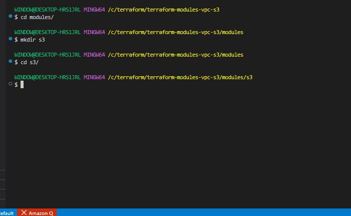

- Write a Terrraform module (**'modules/s3/main.tf'**) for creating s3 bucket with customizable configurations such as bucket name, ACL, etc.

```bash
nano main.tf
```

```bash
# -----------------------------------------------
# S3 Bucket
# -----------------------------------------------
resource "aws_s3_bucket" "main" {
  bucket        = var.bucket_name
  force_destroy = var.force_destroy

  tags = merge(
    {
      Name        = var.bucket_name
      Environment = var.environment
      ManagedBy   = "terraform"
    },
    var.tags
  )
}

# -----------------------------------------------
# Ownership Controls — MUST come before ACL
# -----------------------------------------------
resource "aws_s3_bucket_ownership_controls" "main" {
  bucket = aws_s3_bucket.main.id

  rule {
    object_ownership = "BucketOwnerPreferred"  # ✅ enables ACLs
  }

  depends_on = [aws_s3_bucket.main]
}

# -----------------------------------------------
# Block Public Access
# -----------------------------------------------
resource "aws_s3_bucket_public_access_block" "main" {
  bucket = aws_s3_bucket.main.id

  block_public_acls       = var.block_public_access
  block_public_policy     = var.block_public_access
  ignore_public_acls      = var.block_public_access
  restrict_public_buckets = var.block_public_access

  depends_on = [aws_s3_bucket.main]
}

# -----------------------------------------------
# ACL — depends on both resources above
# -----------------------------------------------
resource "aws_s3_bucket_acl" "main" {
  bucket = aws_s3_bucket.main.id
  acl    = var.acl

  depends_on = [
    aws_s3_bucket_ownership_controls.main,
    aws_s3_bucket_public_access_block.main
  ]
}
```

```bash
nano variables.tf
```

```bash
variable "bucket_name" {
  description = "Name of the S3 bucket (must be globally unique)"
  type        = string
}

variable "environment" {
  description = "Environment name (dev, staging, production)"
  type        = string
  default     = "dev"
}

variable "acl" {
  description = "ACL for the S3 bucket (private, public-read, etc)"
  type        = string
  default     = "private"

  validation {
    condition = contains([
      "private",
      "public-read",
      "public-read-write",
      "authenticated-read"
    ], var.acl)
    error_message = "ACL must be one of: private, public-read, public-read-write, authenticated-read."
  }
}

variable "versioning_enabled" {
  description = "Enable versioning on the bucket"
  type        = bool
  default     = false
}

variable "encryption_enabled" {
  description = "Enable server-side encryption (AES256)"
  type        = bool
  default     = true
}

variable "force_destroy" {
  description = "Allow bucket to be destroyed even if it contains objects"
  type        = bool
  default     = false
}

variable "block_public_access" {
  description = "Block all public access to the bucket"
  type        = bool
  default     = true
}

variable "enable_lifecycle" {
  description = "Enable lifecycle rules for object expiration"
  type        = bool
  default     = false
}

variable "lifecycle_expiration_days" {
  description = "Number of days before objects expire"
  type        = number
  default     = 90
}

variable "noncurrent_version_expiration_days" {
  description = "Days before noncurrent versions expire"
  type        = number
  default     = 30
}

variable "enable_cors" {
  description = "Enable CORS configuration on the bucket"
  type        = bool
  default     = false
}

variable "cors_allowed_origins" {
  description = "List of allowed origins for CORS"
  type        = list(string)
  default     = ["*"]
}

variable "cors_allowed_methods" {
  description = "List of allowed HTTP methods for CORS"
  type        = list(string)
  default     = ["GET", "PUT", "POST"]
}

variable "enable_logging" {
  description = "Enable access logging for the bucket"
  type        = bool
  default     = false
}

variable "logging_target_bucket" {
  description = "Target bucket for access logs"
  type        = string
  default     = ""
}

variable "logging_target_prefix" {
  description = "Prefix for log object keys"
  type        = string
  default     = "logs/"
}

variable "tags" {
  description = "Additional tags to apply to the bucket"
  type        = map(string)
  default     = {}
}
```

```bash
nano outputs.tf
```

```bash
output "bucket_id" {
  description = "Name of the S3 bucket"
  value       = aws_s3_bucket.main.id
}

output "bucket_arn" {
  description = "ARN of the S3 bucket"
  value       = aws_s3_bucket.main.arn
}

output "bucket_domain_name" {
  description = "Bucket domain name"
  value       = aws_s3_bucket.main.bucket_domain_name
}

output "bucket_regional_domain_name" {
  description = "Regional bucket domain name"
  value       = aws_s3_bucket.main.bucket_regional_domain_name
}

output "versioning_status" {
  description = "Versioning status of the bucket"
  value       = var.versioning_enabled ? "Enabled" : "Suspended"
}
```

- Modify the main Terraform configuration file (**'main.tf'**) to use the s3 module and create an s3 bucket.

```bash
nano main.tf
```

```bash
# -----------------------------------------------
# Provider
# -----------------------------------------------
provider "aws" {
  region = var.aws_region

  default_tags {
    tags = {
      Project     = var.project_name
      Environment = var.environment
      ManagedBy   = "terraform"
    }
  }
}

# -----------------------------------------------
# VPC Module
# -----------------------------------------------
module "vpc" {
  source = "./modules/vpc"

  # Identity
  vpc_name    = "${var.project_name}-${var.environment}-vpc"
  environment = var.environment

  # Networking
  vpc_cidr             = var.vpc_cidr
  public_subnet_cidrs  = var.public_subnet_cidrs
  private_subnet_cidrs = var.private_subnet_cidrs
  availability_zones   = var.availability_zones

  # Features
  enable_dns_support   = true
  enable_dns_hostnames = true
  enable_nat_gateway   = var.enable_nat_gateway
  single_nat_gateway   = var.single_nat_gateway

  tags = {
    Project     = var.project_name
    Environment = var.environment
    ManagedBy   = "terraform"
  }
}

# -----------------------------------------------
# S3 Module — Application Assets Bucket
# -----------------------------------------------
module "app_bucket" {
  source = "./modules/s3"

  bucket_name         = "${var.project_name}-${var.environment}-app-assets"
  environment         = var.environment
  acl                 = "private"
  versioning_enabled  = true
  encryption_enabled  = true
  block_public_access = true
  force_destroy       = var.environment != "production"

  enable_lifecycle          = true
  lifecycle_expiration_days = 90

  tags = {
    Project = var.project_name
    Purpose = "app-assets"
  }
}

# -----------------------------------------------
# S3 Module — Static Website Bucket
# -----------------------------------------------
module "static_site_bucket" {
  source = "./modules/s3"

  bucket_name         = "${var.project_name}-${var.environment}-static-site"
  environment         = var.environment
  acl                 = "public-read"
  block_public_access = false
  encryption_enabled  = true
  force_destroy       = var.environment != "production"

  enable_cors          = true
  cors_allowed_origins = var.cors_allowed_origins
  cors_allowed_methods = ["GET", "HEAD"]

  tags = {
    Project = var.project_name
    Purpose = "static-site"
  }
}

# -----------------------------------------------
# S3 Module — Logs Bucket
# -----------------------------------------------
module "logs_bucket" {
  source = "./modules/s3"

  bucket_name         = "${var.project_name}-${var.environment}-logs"
  environment         = var.environment
  acl                 = "private"
  versioning_enabled  = false
  encryption_enabled  = true
  block_public_access = true
  force_destroy       = var.environment != "production"

  enable_lifecycle          = true
  lifecycle_expiration_days = 30

  tags = {
    Project = var.project_name
    Purpose = "logs"
  }
}
```

```bash
nano variables.tf
```

```bash
variable "aws_region" {
  description = "AWS region to deploy resources"
  type        = string
  default     = "us-east-1"
}

variable "environment" {
  description = "Deployment environment"
  type        = string
  default     = "dev"
}

variable "project_name" {
  description = "Name of the project"
  type        = string
  default     = "ecommerce"
}

# -----------------------------------------------
# VPC Variables
# -----------------------------------------------
variable "vpc_cidr" {
  description = "CIDR block for the VPC"
  type        = string
  default     = "10.0.0.0/16"
}

variable "public_subnet_cidrs" {
  description = "CIDR blocks for public subnets"
  type        = list(string)
  default     = ["10.0.1.0/24", "10.0.2.0/24"]
}

variable "private_subnet_cidrs" {
  description = "CIDR blocks for private subnets"
  type        = list(string)
  default     = ["10.0.3.0/24", "10.0.4.0/24"]
}

variable "availability_zones" {
  description = "Availability zones for subnets"
  type        = list(string)
  default     = ["us-east-1a", "us-east-1b"]
}

variable "enable_nat_gateway" {
  description = "Enable NAT gateway for private subnets"
  type        = bool
  default     = true
}

variable "single_nat_gateway" {
  description = "Use a single NAT gateway (cost saving for dev)"
  type        = bool
  default     = true
}

# -----------------------------------------------
# S3 Variables
# -----------------------------------------------
variable "cors_allowed_origins" {
  description = "Allowed origins for S3 CORS configuration"
  type        = list(string)
  default     = ["*"]
}
```

```bash
nano outputs.tf
```

```bash
# -----------------------------------------------
# VPC Outputs
# -----------------------------------------------
output "vpc_id" {
  description = "ID of the created VPC"
  value       = module.vpc.vpc_id
}

output "vpc_cidr" {
  description = "CIDR block of the VPC"
  value       = module.vpc.vpc_cidr
}

output "public_subnet_ids" {
  description = "IDs of the public subnets"
  value       = module.vpc.public_subnet_ids
}

output "private_subnet_ids" {
  description = "IDs of the private subnets"
  value       = module.vpc.private_subnet_ids
}

output "internet_gateway_id" {
  description = "ID of the Internet Gateway"
  value       = module.vpc.internet_gateway_id
}

output "nat_gateway_ids" {
  description = "IDs of the NAT Gateways"
  value       = module.vpc.nat_gateway_ids
}

# -----------------------------------------------
# S3 Outputs
# -----------------------------------------------
output "app_bucket_id" {
  description = "Name of the app assets bucket"
  value       = module.app_bucket.bucket_id
}

output "app_bucket_arn" {
  description = "ARN of the app assets bucket"
  value       = module.app_bucket.bucket_arn
}

output "static_site_bucket_id" {
  description = "Name of the static site bucket"
  value       = module.static_site_bucket.bucket_id
}

output "static_site_bucket_domain" {
  description = "Domain name of the static site bucket"
  value       = module.static_site_bucket.bucket_regional_domain_name
}

output "logs_bucket_id" {
  description = "Name of the logs bucket"
  value       = module.logs_bucket.bucket_id
}
```

**Backend Storage Configuration**

- Configure Terraform to use Amazon S3 as the backend storage for sotoring the Terraform state file.

- Create a backend configuration named **'backend.tf'** specifying the S3 bucket and key for storing the state.

```bash
nano backend.tf
```

```bash
terraform {
  backend "s3" {
    bucket  = "ecommerce-dev-terraform-state"
    key     = "terraform/state/terraform.tfstate"
    region  = "us-east-1"
    encrypt = true

    # ✅ replaces deprecated dynamodb_table
    use_lockfile = true
  }
}
```

Create a separate bootstrap/main.tf

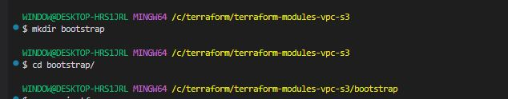

```bash
nano main.tf
```

```bash
# bootstrap/main.tf

provider "aws" {
  region = "us-east-1"
}

# -----------------------------------------------
# S3 Bucket for Terraform State
# -----------------------------------------------
resource "aws_s3_bucket" "terraform_state" {
  bucket        = "ecommerce-dev-terraform-state"
  force_destroy = false   # protect state from accidental deletion

  tags = {
    Name      = "terraform-state"
    ManagedBy = "terraform"
  }
}

# Enable versioning — recover from accidental state corruption
resource "aws_s3_bucket_versioning" "terraform_state" {
  bucket = aws_s3_bucket.terraform_state.id

  versioning_configuration {
    status = "Enabled"
  }
}

# Enable encryption
resource "aws_s3_bucket_server_side_encryption_configuration" "terraform_state" {
  bucket = aws_s3_bucket.terraform_state.id

  rule {
    apply_server_side_encryption_by_default {
      sse_algorithm = "AES256"
    }
  }
}

# Block all public access
resource "aws_s3_bucket_public_access_block" "terraform_state" {
  bucket = aws_s3_bucket.terraform_state.id

  block_public_acls       = true
  block_public_policy     = true
  ignore_public_acls      = true
  restrict_public_buckets = true
}

# -----------------------------------------------
# DynamoDB Table for State Locking
# -----------------------------------------------
resource "aws_dynamodb_table" "terraform_state_lock" {
  name         = "terraform-state-lock"
  billing_mode = "PAY_PER_REQUEST"
  hash_key     = "LockID"

  attribute {
    name = "LockID"
    type = "S"
  }

  tags = {
    Name      = "terraform-state-lock"
    ManagedBy = "terraform"
  }
}
```

- Initialize the Terraform project by using the command;

```bash
terraform init
```

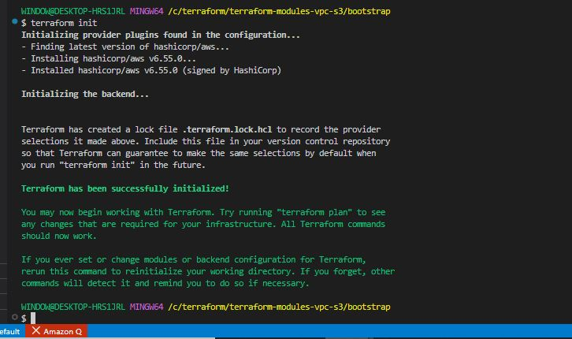

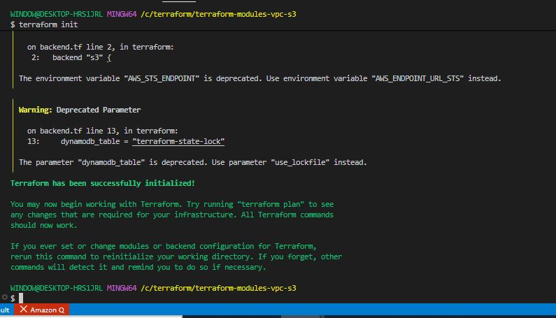

- Apply the Terraform configuration to create the VPC and S3 bucket using the command;

```bash
terraform apply
```

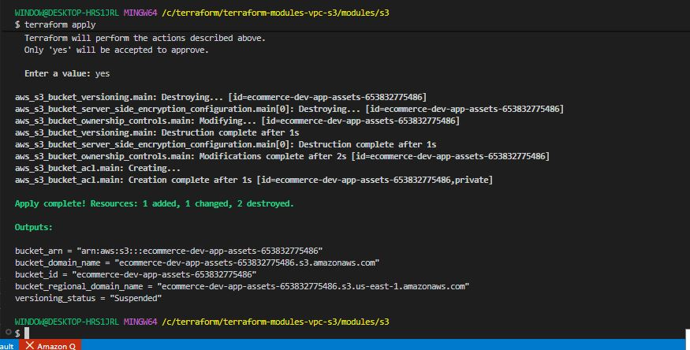

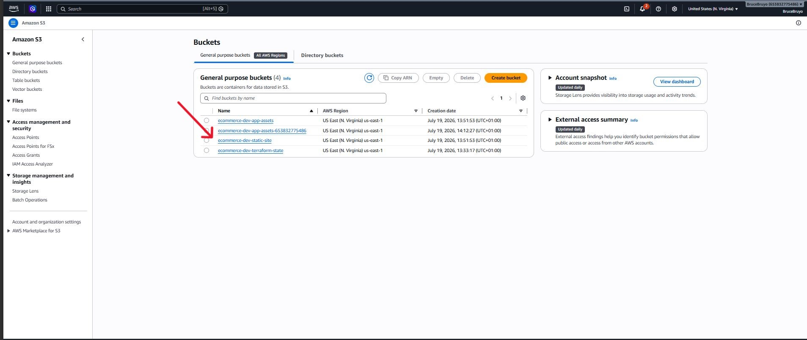

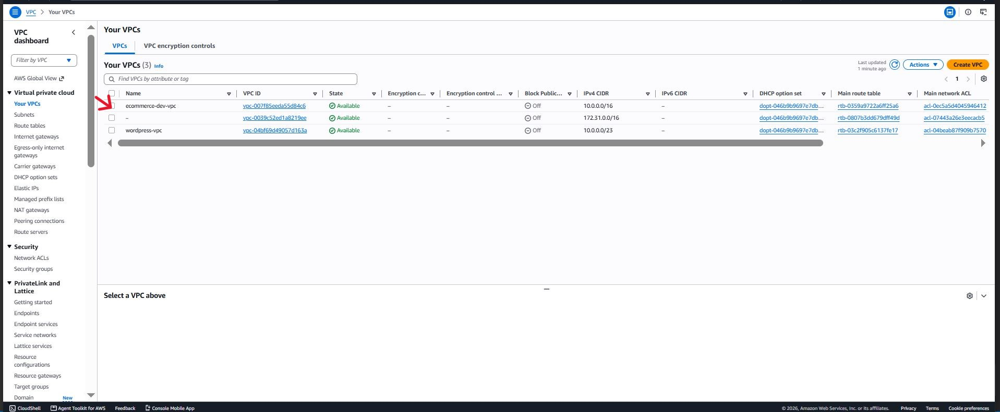


**Clean up**

Clean up the project by using command;

```bash
terraform destroy
```

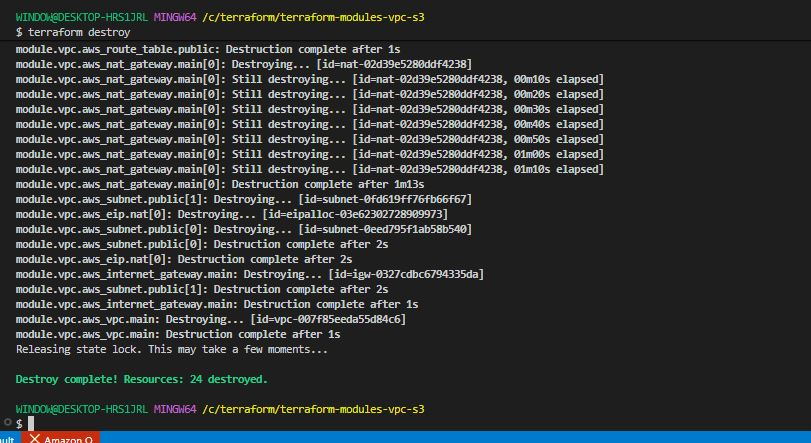

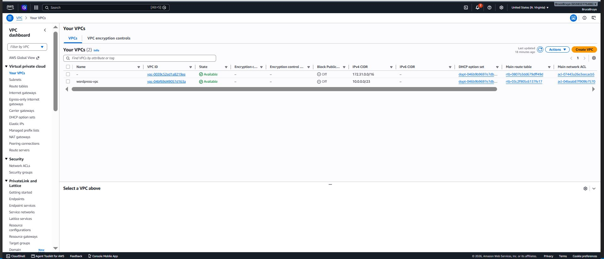

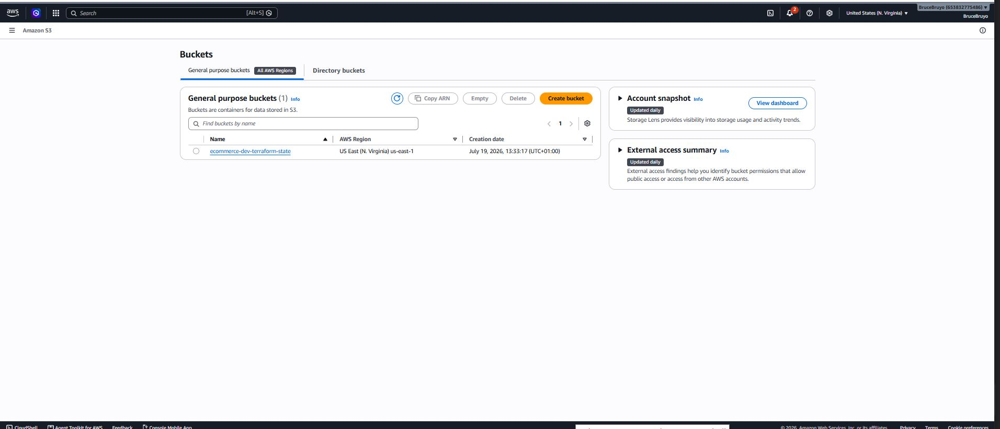
