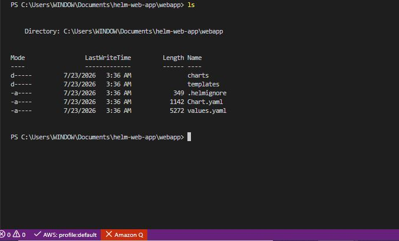
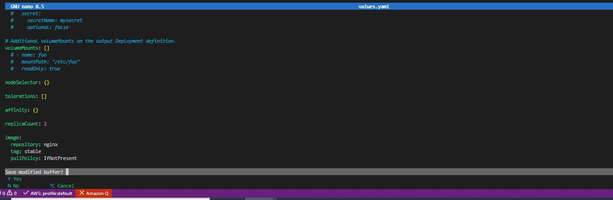
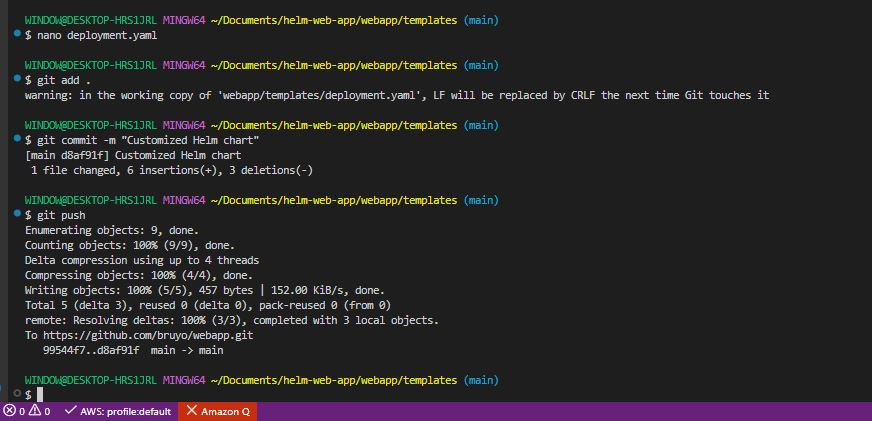
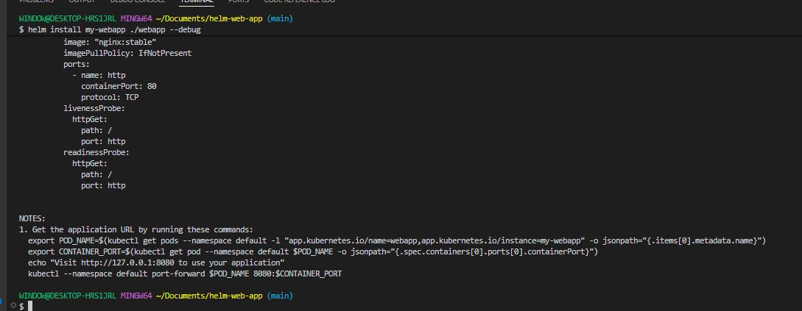
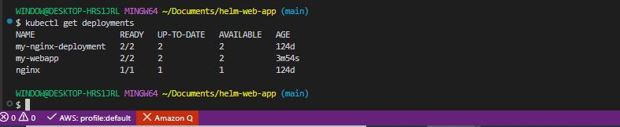
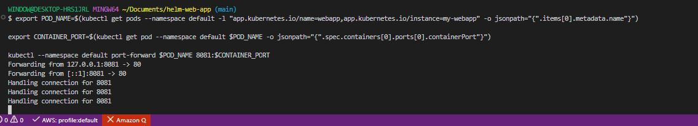
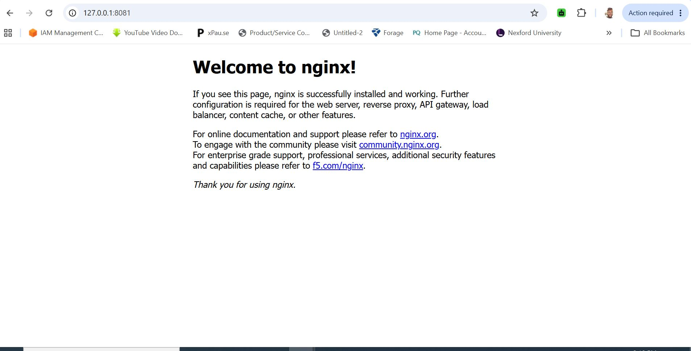

# Working with Helm Chart

## Project Overview

This project provides hands-on exercises that will enhance practical experience in creating, customizing, and deploying Helm Charts for various applications.

### Project Tasks

**Customize Your Helm Chart**

Understanding Helm Charts, Values, and Templates. Why Helm Charts are needed:

- Helm Charts are packages or collections of pre-configured Kubernetes resources.

- They simplify the deployment and management of applications in Kubernetes by bundling all necessary resources into a single, manageable unit.

- Helm Charts promote reusability and consistency, allowing you to define, install, and upgrade even the most complex Kubernetes applications easily.

What are Charts, Values, and Templates:

- **Charts:** A Helm Chart is a directory with a predefined structure. It contains all the resource definitions needed to run an application, tool, or service inside a Kubernetes cluster. Think of it as a recipe with instructions on how to create and run a Kubernetes application.

- **Values:** The 'values.yaml' file inside a chart provides configuration values for a chart's templates. These values can be overridden during chart installation or upgrades, allowing for flexibility and customization without altering the chart's core logic.

- **Templates:** The 'templates/' directory contains the templates files. These are standard Kubernetes YANL files with placeholders (**'{{" .Values.someParameter "}}'**). Helm dynamically fills these placeholders with the values from the **'yaml.values'** file or overrides values provided during runtime. This allows you to customize deployment without changing the actual YAML files.


1. **Explore the 'webapp' Directory.**

- Navigate to the 'webapp' directory created by Helm. Inside, you'll find:

- **'Chart.yaml':** Contains metadata about charts such as name, version, and description.

- **'values.yaml':** Provides configurable values that Helm inject into the templates. Here you set default configuration values.

- **'templates/':** Contains the templates files that will generate Kubernetes manifest files. These templates reference the values defined in **'values.yaml'**.




2. **Modify 'values.yaml':**

- Open the **'values.yaml'** in a text editor.

- Set the image to use Nginx stable version.

```bash
nano values.yaml
```

```bash
replicaCount: 2

image:
  repository: nginx
  tag: stable
  pullPolicy: IfNotPresent
```

- This configuration will deploy two replicas **('replicaCount: 2')** of the Nginx server.

- Save your changes.




3. **Customize 'templates/deployment.yaml':**

- Open the **'deployment.yaml'** file in the **'templates/'** directory.

- Remove the line below from under **'spec.template.spec.containers.resources'** directory.

```bash
{"{- toYaml .Values.resources | nindent 12 "}}
```

- Add a simple resource request and limit under **'spec.template.spec.containers.resources'**. This helps Kubernetes manage resources efficiently.

```bash
resources:
  requests:
    memory: "128Mi"
    cpu: "100m"
  limits:
    memory: "256Mi"
    cpu: "200m"
```

- These settings specify that your deployment should request 128Mi of memory and 100m of CPU, but it won't use more than 256Mi of memory and 200m of cPU.

- Save the file after making the changes.


4. **Commit and Push Changes:**

```bash
git add .
git commit -m "Customized Helm chart"
git push
```



**Deploying Your Application**

1. **Deploy with Helm:** Navigate to the root of the project directory **'helm-web-app'**.

Deploy the application on Kubernetes using the command below:

```bash
helm install my-webapp ./webapp
```

```bash
helm install my-webapp ./webapp --debug
```



2. **Check Deployment:**

```bash
kubectl get deployments
```



3. **Visit Application URL:** Get the application URL by running these commands.

```bash
export POD_NAME=$(kubectl get pods --namespace default -l "app.kubernetes.io/name=webapp,app.kubernetes.io/instance=my-webapp" -o jsonpath="{".items[0].metadata.name"}")

export CONTAINER_PORT=$(kubectl get pod --namespace default $POD_NAME -o jsonpath="{".spec.containers[0].ports[0].containerPort"}")

kubectl --namespace default port-forward $POD_NAME 8081:$CONTAINER_PORT
```




```bash
http://127.0.0.1:8081/
```




### Best practices for Helm

- Run helm lint before every install or upgrade.
- Keep configuration in values.yaml instead of hardcoding values in templates.
- Use image tags instead of latest to make deployments reproducible.
- Use readiness and liveness probes (your chart already includes both).
- Check kubectl get events if resources don't behave as expected.
- Test upgrades in a development cluster before applying them to production.
- Version your chart (Chart.yaml) whenever you make meaningful changes.

Following this checklist will help you quickly identify whether issues are with your Helm chart, your Kubernetes resources, or the application itself.